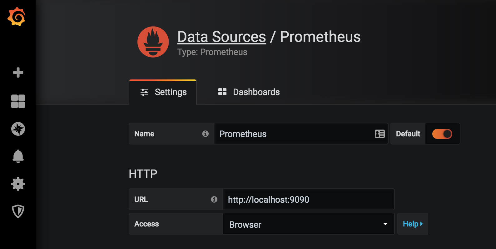

---

[그라파나](http://grafana.com/)는 프로메테우스 데이터 질의를 지원한다. 프로메테우스 전용 그라파나 데이터 소스는 그라파나 2.5.0(2015-10-28)부터 추가됐다.

다음은 프로메테우스 데이터를 질의하는 그라파나 대시보드 예시다:

### 목차

- [Installing](#installing)
- [Using](#using)
  + [Creating a Prometheus data source](#creating-a-prometheus-data-source)
  + [Creating a Prometheus graph](#creating-a-prometheus-graph)
  + [Importing pre-built dashboards from Grafana.com](#importing-pre-built-dashboards-from-grafanacom)

---

## Installing

그라파나를 설치하려면 [그라파나 공식 문서](https://grafana.com/grafana/download/)를 확인해봐라.

---

## Using

기본적으로 그라파나는 http://localhost:3000에서 수신listen한다. 디폴트 로그인 계정은 "admin" / "admin"이다.

### Creating a Prometheus data source

그라파나에서 프로메테우스 데이터 소스를 생성하려면:

1. 사이드바에 있는 "톱니바퀴"를 클릭해서 설정 메뉴를 연다.
2. "Data Sources"를 클릭한다.
3. "Add data source"를 클릭한다.
4. "Prometheus" 타입을 선택한다.
5. 알맞은 프로메테우스 서버 URL을 설정한다 (ex. `http://localhost:9090/`).
6. 다른 데이터 소스 설정을 원하는 대로 조정한다 (ex. 환경에 맞는 Access 모드 선택).
7. "Save & Test"를 클릭해 새 데이터 소스를 저장한다.

다음은 데이터 소스 설정 예시다:

### Creating a Prometheus graph

정석대로 새 그라파나 그래프를 추가하려면:

1. graph title을 클릭한 뒤 "Edit"을 클릭한다.
2. "Metrics" 탭에서 프로메테우스 데이터 소스를 선택한다 (우측 하단).
3. "Metric" 필드에선 자동 완성을 통해 메트릭들을 조회할 수 있다. "Query" 필드에 원하는 프로메테우스 표현식을 입력한다.
4. 시계열에서 보여줄 범례legend의 포맷을 변경하려면 "Legend format"을 입력한다. 예를 들어 반환된 쿼리 결과에서 `method`와 `status` 레이블만 대시로 구분해서 표기하려면, `{{method}} - {{status}}`를 범례 포맷 문자열로 사용하면 된다.
5. 원하는 그래프가 나올 때까지 다른 그래프 설정들을 조정해라.

다음은 프로메테우스 그래프 설정 예시다:

Grafana 7.2 이상에선 `rate`, `increase` 함수에 `$__rate_interval` 변수를 사용하길 [권장](https://grafana.com/docs/grafana/latest/datasources/prometheus/#using-__rate_interval)하고 있다.

### Importing pre-built dashboards from Grafana.com

Grafana.com에선 바로 다운받아 그라파나 독립형 인스턴스들에서 활용할 수 있는 [공유 대시보드 모음](https://grafana.com/dashboards)을 제공한다. "Prometheus" 데이터 소스 전용 대시보드만 둘러보고 싶다면 Grafana.com의 "Filter" 옵션을 사용해라.

현재로썬 다운받은 JSON 파일을 수동으로 편집해서 `datasource:` 항목들을 각자 프로메테우스 서버로 생성했던 그라파나 데이터 소스명으로 수정해야 한다. 수정을 마친 대시보드 파일을 그라파나로 임포트하려면 "Dashboards" → "Home" → "Import" 옵션을 사용하면 된다.
