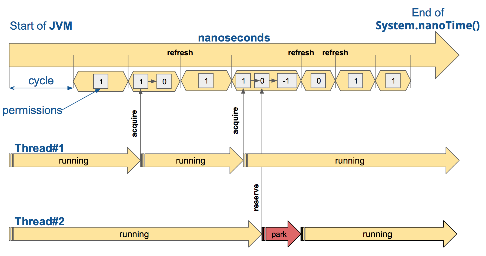

### 목차

- [Introduction](#introduction)
- [Internals](#internals)
- [Create a RateLimiterRegistry](#create-a-ratelimiterregistry)
- [Create and configure a RateLimiter](#create-and-configure-a-ratelimiter)
- [Decorate and execute a functional interface](#decorate-and-execute-a-functional-interface)
- [Consume emitted RegistryEvents](#consume-emitted-registryevents)
- [Consume emitted RateLimiterEvents](#consume-emitted-ratelimiterevents)
- [Override the RegistryStore](#override-the-registrystore)

---

## Introduction

Rate limiting은 API 규모 확장에 대비하고, 서비스의 고가용성과 안정성을 확립하기 위해선 반드시 필요한 기술이다. 게다가 제한치를 넘어간 것을 감지했을 때의 동작이나 제한할 요청 타입과 관련된 광범위한 옵션을 함께 제공한다. 간단히 제한치를 넘어선 요청을 거부하거나, 큐를 만들어 나중에 실행할 수도 있고, 어떤 방식으로든 두 정책을 조합해도 된다.

---

## Internals

Resilience4j는 epoch 시작 시점부터 나노초 단위로 사이클을 분할하는 RateLimiter를 제공한다. 각 사이클이 갖는 기간은 `RateLimiterConfig.limitRefreshPeriod`로 설정해둔 기간이다. 각 사이클이 시작될 때 RateLimiter는 `RateLimiterConfig.limitForPeriod`에 활성 권한 수를 설정한다.<br>
RateLimiter를 호출하는 쪽에선 매 사이클마다 활성 권한 수를 갱신하는 것처럼 보이지만, 실제 `AtomicRateLimiter` 구현체 내부에선 RateLimiter 사용이 활발하지 않다면 갱신을 건너뛰는 식으로 최적화를 진행한다.



RateLimiter의 디폴트 구현체는 AtomicReference를 통해 상태를 관리하는 `AtomicRateLimiter`다. `AtomicRateLimiter.State`는 완전한 immutable 클래스로, 다음과 같은 필드를 가지고 있다:

- `activeCycle` - 마지막에 있었던 호출에서 사용한 사이클 번호.
- `activePermissions` - 마지막으로 호출하고 나서 측정했던 사용 가능한 권한 수.<br>
  권한을 미리 예약해뒀다면 음수일 수도 있다.
- `nanosToWait` - 마지막으로 호출했을 때 권한을 획득하기 위해 기다린 나노초.

다른 구현체로는, 세마포어를 사용하면서 `RateLimiterConfig#limitRefreshPeriod`가 지날 때 마다 스케줄러를 통해 권한을 리프레시하는 `SemaphoreBasedRateLimiter`가 있다.

---

## Create a RateLimiterRegistry

이 모듈은 CircuitBreaker 모듈과 동일하게 RateLimiter 인스턴스들을 관리(생성/조회)할 수 있는 인 메모리 `RateLimiterRegistry`를 제공한다.

```java
RateLimiterRegistry rateLimiterRegistry = RateLimiterRegistry.ofDefaults();
```

---

## Create and configure a RateLimiter

커스텀 글로벌 `RateLimiterConfig`를 제공하는 것도 가능하다. 커스텀 글로벌 `RateLimiterConfig`를 생성할 땐 RateLimiterConfig 빌더를 사용하면 된다. 이 빌더를 통해 다음과 같은 프로퍼티를 설정할 수 있다.

| Config property                                           | Default value | Description                                                  |
| :-------------------------------------------------------- | :------------ | :----------------------------------------------------------- |
| <span class="custom-blockquote">timeoutDuration</span>    | 5 [s]         | 스레드가 권한 획득을 기다리는 디폴트 시간                    |
| <span class="custom-blockquote">limitRefreshPeriod</span> | 500 [ns]      | 제한을 갱신할 주기. rate limiter는 이 시간만큼 지날 때마다 권한 수를 `limitForPeriod` 값으로 되돌린다. |
| <span class="custom-blockquote">limitForPeriod</span>     | 50            | 제한을 갱신한 후 재갱신 전까지 사용할 수 있는 권한 수        |

예를 들어 어떤 메소드를 호출하는 속도를 10req/ms 이하로 제한하고 싶다면 다음과 같이 설정하면 된다.

```java
RateLimiterConfig config = RateLimiterConfig.custom()
  .limitRefreshPeriod(Duration.ofMillis(1))
  .limitForPeriod(10)
  .timeoutDuration(Duration.ofMillis(25))
  .build();

// Create registry
RateLimiterRegistry rateLimiterRegistry = RateLimiterRegistry.of(config);

// Use registry
RateLimiter rateLimiterWithDefaultConfig = rateLimiterRegistry
  .rateLimiter("name1");

RateLimiter rateLimiterWithCustomConfig = rateLimiterRegistry
  .rateLimiter("name2", config);
```

---

## Decorate and execute a functional interface

짐작했겠지만, RateLimiter도 CircuitBreaker에 있던 고차원 데코레이터 함수를 모두 가지고 있다. `Callable`, `Supplier`, `Runnable`, `Consumer`, `CheckedRunnable`, `CheckedSupplier`, `CheckedConsumer`, `CompletionStage`라면 모두 RateLimiter로 데코레이트할 수 있다.

```java
// Decorate your call to BackendService.doSomething()
CheckedRunnable restrictedCall = RateLimiter
    .decorateCheckedRunnable(rateLimiter, backendService::doSomething);

Try.run(restrictedCall)
    .andThenTry(restrictedCall)
    .onFailure((RequestNotPermitted throwable) -> LOG.info("Wait before call it again :)"));
```

`changeTimeoutDuration`과 `changeLimitForPeriod` 메소드를 사용해서 런타임에 rate limiter 파라미터를 변경할 수 있다.<br>바뀐 타임아웃 값은 현재 권한을 기다리고 있는 스레드엔 영향을 주지 않는다.<br>
새로운 제한치도 현재 주기에서 획득할 수 있는 권한엔 영향을 주지 않으며, 다음 주기부터 적용된다.

```java
// Decorate your call to BackendService.doSomething()
CheckedRunnable restrictedCall = RateLimiter
    .decorateCheckedRunnable(rateLimiter, backendService::doSomething);

// during second refresh cycle limiter will get 100 permissions
rateLimiter.changeLimitForPeriod(100);
```

---

## Consume emitted RegistryEvents

RateLimiterRegistry에 이벤트 컨슈머를 등록해서 RateLimiter가 생성, 교체, 삭제될 때마다 필요한 로직을 실행할 수 있다.

```java
RateLimiterRegistry registry = RateLimiterRegistry.ofDefaults();
registry.getEventPublisher()
  .onEntryAdded(entryAddedEvent -> {
    RateLimiter addedRateLimiter = entryAddedEvent.getAddedEntry();
    LOG.info("RateLimiter {} added", addedRateLimiter.getName());
  })
  .onEntryRemoved(entryRemovedEvent -> {
    RateLimiter removedRateLimiter = entryRemovedEvent.getRemovedEntry();
    LOG.info("RateLimiter {} removed", removedRateLimiter.getName());
  });
```

---

## Consume emitted RateLimiterEvents

RateLimiter는 RateLimiterEvent 스트림을 방출한다. 이벤트는 권한 획득 성공일 수도 있고, 획득 실패일 수도 있다.<br>모든 이벤트는 이벤트 생성 시간, rate limiter 이름과 같은 추가 정보를 가지고 있다.<br>이 이벤트를 컨슘하려면 이벤트 컨슈머를 등록해야 한다.

```java
rateLimiter.getEventPublisher()
    .onSuccess(event -> logger.info(...))
    .onFailure(event -> logger.info(...));
```

RxJava나 RxJava2, Project Reactor 어댑터를 사용하면 EventPublisher를 리액티브 스트림으로 전환할 수 있다.

```java
ReactorAdapter.toFlux(rateLimiter.getEventPublisher())
    .filter(event -> event.getEventType() == FAILED_ACQUIRE)
    .subscribe(event -> logger.info(...))
```

---

## Override the RegistryStore

인 메모리 RegistryStore는 커스텀 구현체로 재정의할 수 있다. 예를 들어 일정 시간이 지나면 사용하지 않는 인스턴스를 제거하는 캐시를 사용하고 싶다면:

```java
RateLimiterRegistry rateLimiterRegistry = RateLimiterRegistry.custom()
  .withRegistryStore(new CacheRateLimiterRegistryStore())
  .build();
```