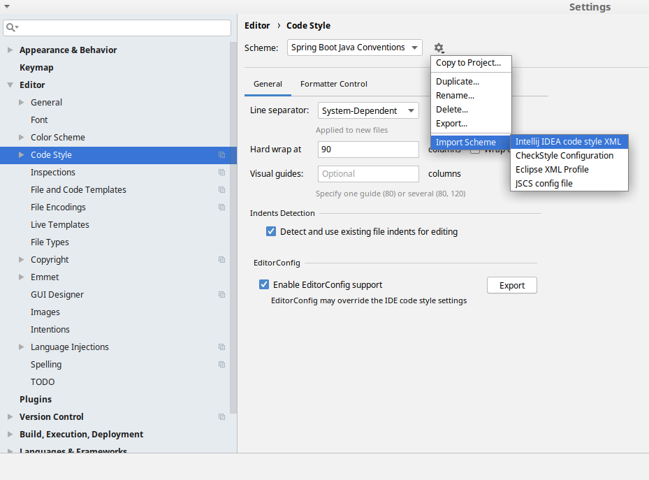
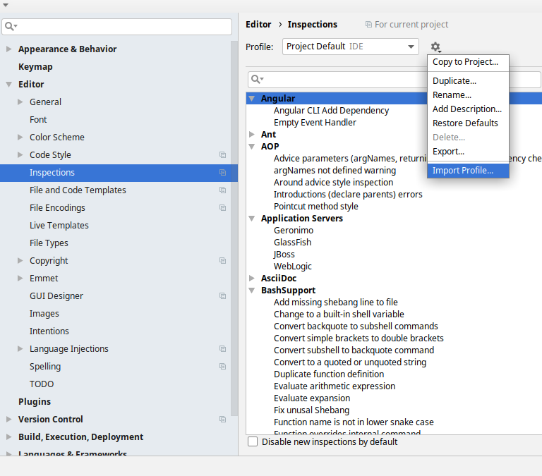
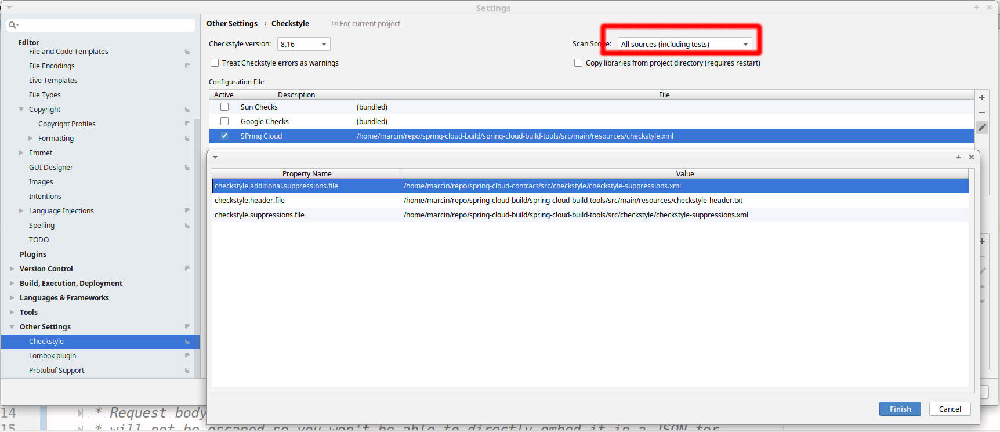

### 목차

- [4.1. Sign the Contributor License Agreement](#41-sign-the-contributor-license-agreement)
- [4.2. Code of Conduct](#42-code-of-conduct)
- [4.3. Code Conventions and Housekeeping](#43-code-conventions-and-housekeeping)
- [4.4. Checkstyle](#44-checkstyle)
- [4.5. IDE setup](#45-ide-setup)
  + [4.5.1. Intellij IDEA](#451-intellij-idea)

---

스프링 클라우드는 자유로운 Apache 2.0 라이선스에 따라 릴리즈되며, Github tracker로 이슈를 관리하고 pull request를 master로 병합하는 매우 표준적인 Github 개발 프로세스를 따른다. 사소하더라도 기여하고 싶은 게 있다면 주저 말고 아래 가이드라인을 따라주길 바란다.

---

## 4.1. Sign the Contributor License Agreement

적지 않은 코드 수정이나 pull request를 수락하기 위해선 먼저, [컨트리뷰터 라이선스 동의](https://cla.pivotal.io/sign/spring)에 서명해야 한다. 여기에 서명한다고 해서 메인 레포지토리에 대한 커밋 권한을 부여하는 건 아니지만, 서명은 우리가 당신의 기여를 수락할 수 있으며, 수락하게 되면 author 크레딧을 받게된다는 의미다. 활발한 기여자에겐 코어 팀에 합류하라는 제의를 보낼 수도 있으며, pull request를 머지할 수 있는 권한이 부여된다.

---

## 4.2. Code of Conduct

이 프로젝트는 [Contributor Covenant](https://en.wikipedia.org/wiki/Contributor_Covenant) [행동 강령](https://github.com/spring-cloud/spring-cloud-build/blob/master/docs/src/main/asciidoc/code-of-conduct.adoc)을 준수한다. 프로젝트에 참여하게 되면 이 지침에 동의하는 것으로 간주한다. 허용되지 않는 행동은 [spring-code-of-conduct@pivotal.io](mailto:spring-code-of-conduct@pivotal.io)로 신고 바란다.

---

## 4.3. Code Conventions and Housekeeping

여기 있는 내용은 pull request에 반드시 필요한 건 아니지만, 모두 도움이 되는 내용이다. pull request를 먼저 만들고, 이후 머지하기 전에 추가해도 된다.

- 스프링 프레임워크 코드 포맷 컨벤션을 사용해라. Eclipse를 사용한다면 [Spring Cloud Build](https://raw.githubusercontent.com/spring-cloud/spring-cloud-build/master/spring-cloud-dependencies-parent/eclipse-code-formatter.xml) 프로젝트의 `eclipse-code-formatter.xml` 파일을 사용해 포맷터 설정을 임포트할 수 있다. IntelliJ를 사용하고 있다면 [Eclipse Code Formatter Plugin](https://plugins.jetbrains.com/plugin/6546)을 통해 같은 파일을 임포트할 수 있다.
- 새로 만든 `.java` 파일엔 모두 당신을 식별할 수 있도록 최소 `@author` 태그를 가진 간단한 Javadoc 클래스 주석이라도 추가해라. 가능하면 해당 클래스가 무엇을 위한 것인지 최소한 한 문단이라도 추가해 주는 게 좋다.
- 새로 만든 모든 `.java` 파일은 주석에 ASF 라이센스 헤더를 추가해라 (프로젝트에 이미 있는 다른 파일에서 복사해도 된다).
- 내용을 많이 바꾼 .java 파일이 있다면 (단순히 외형만 수정한 경우는 제외) 당신을 `@author`로 추가해라.
- 몇 가지 Javadoc을 추가하고, 네임스페이스를 변경했다면 XSD 문서 요소를 추가해라.
- 조금이라도 단위 테스트가 있으면 큰 도움이 된다 — 누군가는 만들어야 한다.
- 브랜치를 혼자 사용하고 있다면 현재 master에 (또는 main 프로젝트에 있는 다른 타겟 브랜치에) 리베이스해라.
- 커밋 메세지는 [이 컨벤션](https://tbaggery.com/2008/04/19/a-note-about-git-commit-messages.html)에 따라 작성하고, 이미 있는 이슈를 수정했다면 커밋 메세지 끝에 `Fixes gh-XXXX`(XXXX는 이슈 번호)를 추가해라.

---

## 4.4. Checkstyle

Spring Cloud Build는 checkstyle 룰 셋을 함께 제공한다. 룰 셋은 `spring-cloud-build-tools` 모듈에서 찾을 수 있다. 이 모듈에서 가장 주목해야 하는 파일은 다음과 같다:

**spring-cloud-build-tools/**

```
└── src
    ├── checkstyle
    │   └── checkstyle-suppressions.xml // (3)
    └── main
        └── resources
            ├── checkstyle-header.txt // (2)
            └── checkstyle.xml // (1)
```

<small><span style="background-color: #a9dcfc; border-radius: 50px;">(1)</span> 디폴트 Checkstyle 룰</small><br>
<small><span style="background-color: #a9dcfc; border-radius: 50px;">(2)</span> 파일 헤더 세팅</small><br>
<small><span style="background-color: #a9dcfc; border-radius: 50px;">(3)</span> 디폴트 suppression 룰</small>

### 4.4.1. Checkstyle configuration

Checkstyle 룰은 **기본적으로 비활성화**돼 있다. 프로젝트에 checkstyle을 추가하려면 아래 프로퍼티와 플러그인을 정의하기만 하면 된다.

**pom.xml**

```xml
<properties>
<maven-checkstyle-plugin.failsOnError>true</maven-checkstyle-plugin.failsOnError> <!-- (1) -->
        <maven-checkstyle-plugin.failsOnViolation>true
        </maven-checkstyle-plugin.failsOnViolation> <!-- (2) -->
        <maven-checkstyle-plugin.includeTestSourceDirectory>true
        </maven-checkstyle-plugin.includeTestSourceDirectory> <!-- (3) -->
</properties>

<build>
        <plugins>
            <plugin> <!-- (4) -->
                <groupId>io.spring.javaformat</groupId>
                <artifactId>spring-javaformat-maven-plugin</artifactId>
            </plugin>
            <plugin> <!-- (5) -->
                <groupId>org.apache.maven.plugins</groupId>
                <artifactId>maven-checkstyle-plugin</artifactId>
            </plugin>
        </plugins>

    <reporting>
        <plugins>
            <plugin> <!-- (5) -->
                <groupId>org.apache.maven.plugins</groupId>
                <artifactId>maven-checkstyle-plugin</artifactId>
            </plugin>
        </plugins>
    </reporting>
</build>
```
<small><span style="background-color: #a9dcfc; border-radius: 50px;">(1)</span> Checkstyle 오류가 발생하면 빌드를 실패시킨다</small><br>
<small><span style="background-color: #a9dcfc; border-radius: 50px;">(2)</span> Checkstyle을 위반하면 빌드를 실패시킨다</small><br>
<small><span style="background-color: #a9dcfc; border-radius: 50px;">(3)</span> Checkstyle에서 테스트 코드도 함께 분석한다</small><br>
<small><span style="background-color: #a9dcfc; border-radius: 50px;">(4)</span> Checkstyle 포맷팅 룰을 대부분 통과하도록 코드 포맷을 바꿔주는 스프링 자바 포맷 플러그인을 추가한다</small><br>
<small><span style="background-color: #a9dcfc; border-radius: 50px;">(5)</span> build, reporting 페이즈에 checkstyle 플러그인을 추가한다</small>

무시하고 싶은 규칙이 있다면 (ex. 라인 길이를 더 늘려줘야 하는 등) <span class="custom-blockquote">${project.root}/src/checkstyle/checkstyle-suppressions.xml</span> 아래 파일에 suppressions를 정의하기만 하면 된다. 예를 들면:

**projectRoot/src/checkstyle/checkstyle-suppresions.xml**

```xml
<?xml version="1.0"?>
<!DOCTYPE suppressions PUBLIC
        "-//Puppy Crawl//DTD Suppressions 1.1//EN"
        "https://www.puppycrawl.com/dtds/suppressions_1_1.dtd">
<suppressions>
    <suppress files=".*ConfigServerApplication\.java" checks="HideUtilityClassConstructor"/>
    <suppress files=".*ConfigClientWatch\.java" checks="LineLengthCheck"/>
</suppressions>
```

`${spring-cloud-build.rootFolder}/.editorconfig`와 `${spring-cloud-build.rootFolder}/.springformat`을 프로젝트에 복사해가는 게 좋다. 이렇게하면 몇 가지 기본 포맷팅 룰이 적용될 거다. 아래 스크립트를 실행해도 된다:

```bash
$ curl https://raw.githubusercontent.com/spring-cloud/spring-cloud-build/master/.editorconfig -o .editorconfig
$ touch .springformat
```

---

## 4.5. IDE setup

### 4.5.1. Intellij IDEA

Intellij를 세팅하려면 코딩 컨벤션, inspection 프로파일을 임포트하고 checkstyle 플러그인을 설정해야 한다. 아래 파일은 [Spring Cloud Build](https://github.com/spring-cloud/spring-cloud-build/tree/master/spring-cloud-build-tools) 프로젝트에서 찾을 수 있다.

**spring-cloud-build-tools/**

```
└── src
    ├── checkstyle
    │   └── checkstyle-suppressions.xml // (3)
    └── main
        └── resources
            ├── checkstyle-header.txt // (2)
            ├── checkstyle.xml // (1)
            └── intellij
                ├── Intellij_Project_Defaults.xml // (4)
                └── Intellij_Spring_Boot_Java_Conventions.xml // (5)
```
<small><span style="background-color: #a9dcfc; border-radius: 50px;">(1)</span> 디폴트 Checkstyle 룰</small><br>
<small><span style="background-color: #a9dcfc; border-radius: 50px;">(2)</span> 파일 헤더 세팅</small><br>
<small><span style="background-color: #a9dcfc; border-radius: 50px;">(3)</span> 디폴트 suppression 룰</small><br>
<small><span style="background-color: #a9dcfc; border-radius: 50px;">(4)</span> Checkstyle 룰을 대부분 적용하는 Intellij의 프로젝트 기본값</small><br>
<small><span style="background-color: #a9dcfc; border-radius: 50px;">(5)</span> Checkstyle 룰을 대부분 적용하는 Intellij의 프로젝트 스타일 컨벤션</small>



**Figure 1. Code style**

`File` → `Settings` → `Editor` → `Code style`로 이동해라. 그다음 `Scheme` 섹션 옆에 있는 아이콘을 클릭한다. 거기 나오는 `Import Scheme`을 클릭하고 `Intellij IDEA code style XML` 옵션을 선택해라. <span class="custom-blockquote">spring-cloud-build-tools/src/main/resources/intellij/Intellij_Spring_Boot_Java_Conventions.xml</span> 파일을 임포트해라.



**Figure 2. Inspection profiles**

`File` → `Settings` → `Editor` → `Inspections`로 이동해라. 그다음 `Profile` 섹션 옆에 있는 아이콘을 클릭한다. 거기 나오는 `Import Profile`을 클릭하고 <span class="custom-blockquote">spring-cloud-build-tools/src/main/resources/intellij/Intellij_Project_Defaults.xml</span> 파일을 임포트해라.

**Checkstyle**

Intellij에서 Checkstyle이 동작하게 하려면 `Checkstyle` 플러그인을 설치해야 한다. `Assertions2Assertj`도 함께 설치해서 JUnit assertions를 자동으로 변환하는 게 좋다.



`File` → `Settings` → `Other settings` → `Checkstyle`로 이동해라. 그다음 `Configuration file` 섹션에서 `+` 아이콘을 클릭한다. 여기에 checkstyle 룰을 선택할 위치를 정의해야 한다. 위 이미지에선 클론한 Spring Cloud Build 레포지토리에 있는 룰을 선택했다. Spring Cloud Build 깃허브 레포지토리를 직접 가리켜도 된다 (e.x. `checkstyle.xml` : <span class="custom-blockquote">raw.githubusercontent.com/spring-cloud/spring-cloud-build/master/spring-cloud-build-tools/src/main/resources/checkstyle.xml</span>). 다음과 같은 변수를 제공해야 한다:

- `checkstyle.header.file` - 클론한 레포지토리나 <span class="custom-blockquote">raw.githubusercontent.com/spring-cloud/spring-cloud-build/master/spring-cloud-build-tools/src/main/resources/checkstyle-header.txt</span> URL을 통해 Spring Cloud Build의 <span class="highlighter-rouge" style="background-color: #404145; color: #FAFAFA; font-size: 0.85em;">spring-cloud-build-tools/src/main/resources/checkstyle-header.txt</span> 파일을 가리켜라.
- `checkstyle.suppressions.file` - 디폴트 suppressions. 클론한 레포지토리나 <span class="custom-blockquote">raw.githubusercontent.com/spring-cloud/spring-cloud-build/master/spring-cloud-build-tools/src/checkstyle/checkstyle-suppressions.xml</span> URL을 통해 Spring Cloud Build의 <span class="highlighter-rouge" style="background-color: #404145; color: #FAFAFA; font-size: 0.85em;">spring-cloud-build-tools/src/checkstyle/checkstyle-suppressions.xml</span> 파일을 가리켜라.
- `checkstyle.additional.suppressions.file` - 로컬 프로젝트의 suppressions에 해당하는 변수다. 예를 들어 `spring-cloud-contract`에서 작업을 하고 있다고 해보자. 이 변수로는 <span class="custom-blockquote">project-root/src/checkstyle/checkstyle-suppressions.xml</span> 폴더를 가리켜라. `spring-cloud-contract`로 예를 들자면 <span class="highlighter-rouge" style="background-color: #404145; color: #FAFAFA; font-size: 0.85em;">/home/username/spring-cloud-contract/src/checkstyle/checkstyle-suppressions.xml</span>이다.

> 프로덕션과 테스트 코드에 checkstyle 룰을 적용하기 때문에 `Scan Scope`를 `All sources`로 설정해야 한다는 점에 주의하자.