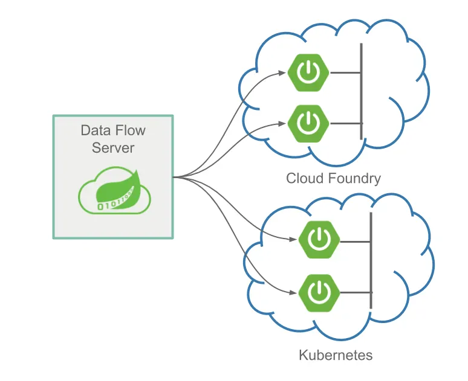

---

스트림 처리는 특별한 상호 작용이나 개입 없이 무한한 양의 데이터를 처리하는 것으로 정의된다. 스트림 처리에 관한 비즈니스 사례는 다음과 같다:

- 실시간 신용카드 사기 탐지 또는 예측 분석
- 분석을 통해 실용적인 가치를 창출해내기 위한 준 실시간 비즈니스 데이터 처리

Spring Cloud Data Flow에서 스트림 처리는 구조적으로 보면 선택한 메세징 미들웨어(ex. RabbitMQ, Apache Kafka)를 통해 연결되는 독립적인 이벤트 기반 스트리밍 애플리케이션 컬렉션으로 구현된다. 독립적인 애플리케이션들은 런타임에 모여 스트리밍 데이터 파이프라인을 구성한다. 이때 파이프라인은 애플리케이션 간에 데이터가 어떻게 흐르냐에 따라 선형일 수도, 비선형일 수도 있다.

### 목차

- [Messaging Middleware](#messaging-middleware)
- [Spring Cloud Stream](#spring-cloud-stream)
- [Running Streaming Apps in the Cloud](#running-streaming-apps-in-the-cloud)
- [Orchestrating Streaming Apps](#orchestrating-streaming-apps)
- [Next Steps](#next-steps)

---

## Messaging Middleware

배포된 스트림 애플리케이션들 메세징 미들웨어 제품을 통해 통신한다. SCDF에선 [RabbitMQ](https://www.rabbitmq.com/)나 [Kafka](https://kafka.apache.org/)를 통해 통신하고 다양한 데이터 제품과 통합할 수 있는 스트림 애플리케이션을 미리 빌드해서 제공하고 있다.

[Spring Cloud Stream Binder](https://cloud.spring.io/spring-cloud-stream/#binder-implementations)를 이용하면 다양한 메세징 미들웨어 제품을 사용할 수 있다. Spring Cloud Data Flow는 다음과 같은 인기 플랫폼들을 지원한다:

- [Kafka Streams](https://kafka.apache.org/documentation/streams/)
- [Amazon Kinesis](https://aws.amazon.com/kinesis/)
- [Google Pub/Sub](https://cloud.google.com/pubsub/docs/)
- [Solace PubSub+](https://solace.com/software/)
- [Azure Event Hubs](https://azure.microsoft.com/en-us/services/event-hubs/)

자세한 정보는 [여기](https://cloud.spring.io/spring-cloud-stream/#binder-implementations)에서 확인할 수 있다 (현재 지원하는 Spring Cloud Stream Binder 목록 등).

---

## Spring Cloud Stream

스프링 개발자라면 커스텀 스트림 애플리케이션은 [Spring Cloud Stream](https://spring.io/projects/spring-cloud-stream) 프레임워크를 사용해 작성하길 권장한다. Spring Cloud Stream을 사용하면 공통 메세징 시스템으로 연결되는 확장성이 뛰어난 이벤트 기반 마이크로서비스를 쉽게 구축할 수 있다.

저수준 API가 가져오는 복잡성과 메세지 브로커에 연결하는 보일러플레이트는 Spring Cloud Stream에 위임하고, 개발자는 애플리케이션의 비즈니스 로직을 개발하는데 집중할 수 있다.

스트리밍 애플리케이션은 고수준에서 메세징 미들웨어를 통해 이벤트를 생성produce, 처리process, 소비consume할 수 있다.

---

## Running Streaming Apps in the Cloud

클라우드 파운드리와 쿠버네티스에는 애플리케이션을 long-lived 형식으로 실행한다는 개념이 있다. 클라우드 파운드리에선 이런 애플리케이션을 LRPLong Running Process라고 일컫는다. 쿠버네티스에선 deployment 리소스를 사용하면 애플리케이션을 실행하는 포드 수를 지정한 수만큼 유지해주는 레플리카 셋을 관리할 수 있다.

Spring Cloud Stream 자체만으로도 스트리밍 애플리케이션 작성을 크게 단순화할 수 있긴 하지만, 독립적인 Spring Cloud Streaming 애플리케이션들을 수동으로 배포할 땐 다음과 같은 일들을 수행해야 한다:

- 모든 애플리케이션의 입출력 목적지를 설정한다.
- 목적지가 같은 컨슈머가 적절하게 합쳐지거나 분리될 수 있도록, 공통으로 사용하는 컨슈머 그룹 프로퍼티명을 설정한다.
- 모니터링을 위해 애플리케이션을 식별하고 메트릭 정보를 게시할 수 있도록 여러 가지 프로퍼티를 설정한다.
- 메세징 미들웨어에 대한 커넥션을 구성하고, 목적지를 만들고, 스케일링과 파티셔닝을 설정한다.
- 애플리케이션 실행에 필요한 플랫폼 리소스들을 생성한다.

Spring Cloud Data Flow에서 하나의 스트림 정의로 스트리밍 애플리케이션들을 배포하면, 시스템이 이런 모든 설정들을 자동으로 처리하고 타겟 플랫폼에서 애플리케이션을 실행하는 데 필요한 인프라 리소스들을 생성한다. 다양한 배포 프로퍼티가 있기 때문에 배포 방식을 커스텀할 수도 있다 (예를 들면 메모리 리소스같은 공통 프로퍼티 설정이나, 클라우드 파운드리에서 빌드팩같은 플랫폼 전용 프로퍼티 속성 설정, 쿠버네티스 deployment에 레이블 설정 등).

---

## Orchestrating Streaming Apps

Spring Cloud Stream을 이용해 스트림 애플리케이션을 작성했거나 미리 빌드돼 있는 여러 가지 Spring Cloud Stream 애플리케이션 중 하나를 사용했다면, 이제 스트리밍 데이터 파이프라인을 구성하는 애플리케이션은 어떻게 정의하고 모든 애플리케이션들의 시작은 어떻게 오케스트레이션할 수 있을까? Spring Cloud Data Flow가 도움을 줄 수 있는 지점이 바로 여기다.

Spring Cloud Data Flow를 통하면 UI에서 drag-and-drop designer를 이용하거나, 친숙한 파이프와 필터 구문을 사용하는 DSLDomain Specific Language로 스트림을 정의할 수 있다. 자세한 내용은 [Tooling](../concepts.tooling) 가이드를 참고해라.

이제 쿠버네티스나 클라우드 파운드리 환경에 배포할 수 있다. 배포하고 난 뒤에 개별 애플리케이션을 업데이트해야 하는 경우엔 어떨까? Spring Cloud Data Flow는 플랫폼에서 blue/green 배포를 트리거하는 간단한 업그레이드 명령어를 제공해서 업그레이드도 쉽게 진행할 수 있다. 자세한 내용은 [Continuous Delivery](https://dataflow.spring.io/docs/stream-developer-guides/continuous-delivery/) 가이드를 참고해라.

스트림은 흔히 사용하는 다양한 모니터링 시스템을 통해 모니터링할 수 있다. 여기서는 프로메테우스와 InfluxDB로 시연한다. 이제 스트림들은 기본으로 제공하는 그라파나 대시보드 템플릿으로 조회할 수 있다. 자세한 내용은 [모니터링](https://dataflow.spring.io/docs/feature-guides/streams/monitoring/) 섹션을 참고해라.

---

## Next Steps

미리 빌드돼 있는 애플리케이션을 사용해 스트리밍 데이터 파이프라인을 생성하는데 관심이 있다면 [스트림 시작 가이드](https://dataflow.spring.io/docs/stream-developer-guides/getting-started/)를 읽어봐라.

Spring Cloud Stream을 사용해 커스텀 스트림 처리 애플리케이션을 작성하고 배포하고 싶다면 [스트림 개발자 가이드](https://dataflow.spring.io/docs/stream-developer-guides/streams/)를 읽어봐라.
