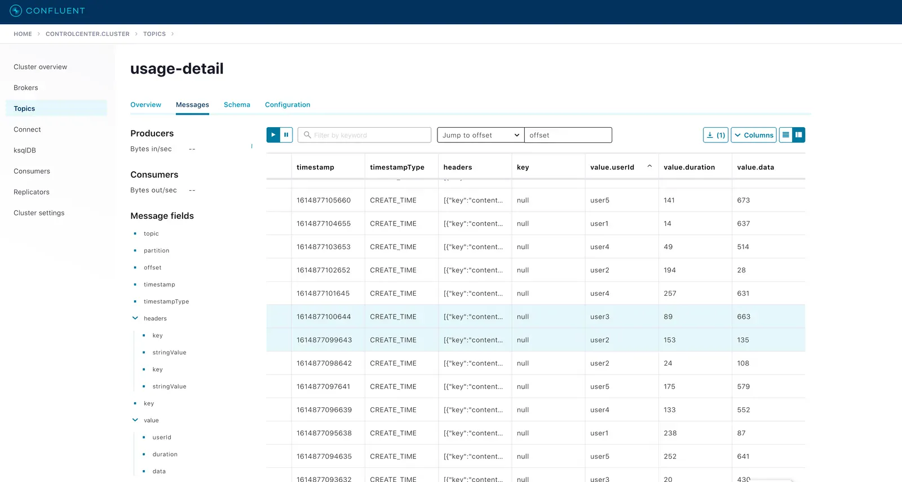
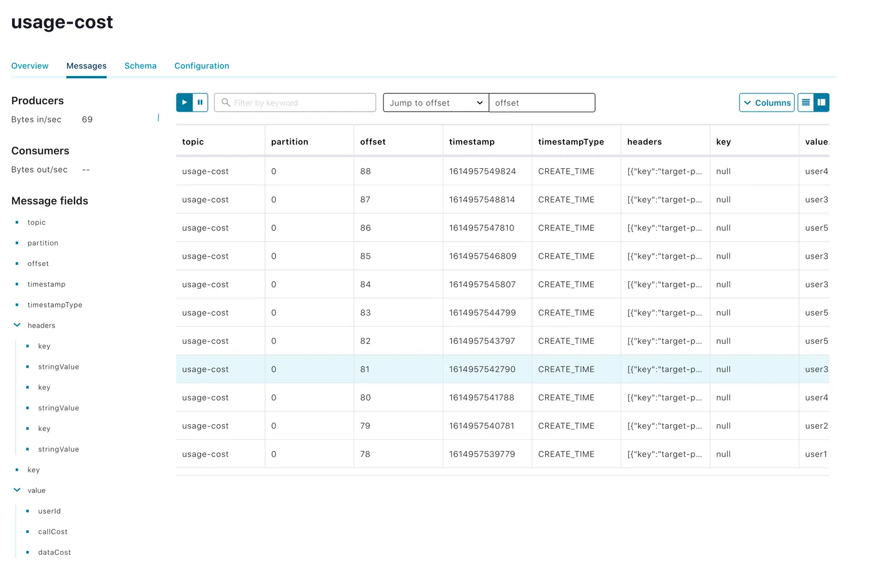
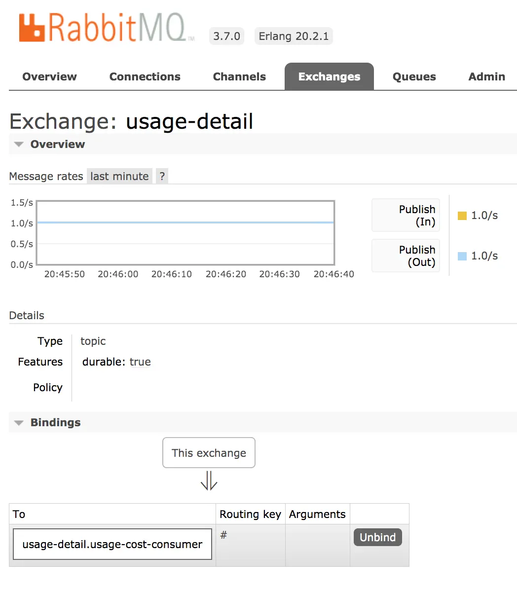
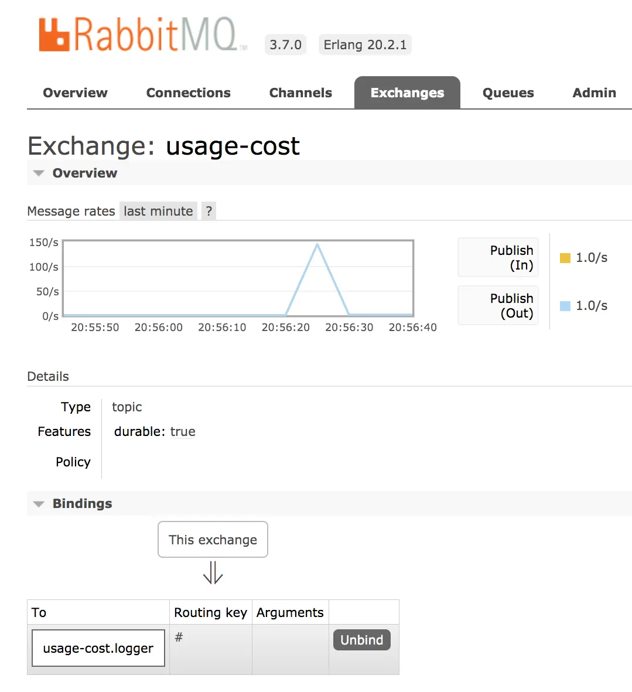
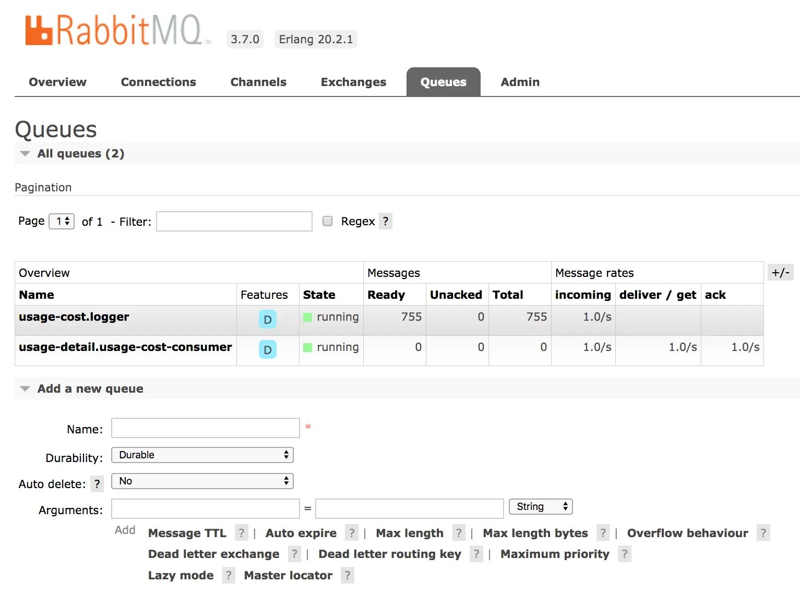

---

[샘플 스트림 애플리케이션들](../stream-developer-guides.stream-development.stream-application-development)을 설정해 빌드하고, 지원하는 메세지 브로커 중에 하나를 골라 함께 실행되도록 설정을 완료했다면, 이 애플리케이션들은 `local` 환경에서 독립형으로 실행할 수 있다.

### 목차

- [Local Deployment using Kafka](#local-deployment-using-kafka)
  + [Install and Run Kafka](#install-and-run-kafka)
  + [Run with Docker Compose](#run-with-docker-compose)
  + [Running the Source](#running-the-source)
  + [Running the Processor](#running-the-processor)
  + [Running the Sink](#running-the-sink)
  + [Clean up](#clean-up)
- [Local Deployment using RabbitMQ](#local-deployment-using-rabbitmq)
  + [Install and Run RabbitMQ](#install-and-run-rabbitmq)
  + [Running the UsageDetailSender Source](#running-the-usagedetailsender-source)
  + [Running the Processor](#running-the-processor-1)
  + [Running the Sink](#running-the-sink-1)

---

## Local Deployment using Kafka

아직 설정을 완료하지 않았다면, 로컬 환경에 `Kafka`를 다운받아 실행하거나 `docker-compose`를 이용해 `Kafka`와 `Zookeeper`를 컨테이너로 실행시키면 된다.

### Install and Run Kafka

아카이브를 [다운로드](https://kafka.apache.org/downloads)받고 압축을 풀어라. 그런 다음 카프카 설치 디렉토리에서 아래 명령어를 실행해 `ZooKeeper`와 `Kafka` 서버를 시작해라:

```bash
./bin/zookeeper-server-start.sh config/zookeeper.properties &
```

```bash
./bin/kafka-server-start.sh config/server.properties &
```

### Run with Docker Compose

아니면 도커 전용 [trial Confluent platform](https://docs.confluent.io/platform/current/quickstart/ce-docker-quickstart.html)을 다운받아도 된다.

```bash
curl --silent --output docker-compose.yml \
  https://raw.githubusercontent.com/confluentinc/cp-all-in-one/6.1.0-post/cp-all-in-one/docker-compose.yml
```

이 플랫폼을 시작하려면:

```bash
docker-compose up -d
```

이렇게 하면 카프카 브로커 외에도 [Control Center](https://docs.confluent.io/platform/current/monitor/index.html)를 포함한 다른 Confluent 컴포넌트들을 설치하게 된다. 토픽에 발행한 메세지들을 조회하려면 http://localhost:9021에서 Control Center에 액세스해서 `Topics`를 선택라.

### Running the Source

[미리 정의돼 있는](../stream-developer-guides.stream-development.stream-application-development#source) 설정 프로퍼티들을 사용하면 `UsageDetailSender` 애플리케이션은 다음과 같이 실행할 수 있다:

```bash
java -jar target/usage-detail-sender-kafka-0.0.1-SNAPSHOT.jar &
```

카프가 바이너리를 설치했다면 다음과 같이 카프카 콘솔 컨슈머를 이용해 카프카 토픽 `usage-detail`로 전송되는 메시지를 확인할 수 있다:

```bash
./bin/kafka-console-consumer.sh --bootstrap-server localhost:9092 --topic usage-detail
```

Confluent platform을 설치했다면 위에서 설명한 대로 Control Center에 접근해라. `usage-detail` 토픽과 `Messages` 탭을 선택하면 다음과 같은 내용을 확인할 수 있을 거다:



토픽들을 확인해보려면 아래 명령어를 실행해라:

```bash
./bin/kafka-topics.sh --zookeeper localhost:2181 --list
```

### Running the Processor

[미리 정의돼 있는](../stream-developer-guides.stream-development.stream-application-development#processor) 설정 프로퍼티들을 사용하면 `UsageCostProcessor` 애플리케이션은 다음과 같이 실행할 수 있다:

```sh
java -jar target/usage-cost-processor-kafka-0.0.1-SNAPSHOT.jar  &
```

`UsageDetailSender` 소스 애플리케이션이 카프카 토픽 `usage-detail`에 `UsageDetail` 데이터를 전송하면, 다음과 같이 카프카 토픽 `usage-cost`에서 `UsageCostDetail`을 확인할 수 있다.

```sh
 ./bin/kafka-console-consumer.sh --bootstrap-server localhost:9092 --topic usage-cost
```

또는 Control Center를 사용한다면:



### Running the Sink

[미리 정의돼 있는](../stream-developer-guides.stream-development.stream-application-development#sink) 설정 프로퍼티들을 사용하면 `UsageCostLogger` 애플리케이션은 다음과 같이 실행할 수 있다:

```sh
java -jar target/usage-cost-logger-kafka-0.0.1-SNAPSHOT.jar &
```

이제 이 애플리케이션이 `UsageCostDetail`를 기록하는 것을 확인할 수 있다.

```bash
...
2021-03-05 10:44:05.193  INFO 55690 --- [container-0-C-1] i.s.d.s.u.UsageCostLogger     : {"userId": "user2", "callCost": "0.7000000000000001", "dataCost": "21.8" }
2021-03-05 10:44:05.193  INFO 55690 --- [container-0-C-1] i.s.d.s.u.UsageCostLogger     : {"userId": "user2", "callCost": "0.7000000000000001", "dataCost": "21.8" }
2021-03-05 10:44:06.195  INFO 55690 --- [container-0-C-1] i.s.d.s.u.UsageCostLogger     : {"userId": "user4", "callCost": "0.5", "dataCost": "24.55" }
2021-03-05 10:44:06.199  INFO 55690 --- [container-0-C-1] i.s.d.s.u.UsageCostLogger     : {"userId": "user4", "callCost": "0.5", "dataCost": "24.55" }
...
```

### Clean up

`docker-compose`로 Confluent platform을 시작했다면 리소스를 정리할 땐:

```bash
docker-compose stop
```

---

## Local Deployment using RabbitMQ

[샘플 스트림 애플리케이션들](../stream-developer-guides.stream-development.stream-application-development)을 설정해 빌드하고, RabbitMQ와 함께 실행되도록 설정을 완료했다면, 이 애플리케이션들은 `local` 환경에서 독립형으로 실행할 수 있다.

### Install and Run RabbitMQ

`RabbitMQ` 도커 이미지를 설치하고 실행하려면 아래 명령어를 실행해라:command:

```bash
docker run -d --hostname rabbitmq --name rabbitmq -p 15672:15672 -p 5672:5672 rabbitmq:3.7.14-management
```

설치를 완료하면 http://localhost:15672에서 로컬 시스템에 있는 RabbitMQ management 콘솔에 로그인할 수 있다. 디폴트 계정의 username과 password, `guest`/`guest`를 사용해도 된다.

### Running the `UsageDetailSender` Source

[미리 정의돼 있는](../stream-developer-guides.stream-development.stream-application-development#source) 설정 프로퍼티들을 사용하면 `UsageDetailSender` 애플리케이션은 다음과 같이 실행할 수 있다:

```sh
java -jar target/usage-detail-sender-rabbit-0.0.1-SNAPSHOT.jar &
```

애플리케이션을 실행하면 다음과 같이 RabbitMQ exchange `usage-detail`이 생성되고, 이 exchange에 `usage-detail.usage-cost-consumer`란 큐가 바인딩된 것을 확인할 수 있다:



또한 `Queues`를 클릭해 `usage-detail.usage-cost-consumer` 큐를 체크하면 다음과 같이 이 durable 큐에서 컨슈밍되고 저장되는 메세지들을 볼 수 있다:


이 `Source` 애플리케이션에 대한 컨슈머 애플리케이션을 설정할 때는 `group` 바인딩 프로퍼티를 설정해 해당 durable 큐에 연결하면 된다.

`requiredGroups` 프로퍼티를 설정하지 않으면, `usage-detail` exchange에 있는 메세지를 컨슘하기 위한 `queue`가 없는 것을 확인할 수 있는데, 그렇기 때문에 이 애플리케이션을 기동하기 전에 컨슈머를 동작시키지 않으면 메세지는 유실된다.

### Running the Processor

[미리 정의돼 있는](../stream-developer-guides.stream-development.stream-application-development#processor) 설정 프로퍼티들을 사용하면 `UsageCostProcessor` 애플리케이션은 다음과 같이 실행할 수 있다:

```sh
java -jar target/usage-cost-processor-rabbit-0.0.1-SNAPSHOT.jar &
```

RabbitMQ 콘솔에선 다음을 확인할 수 있다:

- `UsageCostProcessor` 애플리케이션은 `spring.cloud.stream.bindings.input.group=usage-cost-consumer` 프로퍼티에 따라 `usage-detail.usage-cost-consumer` durable 큐를 컨슘한다.
- `UsageCostProcessor` 애플리케이션은 `UsageCostDetail`을 생성하고, `spring.cloud.stream.bindings.output.destination=usage-cost` 프로퍼티에 따라 `usage-cost` exchange로 전송한다.
- `usage-cost.logger` durable 큐가 생성된다. `spring.cloud.stream.bindings.output.producer.requiredGroups=logger` 프로퍼티에 따라 `usage-cost` exchange에서 메시지를 컨슘한다.

애플리케이션을 실행하면 다음과 같이 RabbitMQ exchange `usage-cost`가 생성되고, 이 exchange에 `usage-detail.usage-cost-consumer`란 durable 큐가 바인딩된 것을 확인할 수 있다:



또한 `Queues`를 클릭해 `usage-cost.logger` 큐를 체크하면 다음과 같이 이 durable 큐에서 컨슈밍되고 저장되는 메세지들을 볼 수 있다:



### Running the Sink

[미리 정의돼 있는](../stream-developer-guides.stream-development.stream-application-development#sink) 설정 프로퍼티들을 사용하면 `UsageCostLogger` 애플리케이션은 다음과 같이 실행할 수 있다:

```sh
java -jar target/usage-cost-logger-rabbit-0.0.1-SNAPSHOT.jar &
```

이제 이 애플리케이션이 durable 큐 `usage-cost.logger`를 통해 RabbitMQ `usage-cost`에서 읽어온 usage cost detail을 기록하는 것을 확인할 수 있다:

```bash
2019-05-08 08:16:46.442  INFO 10769 --- [o6VmGALOP_onw-1] i.s.d.s.u.UsageCostLogger     : {"userId": "user2", "callCost": "28.3", "dataCost": "29.8" }
2019-05-08 08:16:47.446  INFO 10769 --- [o6VmGALOP_onw-1] i.s.d.s.u.UsageCostLogger     : {"userId": "user2", "callCost": "12.0", "dataCost": "23.75" }
2019-05-08 08:16:48.451  INFO 10769 --- [o6VmGALOP_onw-1] i.s.d.s.u.UsageCostLogger     : {"userId": "user4", "callCost": "16.0", "dataCost": "30.05" }
2019-05-08 08:16:49.454  INFO 10769 --- [o6VmGALOP_onw-1] i.s.d.s.u.UsageCostLogger     : {"userId": "user1", "callCost": "17.7", "dataCost": "18.0" }
```