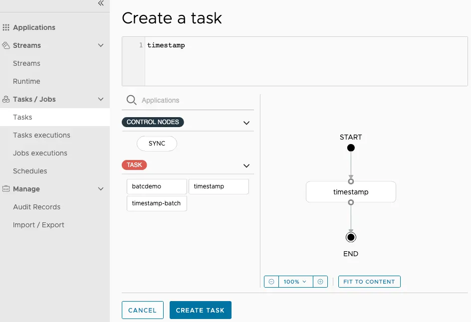
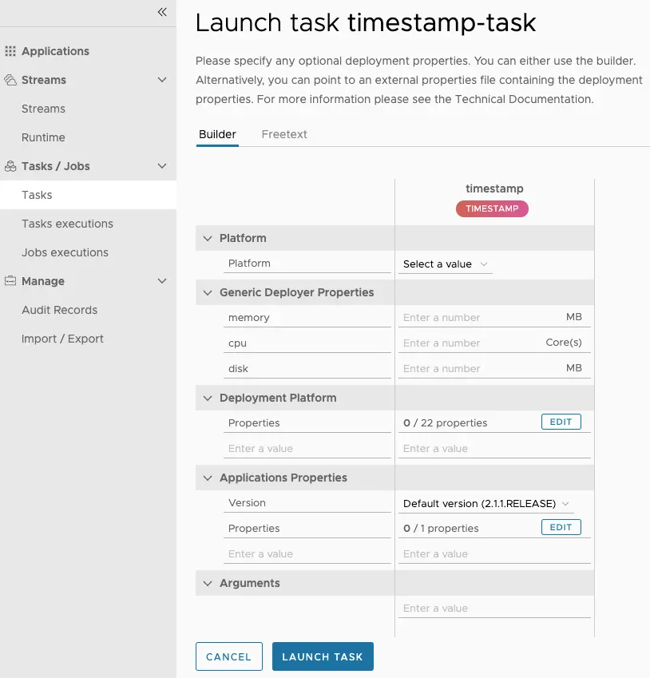
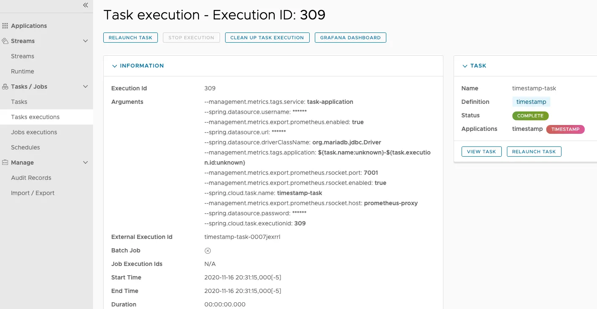

---

이번 가이드에선 간단한 태스크 정의를 하나 만들어 기동시켜본다.

먼저 태스크 애플리케이션 셋을 제공하는 [Spring Cloud Task App Starters](https://cloud.spring.io/spring-cloud-task-app-starters/)를 사용하는 것으로 시작해보겠다. 그 중에서도, 현재 타임스탬프를 기록하는 기본적인 hello-world-style의 `timestamp` 애플리케이션을 사용한다. 이 가이드에서는 각자 [설치 가이드](../installation)에 설명했던 방법대로 `timestamp` 애플리케이션을 미리 임포트해서 Spring Cloud Data Flow에 등록했다고 가정한다.

### 목차

- [Creating the Task](#creating-the-task)
- [Running the Task](#running-the-task)
- [Verifying the Output](#verifying-the-output)

---

## Creating the Task

태스크를 생성하려면:

1. 메뉴에서 **Tasks**를 클릭해라.

2. **CREATE TASK** 버튼을 클릭한다.

   

3. 텍스트 영역에 `timestamp`를 입력해라. Timestamp 태스크 애플리케이션을 사용하는 간단한 태스크 정의가 생성될 거다. 다음은 이 Timestamp 애플리케이션을 보여주는 이미지다:

   

   아니면 왼편에 있는 앱 팔레트에서 Timestamp 애플리케이션을 Flo 캔버스로 드래그하고,  `START`와 `END`를 태스크 애플리케이션에 연결해도 된다.

4. `Create Task`를 클릭한다.

5. 이름에는 다음과 같이 `timestamp-task`를 입력해라:

   

6. `CREATE THE TASK` 버튼을 클릭해라.

   다음과 같은 Task 정의 페이지가 나타나고 생성한 정의(`timestamp-task`)가 보일 거다:

   

---

## Running the Task

태스크를 정의했으므로 이제 태스크를 실행할 수 있다. 실행시키려면:

1. `timestamp-task` 정의 옆에 있는 드롭다운 컨트롤을 클릭하고 **Launch** 옵션을 클릭한다:

   

   이 UI에선 별도 설정을 제공할 수 있다:

   - **Properties**: `TaskLauncher`를 위한 추가적인 프로퍼티들.
   - **Arguments**: 커맨드라인 인자로 전달해야 하는 모든 프로퍼티들

   

2. 우리는 별도 인자나 파라미터가 필요하지 않기 때문에, 바로 **LAUNCH THE TASK** 버튼을 클릭한다. UI는 다음과 같이 태스크 정의 페이지로 되돌아간다:

   

잠시 기다리면 이 태스크 정의의 상태는 "COMPLETE"로 표기될 거다. 업데이트된 상태를 보려면 **REFRESH** 버튼을 눌러야 할 수도 있다.

---

## Verifying the Output

잘 실행되었는지를 검증해보려면:

1. 다음과 같이 **Task executions** 탭을 클릭해라:

   

   이 태스크 애플리케이션에는 성공적으로 실행되었음을 나타내는 종료 코드 `0`이 나타나있는 걸 볼 수 있다.

2. 태스크의 `Execution ID`를 클릭하면 다음과 같이 더 자세한 내용도 확인할 수 있다:

   

timestamp 로그도 함께 확인하고 싶다면, 페이지 하단에 있는 **VIEW LOG** 버튼을 클릭해라:

