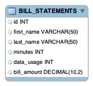
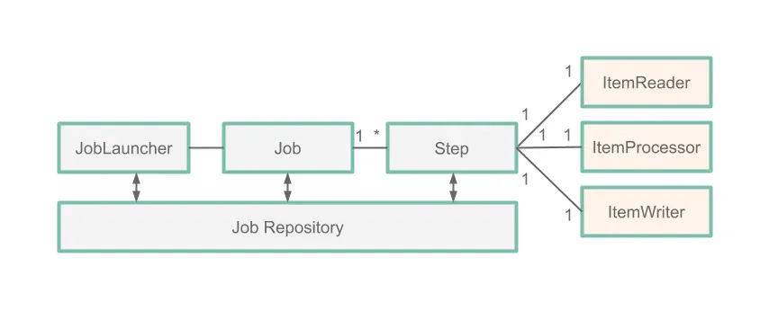
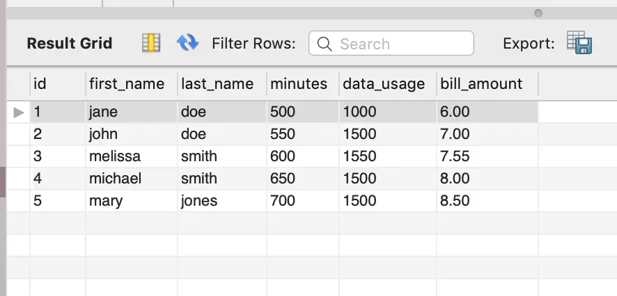
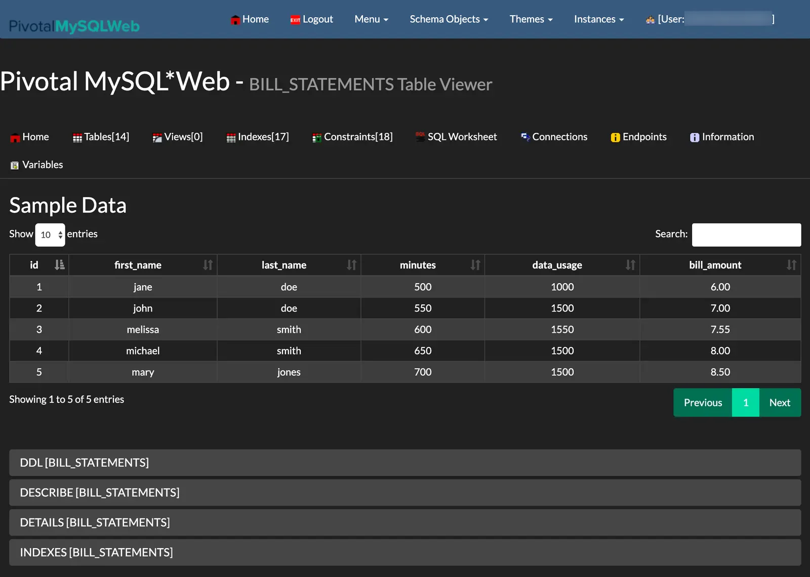

---

이 가이드에선 스프링 배치 애플리케이션을 개발하고 클라우드 파운드리와, 쿠버네티스, 로컬 머신에 배포해본다. [스프링 배치 애플리케이션을 Data Flow로 배포](../batch-developer-guides.batch-development.data-flow-spring-spring)하는 방법은 별도 가이드에서 다룬다.

<span id="batch_processing_with_spring_batch"></span>여기서는 이 애플리케이션을 빌드하는 방법을 처음부터 설명한다. 원한다면 `billrun` 애플리케이션 소스 코드가 담겨있는 zip 파일을 다운받아, 압축을 풀고 [배포](#deployment) 섹션으로 이동해도 좋다.

이 프로젝트는 [브라우저에서 다운](https://github.com/spring-cloud/spring-cloud-dataflow-samples/blob/master/dataflow-website/batch-developer-guides/batch/batchsamples/dist/batchsamples.zip?raw=true)받거나, 커맨드라인에서 아래 명령어를 실행해서 받으면 된다:

```bash
wget https://github.com/spring-cloud/spring-cloud-dataflow-samples/blob/master/dataflow-website/batch-developer-guides/batch/batchsamples/dist/batchsamples.zip?raw=true -O batchsamples.zip
```

### 목차

- [Development](#development)
  + [Introducing Spring Batch](#introducing-spring-batch)
  + [Our Batch Job](#our-batch-job)
  + [Initializr](#initializr)
  + [Setting up MySQL](#setting-up-mysql)
  + [Building The Application](#building-the-application)
  + [Testing](#testing)
- [Deployment](#deployment)
  + [Local](#local)
    * [Cleanup](#cleanup)
  + [Cloud Foundry](#cloud-foundry)
    * [Requirements](#requirements)
    * [Building the Application](#building-the-application-1)
    * [Setting up Cloud Foundry](#setting-up-cloud-foundry)
    * [Task Concepts in Cloud Foundry](#task-concepts-in-cloud-foundry)
    * [Running `billrun` on Cloud Foundry](#running-billrun-on-cloud-foundry)
    * [Validating the Database Results](#validating-the-database-results)
    * [Tearing down All Task Applications and Services](#tearing-down-all-task-applications-and-services)
  + [Kubernetes](#kubernetes)
    * [Setting up the Kubernetes Cluster](#setting-up-the-kubernetes-cluster)
- [Database Specific Notes](#database-specific-notes)
  + [Microsoft SQL Server](#microsoft-sql-server)
    * [Incrementer](#incrementer)
    * [BatchConfigurer](#batchconfigurer)
    * [Dependencies](#dependencies)

---

## Development

[Spring Initializr](https://start.spring.io/)에서 스프링 배치 애플리케이션을 만드는 것부터 시작한다.

휴대폰 데이터 제공업체가 고객을 위한 청구서를 작성해야 하는 상황이라고 가정한다. 사용 데이터는 JSON 형식으로 파일 시스템에 저장한다. 이 파일에서 사용 데이터를 가져와 청구 데이터를 생성하고 `BILL_STATEMENTS` 테이블에 저장하는 청구 솔루션이 필요하다.

이 솔루션은 스프링 배치를 사용하는 단일 스프링 부트 애플리케이션으로 전부 구현할 수 있다. 하지만 이 예제에선 솔루션을 두 단계로 나눈다:

1. [`billsetuptask`](../batch-developer-guides.batch-development.data-flow-simple-task): [`billsetuptask`](../batch-developer-guides.batch-development.data-flow-simple-task) 애플리케이션은 Spring Cloud Task를 사용해 `BILL_STATEMENTS` 테이블을 생성하는 스프링 부트 애플리케이션이다.
2. `billrun`: `billrun` 애플리케이션은 Spring Cloud Task와 스프링 배치를 이용해 JSON 파일 row마다 사용 데이터를 읽고, 가격을 계산한 결과를 `BILL_STATEMENTS` 테이블에 넣는 스프링 부트 애플리케이션이다.

이 섹션에선 고객 사용 데이터가 들어있는 JSON 파일을 읽고, 각 항목마다 가격을 계산해 `BILL_STATEMENTS` 테이블에 배치하는 Spring Cloud Task 및 스프링 배치 애플리케이션 `billrun`을 만들어본다.

다음은 `BILL_STATEMENTS` 테이블을 나타내는 이미지다:

{: .center-image }

### Introducing Spring Batch

스프링 배치는 견고한 배치 애플리케이션을 개발할 수 있게 설계된 포괄적인 경량 배치 프레임워크다. 스프링 배치는 대용량 데이터 처리에 필수적인 기능을 재사용할 수 있는 형태로 제공한다:

- 로깅/트레이싱
- 청크 기반 처리
- 선언적인 I/O
- 시작/중단/재시작
- 재시도/스킵
- 리소스 관리

다른 고급 기술도 제공하는데, 최적화나 파티셔닝 같은 기법을 사용하면 극단적으로 큰 데이터 처리나 고성능 배치도 쉽게 구현할 수 있다. 

이 가이드에선 아래 이미지에 나와있는 다섯 가지 스프링 배치 컴포넌트들에 집중한다:



- `Job`: `Job`은 전체 배치 프로세스를 캡슐화한 엔티티다. 하나의 job은 한 개 이상의 `step`으로 구성된다.
- `Step`: `Step`은 배치 job의 독립적이고 순차적인 단계를 캡슐화한 도메인 객체다. 각 `step`은 `ItemReader`, `ItemProcessor`, `ItemWriter`로 구성된다.
- `ItemReader`: `ItemReader`는 `Step`에서 한 번에 아이템을 하나씩 읽어오는 작업을 추상화한 개념이다.
- `ItemProcessor`: `ItemProcessor`는 아이템을 처리하는 비지니스 로직을 추상화한다.
- `ItemWriter`는 `Step`의 출력을 추상화한다.

위 다이어그램에선 `JobExecution`의 각 단계를 `JobRepository`(여기선 MySQL 데이터베이스)에 저장한다는 것을 알 수 있다. 즉, 스프링 배치에서 수행하는 모든 작업은 로그와 job 재실행을 위해 데이터베이스에 기록된다.

> **참고:** 자세한 프로세스는 [여기](../../Spring%20Batch/domainlanguage)를 읽어보면 된다.

### Our Batch Job

따라서 우리가 만들어볼 애플리케이션에선, 다음과 같이 구성되는 `Step`을 하나 가지는 `BillRun` `Job`을 생성한다:

- `JsonItemReader`: 사용 데이터를 가지고 있는 JSON 파일을 읽는 `ItemReader`.
- `BillProcessor`: `JsonItemReader`가 전달한 데이터의 각 row를 기준으로 가격을 계산하는 `ItemProcessor`.
- `JdbcBatchItemWriter`: 가격을 매긴 `Bill` 레코드를 `BILLING_STATEMENT` 테이블에 저장하는 `ItemWriter`.

### Initializr

[Spring Initializr](https://start.spring.io/)를 사용해 애플리케이션을 생성해보자. 그러려면:

1. [Spring Initializr 사이트](https://start.spring.io/)에 접속해라.
2. 스프링 부트는 최신 릴리즈를 선택한다.
3. 그룹명은 `io.spring`, 아티팩트명은 `billrun`을 사용해서 새 메이븐 프로젝트를 생성한다.
4. **Dependencies** 텍스트 박스에 `task`를 입력해서 Cloud Task 의존성을 선택한다.
5. **Dependencies** 텍스트 박스에 `jdbc`를 입력해서 JDBC 의존성을 선택한다.
6. **Dependencies** 텍스트 박스에 `h2`를 입력해서 H2 의존성을 선택한다. H2는 단위 테스트에 사용한다.
7. **Dependencies** 텍스트 박스에 `mysql`을 입력해서 MySQL 의존성을 선택한다 (다른 데이터베이스도 괜찮다). MySQL을 런타임 데이터베이스로 사용한다.
8. **Dependencies** 텍스트 박스에 `batch`를 입력해서 배치를 선택해라.
9. **Generate Project** 버튼을 클릭한다.
10. `billrun.zip` 파일의 압축을 풀고 즐겨 사용하는 IDE에서 프로젝트를 import해라.

아니면 미리 빌드되어 있는 파일을 다운받아 프로젝트를 초기화해도 된다. 그러려면:

1. [이 Spring Initializr 링크](https://start.spring.io/starter.zip?type=maven-project&language=java&baseDir=billrun&groupId=io.spring&artifactId=billrun&name=Bill+Run&description=Bill+Run+Sample+App&packageName=io.spring.billrun&packaging=jar&dependencies=batch&dependencies=cloud-task&dependencies=jdbc&dependencies=h2&dependencies=mysql)를 클릭해 미리 설정해둔 `billrun.zip` 파일을 다운받아라.
2.  billrun.zip 파일의 압축을 풀어 즐겨 사용하는 IDE에서 프로젝트를 import해라.

### Setting up MySQL

사용할 수 있는 MySQL 인스턴스가 없다면, 아래 가이드에 따라 이 예제에서 사용할 MySQL 도커 이미지를 실행하면 된다:

1. 아래 명령어를 실행해 MySQL 도커 이미지를 가져온다:

   ```bash
   docker pull mysql:5.7.25
   ```

2. 아래 명령어를 실행해 MySQL을 시작한다:

   ```bash
   docker run -p 3306:3306 --name mysql -e MYSQL_ROOT_PASSWORD=password \
   -e MYSQL_DATABASE=task -d mysql:5.7.25
   ```

### Building The Application

1. [`usageinfo.json`](https://raw.githubusercontent.com/spring-cloud/spring-cloud-dataflow-samples/master/dataflow-website/batch-developer-guides/batch/batchsamples/billrun/src/main/resources/usageinfo.json)을 다운받아 `/src/main/resources` 디렉토리에 복사해라.

2. [`schema.sql`](https://raw.githubusercontent.com/spring-cloud/spring-cloud-dataflow-samples/master/dataflow-website/batch-developer-guides/batch/batchsamples/billrun/src/main/resources/schema.sql)을 다운받아 `/src/main/resources` 디렉토리에 복사해라.

3. 원하는 IDE에서 `io.spring.billrun.model` 패키지를 생성해라.

4. `io.spring.billrun.model` 안에 [Usage.java](https://github.com/spring-cloud/spring-cloud-dataflow-samples/tree/master/dataflow-website/batch-developer-guides/batch/batchsamples/billrun/src/main/java/io/spring/billrun/model/Usage.java)와 유사한 `Usage` 클래스를 생성해라.

4. `io.spring.billrun.model` 안에 [Bill.java](https://github.com/spring-cloud/spring-cloud-dataflow-samples/tree/master/dataflow-website/batch-developer-guides/batch/batchsamples/billrun/src/main/java/io/spring/billrun/model/Bill.java)와 유사한 `Bill` 클래스를 생성해라.

6. 원하는 IDE에서 `io.spring.billrun.configuration` 패키지를 생성해라.

7. 각 `Usage` 레코드의 가격을 책정할 `ItemProcessor`를 생성해라. `io.spring.billrun.configuration` 안에 아래와 유사한 [`BillProcessor`](https://github.com/spring-cloud/spring-cloud-dataflow-samples/tree/master/dataflow-website/batch-developer-guides/batch/batchsamples/billrun/src/main/java/io/spring/billrun/configuration/BillProcessor.java) 클래스를 만들면 된다:

   ```java
   public class BillProcessor implements ItemProcessor<Usage, Bill> {
   
     @Override
     public Bill process(Usage usage) {
        Double billAmount = usage.getDataUsage() * .001 + usage.getMinutes() * .01;
        return new Bill(usage.getId(), usage.getFirstName(), usage.getLastName(),
              usage.getDataUsage(), usage.getMinutes(), billAmount);
     }
   }
   ```

   `process` 메소드를 가진 `ItemProcessor` 인터페이스를 구현하고 재정의한 것에 주목해라. 우리가 사용할 파라미터는 `Usage` 객체이며, 반환 값은 `Bill` 타입이다.

8. 이제 자바 설정을 만들어 `BillRun` `Job`에 필요한 빈을 지정할 수 있다. `io.spring.billrun.configuration` 패키지에 다음과 유사한 [`BillingConfiguration`](https://github.com/spring-cloud/spring-cloud-dataflow-samples/tree/master/dataflow-website/batch-developer-guides/batch/batchsamples/billrun/src/main/java/io/spring/billrun/configuration/BillingConfiguration.java) 클래스를 생성해야 한다:

   ```java
   @Configuration
   @EnableTask
   @EnableBatchProcessing
   public class BillingConfiguration {
     @Autowired
     public JobBuilderFactory jobBuilderFactory;
   
     @Autowired
     public StepBuilderFactory stepBuilderFactory;
   
     @Value("${usage.file.name:classpath:usageinfo.json}")
     private Resource usageResource;
   
     @Bean
     public Job job1(ItemReader<Usage> reader,
       ItemProcessor<Usage,Bill> itemProcessor, ItemWriter<Bill> writer) {
         Step step = stepBuilderFactory.get("BillProcessing")
                 .<Usage, Bill>chunk(1)
                 .reader(reader)
                 .processor(itemProcessor)
                 .writer(writer)
                 .build();
   
         return jobBuilderFactory.get("BillJob")
                 .incrementer(new RunIdIncrementer())
                 .start(step)
                 .build();
     }
   
     @Bean
     public JsonItemReader<Usage> jsonItemReader() {
   
         ObjectMapper objectMapper = new ObjectMapper();
         JacksonJsonObjectReader<Usage> jsonObjectReader =
                 new JacksonJsonObjectReader<>(Usage.class);
         jsonObjectReader.setMapper(objectMapper);
   
         return new JsonItemReaderBuilder<Usage>()
                 .jsonObjectReader(jsonObjectReader)
                 .resource(usageResource)
                 .name("UsageJsonItemReader")
                 .build();
     }
   
     @Bean
     public ItemWriter<Bill> jdbcBillWriter(DataSource dataSource) {
         JdbcBatchItemWriter<Bill> writer = new JdbcBatchItemWriterBuilder<Bill>()
                         .beanMapped()
                 .dataSource(dataSource)
                 .sql("INSERT INTO BILL_STATEMENTS (id, first_name, " +
                    "last_name, minutes, data_usage,bill_amount) VALUES " +
                    "(:id, :firstName, :lastName, :minutes, :dataUsage, " +
                    ":billAmount)")
                 .build();
         return writer;
     }
   
     @Bean
     ItemProcessor<Usage, Bill> billProcessor() {
         return new BillProcessor();
     }
   }
   ```

   `@EnableBatchProcessing` 어노테이션은 스프링 배치의 기능들을 활성화하고, 배치 job 세팅을 위한 기본 설정을 제공한다. `@EnableTask` 어노테이션은 태스크 실행에 대한 정보(태스크의 시작/종료 시간이나 종료 코드같은)를 저장하는 `TaskRepository`를 설정해준다. 위 설정을 보면 `ItemReader` 빈은 `JsonItemReader`의 인스턴스라는 걸 알 수 있다. 이 `JsonItemReader` 인스턴스는 리소스의 내용을 읽어 JSON 데이터를 `Usage` 객체들로 언마샬링한다. `JsonItemReader`는 스프링 배치에서 제공하는 `ItemReader` 구현체 중 하나다. 마찬가지로, `ItemWriter` 빈은 `JdbcBatchItemWriter`의 인스턴스임을 알 수 있다. `JdbcBatchItemWriter` 인스턴스는 결과를 데이터베이스에 저장한다. `JdbcBatchItemWriter`는 스프링 배치에서 제공하는 `ItemWriter` 구현체 중 하나다. `ItemProcessor`는 우리가 직접 만든 `BillProcessor`다. 주목할 점은, 스프링 배치에서 제공하는 클래스들(`Job`, `Step`, `ItemReader`, `ItemWriter`)을 사용하는 빈은 전부 스프링 배치에서 제공하는 빌더를 통해 빌드하기 때문에 직접 코딩해야할 양은 적다는 거다.

### Testing

이제 코드를 완성했으므로 테스트를 작성할 차례다. 여기서는 청구서 정보가 `BILLING_STATEMENTS` 테이블에 제대로 삽입되었는지를 검증하려고 한다. 테스트를 생성하려면 [BillrunApplicationTests.java](https://github.com/spring-cloud/spring-cloud-dataflow-samples/blob/master/dataflow-website/batch-developer-guides/batch/batchsamples/billrun/src/test/java/io/spring/billrun/BillRunApplicationTests.java)를 다음과 같이 업데이트해라:

```java
package io.spring.billrun;

import io.spring.billrun.model.Bill;
import org.junit.jupiter.api.BeforeEach;
import org.junit.jupiter.api.Test;
import org.springframework.beans.factory.annotation.Autowired;
import org.springframework.boot.test.context.SpringBootTest;
import org.springframework.jdbc.core.JdbcTemplate;

import javax.sql.DataSource;
import java.util.List;

import static org.assertj.core.api.Assertions.assertThat;

@SpringBootTest
public class BillRunApplicationTests {

	@Autowired
	private DataSource dataSource;

	private JdbcTemplate jdbcTemplate;

	@BeforeEach
	public void setup() {
		this.jdbcTemplate = new JdbcTemplate(this.dataSource);
	}

	@Test
	public void testJobResults() {
		List<Bill> billStatements = this.jdbcTemplate.query("select id, " +
						"first_name, last_name, minutes, data_usage, bill_amount " +
						"FROM bill_statements ORDER BY id",
				(rs, rowNum) -> new Bill(rs.getLong("id"),
						rs.getString("FIRST_NAME"), rs.getString("LAST_NAME"),
						rs.getLong("DATA_USAGE"), rs.getLong("MINUTES"),
						rs.getDouble("bill_amount")));

		assertThat(billStatements.size()).isEqualTo(5);
		Bill billStatement = billStatements.get(0);
		assertThat(billStatement.getBillAmount()).isEqualTo(6.0);
		assertThat(billStatement.getFirstName()).isEqualTo("jane");
		assertThat(billStatement.getLastName()).isEqualTo("doe");
		assertThat(billStatement.getId()).isEqualTo(1);
		assertThat(billStatement.getMinutes()).isEqualTo(500);
		assertThat(billStatement.getDataUsage()).isEqualTo(1000);

	}
}
```

이 테스트에선 `JdbcTemplate`을 이용해 쿼리를 실행하고 `billrun`의 결과를 조회한다. 쿼리를 실행하고 난 뒤엔 테이블의 첫 번째 row에 있는 데이터가 예상한 데이터가 맞는지 검증한다.

---

## Deployment

이 섹션에선 로컬 머신과 클라우드 파운드리, 쿠버네티스에 배포해본다.

### Local

이제 프로젝트를 빌드할 수 있다.

1. 커맨드라인에서 디렉토리를 프로젝트 위치로 변경한 다음 메이븐 명령어 `./mvnw clean package`를 실행해 프로젝트를 빌드해라.

2. 데이터베이스에 있는 사용 정보를 처리할 수 있게끔, 필요한 설정과 함께 애플리케이션을 실행해라. 

   `billrun` 애플리케이션은 다음 인자들로 설정할 수 있다:

   - `spring.datasource.url`: URL을 데이터베이스 인스턴스로 설정해라. 아래 샘플에선 로컬 시스템의 3306 포트에 있는 MySQL `task` 데이터베이스에 연결한다.
   - `spring.datasource.username`: MySQL 데이터베이스에서 사용할 user name. 아래 샘플에선 `root`를 사용한다.
   - `spring.datasource.password`: MySQL 데이터베이스에서 사용할 password. 아래 샘플에선 `password`를 사용한다.
   - `spring.datasource.driverClassName`: MySQL 데이터베이스에 연결하는 데 사용할 드라이버. 아래 샘플에선 `com.mysql.jdbc.Driver`를 사용한다.
   - `spring.datasource.initialization-mode`: 데이터베이스를 이 애플리케이션에 필요한 `BILL_STATEMENTS`, `BILL_USAGE` 테이블로 초기화한다. 아래 샘플에선 항상(`always`) 이 작업을 수행한다고 명시하고 있다. 테이블이 이미 존재할 때는 덮어쓰진 않는다.
   - `spring.batch.initialize-schema`: 데이터베이스를 스프링 배치에 필요한 테이블로 초기화한다. 아래 샘플에선 항상(`always`) 이 작업을 수행한다고 명시하고 있다. 테이블이 이미 존재할 때는 덮어쓰진 않는다.

   ```bash
   java -jar target/billrun-0.0.1-SNAPSHOT.jar \
   --spring.datasource.url=jdbc:mysql://localhost:3306/task?useSSL=false \
   --spring.datasource.username=root \
   --spring.datasource.password=password \
   --spring.datasource.driverClassName=com.mysql.jdbc.Driver \
   --spring.datasource.initialization-mode=always \
   --spring.batch.initialize-schema=always
   ```

3. `mysql` 컨테이너에 로그인해 `BILL_STATEMENTS` 테이블에 질의를 날려봐라. 아래 명령어를 실행하면 된다:

```bash
$ docker exec -it mysql bash -l
# mysql -u root -ppassword
mysql> select * from task.BILL_STATEMENTS;
```

다음과 유사한 결과를 볼 수 있을 거다:

| id   | first_name | last_name | minutes | data_usage | bill_amount |
| ---- | ---------- | --------- | ------- | ---------- | ----------- |
| 1    | jane       | doe       | 500     | 1000       | 6.00        |
| 2    | john       | doe       | 550     | 1500       | 7.00        |
| 3    | melissa    | smith     | 600     | 1550       | 7.55        |
| 4    | michael    | smith     | 650     | 1500       | 8.00        |
| 5    | mary       | jones     | 700     | 1500       | 8.50        |

#### Cleanup

도커 인스턴스에서 실행 중인 MySQL 컨테이너를 중지하고 삭제하려면 다음 명령을 실행해라:

```bash
docker stop mysql
docker rm mysql
```

### Cloud Foundry

이 가이드에선 간단한 [스프링 배치](https://spring.io/projects/spring-batch) 독립형 애플리케이션을 클라우드 파운드리에 배포하고 실행하는 방법을 안내한다.

#### Requirements

로컬 머신에 다음을 설치해야 한다:

- Java
- [Git](https://git-scm.com/)
- [클라우드 파운드리 커맨드라인 인터페이스](https://console.run.pivotal.io/tools) (이 [문서](https://docs.pivotal.io/application-service/2-11/cf-cli/index.html) 참고)

#### Building the Application

이제 프로젝트를 빌드할 수 있다. 커맨드라엔에서 디렉토리를 프로젝트 위치로 변경한 다음 메이븐 명령어 `./mvnw clean package`를 실행해 프로젝트를 빌드해라.

#### Setting up Cloud Foundry

먼저 클라우드 파운드리 계정이 필요하다. [Pivotal Web Services (PWS)](https://run.pivotal.io/)를 사용하면 무료 계정을 만들 수 있다. 이 예시에서도 PWS를 사용한다. 다른 provider를 사용하는 경우는 이 문서와는 약간 다르게 진행해야 할 수도 있다.

시작하기 앞서, [클라우드 파운드리 커맨드라인 인터페이스](https://console.run.pivotal.io/tools)를 사용해 클라우드 파운드리에 로그인해라:

```bash
cf login
```

> `-a` 플래그를 사용해 특정 클라운드 파운드리 인스턴스를 타겟으로 지정할 수도 있다 (ex. `cf login -a https://api.run.pivotal.io`).

애플리케이션을 푸시하기 전에 먼저 클라우드 파운드리에 **MySQL 서비스**를 설정했는지 반드시 확인해봐야 한다. 사용 가능한 서비스들은 아래 명령어로 확인할 수 있다:

```bash
cf marketplace
```

[Pivotal Web Services](https://run.pivotal.io/) (PWS)에선 다음 명령어로 MySQL 서비스를 설치할 수 있을 거다:

```bash
cf create-service cleardb spark task-example-mysql
```

MySQL 서비스명은 `task-example-mysql`로 지정해야 한다. 이 문서에선 계속 이 값을 사용할 거다.

#### Task Concepts in Cloud Foundry

클라우드 파운드리에 대한 설정 파라미터를 제공할 수 있도록, 각 애플리케이션마다 전용 `manifest` YAML 파일을 생성할 거다. 매니페스트 설정에 대한 추가 정보는 [클라우드 파운드리 문서](https://docs.cloudfoundry.org/devguide/deploy-apps/manifest.html)를 참고해라.

클라우드 파운드리에서 태스크를 실행하려면 두 단계를 거쳐야 한다. 실제로 태스크를 실행하려면, 먼저 실행 중인 인스턴스 없이 런타임 환경을 준비한<sup>staged</sup> 앱을 푸시해야 한다. 각 애플리케이션의 매니페스트 YAML 파일에는 다음과 같은 공통 프로퍼티를 제공할 거다:

```yml
memory: 32M
health-check-type: process
no-route: true
instances: 0
```

핵심은 `instances` 프로퍼티를 `0`으로 설정하는 거다. 이렇게 하면 앱을 실행하지는 않고 준비<sup>stage</sup>시킨다. 또한 라우트를 생성할 필요가 없으므로 `no-route`를 `true`로 설정하면 된다.

> 앱을 준비<sup>staged</sup>시키고 실행은 하지 않으면 좋은 점이 또 있다. 이렇게 준비한<sup>staged</sup> 애플리케이션은 이후 태스크를 실행하기 위해서도 필요하지만, 데이터베이스 서비스가 internal이라면 (클라우드 파운드리 인스턴스에 속해있다면), 이 애플리케이션을 사용해 관련 MySQL 데이터베이스 서비스에 대한 SSH 터널을 구축해 저장된 데이터를 조회할 수 있다. 자세한 내용은 잠시 뒤 살펴보겠다.

#### Running `billrun` on Cloud Foundry

이제 두 번째 태스크 애플리케이션을 배포하고 실행할 수 있다. 배포하려면 다음과 같은 내용으로 `manifest-billrun.yml` 파일을 생성해라:

```yaml
applications:
  - name: billrun
    memory: 32M
    health-check-type: process
    no-route: true
    instances: 0
    disk_quota: 1G
    timeout: 180
    buildpacks:
      - java_buildpack
    path: target/billrun-0.0.1-SNAPSHOT.jar
    services:
      - task-example-mysql
```

이제 `cf push -f ./manifest-billrun.yml`을 실행해보자. 그러면 애플리케이션이 준비<sup>stage</sup>될 거다. 이제 아래 명령어를 통해 태스크를 실행할 준비를 마쳤다:

```bash
cf run-task billrun ".java-buildpack/open_jdk_jre/bin/java org.springframework.boot.loader.JarLauncher arg1" --name billrun-task
```

그러면 다음과 유사한 출력을 확인할 수 있을 거다:

```bash
Task has been submitted successfully for execution.
task name:   billrun-task
task id:     1
```

클라우드 파운드리 대시보드에서 이 태스크를 조회해보면 태스크가 문제없이 실행되었음을 알 수 있다. 하지만 이 태스크 애플리케이션이 데이터베이스 테이블에도 정상적으로 데이터를 채웠는지는 어떻게 검증할까? 바로 다음에 해볼 일이 바로 이 일이다.

#### Validating the Database Results

가지고 있는 클라우드 파운드리 환경에 따라, 클라우드 파운드리 있는 데이터베이스에 접근하는 방법에는 여러 가지 옵션이 있다:

- 로컬 툴 이용 (SSH나 외부 데이터베이스 provider)
- 클라우드 파운드리에 배포한 데이터베이스 GUI 활용

##### Using Local Tools (MySQLWorkbench)

먼저 다음과 같이 `cf create-service-key` 명령어를 사용해 [서비스 인스턴스 전용 키](https://cli.cloudfoundry.org/en-US/cf/create-service-key.html)를 생성해야 한다.

```bash
cf create-service-key task-example-mysql EXTERNAL-ACCESS-KEY
cf service-key task-example-mysql EXTERNAL-ACCESS-KEY
```

키를 생성하고 나면 데이터베이스에 접근할 때 필요한 credential은 아래 예시처럼 다시 얻어올 수 있다:

```json
Getting key EXTERNAL-ACCESS-KEY for service instance task-example-mysql as ghillert@gopivotal.com...

{
 "hostname": "...",
 "jdbcUrl": "jdbc:mysql://...",
 "name": "...",
 "password": "...",
 "port": "3306",
 "uri": "mysql://...",
 "username": "..."
}
```

그러면 해당 데이터베이스에 대한 접근 정보를 상세히 나타내고 있는 응답이 보일 거다. 응답 결과는 데이터베이스 서비스를 내부에서 실행하는지, 또는 써드 파티에서 제공하는 서비스인지에 따라 다르다. PWS와 ClearDB의 경우 써드 파티 provider이기 때문에 데이터베이스에 곧바로 연결할 수 있다.

내부 서비스를 처리하는 경우엔 다음과 같이 `cf ssh` 명령어를 통해 SSH 터널을 생성해야 할 수도 있다:

```bash
cf ssh -L 3306:<host_name>:<port> task-example-mysql
```

무료 [MySQLWorkbench](https://www.mysql.com/products/workbench/)를 사용하면 다음과 같이 데이터가 채워진 것을 확인할 수 있다:



##### Using a Database GUI Deployed to Cloud Foundry

MySQL 인스턴스를 계속해서 관찰할 수 있는 재미있는 방법이 하나 더 있는데, [PivotalMySQLWeb](https://github.com/pivotal-cf/PivotalMySQLWeb)을 사용하는 거다. 간단히 설명하면 PivotalMySQLWeb을 클라우드 파운드리 공간에 푸시하고 이를 MySQL 인스턴스에 바인딩해서, 로컬 툴 없이도 MySQL 서비스를 관찰할 수 있다.

아래 프로젝트를 체크아웃 받아라:

```bash
git clone https://github.com/pivotal-cf/PivotalMySQLWeb.git
cd PivotalMySQLWeb
```

> **주의**: 반드시 `src/main/resources/application-cloud.yml`([GitHub](https://github.com/pivotal-cf/PivotalMySQLWeb/blob/master/src/main/resources/application-cloud.yml))에 있는 credential부터 업데이트해야 한다. 기본값에서는 username은 `admin`, password는 `cfmysqlweb`이다.

이제 아래 명령어로 이 프로젝트를 빌드하면 된다:

```bash
./mvnw -DskipTests=true package
```

그 다음엔 `manifest.yml` 파일을 다음과 같이 수정해야 한다:

```yml
applications:
  - name: pivotal-mysqlweb
    memory: 1024M
    instances: 1
    random-route: true
    path: ./target/PivotalMySQLWeb-1.0.0-SNAPSHOT.jar
    services:
      - task-example-mysql
    env:
      JAVA_OPTS: -Djava.security.egd=file:///dev/urandom
```

> **주의**: MySQL 서비스는 반드시 `task-example-mysql`로 지정해야 한다. 이 문서에선 계속해서 이 값을 사용한다.

여기서는 `random-route` 프로퍼티를 `true`로 설정해서 애플리케이션에 대한 URL을 랜덤으로 생성한다. URL 값은 콘솔을 통해 확인하면 된다. 이제 아래 명령어를 실행해서 애플리케이션을 클라우드 파운드리로 푸시해라:

```bash
cf push
```

이제 애플리케이션에 로그인해서 `billrun` 태스크 애플리케이션이 채운 테이블을 확인할 수 있다. 다음 이미지는 이 예제에 있는 작업을 모두 마친 후에 볼 수 있는 화면이다:



#### Tearing down All Task Applications and Services

이 예제를 다 따라해봤다면 클라우드 파운드리에 있는 모든 인스턴스를 제거하고 싶을 수도 있다. 이럴땐 다음 명령어를 실행하면 된다:

```bash
cf delete billsetuptask -f
cf delete billrun -f
cf delete pivotal-mysqlweb -f -r
cf delete-service-key task-example-mysql EXTERNAL-ACCESS-KEY -f
cf delete-service task-example-mysql -f
```

중요한 건 `task-example-mysql` 서비스 자체를 삭제하기 전에 `EXTERNAL-ACCESS-KEY` 서비스 키를 먼저 삭제해야 한다는 거다. 추가로, 여기서 사용한 명령 플래그들은 다음과 같다:

- `-f` 확인 없이 강제로 삭제한다
- `-r` 매핑된 라우트들오 함게 삭제한다

### Kubernetes

이번 섹션에선 `billrun` 애플리케이션을 쿠버네티스 환경에서 실행하는 방법을 안내한다.

#### Setting up the Kubernetes Cluster

이 예제를 따라해보려면 실행 중인 [쿠버네티스 클러스터](../installation.kubernetes.creatingcluster)가 필요하다. 여기서는 `minikube`에 배포한다.

##### Verifying that Minikube is Running

Minikube가 실행 중인지 확인하려면 아래 명령어를 실행하면 된다 (출력 문구도 함께 표기했다):

```bash
minikube status
host: Running
kubelet: Running
apiserver: Running
kubectl: Correctly Configured: pointing to minikube-vm at 192.168.99.100
```

##### Installing the Database

Spring Cloud Data Flow의 디폴트 설정을 사용해 MySQL 서버를 설치한다. 다음 명령어를 실행해라:

```bash
kubectl apply -f https://raw.githubusercontent.com/spring-cloud/spring-cloud-dataflow/v2.9.1/src/kubernetes/mysql/mysql-deployment.yaml \
-f https://raw.githubusercontent.com/spring-cloud/spring-cloud-dataflow/v2.9.1/src/kubernetes/mysql/mysql-pvc.yaml \
-f https://raw.githubusercontent.com/spring-cloud/spring-cloud-dataflow/v2.9.1/src/kubernetes/mysql/mysql-secrets.yaml \
-f https://raw.githubusercontent.com/spring-cloud/spring-cloud-dataflow/v2.9.1/src/kubernetes/mysql/mysql-svc.yaml
```

##### Building a Docker Image for the Sample Task Application

[`billrun`](#batch_processing_with_spring_batch) 앱 위한 도커 이미지를 빌드해야 한다.

 [jib 메이븐 플러그인](https://github.com/GoogleContainerTools/jib/tree/master/jib-maven-plugin#build-your-image)을 사용해보겠다. [소스 배포판](#batch_processing_with_spring_batch)을 다운로드했다면 이미 jib 플러그인이 설정돼 있을 거다. 앱을 처음부터 직접 빌드했다면 `pom.xml`에서 `plugins` 아래에 다음 설정을 추가해라:

```xml
<plugin>
    <groupId>com.google.cloud.tools</groupId>
    <artifactId>jib-maven-plugin</artifactId>
    <version>0.10.1</version>
    <configuration>
        <from>
            <image>springcloud/openjdk</image>
        </from>
        <to>
            <image>${docker.org}/${project.artifactId}:${docker.version}</image>
        </to>
        <container>
            <useCurrentTimestamp>true</useCurrentTimestamp>
        </container>
    </configuration>
</plugin>
```

그런 다음 `properties` 아래에 참조 프로퍼티를 추가해라. 이 예제에선 다음 프로퍼티를 사용한다:

```xml
<docker.org>springcloudtask</docker.org>
<docker.version>${project.version}</docker.version>
```

이제 `minikube` 도커 레지스트리에 이미지를 추가할 수 있다. 다음 명령어를 실행하면 된다:

```bash
eval $(minikube docker-env)
./mvnw clean package jib:dockerBuild
```

이미지가 잘 추가되었는지는 다음 명령어로 확인할 수 있다 (이미지 목록에서 `springcloudtask/billrun`을 찾으면 된다):

```bash
docker images
```

> Spring Cloud Data Flow는 [스프링 부트의 그래들/메이븐 플러그인](https://spring.io/guides/gs/spring-boot-docker/)과 [jib 메이븐 플러그인](https://github.com/GoogleContainerTools/jib/tree/master/jib-maven-plugin#build-your-image), `docker build` 명령으로 생성한 컨테이너에서 테스트를 마쳤다.

##### Deploying the Application

배치 애플리케이션을 가장 간단하게 배포하는 방법은 독립형 [Pod](https://kubernetes.io/docs/concepts/workloads/pods/pod/)를 이용하는 거다. 프로덕션 환경에서의 베스트 프랙티스는 배치 앱을 [Job](https://kubernetes.io/docs/concepts/workloads/controllers/jobs-run-to-completion/)이나 [CronJob](https://kubernetes.io/docs/tasks/job/)으로 배포하는 것이지만, 이 가이드에서 다룰 내용은 아니다.

`batch-app.yaml`에 아래 내용을 저장해라:

```yaml
apiVersion: v1
kind: Pod
metadata:
  name: billrun
spec:
  restartPolicy: Never
  containers:
    - name: task
      image: springcloudtask/billrun:0.0.1-SNAPSHOT
      env:
        - name: SPRING_DATASOURCE_PASSWORD
          valueFrom:
            secretKeyRef:
              name: mysql
              key: mysql-root-password
        - name: SPRING_DATASOURCE_URL
          value: jdbc:mysql://mysql:3306/task
        - name: SPRING_DATASOURCE_USERNAME
          value: root
        - name: SPRING_DATASOURCE_DRIVER_CLASS_NAME
          value: com.mysql.jdbc.Driver
  initContainers:
    - name: init-mysql-database
      image: mysql:5.6
      env:
        - name: MYSQL_PWD
          valueFrom:
            secretKeyRef:
              name: mysql
              key: mysql-root-password
      command:
        [
          'sh',
          '-c',
          'mysql -h mysql -u root -e "CREATE DATABASE IF NOT EXISTS task;"',
        ]
```

애플리케이션을 시작하려면 아래 명령어를 실행하면 된다:

```bash
kubectl apply -f batch-app.yaml
```

태스크가 완료되면 아래와 유사한 결과를 확인할 수 있을 거다:

```bash
kubectl get pods
NAME                     READY   STATUS      RESTARTS   AGE
mysql-5cbb6c49f7-ntg2l   1/1     Running     0          4h
billrun                  0/1     Completed   0          10s
```

이제 포드를 삭제해도 좋다. 삭제하려면 다음 명령을 실행해라:

```bash
kubectl delete -f batch-app.yaml
```

이제 `mysql` 컨테이너에 로그인하고 `BILL_STATEMENTS` 테이블을 질의해라. `mysql` 포드명은 앞에서처럼 `kubectl get pods`를 실행해 가져오면 된다. 그런 다음 다음과 같이 로그인하고 `BILL_STATEMENTS` 테이블을 질의해보면 된다:

```bash
kubectl exec -it mysql-5cbb6c49f7-ntg2l -- /bin/bash
# mysql -u root -p$MYSQL_ROOT_PASSWORD
mysql> select * from task.BILL_STATEMENTS;
```

다음과 유사한 결과를 볼 수 있을 거다:

| id   | first_name | last_name | minutes | data_usage | bill_amount |
| ---- | ---------- | --------- | ------- | ---------- | ----------- |
| 1    | jane       | doe       | 500     | 1000       | 6.00        |
| 2    | john       | doe       | 550     | 1500       | 7.00        |
| 3    | melissa    | smith     | 600     | 1550       | 7.55        |
| 4    | michael    | smith     | 650     | 1500       | 8.00        |
| 5    | mary       | jones     | 700     | 1500       | 8.50        |

`mysql`을 삭제하려면 다음 명령어를 실행해라:

```bash
kubectl delete all -l app=mysql
```

---

## Database Specific Notes

### Microsoft SQL Server

스프링 배치 4.x 이하를 Microsoft SQL Server 데이터베이스와 함께 사용하면, 여러 스프링 배치 애플리케이션을 동시에 기동할 때 데이터베이스에서 데드락이 발생할 수 있다. 이 문제는 이 [이슈](https://github.com/spring-projects/spring-batch/issues/1448)에서 보고되었다. 한 가지 해결책은 테이블 대신 시퀀스를 생성하고 이를 사용할 `BatchConfigurer`를 생성하는 거다.
아래 테이블을 삭제하고 동일한 이름을 사용하는 시퀀스로 교체해라:

- `BATCH_STEP_EXECUTION_SEQ`
- `BATCH_JOB_EXECUTION_SEQ`
- `BATCH_JOB_SEQ`

> **참고:** 각 시퀀스 값은 테이블의 현재 `id` + 1로 설정해야 한다.

테이블을 시퀀스로 교체했다면, 배치 애플리케이션은 `BatchConfigurer`를 재정의해 자체 incrementer를 활용하도록 업데이트해라. 아래 섹션에서 한 가지 구현체 예시를 볼 수 있다:

#### Incrementer

자체 incrementer를 생성한다:

```java
import javax.sql.DataSource;

import org.springframework.jdbc.support.incrementer.AbstractSequenceMaxValueIncrementer;

public class SqlServerSequenceMaxValueIncrementer extends AbstractSequenceMaxValueIncrementer {

	SqlServerSequenceMaxValueIncrementer(DataSource dataSource, String incrementerName) {
		super(dataSource, incrementerName);
	}
	@Override
	protected String getSequenceQuery() {
		return "select next value for " + getIncrementerName();
	}
}
```

#### BatchConfigurer

설정에 자체 `BatchConfigurer`를 생성해 위에 있는 incrementer를 활용하도록 만든다:

```java
@Bean
public BatchConfigurer batchConfigurer(DataSource dataSource) {
    return new DefaultBatchConfigurer(dataSource) {
        protected JobRepository createJobRepository() {
            return getJobRepository();
        }

        @Override
        public JobRepository getJobRepository() {
            JobRepositoryFactoryBean factory = new JobRepositoryFactoryBean();
            DefaultDataFieldMaxValueIncrementerFactory incrementerFactory =
                    new DefaultDataFieldMaxValueIncrementerFactory(dataSource) {
                        @Override
                        public DataFieldMaxValueIncrementer getIncrementer(String incrementerType, String incrementerName) {
                            return getIncrementerForApp(incrementerName);
                        }
                    };
            factory.setIncrementerFactory(incrementerFactory);
            factory.setDataSource(dataSource);
            factory.setTransactionManager(this.getTransactionManager());
            factory.setIsolationLevelForCreate("ISOLATION_REPEATABLE_READ");
            try {
                factory.afterPropertiesSet();
                return factory.getObject();
            }
            catch (Exception exception) {
                exception.printStackTrace();
            }

            return null;
        }

        private DataFieldMaxValueIncrementer getIncrementerForApp(String incrementerName) {

            DefaultDataFieldMaxValueIncrementerFactory incrementerFactory = new DefaultDataFieldMaxValueIncrementerFactory(dataSource);
            DataFieldMaxValueIncrementer incrementer = null;
            if (dataSource != null) {
                String databaseType;
                try {
                    databaseType = DatabaseType.fromMetaData(dataSource).name();
                }
                catch (MetaDataAccessException e) {
                    throw new IllegalStateException(e);
                }
                if (StringUtils.hasText(databaseType) && databaseType.equals("SQLSERVER")) {
                    if (!isSqlServerTableSequenceAvailable(incrementerName)) {
                        incrementer = new SqlServerSequenceMaxValueIncrementer(dataSource, incrementerName);
                    }
                }
            }
            if (incrementer == null) {
                try {
                    incrementer = incrementerFactory.getIncrementer(DatabaseType.fromMetaData(dataSource).name(), incrementerName);
                }
                catch (Exception exception) {
                    exception.printStackTrace();
                }
            }
            return incrementer;
        }

        private boolean isSqlServerTableSequenceAvailable(String incrementerName) {
            boolean result = false;
            DatabaseMetaData metaData = null;
            try {
                metaData = dataSource.getConnection().getMetaData();
                String[] types = {"TABLE"};
                ResultSet tables = metaData.getTables(null, null, "%", types);
                while (tables.next()) {
                    if (tables.getString("TABLE_NAME").equals(incrementerName)) {
                        result = true;
                        break;
                    }
                }
            }
            catch (SQLException sqe) {
                sqe.printStackTrace();
            }
            return result;
        }
    };
}
```

> **참고:** 배치 테이블들에서 엔트리를 생성할 때 데드락에 빠지지 않도록 create를 위한 격리 수준은 `ISOLATION_REPEATABLE_READ`로 설정했다.

#### Dependencies

Spring Cloud Task는 2.3.3 이상을 사용해야 한다. Spring Cloud Task 2.3.3은 가능하다면 `TASK_SEQ` 시퀀스를 사용하기 때문이다.

> **참고:** composed 태스크를 사용 중이라면 Spring Cloud Data Flow 2.8.x 이상을 사용해야 한다.