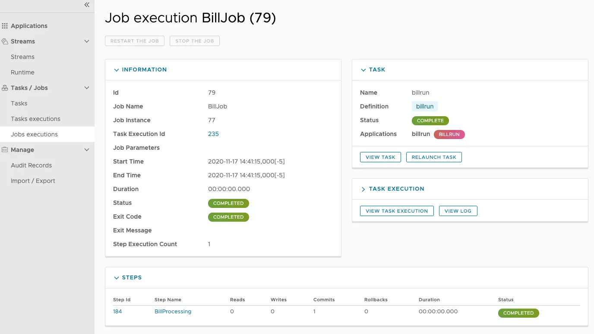
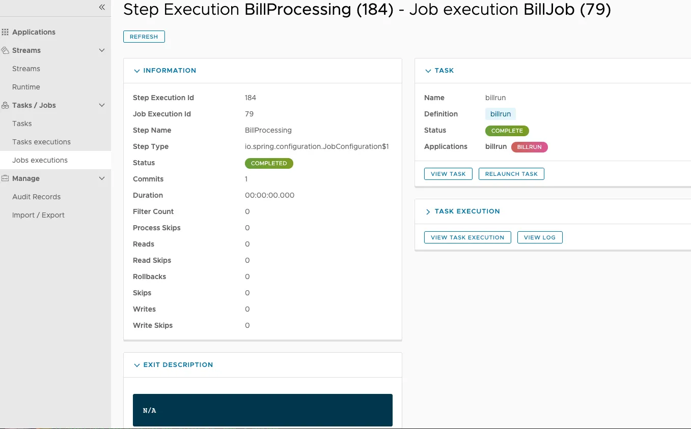

---

이번 섹션에선 스프링 배치 애플리케이션을 Data Flow에 등록해서 태스크 정의를 생성해보고, 클라우드 파운드리, 쿠버네티스, 로컬 머신에서 정의한 태스크를 기동시키는 방법을 보여준다.

### 목차

- [Prerequisites](#prerequisites)
  + [Data Flow Installation](#data-flow-installation)
  + [Spring Batch Project](#spring-batch-project)
- [Create Task Definition](#create-task-definition)
  + [The Data Flow Dashboard](#the-data-flow-dashboard)
  + [Application Registration](#application-registration)
    * [Application Registration Concepts](#application-registration-concepts)
    * [Registering an Application](#registering-an-application)
  + [Creating the Task Definition](#creating-the-task-definition)
  + [Launching the Task](#launching-the-task)
  + [Reviewing the Job Execution](#reviewing-the-job-execution)

---

## Prerequisites

이 샘플을 시작하기 전에 먼저

1. Cloud Data Flow를 설치해야 한다.
2. 이 프로젝트에서 사용할 Spring Cloud Task 프로젝트를 설치해야 한다.

### Data Flow Installation

아래 플랫폼 중 하나에 Spring Cloud Data Flow를 설치해놔야 한다:

- [로컬](../installation.local-machine)
- [클라우드 파운드리](../installation.cloudfoundry)
- [쿠버네티스](../installation.kubernetes)

### Spring Batch Project

여기서는 `billrun`이라는 [Spring Batch Jobs](../batch-developer-guides.batch-development.spring-batch-jobs) 샘플을 사용한다. 아직 코드를 만들고 빌드하지 않았다면 이 가이드대로 따라해봐라.

---

## Create Task Definition

배치 애플리케이션을 등록하고, 이 배치 애플리케이션으로 간단한 태스크 정의를 생성하고, Data Flow 서버를 이용해 태스크를 시작해보겠다. Data Flow 서버는 필요한 각 단계들을 수행할 수 있는 포괄적인 [API](https://docs.spring.io/spring-cloud-dataflow/docs/current/reference/htmlsingle/#api-guide)를 제공한다. Data Flow 서버에는 Data Flow 대시보드 웹 UI 클라이언트가 포함돼 있다. 별도로 다운로드할 수 있는 [Data Flow 쉘](https://docs.spring.io/spring-cloud-dataflow/docs/current/reference/htmlsingle/#shell) 커맨드라인 인터페이스(CLI)도 제공한다. CLI와 UI 모두 API 기능을 전부 사용할 수 있다. 어떤 걸 사용할지는 취향의 문제지만, UI가 꽤 잘 빠졌기 때문에 여기서는 UI를 소개한다.

### The Data Flow Dashboard

Data Flow를 [설치](../installation)했고 지원 플랫폼 중 하나에서 실행되고 있다고 가정하고, 브라우저를 열어 `<data-flow-url>/dashboard`에 접속해라. 여기서 `<data-flow-url>`은 플랫폼에 따라 다르다. 현재 플랫폼의 베이스 URL을 알고싶다면 [설치 가이드](../installation)를 참고해라. Data Flow를 로컬 머신에서 실행 중이라면 http://localhost:9393/dashboard로 이동하면 된다.

### Application Registration

Data Flow 대시보드에는 샘플 스프링 배치 앱을 등록할 수 있는 Application Registration 뷰가 포함돼 있다. 다음은 이 Application Registration 뷰를 보여주는 이미지다:

#### Application Registration Concepts

Data Flow에 애플리케이션을 등록할 땐 지정한 리소스 이름을 통해 등록한다. 따라서 Data Flow DSL을 사용해 태스크를 설정하고 구성할 땐 이 리소스 이름을 참조하면 된다. 애플리케이션을 등록하면, 논리적인 애플리케이션 이름과 타입이 URI로 제공한 물리적인 리소스와 연결된다. 이 URI는 [스키마](https://docs.spring.io/spring-cloud-dataflow/docs/current/reference/htmlsingle/#spring-cloud-dataflow-register-stream-apps)를 따르고 있으며, 메이븐 아티팩트나 도커 이미지, 또는 실제 `http(s)`나 `file` URL을 나타낼 수 있다. Data Flow에선 스트리밍 컴포넌트나 태스크, 독립 실행형 애플리케이션과 같은 롤을 나타내는 몇 가지 논리적인 애플리케이션 타입을 정의하고 있다. 여기서는 스프링 배치 애플리케이션을 `task` 타입으로 등록한다.

> 스프링 배치 애플리케이션을 Data Flow로 실행할 수 있으려면, 배치 애플리케이션이면서 동시에 Spring Cloud Task 애플리케이션이기도 해야 한다. [샘플](../batch-developer-guides.batch-development.spring-batch-jobs)에서 보여줬던 대로 설정 클래스나 애플리케이션에 `@EnableTask`를 추가하면 된다.

#### Registering an Application

Local
CloudFoundry
Kubernetes

Spring Cloud Data Flow는 로컬 배포에는 메이븐, HTTP, 파일, 도커 리소스를 지원한다. 이 예제에선 메이븐 리소스를 사용한다. 메이븐 아티팩트 URI는 보통 <code class="highlighter-rouge">maven://&lt;groupId&gt;:&lt;artifactId&gt;:&lt;version&gt;</code> 형식이다. 이 샘플 애플리케이션의 메이븐 URI는 다음과 같다:

<pre class="highlight"><code>maven://io.spring:billrun:0.0.1-SNAPSHOT
</code></pre>

<code class="highlighter-rouge">maven:</code> 프로토콜은 Data Flow 서버에 설정해둔 리모트 혹은 로컬 메이븐 레포지토리를 통해 리졸브하는 메이븐 아티팩트를 지정한다. 애플리케이션을 등록하려면 <strong>ADD APPLICATION(S)</strong>를 선택해라. <strong>Add Application(s)</strong> 페이지가 나타나면 <strong>Register one or more applications</strong>를 선택해라. 다음과 같이 양식을 작성하고 <strong>IMPORT APPLICATION(S)</strong>를 클릭하면 된다:

Spring Cloud Data Flow는 클라우드 파운드리 배포에는 메이븐, HTTP, 도커 리소스를 지원한다. 이 예제에선 HTTP(사실상 HTTPS) 리소스를 사용한다. HTTPS 리소스의 URI는 <code class="highlighter-rouge">https://&lt;web-path&gt;/&lt;artifactName&gt;-&lt;version&gt;.jar</code> 형식이다. 이렇게 지정하면 Spring Cloud Data Flow는 이 HTTPS URI에서 아티팩트를 가져온다.

이 샘플 앱의 HTTPS URI는 다음과 같다:

<pre class="highlight"><code>maven://io.spring:billrun:0.0.1-SNAPSHOT
</code></pre>

애플리케이션을 등록하려면 <strong>ADD APPLICATION(S)</strong>를 선택해라. <strong>Add Application(s)</strong> 페이지가 나타나면 <strong>Register one or more applications</strong>를 선택해라. 다음과 같이 양식을 작성하고 <strong>IMPORT APPLICATION(S)</strong>를 클릭하면 된다.

Spring Cloud Data Flow는 쿠버네티스 배포에는 도커 리소스를 지원한다. 도커 이미지의 URI는 <code class="highlighter-rouge">docker:&lt;docker-image-path&gt;/&lt;imageName&gt;:&lt;version&gt;</code>형식이며, Data Flow 태스크 플랫폼에 설정돼있는 도커 레지스트리와 이미지 pull 정책을 사용해 리졸브된다.

샘플 앱의 도커 URI는 다음과 같다:

<pre class="highlight"><code>docker:springcloudtask/billrun:0.0.1-SNAPSHOT
</code></pre>

애플리케이션을 등록하려면 <strong>ADD APPLICATION(S)</strong>를 선택해라. <strong>Add Application(s)</strong> 페이지가 나타나면 <code class="highlighter-rouge">Register one or more applications</code>를 선택해라. 다음과 같이 양식을 작성하고 <strong>IMPORT APPLICATION(S)</strong>를 클릭하면 된다:

### Creating the Task Definition

태스크를 정의를 생성하려면:

1. 왼쪽 네비게이션 바에서 **Tasks**를 선택한다.
2. **CREATE TASK**를 선택해라. 태스크를 구성할 수 있는 그래픽 에디터가 보일 거다. 초기 캔버스에는 `START` 노드와 `END` 노드가 존재한다. 캔버스 왼편에는 방금 등록한 `billrun`을 포함해서 사용 가능한 태스크 애플리케이션들이 나와있다.
3. 이 태스크(`billrun`)를 캔버스로 드래그하고, START 노드와 END 노드에 연결해 태스크 정의를 완성해라. 여기서는 단일 태스크 애플리케이션으로 태스크 정의를 구성한다. 앱에 설정 프로퍼티를 정의했다면 여기에서 설정했을 거다. 다음은 태스크 생성 UI를 보여주는 이미지다: 
   
4. **CREATE TASK**를 클릭한다. 태스크 정의의 이름을 지정하라는 메시지가 보일 거다. 태스크 정의 이름은 배포하려는 런타임 설정에 붙이는 논리적인 이름이다. 여기서는 태스크 애플리케이션과 동일한 이름 `billrun`을 사용한다. 이제 다음과 같은 컨펌 뷰가 보일 거다: 
   
5. **CREATE THE TASK**를 클릭한다. 그러면 메인 **Tasks** 뷰가 나타날 거다.

### Launching the Task

다음은 태스크를 실행시킬 수 있는 Task 뷰를 띄워놓은 이미지다:

태스크를 기동시키려면:

1. 실행하고 싶은 태스크 옆에 있는 옵션 컨트롤을 클릭하고 **Launch** 옵션을 선택해라. 커맨드라인 인자와 배포 프로퍼티들을 추가할 수 있는 양식으로 이동하지만, 이 태스크에선 추가 설정이 필요하지 않다.
2. **Launch the task**를 클릭해라. 이제 Data Flow 서버의 태스크 플랫폼에서 태스크가 실행되고 태스크 `execution`이 새로 기록될 거다. 실행이 완료되면 Status가 녹색으로 변경되며 `COMPLETE`가 표시된다. 이 태스크의 간단한 실행 내역을 조회하려면 **Executions** 탭을 선택해라.

### Reviewing the Job Execution

이제 태스크를 기동시키는데 성공했으므로, 이 애플리케이션에서 실행한 job의 상태를 확인할 수 있다. job 실행 내역을 보려면 UI 왼편에 있는 **Job executions** 탭을 클릭해라. 다음은 **Jobs** 뷰를 보여주는 이미지다:

이제 job 실행 내역을 볼 수 있으므로, 각 job 실행 내역에 관한 세부 정보를 살펴볼 수 있다. 원하는 job 실행 내역에서 **Execution ID** 링크를 클릭하면 다음 이미지와 같이 해당 job 실행 내역에 대한 세부 정보가 표시된다:

뿐만 아니라 job 실행 내역마다 각 step들에 대한 세부 정보도 확인할 수 있다. 그러려면 step 이름을 클릭하면 된다. 여기서는 `BillProcessing`에 해당한다. 다음은 step execution 뷰를 보여주는 이미지다:

