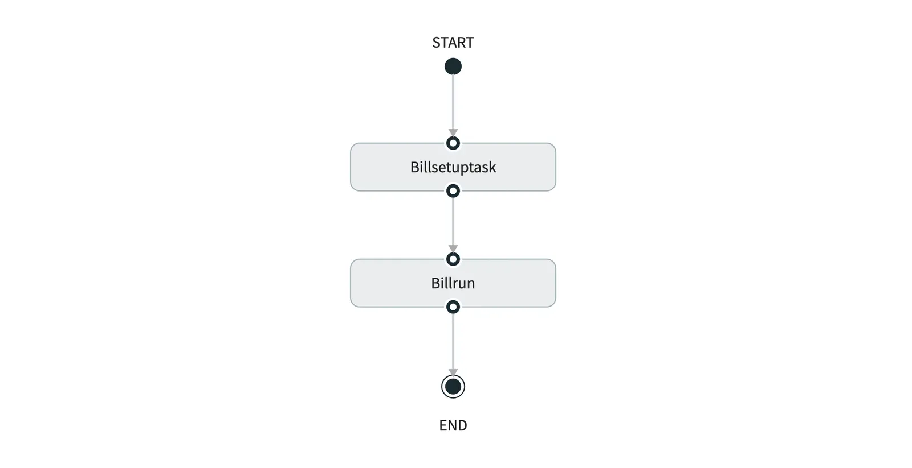
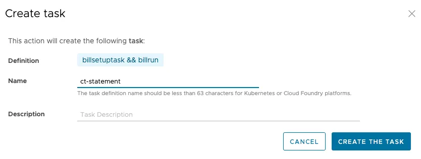

---

앞에서는 두 가지 애플리케이션을 사용했다:

- `billsetuptask`: `billsetuptask`는 `billrun` 애플리케이션을 위한 데이터베이스를 설정한다.
- `billrun`: `billrun`은 파일에서 사용 정보를 읽어 파일에 있는 각 항목마다 청구서 레코드를 생성한다.

앞에서는 수동으로 `billsetuptask` 애플리케이션을 실행한 다음에 `billrun` 애플리케이션을 실행했었다. 두 가지 애플리케이션을 연달아 실행하고 첫 번째 앱은 몇 초 안에 실행이 완료되는 스몰 케이스라면 이 방법으로도 충분히 가능하다. 하지만 순서대로 실행해야 하는 애플리케이션이 5개, 10개, 20개 혹은 그 이상 있고, 다 실행되는데 몇 시간이 걸리는 애플리케이션도 있다면 어떨까? 
게다가 이 앱들 중 하나가 0 이외의 종료 코드를 반환하면 (즉, 어떠한 에러로 끝나면) 어떻게 대응해야 할까? Spring Cloud Data Flow는 composed 태스크를 이용해 이 문제에 대한 솔루션을 제공한다. 
composed 태스크는 태스크 애플리케이션을 그래프의 각 노드로 표현하는 유향 그래프directed graph다. 이전 예제에서 사용했던 두 애플리케이션(`billsetuptask`, `billrun`)에선 그래프를 다음과 같이 표현할 수 있다:

이 섹션에선 Spring Cloud Data Flow의 UI를 이용해 composed 태스크를 생성한 다음 클라우드 파운드리, 쿠버네티스, 로컬 머신에서 기동하는 방법을 보여준다.

### 목차

- [Prerequisites](#prerequisites)
  + [Data Flow Installation](#data-flow-installation)
  + [Registering the Billing Applications](#registering-the-billing-applications)
  + [Registering the Composed Task Runner](#registering-the-composed-task-runner)
- [Creating a Composed Task](#creating-a-composed-task)
  + [Launching the Task](#launching-the-task)
  + [Verifying the Results](#verifying-the-results)
  + [Deleting a Composed Task](#deleting-a-composed-task)

---

## Prerequisites

이 샘플을 시작하기 전에 먼저

1. Cloud Data Flow를 설치해야 한다.
2. 이 프로젝트에서 사용할 Spring Cloud Task 프로젝트를 설치해야 한다.

### Data Flow Installation

아래 플랫폼 중 하나에 Spring Cloud Data Flow를 설치해놔야 한다:

- [로컬](../installation.local-machine)
- [클라우드 파운드리](../installation.cloudfoundry)
- [쿠버네티스](../installation.kubernetes)

### Registering the Billing Applications

이 가이드를 따라해보려면 Spring Cloud Data Flow에 미리 [billsetuptask](../batch-developer-guides.batch-development.data-flow-simple-task)와 [billrun](../batch-developer-guides.batch-development.data-flow-spring-spring) 애플리케이션을 등록해놔야 한다.

### Registering the Composed Task Runner

composed task runner를 등록하려면:

1. 아직 등록하지 않았다면, `composed-task-runner` 애플리케이션을 제공하는 [Spring Cloud Task App Starters](https://cloud.spring.io/spring-cloud-task-app-starters/)를 임포트해라. 그러려면 왼쪽 네비게이션 바에서 **Apps**를 클릭해라.
2. **Add Applications(s)**를 선택해라.
3. Add Application(s) 페이지가 보이면 **Bulk import application coordinates from an HTTP URI location**을 선택해라.
4. **URI** 필드에 다음 중 하나를 입력한다 (앱을 가져올 리소스를 기반으로 선택해라):
  - 메이븐: `https://dataflow.spring.io/task-maven-latest`
  - 도커: `https://dataflow.spring.io/task-docker-latest`
7. **Import the application(s)**를 클릭해라.

---

## Creating a Composed Task

composed 태스크를 생성하려면:

1. 왼쪽 네비게이션 바에서 **Tasks**를 선택한다.

2. **CREATE TASK**를 선택해라. 태스크 생성 뷰가 띄워질 거다: 
   
   
   태스크를 구성할 수 있는 그래픽 에디터가 보일 거다. 초기 캔버스에는 `START` 노드와 `END` 노드가 존재한다. 캔버스 왼편에는 `billsetuptask`와 `billrun`을 포함한 사용 가능한 태스크 애플리케이션들이 나와있다.
   
3. `billsetuptask` 애플리케이션을 캔버스로 드래그해라.

4. START 노드를 `billsetuptask`에 연결해라.

5. `billrun` 애플리케이션을 캔버스로 드래그해라.

6. `billsetuptask` 애플리케이션을 `billrun` 애플리케이션에 연결해라.

7. `billrun` 애플리케이션을 END 노드에 연결해 composed task 정의를 완성해라. 여기서는 두 태스크 앱(`billsetuptask`와 `billrun`)으로 composed 태스크 정의를 구성한다. 애플리케이션에 설정 프로퍼티를 정의했다면 여기에서 설정했을 거다. 
   

8. **CREATE TASK**를 클릭한다. 태스크 정의의 이름을 입력하라는 메세지가 보일 거다. 태스크 정의 이름은 배포하려는 런타임 설정에 붙이는 논리적인 이름이다. 여기서는 태스크 애플리케이션과 동일하게 `ct-statement`를 사용한다. 이제 다음과 같은 컨펌 뷰가 보일 거다: 
   
   
9. **Create the task**를 클릭한다. 그러면 메인 **Tasks** 뷰가 나타날 거다.

> **팁:** Composed 태스크 그래프로 할 수 있는 모든 작업을 알고싶다면 레퍼런스 문서에서 Composed Task [섹션](../feature-guides.batch.composed-task)을 읽어봐라.

### Launching the Task

아래 이미지에 보이는 태스크 리스트로 돌아가면, 이제 태스크 정의가 세 개가 있는 것을 확인할 수 있다:

ct-statement 태스크를 만들었을 때 아래 세 가지 태스크 정의가 만들어진 것을 알 수 있다:

- `ct-statement`: 이 정의는 composed 태스크 그래프 안에서 태스크들을 실행하는  composed task runner를 나타낸다.
- `ct-statement-billsetuptask`: 이 정의는 실행되는 `billsetuptask` 앱을 나타낸다.
- `ct-statement-billrun`: 이 정의는 실행시킬 `billrun` 앱을 나타낸다.

이제  다음과 같이 `ct-statement`의 왼쪽에 있는 드롭다운을 클릭하고 **Launch** 옵션을 선택하면 `ct-statement`를 실행할 수 있다: 

커맨드라인 인자와 배포 파라미터들을 추가할 수 있는 양식으로 이동하지만, 이 composed 태스크에선 추가 설정이 필요하지 않다. **LAUNCH THE TASK** 버튼을 클릭해라.

그러면 Data Flow 서버의 태스크 플랫폼에서 composed 태스크 그래프 실행을 관리하는 composed task runner가 실행된다.

> **팁:** composed 태스크를 여러 번 실행해야 한다면, 실행할 때마다 `increment-instance-enabled` 프로퍼티를 `true`로 설정해야 한다.

### Verifying the Results

실행이 완료되면 각 태스크 정의의 Status가 녹색으로 변경되며 `COMPLETE`가 표시된다. 이 태스크의 간단한 실행 내역들을 조회하려면 아래 이미지에 보이는 **Task executions** 탭을 선택해라.

### Deleting a Composed Task

앞에서도 보여줬듯이, composed 태스크는 그래프에 있는 각 애플리케이션마다 정의를 하나씩 생성한다. composed 태스크로 만들어진 모든 정의를 삭제하려면, composed task runner 정의를 삭제하면 된다. 그러려면:

1. `ct-statement` 왼편에 있는 드롭다운을 클릭하고 **Destroy** 옵션을 선택한다:

   

2. `Confirm Destroy Task`를 묻는 대화 상자가 나타날 거다. ***DESTROY THE TASK*** 버튼을 클릭해라. 이렇게 하면 `ct-statement` composed 태스크를 구성하는 정의들이 삭제된다.