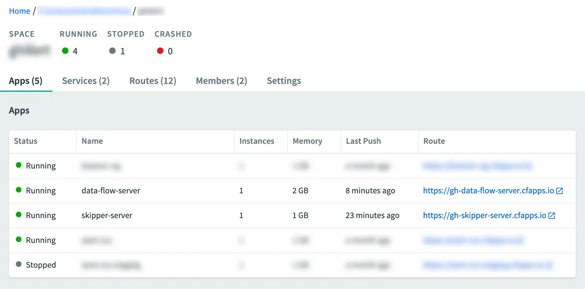

---

Spring Cloud Data Flow를 이용해 두 태스크 애플리케이션을 실행할 수 있으려면, 클라우드 파운드리에 아래 두 가지 서버 인스턴스도 설정해야 한다:

- [Spring Cloud Data Flow](https://cloud.spring.io/spring-cloud-dataflow/)
- [Spring Cloud Skipper](https://cloud.spring.io/spring-cloud-skipper/)

Spring Cloud Data Flow를 다운받으려면 아래 명령어를 실행해라:

```bash
wget https://repo.spring.io/milestone/org/springframework/cloud/spring-cloud-dataflow-server/2.1.0.M1/spring-cloud-dataflow-server-2.1.0.M1.jar
```

Spring Cloud Skipper를 다운받으려면 아래 명령어를 실행해라:

```bash
wget https://repo.spring.io/milestone/org/springframework/cloud/spring-cloud-skipper-server/2.0.2.RC1/spring-cloud-skipper-server-2.0.2.RC1.jar
```

여기서부터는 이 두 jar를 클라우드 파운드리에 배포하는 방법을 설명한다.

### 목차

- [Setting up Services](#setting-up-services)
- [Setting up Skipper on Cloud Foundry](#setting-up-skipper-on-cloud-foundry)
- [Setting up Data Flow on Cloud Foundry](#setting-up-data-flow-on-cloud-foundry)

---

## Setting up Services

서비스들을 세팅하려면 먼저 클라우드 파운드리 계정이 필요하다. [Pivotal Web Services (PWS)](https://run.pivotal.io/)를 사용하면 무료 계정을 만들 수 있다. 이 예시에서도 PWS를 사용한다. 다른 provider를 사용하는 경우는 이 문서와는 약간 다르게 진행해야 할 수도 있다.

계정을 만들었다면, [클라우드 파운드리 커맨드라인 인터페이스](https://console.run.pivotal.io/tools)에서 클라우드 파운드리에 로그인하려면 다음 명령어를 실행해라:

```bash
cf login
```

> `-a` 플래그를 사용해 특정 클라운드 파운드리 인스턴스를 타겟으로 지정할 수도 있다 (ex. `cf login -a https://api.run.pivotal.io`).

아래 클라우드 파운드리 서비스들을 사용할 거다:

- PostgreSQL
- RabbitMQ

> RabbitMQ가 반드시 필요한 건 아니지만, Streams와 계속 같이갈 수 있다면, 좋은 파트너가 되고 싶다.

클라우드에서 사용 가능한 서비스들은 다음과 같이 `marketplace` 명령어로 확인할 수 있다:

```bash
cf marketplace
```

[Pivotal Web Services](https://run.pivotal.io/) (PWS)에선 다음 명령어들로 PostgreSQL 서비스와 RabbitMQ 서비스를 설치할 수 있을 거다:

```bash
cf create-service elephantsql panda postgres-service
cf create-service cloudamqp lemur rabbitmq-service
```

> **중요**: Postgres 서비스를 선택할 땐 커넥션을 몇 개까지 제공하는지 주목해라. 예를 들어 PWS에선 `elephantsql`을 무료 서비스 티어로 사용하면 데이터베이스 커넥션을 병렬로 4개만 사용할 수 있기 때문에, 이 예제를 문제 없이 실행하기에는 너무 제약이 크다.

PostgresSQL 서비스명은 `postgres-service`로 지정해야 한다. 이 문서에 나오는 예시에선 계속 이 값을 사용한다.

---

## Setting up Skipper on Cloud Foundry

이 예제에선 Skipper를 사용하며, Skipper는 클라우드 파운드리에 세팅할 수 있다. 그러려면:

1. 아래 내용으로 `manifest-skipper.yml` 파일을 생성해라:

   ```yaml
   applications:
    - name: skipper-server
      routes:
        - route: <your-skipper-server-route> # e.g. my-skipper-server.cfapps.io
      memory: 1G
      disk_quota: 1G
      instances: 1
      timeout: 180
      buildpacks:
        - java_buildpack
      path: ./spring-cloud-skipper-server-2.8.1.jar
      env:
        SPRING_APPLICATION_NAME: skipper-server
        SPRING_PROFILES_ACTIVE: cloud
        JBP_CONFIG_SPRING_AUTO_RECONFIGURATION: '{enabled: false}'
        SPRING_DATASOURCE_HIKARI_MINIMUMIDLE: 1
        SPRING_DATASOURCE_HIKARI_MAXIMUMPOOLSIZE: 4
        SPRING_APPLICATION_JSON: |-
          {
            "spring.cloud.skipper.server" : {
               "platform.cloudfoundry.accounts" : {
                     "default" : {
                         "connection" : {
                             "url" : <cf-api-url>,
                             "domain" : <cf-apps-domain>,
                             "org" : <org>,
                             "space" : <space>,
                             "username": <email>,
                             "password" : <password>,
                             "skipSsValidation" : false
                         },
                         "deployment" : {
                             "deleteRoutes" : false,
                             "services" : "rabbitmq-service",
                             "enableRandomAppNamePrefix" : false,
                             "memory" : 2048
                         }
                    }
                }
             }
          }
   
      services:
        - postgres-service
   ```

2. `cf push -f ./manifest-skipper.yml`을 실행해라.

---

## Setting up Data Flow on Cloud Foundry

이 예제에선 Data Flow를 사용하며, Data Flow는 클라우드 파운드리에 세팅할 수 있다. 그러려면:

1. `manifest-dataflow.yml` 파일을 생성해라:

   ```yaml
   ---
   applications:
    - name: data-flow-server
      routes:
        - route: <your-data-flow-server-route> # e.g. my-data-flow-server.cfapps.io
      memory: 2G
      disk_quota: 2G
      instances: 1
      path: ./spring-cloud-dataflow-server-2.1.0.M1.jar
      env:
        SPRING_APPLICATION_NAME: data-flow-server
        SPRING_PROFILES_ACTIVE: cloud
        JBP_CONFIG_SPRING_AUTO_RECONFIGURATION: '{enabled: false}'
        SPRING_CLOUD_SKIPPER_CLIENT_SERVER_URI: https://<skipper-host-name>/api
        SPRING_APPLICATION_JSON: |-
          {
            "maven" : {
                "remoteRepositories" : {
                    "repo1" : {
                      "url" : "https://repo.spring.io/libs-snapshot"
                    }
                }
            },
            "spring.cloud.dataflow" : {
                  "task.platform.cloudfoundry.accounts": {
                      "default" : {
                          "connection" : {
                              "url": <cf-api-url>,
                              "domain": <cf-apps-domain>,
                              "org": <org>,
                              "space" : <space>,
                              "username": <email>,
                              "password" : <password>,
                              "skipSsValidation" : true
                          },
                          "deployment" : {
                            "services" : "postgres-service"
                          }
                      }
                  },
                  "applicationProperties" : {
                      "task": {
                          "spring.datasource.hikari" : {
                                "minimumIdle" : 1, ,  
                                "maximumPoolSize" : 2
                          }
                      }
                  }
            }
          }
      services:
        - postgres-service
   ```

   설정한 프로퍼티에 대한 설명은 [https://docs.spring.io/spring-cloud-dataflow/docs/current/reference/htmlsingle/#\_common\_application_properties](https://docs.spring.io/spring-cloud-dataflow/docs/current/reference/htmlsingle/#\_common\_application_properties)를 확인해봐라.

2. `cf push -f ./manifest-dataflow.yml`을 실행해라.

Spring Cloud Data Flow와 Spring Cloud Skipper를 모두 배포했다면 클라우드 파운드리 대시보드로 이동해라. 둘 모두 다음과 같이 `Running` 상태에 있어야 한다:

