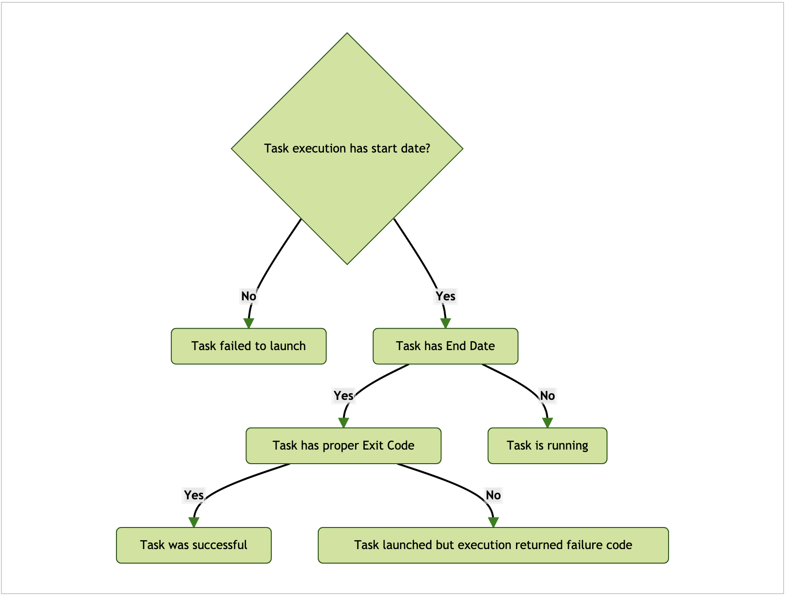
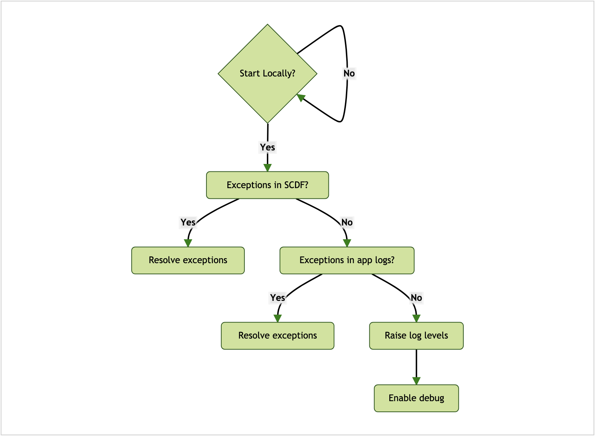
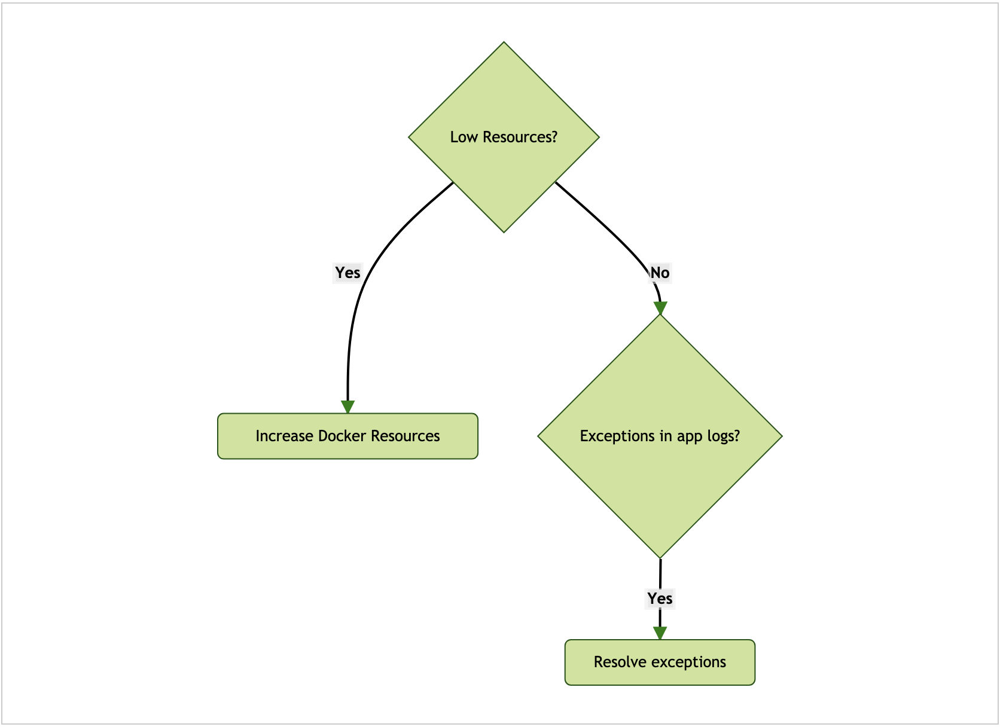
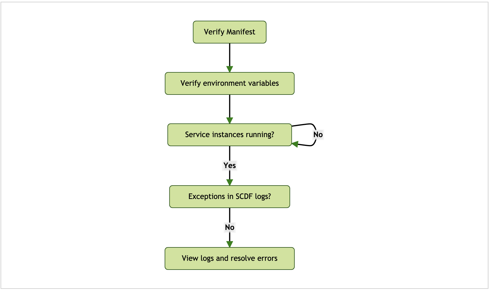
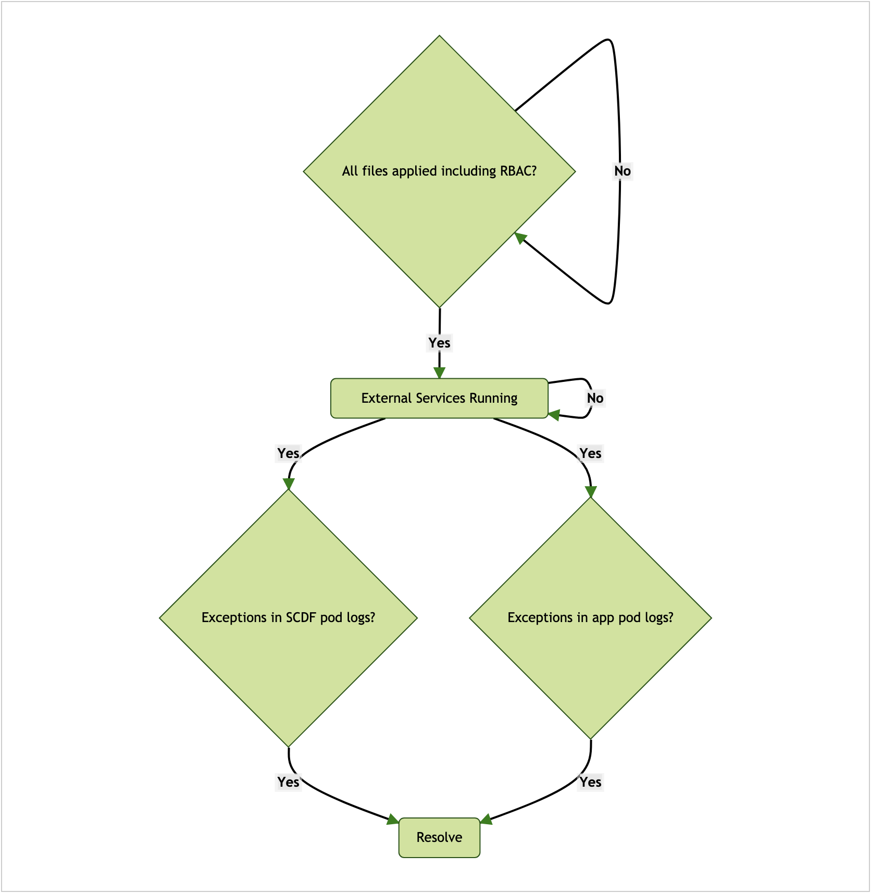
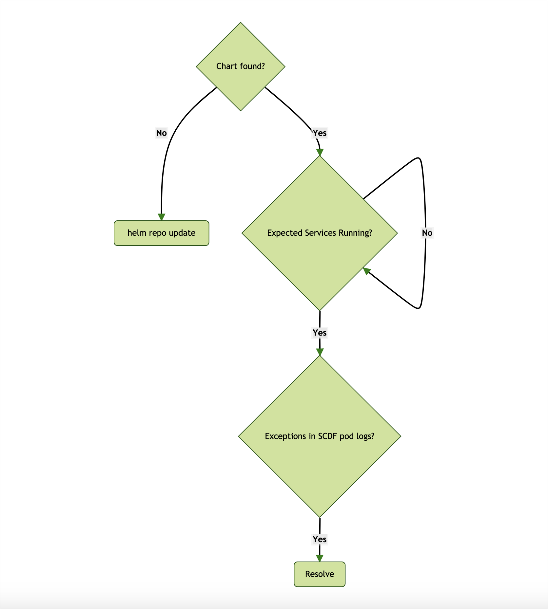
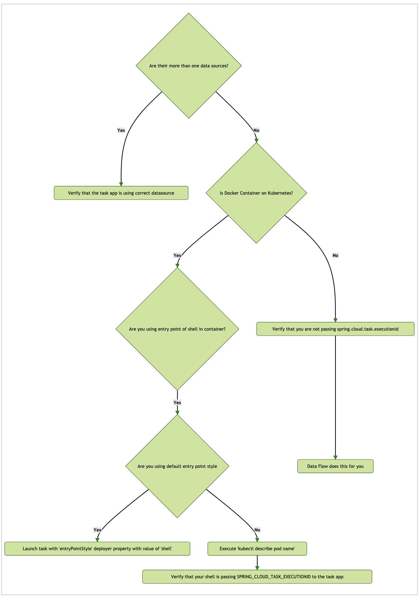

### 목차

- [Did the Task Launch?](#did-the-task-launch)
- [What To Check If a Task Failed To Launch](#what-to-check-if-a-task-failed-to-launch)
- [Platforms](#platforms)
  + [Local](#local)
    * [Docker Compose - Startup](#docker-compose---startup)
    * [Docker Compose - Runtime](#docker-compose---runtime)
  + [Cloud Foundry](#cloud-foundry)
    * [Startup Failures](#startup-failures)
    * [Application Failures](#application-failures)
  + [Kubernetes](#kubernetes)
    * [Distributed Deployment Files](#distributed-deployment-files)
    * [Helm Chart](#helm-chart)
    * [An empty task execution id record is created before the task execution id](#an-empty-task-execution-id-record-is-created-before-the-task-execution-id)
    * [General](#general)
- [Troubleshooting Help](#troubleshooting-help)

---

## Did the Task Launch?

태스크 제대로 실행됐는지 확인하려면 UI에서는 Task Execution 페이지로 들어가고, 쉘에서는 `task execution list`를 입력하면 된다. 원하는 태스크의 실행 내역을 찾으면 된다.

다음은 태스크 실행 에러를 해결하는 방법을 보여주는 다이어그램이다:



---

## What To Check If a Task Failed To Launch

태스크가 실행되지 않을 때는:

- 특정 릴리스 버전의 최신 GA를 사용하고 있는지 확인해봐라.
- 선택한 플랫폼이 지원하는 최소 버전을 충족하는지 확인해봐라.
- 태스크/배치 애플리케이션을 SCDF에서 실행하기 전에 애플리케이션이 독립형으로는 잘 실행되는지 확인해봐라. 계속하기 전에 먼저 [배치 애플리케이션 디버깅하기](../batch-developer-guides.troubleshooting.task-apps)를 읽어봐라.

태스크 실행은 SCDF가 담당한다. 태스크 실행 실패 메세지는 보통 SCDF 애플리케이션 로그에서 찾을 수 있다.

---

## Platforms

이 섹션에선 특정 플랫폼에서 발생하는 문제를 해결하는 방법을 다룬다:

- 로컬
- 클라우드 파운드리
- 쿠버네티스

### Local

이 섹션에선 로컬 환경에서 애플리케이션을 실행할 때 발생할 수 있는 문제를 디버깅하는 방법을 설명한다.

다음은 로컬 태스크 실행 에러를 해결하는 방법을 보여주는 다이어그램이다:



애플리케이션 로그 파일은 애플리케이션별로 검사할 수 있다. 모든 애플리케이션 로그를 하나로 집계하려면 deployer 프로퍼티 `inheritLogging=true`를 설정하면 된다. 자세한 내용은 ["로컬 배포 내역을 단일 로그로 집계할 수 있나요?"](https://dataflow.spring.io/docs/resources/faq/#aggregatelogs)를 참고하고, 더 많은 로그를 활성화하는 방법은 ["플랫폼 배포 로그를 DEBUG 레벨로 바꾸려면 어떻게 해야 하나요?"](https://dataflow.spring.io/docs/resources/faq/#debuglogs)를 참고해라.

deployer 프로퍼티 `debugPort`를 설정하면 애플리케이션을 JDWP로 디버깅할 수 있다. 자세한 내용은 ["배포된 애플리케이션을 원격에서 디버깅하려면 어떻게 해야 하나요?"](https://dataflow.spring.io/docs/resources/faq/#remotedebug)를 참고해라.

#### Docker Compose - Startup

다음은 Docker compose 기동 이슈와 관련해서 로컬 태스크 실행 에러를 해결하는 방법을 보여주는 다이어그램이다:


환경 변수 `DATAFLOW_VERSION`과 `SKIPPER_VERSION`은 `export`하거나 `docker-compose` 명령어 뒤에 명시하는 식으로, 현재 터미널 환경에서 사용할 수 있게 만들어야 한다. 자세한 내용은 [Docker Compose 시작하기](../installation.local-machine.docker-compose)를 참고해라.

#### Docker Compose - Runtime

다음은 Docker compose 런타임 이슈와 관련해서 로컬 태스크 실행 에러를 해결하는 방법을 보여주는 다이어그램이다:



기본적으로 도커에 할당되는 메모리로는 부족할 수도 있다. 권장 할당량은 8GB다. `docker stats` 명령어는 리소스 사용과 관련해서 유용한 정보를 제공해줄 거다. 리소스 제약으로 인해 애플리케이션 기동에 실패했다면 리소스 할당을 늘려라. [도커 문서](https://docs.docker.com/)에서 사용하는 플랫폼에 대한 설명을 읽어봐라.

SCDF를 통해 태스크를 실행하면, 해당 태스크 정의에 속해있는 애플리케이션들은 SCDF 컨테이너에서 자바 프로세스로 기동된다. 태스크 정의를 구성하는 요소마다 애플리케이션이 하나씩 실행된다. 도커에 제공하는 전체적인 리소스 할당량(메모리, CPU 등)은 실행하는 애플리케이션 수를 고려해야 한다.

### Cloud Foundry

이 섹션에선 클라우드 파운드리 애플리케이션에서 발생할 수 있는 문제를 디버깅하는 방법을 설명한다.

#### Startup Failures

다음은 클라우드 파운드리에서 애플리케이션이 실행되지 않을 때 해결 방법을 보여주는 다이어그램이다:



#### Application Failures

다음은 클라우드 파운드리에서 애플리케이션이 실패할 해결 방법을 보여주는 다이어그램이다:


배포 이슈를 디버깅할 때는 deployer와 클라우드 파운드리 관련 로그 레벨을 높이는 것도 도움이 될 수 있다. 자세한 내용은  ["플랫폼 배포 로그를 DEBUG 레벨로 바꾸려면 어떻게 해야 하나요?"](https://dataflow.spring.io/docs/resources/faq/#debuglogs)를 참고해라.

### Kubernetes

이 섹션에선 쿠버네티스 애플리케이션에서 발생할 수 있는 문제를 디버깅하는 방법을 설명한다.

#### Distributed Deployment Files

다음은 쿠버네티스에서 애플리케이션을 실행할 때 분산 deployment 파일로 인한 문제를 해결하는 방법을 보여주는 다이어그램이다:



#### Helm Chart

다음은 쿠버네티스에서 애플리케이션을 실행할 때 헬름 차트로 인한 문제를 해결하는 방법을 보여주는 다이어그램이다:



#### An empty task execution id record is created before the task execution id



태스크가 정상적인 프로퍼티로도 실행되지 않을 땐 이 결정 트리를 참고하면 된다.

#### General

다음은 쿠버네티스에서 애플리케이션을 실행할 때 발생할 수 있는 전반적인 이슈를 보여주는 다이어그램이다:


포드의 세부 정보를 조회할 때는 `events` 테이블 섹션이 디버깅에 유용한 정보를 제공하며, 다음과 같이 실행할 수 있다:

```sh
kubectl describe po/pod_name
```

예를 들어 정상적으로 실행된 `timestamp-batch-task` 애플리케이션의 이벤트는 다음과 같이 조회된다:

```sh
Events:
  Type    Reason     Age   From               Message
  ----    ------     ----  ----               -------
  Normal  Scheduled  15s   default-scheduler  Successfully assigned default/timestamp-7138z511d8 to minikube
  Normal  Pulled     15s   kubelet, minikube  Container image "springcloudtask/timestamp-batch-task:latest" already present on machine
  Normal  Created    14s   kubelet, minikube  Created container
  Normal  Started    14s   kubelet, minikube  Started container
```

애플리케이션 로그는 다음 명령어를 사용하면 로그가 도착하는 즉시 확인할 수 있다:

```sh
kubectl logs -f po/pod_name
```

---

## Troubleshooting Help

여기 있는 트러블슈팅 테크닉으로는 해결되지 않아 여전히 도움이 필요하다면, [StackOverflow](https://stackoverflow.com/tags/spring-cloud-dataflow/)에 관련 세부 정보와 함께 올려달라 ([Wiki](https://github.com/spring-cloud/spring-cloud-dataflow/wiki/Reporting-Issues) 참고). 우리는 포럼 스레드를 활발하게 모니터링하고 있다.