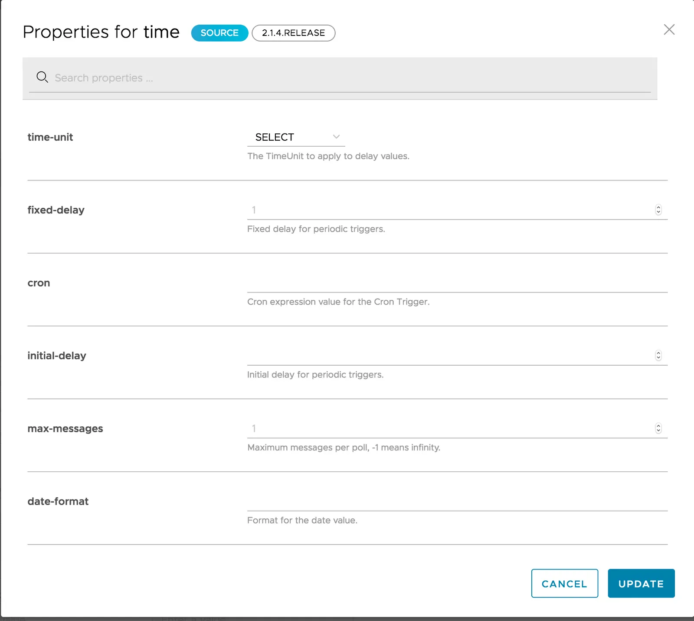
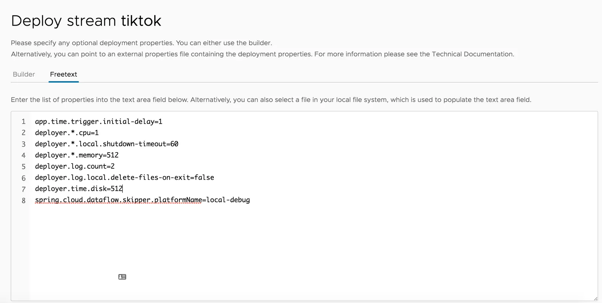

---

스트림을 배포할 때 사용하는 프로퍼티는 두 가지로 나뉜다:

- Deployer Properties: 이 프로퍼티들은 앱을 타겟 플랫폼에 배포하는 방식을 제어하며, `deployer` 프리픽스를 사용한다.
- Application Properties: 이 프로퍼티들은 스트림을 생성할 때 애플리케이션의 동작 방식과 설정 방식을 제어하거나 재정의한다.

각 플랫폼 타입(`local`, `cloudfoundry`, `kubernetes`)마다 가능한 배포 프로퍼티 셋이 다르기 때문에, 플랫폼에 정의돼 있는 설정을 골라야 한다. `memory`, `cpu`, `disk` 예약, `count`(해당 플랫폼에서 생성해야 하는 인스턴스 수)를 위한 일반 프로퍼티 셋은 모든 플랫폼에 정의돼 있다.

> 각 플랫폼을 위한 전용 배포 프로퍼티는 아래 링크에서 확인할 수 있다:
>
> - [로컬](https://docs.spring.io/spring-cloud-dataflow/docs/current/reference/htmlsingle/#configuration-local-deployer)
> - [클라우드 파운드리](https://docs.spring.io/spring-cloud-dataflow/docs/current/reference/htmlsingle/#configuration-cloudfoundry-deployer)
> - [쿠버네티스](https://docs.spring.io/spring-cloud-dataflow/docs/current/reference/htmlsingle/#configuration-kubernetes-deployer).

다음은 Deploy Stream Definition 뷰를 띄워놓은 이미지다:


다음은 `local` deployer 프로퍼티를 재정의하는 한 가지 예시를 보여주는 이미지다 (이 프로퍼티들은 전역으로도, 애플리케이션 단위로도 정의할 수 있다):


다음은 `time` 애플리케이션의 프로퍼티 예시를 보여주는 이미지다:



프로퍼티는 *Freetext*와 *Builder* 탭을 옮겨다니며 정의할 수 있다. 아래 이미지는 Freetext 에디터를 보여준다:



이렇게 프로퍼티를 적용하면, SCDF가 프로퍼티들을 변환해서 다음과 같이 잘 정의해준다:

```properties
app.time.trigger.initial-delay=1
deployer.*.cpu=1
deployer.*.local.shutdown-timeout=60
deployer.*.memory=512
deployer.log.count=2
deployer.log.local.delete-files-on-exit=false
deployer.time.disk=512
spring.cloud.dataflow.skipper.platformName=local-debug
```

> 프로퍼티 중에는 디폴트 값이 정해진 프로퍼티가 있다. 값을 변경하지 않고 그대로 놔두면 새로 만드는 프로퍼티 목록에선 제외한다.

SCDF 쉘에선 위 예시를 다음과 같이 작성할 수 있다:

```sh
stream deploy --name ticktock --properties "app.time.trigger.initial-delay=1,deployer.*.cpu=1,deployer.*.local.shutdown-timeout=60,deployer.*.memory=512,deployer.log.count=2,deployer.log.local.delete-files-on-exit=false,deployer.time.disk=512,spring.cloud.dataflow.skipper.platformName=local-debug"
Deployment request has been sent for stream 'ticktock'
```
