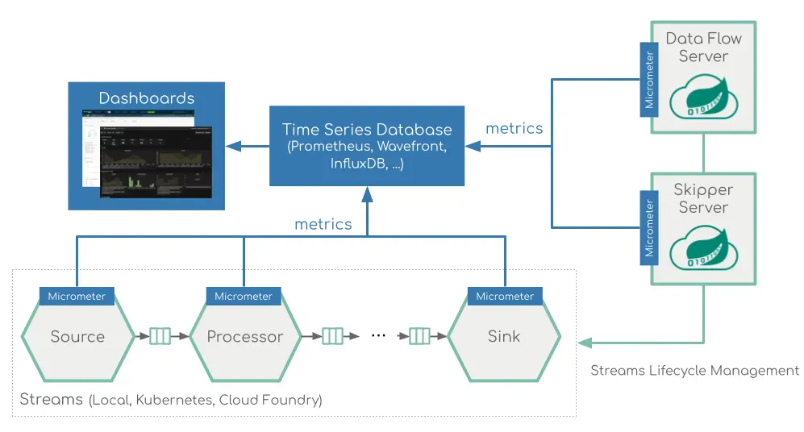
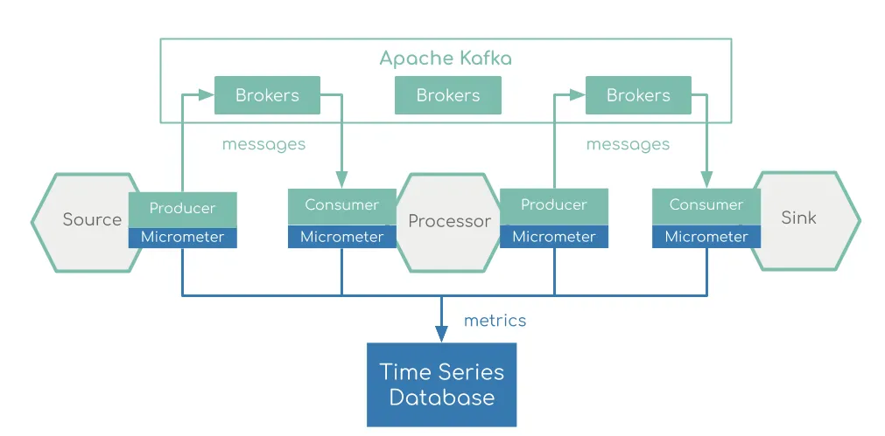
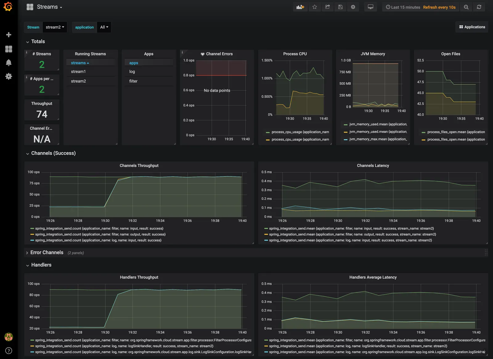

---

이 섹션에선 스트림 데이터 파이프라인을 구성하도록 배포한 애플리케이션들을 모니터링하는 방법을 설명한다. 각 플랫폼마다 설정은 다르지만, 전반적인 아키텍처는 모든 플랫폼에서 동일하다.

Data Flow 메트릭 아키텍처는 [Micrometer](https://micrometer.io/) 라이브러리를 중심으로 설계되어, 가장 많이 사용하는 모니터링 시스템들의 전용 instrumentation 클라이언트를 위한 간단한 파사드를 제공한다. 지원하는 모니터링 시스템 목록은 [Micrometer 문서](https://micrometer.io/docs)를 참고해라. Micrometer는 스프링 부트에서 제공하는 애플리케이션 메트릭을 전달할 수 있는 동력이다. Spring Integration은 스트림 모니터링에 꼭 필요한 메세지 비율과 에러에 관한 메트릭을 노출할 수 있는 [별도 마이크로미터 통합](https://docs.spring.io/spring-integration/docs/current/reference/html/system-management.html#micrometer-integration)을 제공한다.

모든 Spring Cloud [Stream App Starters](https://docs.spring.io/spring-cloud-dataflow/docs/current/reference/htmlsingle/#applications)와 [Stream Applications](https://github.com/spring-cloud/stream-applications)에는 가장 흔히 쓰는 세 가지 모니터링 시스템 [프로메테우스](https://prometheus.io/), [Wavefront](https://www.wavefront.com/), [InfluxDB](https://www.influxdata.com/)를 위한 설정이 미리 세팅돼있다. 배포한 애플리케이션들에서 사용하고 싶은 모니터링 시스템을 선언해주면 된다.

다른 모니터링 시스템에 대한 지원을 활성화하려면, 다른 모니터링 시스템을 사용하도록 [스트림 애플리케이션을 커스텀](https://docs.spring.io/stream-applications/docs/2021.0.1/reference/html/#_patching_pre_built_applications)하면 된다.

Data Flow는 스트림 모니터링을 쉽게 시작할 수 있도록, 필요에 따라 설치하고 커스텀할 수 있는 프로메테우스 전용 [그라파나](https://grafana.com/) 대시보드를 제공한다 (프로메테우스와 InfluxDB용). Wavefront에선 Data Flow 통합 타일<sup>tile</sup>을 사용해 메트릭을 다각도로 시각화할 수 있다.

다음은 스트리밍 애플리케이션 모니터링의 전반적인 아키텍처를 나타낸 이미지다:



카프카 바인더를 사용하는 스트리밍 데이터 파이프라인에선 아파치 카프카 메트릭을 기반으로 전용 카프카와 카프카 스트림 대시보드를 별도로 제공한다:



> 프로메테우스에선 메트릭에 설정된 엔드포인트를 자동으로 알아내기 위해 서비스 디스커버리 컴포넌트가 필요하다. Spring Cloud Data Flow 서버는 서비스 디스커버리 메커니즘에 `rsocket` 프로토콜을 이용하는 [프로메테우스 RSocket Proxy](https://github.com/micrometer-metrics/prometheus-rsocket-proxy)를 사용한다. RSocket 프록시를 사용하기 때문에 동일한 아키텍처를 이용해 short lived에 속하는 태스크 뿐 아니라, long-lived 스트림 애플리케이션까지 모니터링할 수 있다. 자세한 내용은 마이크로미터 문서의 [short lived 태스크와 배치 애플리케이션](https://github.com/micrometer-metrics/prometheus-rsocket-proxy#support-for-short-lived-or-serverless-applications)을 참고해라. 뿐만 아니라, RSocket으로 접근하면 모든 플랫폼에서 동일한 모니터링 아키텍처를 활용할 수 있다. 프로메테우스는 각 프록시 인스턴스를 스크랩하도록 설정된다. 프록시는 돌아가며 이 RSocket 커넥션을 사용해 각 애플리케이션에서 메트릭을 가져온다. 스크랩한 메트릭은 그라파나 대시보드를 통해 조회할 수 있다.

#### Data Flow Metric Tags

메트릭을 애플리케이션 타입별로, 인스턴스별로, 스트림별로 집계할 수 있도록, Spring Cloud Stream 애플리케이션 스타터는 다음 Micrometer 태그를 사용하도록 설정돼 있다:

- `stream.name`: 메트릭을 전송하는 애플리케이션들을 가지고 있는 스트림의 이름
- `application.name`: 메트릭을 리포팅하는 애플리케이션의 이름 혹은 레이블
- `application.type`: 메트릭을 리포팅하는 애플리케이션의 타입 (소스, 프로세서, 싱크)
- `application.guid`: 메트릭을 리포팅하는 애플리케이션 인스턴스의 고유 인스턴스 식별자
- `application.index`: 애플리케이션 인스턴스 ID (사용 가능하면)

#### Data Flow Metric Buttons

그라파나 혹은 Wavefront URL을 가리키는 `spring.cloud.dataflow.metrics.dashboard.url` 프로퍼티를 사용해 Data Flow 서버를 시작하면 `Dashboard` 기능이 활성화되며, Data Flow UI에선 그라파나 버튼이나 Wavefront 버튼을 제공한다. 이 버튼을 클릭하면 주어진 스트림이나, 애플리케이션, 애플리케이션 인스턴스에 대한 대시보드가 열린다. 아래 스크린샷들이 이 버튼을 보여주고 있다 (주황색 아이콘 주목).


Wavefront, 프로메테우스, InfluxDB 중에서 선택해서 필요한 컴포넌트를 설치하는 일은 실행하는 플랫폼에 따라 다르다. 각 설치 가이드 링크는 아래 섹션에서 제공한다.

### 목차

- [Local](#local)
  + [Prometheus](#prometheus)
  + [Wavefront](#wavefront)
  + [InfluxDB](#influxdb)
- [Kubernetes](#kubernetes)
  + [Prometheus](#prometheus-1)
  + [Wavefront](#wavefront-1)
- [Cloud Foundry](#cloud-foundry)
  + [Prometheus](#prometheus-2)
  + [Wavefront](#wavefront-2)

---

## Local

이 섹션에선 로컬 시스템에 있는 프로메테우스나 InfluxDB를 메트릭 저장소로 사용하는 스트림 애플리케이션 메트릭을 조회하는 방법을 설명한다. Wavefront는 클라우드 기반 플랫폼이긴 하지만, Data Flow를 로컬에 배포한 뒤 클라우드가 관리하는 Wavefront 모니터링 시스템을 가리키게 만들 수 있다.

### Prometheus

프로메테우스와 그라파나를 설치하려면 Docker Compose 가이드에 있는 [프로메테우스와 그라파나로 모니터링하기](../installation.local-machine.docker-customize#prometheus--grafana)를 따라하면 된다. 가이드대로 따라하면 Spring Cloud Data Flow, Skipper, 아파치 카프카, 프로메테우스와, 기본 제공하는 그라파나 전용 대시보드가 설치된다.

모든 컨테이너를 실행하고 나면 Spring Cloud Data Flow 대시보드는 http://localhost:9393/dashboard에서 확인할 수 있다.

http://localhost:9090/graph, http://localhost:9090/targets에서 프로메테우스 UI에도 붙을 수 있다.

그라파나 대시보드는 http://localhost:3000에서 아래 credential을 통해 액세스할 수 있다:

- user: `admin`
- password: `admin`

두 가지 대시보드가 준비되어 있다:

- Streams: http://localhost:3000/d/scdf-streams/streams?refresh=10s
- Applications: http://localhost:3000/d/scdf-applications/applications?refresh=10s

대시보드가 작동하는 걸 보고싶다면, 카프카를 사용하는 간단한 스트림을 배포해봐라:

```sh
dataflow:>app import --uri https://dataflow.spring.io/kafka-maven-latest --force
dataflow:>stream create stream2 --definition "time --fixed-delay=10 --time-unit=MILLISECONDS | filter --expression=payload.contains('3') | log" --deploy
```

아래 이미지와 유사한 대시보드를 볼 수 있을 거다:


### Wavefront

Data Flow를 Wavefront 지원 기능과 함께 설치하려면 Docker Compose 가이드에 있는 [Wavefront로 모니터링하기](../installation.local-machine.docker-customize#wavefront)를 따라하면 된다. 가이드대로 따라하면 Spring Cloud Data Flow, Skipper, 아파치 카프카가 설치된다. 또한 자동으로 Wavefront Data Flow 통합 타일<sup>Tile</sup>을 가리키고 있을 거다.

Wavefront는 SaaS 기반 플랫폼으로, 먼저 사용자 계정을 생성해야 한다. 이 계정을 사용해 뒤에서 설명하는 대로 환경 변수 `WAVEFRONT_KEY`와 `WAVEFRONT_URI`를 설정하면 된다.

아래 이미지와 유사한 대시보드를 볼 수 있을 거다:


### InfluxDB

InfluxDB와 그라파나를 설치하려면 Docker Compose 가이드에 있는 [InfluxDB와 그라파나로 모니터링하기](../installation.local-machine.docker-customize#influxdb--grafana)를 따라하면 된다. 가이드대로 따라하면 Spring Cloud Data Flow, Skipper, 아파치 카프카, InfluxDB와, 기본 제공하는 그라파나 전용 대시보드가 설치된다.

모든 컨테이너를 실행하고 나면 Spring Cloud Data Flow 대시보드는 http://localhost:9393/dashboard에서 확인할 수 있다. 그라파나 대시보드는 http://localhost:3000에서 아래 credential을 통해 액세스할 수 있다:

- user: `admin`
- password: `admin`

두 가지 대시보드가 준비되어 있다:

- Streams: http://localhost:3000/d/scdf-streams/streams?refresh=10s
- Applications: http://localhost:3000/d/scdf-applications/applications?refresh=10s

이제 다음과 같이 카프카를 사용하는 간단한 스트림을 배포해보면 된다:

```sh
dataflow:>app import --uri https://dataflow.spring.io/kafka-maven-latest --force

dataflow:>stream create stream2 --definition "time --fixed-delay=10 --time-unit=MILLISECONDS | filter --expression=payload.contains('3') | log" --deploy
```

아래 이미지와 유사한 대시보드를 볼 수 있을 거다:



제대로 세팅됐는지 알고싶다면 다음 명령어를 이용해 해당 컨테이너에 로그인하면 된다:

```bash
docker exec -it influxdb /bin/sh
docker exec -it grafana /bin/bash
```

그런 다음 아래 명령어를 실행해서 InfluxDB의 컨텐츠를 확인하면 된다:

```bash
root:/# influx
> show databases
> use myinfluxdb
> show measurements
> select * from spring_integration_send limit 10
```

---

## Kubernetes

이 섹션에선 쿠버네티스에 있는 프로메테우스를 메트릭 저장소로 사용하는 스트림 애플리케이션 메트릭을 조회하는 방법을 설명한다.

### Prometheus

쿠버네티스 환경에 프로메테우스와 그라파나를 설치하려면 [kubectl을 이용해 설치하기](../installation.kubernetes.kubectl) 가이드대로 따라해라.

> 그라파나 UI에 접근할 때 사용하는 주소는 해당 시스템을 배포한 쿠버네티스 플랫폼에 따라 다르다. 예를 들어 GKE를 사용 중이라면 로드 밸런서 주소를 사용한다. 로드 밸런서 구현체를 제공하지 않는 Minikube를 사용하는 경우엔 Minikube의 IP(할당된 포트와 함께)를 사용한다. 아래 예시에선 간단하게 Minikube를 사용한다.

그라파나를 Minikube에 배포할 때는 다음 명령어로 그라파나 UI에 접근할 수 있는 URL을 확인할 수 있다:

```bash
$ minikube service --url grafana
http://192.168.99.100:31595
```

그라파나 대시보드는 http://192.168.99.100:31595에서 아래 credential을 통해 액세스할 수 있다:

- User name: admin
- Password: password

두 가지 대시보드가 준비되어 있다:

- Streams: http://192.168.99.100:31595/d/scdf-streams/streams?refresh=10s
- Applications: http://192.168.99.100:31595/d/scdf-applications/applications?refresh=10s

메트릭은 애플리케이션별이나 스트림별로도 수집할 수 있고, 배포된 모든 애플리케이션에 글로벌로 메트릭 수집을 적용할 수도 있다.

메트릭을 활성화한 단일 스트림을 배포하려면 Spring Cloud Data Flow 쉘에 다음과 같이 입력해라:

```sh
dataflow:>stream create metricstest --definition "time --fixed-delay=10 --time-unit=MILLISECONDS | filter --expression=payload.contains('3') | log" --deploy
```

아래 이미지와 유사한 대시보드를 볼 수 있을 거다:


### Wavefront

Wavefront는 SaaS 기반 플랫폼이다. 먼저 사용자 계정을 생성하고 이 계정에 할당된 `API-KEY`와 `WAVEFRONT-URI`를 알아내야 한다.

통합 가이드 [쿠버네티스에 Data Flow 설치하기](../installation.kubernetes/)에 따라 서버를 준비해라.

그런 다음 Spring Cloud Data Flow 서버 설정(ex. `src/kubernetes/server/server-config.yaml`)에 아래 프로퍼티를 추가해서 Wavefront 통합을 활성화해라:

```yml
management:
  metrics:
    export:
      wavefront:
        enabled: true
        api-token: <YOUR API-KEY>
        uri: <YOUR WAVEFRONT-URI>
        source: demo-scdf-source
```

그러면 Wavefront 포탈에서 아래 이미지와 유사한 대시보드를 볼 수 있을 거다:


---

## Cloud Foundry

이 섹션에선 클라우드 파운드리 환경에 있는 프로메테우스를 메트릭 저장소로 사용하는 스트림 애플리케이션 메트릭을 조회하는 방법을 설명한다.

### Prometheus

스트림 애플리케이션의 메트릭 데이터를 프로메테우스 RSocket 게이트웨이로 전송하도록 Data Flow 서버의 매니페스트를 구성하려면 [매니페스트 기반 설치 가이드](../installation.cloudfoundry.cli#configuration-for-prometheus)를 따라해라.

프로메테우스, 그라파나, Spring Cloud Data Flow와 기타 서비스들([Getting Started - 클라우드 파운드리](../installation.cloudfoundry.cli) 섹션에 정의돼 있는)을 모두 띄워 실행 중이라면, 이제 메트릭을 수집할 준비가 됐다.

각자 그라파나를 설치한 위치에서 아래 credential을 통해 그라파나 대시보드에 접근하면 된다:

- User name: admin
- Password: password

두 가지 대시보드를 아래 링크를 통해 설치할 수 있다:

- Streams: https://grafana.com/grafana/dashboards/9933
- Applications: https://grafana.com/grafana/dashboards/9934

이제 메트릭을 애플리케이션별이나 스트림별로도 수집할 수 있고, 배포된 모든 애플리케이션에 글로벌로 메트릭 수집을 적용할 수도 있다.

메트릭을 활성화한 단일 스트림을 배포하려면 Spring Cloud Data Flow 쉘에 다음과 같이 입력해라:

```sh
dataflow:>stream create metricstest --definition "time --fixed-delay=10 --time-unit=MILLISECONDS | filter --expression=payload.contains('3') | log" --deploy
```

스트림을 배포한 뒤엔 실행시켜서 아래 이미지에서 보이는 것 같은 그라파나 대시보드를 조회하면 된다:


### Wavefront

Wavefront는 SaaS 기반 플랫폼이다. 먼저 사용자 계정을 생성하고 이 계정에 할당된 `API-KEY`와 `WAVEFRONT-URI`를 알아내야 한다.

스트림 애플리케이션의 메트릭 데이터를 Wavefront 모니터링 시스템으로 전송하도록 Data Flow 서버를 설정하려면 [매니페스트 기반 Wavefront 설정 가이드](../installation.cloudfoundry.cli#configuration-for-wavefront)를 따라해라.

그러면 Wavefront 포탈에서 아래 이미지와 유사한 대시보드를 볼 수 있을 거다:

