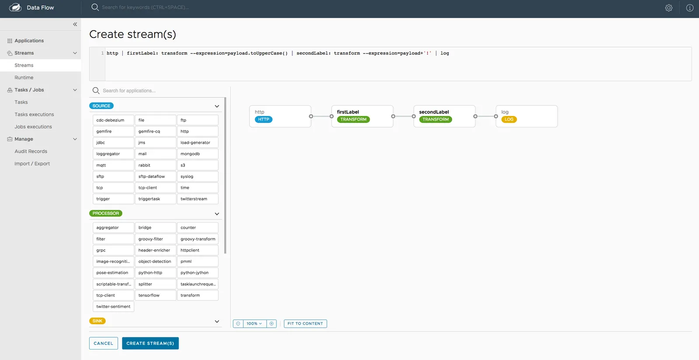

---

Stream DSL이나 Batch DSL에선 애플리케이션을 참조하는 대안으로 레이블을 활용할 수 있다. 애플리케이션 이름 앞에 레이블을 추가하면 된다. 레이블은 전체 정의 내에서 고유해야 하며, 뒤에 콜론 `:`을 붙어야 한다.

예를 들어 스트림을 구성하는 앱들 중에 같은 이름을 가진 앱이 있다면, 이 앱들을 고유하게 식별할 수 있도록 레이블로 단서를 줘야 한다.

```bash
stream create --definition "http | firstLabel: transform --expression=payload.toUpperCase() | secondLabel: transform --expression=payload+'!' | log" --name myStreamWithLabels --deploy
```

이 스트림 정의를 그래프로 시각화하면 다음과 같다:



아니면 레이블을 이용해서 스트림과 배치 job을 좀더 알기 쉽게 시각화할 수도 있다. 샘플 [파이썬 애플리케이션](https://dataflow.spring.io/docs/recipes/polyglot/app/)에 있는 예시를 보면 어떤 스타일로 사용하는 건지 알 수 있을 거다.