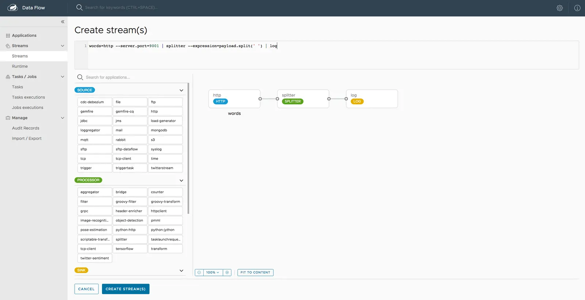
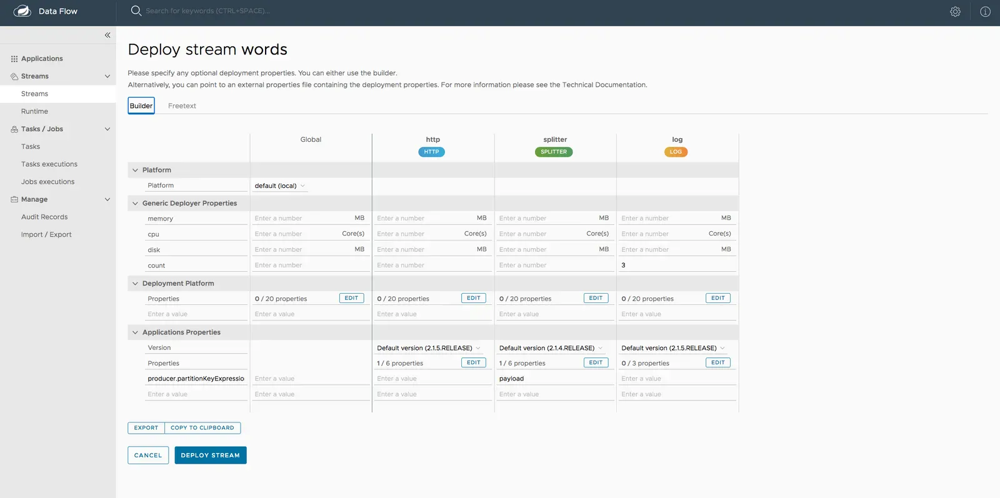

---

관련 있는 데이터를 모두 함께 처리할 수 있으려면, 성능이나 일관성 면에서 파티셔닝이 stateful 처리의 핵심이다. 예를 들어 time-window로 평균을 계산한다면, 주어진 센서로 측정된 모든 데이터를 동일한 애플리케이션 인스턴스에서 처리하는 것이 중요하다. 또는 수신 이벤트와 관련된 일부 데이터를 보강하기 위해 원격 프로시저를 호출해 조회하는 대신, 관련 데이터에 캐시를 두고 싶을 수도 있다.

파티셔닝 기능을 활용하면, 스트리밍 데이터 파이프라인에 있는 다운스트림 애플리케이션 인스턴스에 전송할 페이로드를 컨텐츠 기반으로 라우팅할 수 있다. 업스트림 애플리케이션의 특정한 파티션 데이터를 다운스트림 애플리케이션 인스턴스로 처리하고 싶을 때 특히 유용하다. 예를 들어 데이터 파이프라인의 프로세서 애플리케이션이 페이로드의 고유 식별자(`customerId`같은)를 기반으로 연산을 수행한다면, 이 고유 식별자를 기반으로 스트림을 파티셔닝할 수 있다.

### 목차

- [Stream Partition Properties](#stream-partition-properties)
- [Deploying a Stream with Partitioned Downstream Applications](#deploying-a-stream-with-partitioned-downstream-applications)
  * [Creating the Stream](#creating-the-stream)
- [Deploy the Stream](#deploy-the-stream)

---

## Stream Partition Properties

각 메세지들을 특정 컨슈머 인스턴스로 라우팅하기 위한 파티셔닝 전략을 설정하려면, 아래 있는 파티션 프로퍼티를 선언해서 스트림을 배포할 때 전달해주면 된다.

파티셔닝을 적용할 스트림은 다음과 같이 배포할 수 있다:

- `app.[app/label name].producer.partitionKeyExtractorClass`: `PartitionKeyExtractorStrategy`를 구현한 클래스명 (디폴트: null).
- `app.[app/label name].producer.partitionKeyExpression`: 메세지를 통해 파티션 키를 결정하는 SpEL<sup>Spring Expression Language</sup> 표현식. `partitionKeyExtractorClass`가 null일 때만 적용된다. 둘 다 null일 땐 애플리케이션을 파티셔닝하지 않는다 (디폴트: null).
- `app.[app/label name].producer.partitionSelectorClass`: `PartitionSelectorStrategy`를 구현한 클래스명 (디폴트: null).
- `app.[app/label name].producer.partitionSelectorExpression`: 파티션 키를 통해 메세지를 라우팅할 파티션 인덱스를 결정하는 SpEL 표현식. 최종 파티션 인덱스는 이 반환 값(integer)에 `[nextModule].count`로 나머지 연산<sup>modulo</sup>를 수행한 값이다. 클래스와 표현식 모두 null이면, 내부 바인더의 디폴트 `PartitionSelectorStrategy`를 적용한다 (디폴트: null).

정리하면, 배포 인스턴스 수가 >1이고 앞에 있는 애플리케이션에 `partitionKeyExtractorClass`나 `partitionKeyExpression`이 설정돼 있다면 애플리케이션을 파티셔닝한다 (`partitionKeyExtractorClass`를 우선시한다). 파티션 키를 추출하면, `partitionSelectorClass`(있으면)나 `partitionSelectorExpression % partitionCount`를 호출해서 파티셔닝된 애플리케이션 인스턴스를 결정한다. 여기서 `partitionCount`는 애플리케이션 수(RabbitMQ) 혹은 토픽 내부 파티션 수(카프카)다.

`partitionSelectorClass`와 `partitionSelectorExpression`이 둘 다 없으면 `key.hashCode() % partitionCount`를 사용한다.

---

## Deploying a Stream with Partitioned Downstream Applications

Spring Cloud Data Flow와 Spring Cloud Skipper 서버는 [설치 가이드](../installation)를 참고해 세팅하면 된다.

이 예제에선 기본으로 제공하는 `http`, `splitter`, `log` 애플리케이션을 사용한다.

### Creating the Stream

이 섹션에선 파티셔닝된 스트림을 생성하고 배포하는 방법을 설명한다.

아래와 같은 스트림을 생각해보자:

- `http` 소스 애플리케이션은 9001 포트에서 수신<sup>listen</sup>하며 문장을 받는다.
- `splitter` 프로세서 애플리케이션은 이 문장을 단어로 나누고, 단어들을 해시 값에 따라 파티셔닝한다 (`payload`를 `partitionKeyExpression`으로 사용해서).
- `log` 싱크 애플리케이션은 3개의 애플리케이션 인스턴스를 실행하며, 각 인스턴스는 업스트림에서 고유한 해시 값을 수신하고 싶다.

이 스트림을 생성하려면:

1. Spring Cloud Data Flow 대시보드 UI에 접속하고, 왼편에 있는 네비게이션 바에서 `Streams`를 선택한다. 다음 이미지와 같은 메인 Streams 뷰가 보일 거다:

   

2. `CREATE STREAM(S)`을 선택해서 다음 이미지와 같이 스트림 정의를 생성할 수 있는 그래픽 에디터를 띄운다:

   

   이 `Source`, `Processor`, `Sink` 애플리케이션은 (앞에서 등록했었다) 왼쪽 패널에서 확인할 수 있다.

3. 각 애플리케이션을 캔버스로 끌어와라.

4. 아이콘을 이어서 애플리케이션들을 연결해라.

   캔버스 상태에 따라 바뀌는 상단 텍스트 패널의 Data Flow DSL 정의에 주목해라. 다음과 같은 Stream DSL 텍스트를 입력해도 된다.

   ```sh
   words=http --server.port=9001 | splitter --expression=payload.split(' ') | log
   ```

5. `CREATE STREAM(S)`를 클릭해라.

---

## Deploy the Stream

스트림 왼쪽에 있는 줄임표 아이콘을 클릭해서 배포해보자. Deploy를 누르면 배포 프로퍼티를 추가로 입력할 수 있는 Deploy Stream 페이지로 이동한다.

이 스트림에 지정해야 하는 건 다음과 같다:

- 업스트림 애플리케이션의 파티셔닝 기준
- 다운스트림 애플리케이션 갯수

이 예제에선 프로퍼티를 아래와 같이 설정해야 한다:

```properties
app.splitter.producer.partitionKeyExpression=payload
deployer.log.count=3
```

대시보드의 stream deployment 페이지에서 다음과 같이 입력해주면 된다:

- `producer.partitionKeyExpression`: `splitter` 애플리케이션에 `payload`로 설정해주자.
- `count`: `log` 애플리케이션에 `3`으로 설정해주자.

이제 **DEPLOY STREAM**을 클릭해라:



스트림의 상태는 `Runtime` 페이지에서 확인할 수 있다.

다음과 같이 모든 애플리케이션이 실행되고 나면 스트림 배포가 완료된다:


모든 애플리케이션이 실행됐다면, `http` 소스에 데이터 전송을 시작해볼 수 있다.

데이터를 게시하려면 아래 `curl` 명령어를 사용하면 된다:

```sh
curl -X POST http://localhost:9001 -H "Content-Type: text/plain" -d "How much wood would a woodchuck chuck if a woodchuck could chuck wood"
```

`log` 애플리케이션 인스턴스들의 로그 파일에 액세스하려면, `Runtime`을 클릭하고 `log` 애플리케이션 이름(`words.log-v1`)을 눌러서 각 `log` 애플리케이션 인스턴스의 stdout 로그 파일 위치를 확인해라.

`tail` 명령어를 통해 각 `log` 애플리케이션 인스턴스의 stdout 로그를 확인해보면 된다.

이 로그를 보면 `splitter` 애플리케이션의 출력 데이터가 파티셔닝되며, 이렇게 파티셔닝된 데이터를 `log` 애플리케이션 인스턴스들이 수신하고 있는 것을 확인할 수 있다.

다음은 `log` 인스턴스 1의 출력 로그다:

```sh
2019-05-10 20:59:58.574  INFO 13673 --- [itter.words-0-1] log-sink                                 : much
2019-05-10 20:59:58.587  INFO 13673 --- [itter.words-0-1] log-sink                                 : wood
2019-05-10 20:59:58.600  INFO 13673 --- [itter.words-0-1] log-sink                                 : would
2019-05-10 20:59:58.604  INFO 13673 --- [itter.words-0-1] log-sink                                 : if
2019-05-10 20:59:58.609  INFO 13673 --- [itter.words-0-1] log-sink                                 : wood
```

다음은 `log` 인스턴스 2의 출력 로그다:

```sh
2019-05-10 20:59:58.579  INFO 13674 --- [itter.words-1-1] log-sink                                 : a
2019-05-10 20:59:58.589  INFO 13674 --- [itter.words-1-1] log-sink                                 : chuck
2019-05-10 20:59:58.595  INFO 13674 --- [itter.words-1-1] log-sink                                 : a
2019-05-10 20:59:58.598  INFO 13674 --- [itter.words-1-1] log-sink                                 : could
2019-05-10 20:59:58.602  INFO 13674 --- [itter.words-1-1] log-sink                                 : chuck
```

다음은 `log` 인스턴스 3의 출력 로그다:

```sh
2019-05-10 20:59:58.573  INFO 13675 --- [itter.words-2-1] log-sink                                 : How
2019-05-10 20:59:58.582  INFO 13675 --- [itter.words-2-1] log-sink                                 : woodchuck
2019-05-10 20:59:58.586  INFO 13675 --- [itter.words-2-1] log-sink                                 : woodchuck
```