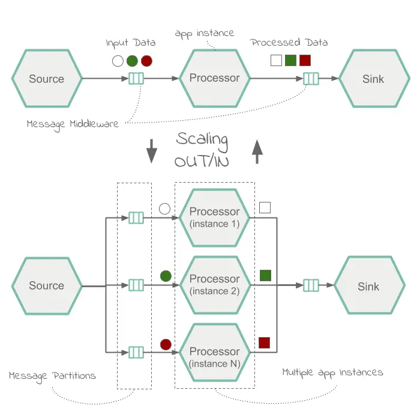

---

확장성의 일반적인 정의와, 어떤 타입이 있으며, 이 것들이 왜 필요한 건지부터 시작해보자.

[확장성Scalability](https://en.wikipedia.org/wiki/Scalability)은 리소스를 추가해서 부하가 늘어나는 것에 대처하는 시스템의 능력을 뜻한다. 분산 시스템에선, 기존 노드에 리소스(CPU, 메모리, 스토리지 등)를 추가하는 능력을 [수직 확장vertical scaling](https://en.wikipedia.org/wiki/Scalability#Vertical) (up/down)이라고 하는 반면, [수평 확장horizontal scaling](https://en.wikipedia.org/wiki/Scalability#Horizontal) (out/in)은 시스템에 노드를 더 추가하는 것을 의미한다. 이어서는 스트리밍 데이터 파이프라인에 `horizontal scaling`을 적용하는데 필요한 공통 개념들에 대해 논한다 (ex. scaling out, shared nothing).

Spring Cloud Data Flow에서 [스트림 처리](../concepts.stream-processing)는 구조적으로 보면 선택한 메세징 미들웨어(ex. RabbitMQ, 아파치 카프카)를 통해 연결되는 독립적인 이벤트 기반 스트리밍 애플리케이션 컬렉션으로 구현된다. 독립적인 애플리케이션들은 런타임에 모여 스트리밍 데이터 파이프라인을 구성한다. 스트리밍 데이터 파이프라인에서 데이터 부하가 늘어날 때 대처하는 능력은 다음 특성에 따라 달라진다:

- *메세징 미들웨어*: [데이터 파티셔닝](https://docs.spring.io/spring-cloud-stream/docs/current/reference/html/spring-cloud-stream.html#partitioning)은 메세징 미들웨어 인프라를 확장할 때 널리 쓰이는 기술이다. Spring Cloud Data Flow는 Spring Cloud Stream을 통해 [스트리밍 파티셔닝](../feature-guides.stream.partitioning)을 매우 잘 지원하고 있다.
- *이벤트 기반 애플리케이션*: Spring Cloud Stream은 보통 애플리케이션 스케일링scaling이라고 부르는, 멀티 컨슈머 인스턴스를 통한 병렬 데이터 처리를 지원한다.

다음은 데이터 파티셔닝과 애플리케이션 병렬 처리를 기반으로 구현하는 전형적인 scale-out 아키텍처를 나타낸 다이어그램이다:

쿠버네티스와 클라우드 파운드리같은 플랫폼들은 운영자가 시스템 부하를 제어할 수 있는 스케일링 기능을 제공한다. 예를 들어 클라우드 파운드리에선 [cf scale](https://docs.cloudfoundry.org/devguide/deploy-apps/cf-scale.html)을 사용해 [애플리케이션을 확장](https://docs.spring.io/spring-cloud-dataflow/docs/2.3.0.RELEASE/reference/htmlsingle/#configuration-cloudfoundry-scaling)할 수 있으며, 마찬가지로 쿠버네티스에선 [kubectl scale](https://jamesdefabia.github.io/docs/user-guide/kubectl/kubectl_scale/)을 사용해 애플리케이션을 확장할 수 있다. 뿐만 아니라, 클라우드 파운드리의 [App Autoscaler](https://docs.pivotal.io/application-service/2-11/appsman-services/autoscaler/using-autoscaler.html)와 쿠버네티스의 [HPA](https://kubernetes.io/docs/tasks/run-application/horizontal-pod-autoscale/), [KEDA](https://github.com/kedacore/keda)의 지원을 받아 오토스케일링 기능도 활성화할 수 있다. 오토스케일링은 일반적으로 CPU/메모리 제한 임계치나, 메세지 큐 depth와 topic-offset-lag 메트릭으로 결정된다.

스케일링은 Spring Cloud Data Flow 밖에서 일어나는 일이지만, 스케일링된 애플리케이션들은 자동으로 반응해 업스트림 부하를 처리할 수 있다. 개발자는 [partitionKeyExpression](https://docs.spring.io/spring-cloud-stream/docs/current/reference/html/spring-cloud-stream.html#spring-cloud-stream-overview-configuring-output-bindings-partitioning), [partitionCount](https://docs.spring.io/spring-cloud-stream/docs/current/reference/html/spring-cloud-stream.html#spring-cloud-stream-overview-configuring-output-bindings-partitioning) 같은 프로퍼티를 설정해서 메세지 파티셔닝만 구성해주면 된다.

플랫폼 전용 저수준 API 외에도, Spring Cloud Data Flow는 데이터 파이프라인 확장을 위해 설계된 전용 [Scale API](https://docs.spring.io/spring-cloud-dataflow/docs/2.9.1/reference/htmlsingle/#api-guide-resources-stream-deployment-scale)를 제공한다. 이 `Scale API`에선 다양한 플랫폼의 네이티브 스케일링 기능을 간단하면서도 일관적인 인터페이스로 통합하고 있다. 이 API를 사용하면 애플리케이션의 특정한 도메인이나 비즈니스 로직을 기반으로 스케일링을 제어할 수 있다. Scale API는 모든 Spring Cloud Data Flow 지원 플랫폼에서 그대로 사용할 수 있다. 개발자는 auto-scale 컨트롤러를 구현하고 쿠버네티스나 클라우드 파운드리, 심지어 테스트 용도의 로컬 플랫폼에서도 재사용할 수 있다.

[스케일링 레시피](https://dataflow.spring.io/docs/recipes/scaling/)에 방문해서 [SCDF 쉘을 이용해 애플리케이션 확장](https://dataflow.spring.io/docs/recipes/scaling/manual-scaling/)하는 방법이나 [SCDF와 프로메테우스를 이용해 스트리밍 데이터 파이프라인의 오토스케일링](https://dataflow.spring.io/docs/recipes/scaling/autoscaling/)을 구현하는 방법을 읽어봐라.
