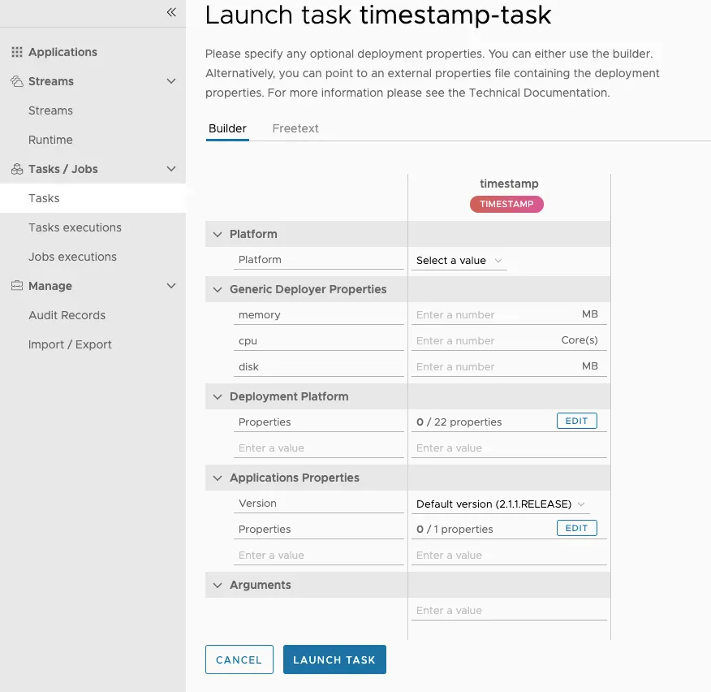
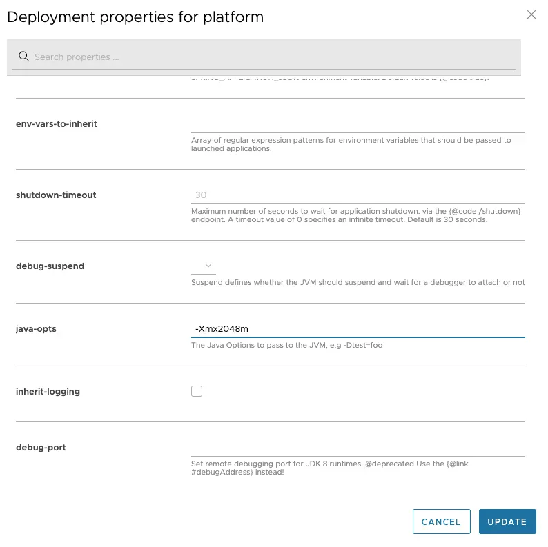

---

태스크 정의를 타겟 플랫폼(`local`, `cloudFoundry`, `kubernetes`)에서 실행시킬 땐, 실행 시점에 태스크 애플리케이션에 적용할 설정 프로퍼티를 제공할 수 있다. 예를 들어 아래 프로퍼티들을 지정할 수 있다:

- Deployer Properties - 이 프로퍼티들은 태스크 실행 방식을 커스텀한다.
- Application Properties - 이 프로퍼티들은 애플리케이션 전용 프로퍼티다.

> 각 플랫폼을 위한 전용 배포 프로퍼티는 아래 링크에서 확인할 수 있다:
>
> - [로컬](https://docs.spring.io/spring-cloud-dataflow/docs/current/reference/htmlsingle/#configuration-local-deployer)
>- [클라우드 파운드리](https://docs.spring.io/spring-cloud-dataflow/docs/current/reference/htmlsingle/#configuration-cloudfoundry-deployer)
> - [쿠버네티스](https://docs.spring.io/spring-cloud-dataflow/docs/current/reference/htmlsingle/#configuration-kubernetes-deployer).

### 목차

- [Deployer Properties](#deployer-properties)
- [Application Properties](#application-properties)
- [How to Set These Properties](#how-to-set-these-properties)

---

## Deployer Properties

Deployer 프로퍼티는 Spring Cloud Data Flow의 deployer에게 애플리케이션을 어떻게 실행시킬지를 알려주는 프로퍼티들이다. `deployer.<application name>.property` 형식을 사용한다. 예를 들어 로컬 플랫폼에서 실행하고 최대 힙을 2048m로 설정하고 싶을 땐 아래 deployer 프로퍼티를 설정해야 한다:

```properties
deployer.timestamp.local.javaOpts=-Xmx2048m
```

---

## Application Properties

애플리케이션 프로퍼티는 애플리케이션의 동작을 지정하기 위해 애플리케이션 개발자가 만든 프로퍼티다. 예를 들어 timestamp 애플리케이션에선 인자나 프로퍼티를 통해 타임스탬프 format을 설정할 수 있다. 앱 프로퍼티의 형식은 `app.<application name>.<property>`이다. 따라서 타임스탬프 format 프로퍼티는 `app.timestamp.format=YYYY`가 된다.

---


## How to Set These Properties

먼저 [Getting Started 가이드](../batch-developer-guides.getting-started)에서 설명하는 대로 timestamp 애플리케이션을 등록하고 태스크 정의를 생성해야 한다. 태스크 정의까지 마쳤다면 UI를 이용해 `play` 버튼(오른쪽을 가리키고 있는 화살촉 모양의 중간 아이콘)을 눌러 `timestamp-task`를 시작할 수 있다. 그러면 커맨드라인 인자와 배포 파라미터를 추가할 수 있는 양식으로 이동할 거다:



앞에서 보여줬던 예제를 다시 가져와서, 타임스탬프 format을 위한 애플리케이션 프로퍼티를 `YYYY`로 설정하고 deployer 프로퍼티 javaOpts를 사용해 최대 힙 사이즈를 설정해볼 거다. 먼저 타임스탬프 format을 설정해보자. `Applications Properties` 아래에 있는 `edit` 버튼을 선택하면 된다. 그러면 아래와 같은 대화 상자가 나타날 거다:


이제 `format` 필드에 `YYYY`를 입력하고 `UPDATE` 버튼을 클릭해라. 이번엔 `Deployment Properties`에서 `edit` 버튼을 선택한다. 아래와 같은 대화 상자가 보일 거다:



이제 `java-opts` 필드에 `-Xmx2048m`을 입력하고 `UPDATE` 버튼을 클릭한다.

**Launch the task**를 눌러보자. 그러면 Data Flow 서버의 태스크 플랫폼에서 태스크가 실행되고, 태스크 `execution`이 새로 하나 기록된다. 실행이 완료되면 상태가 녹색으로 변경되고 `Complete`가 표시된다. 이 태스크의 간단한 실행 내역들을 조회하려면 **Executions** 탭을 선택해라.