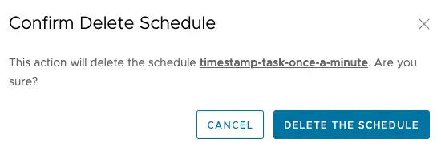

---

배치 애플리케이션을 개발하고 즉석에서 기동시키는 방법은 [배치 개발자 가이드](../batch-developer-guides)에서 보여줬다. 하지만 보통 배치 job은 예약된 시간에 실행시키거나 이벤트를 기반으로 시작한다. 이 섹션에선 Spring Cloud Data Flow를 사용해 배치 job 시작을 예약하는 방법을 설명한다.

### 목차

- [Spring Cloud Data Flow Scheduling Overview](#spring-cloud-data-flow-scheduling-overview)
- [Scheduling a Batch Job](#scheduling-a-batch-job)
- [Monitoring Task Launches](#monitoring-task-launches)
- [Deleting a Schedule](#deleting-a-schedule)

---

## Spring Cloud Data Flow Scheduling Overview

Spring Cloud Data Flow를 사용하면 cron 표현식을 설정해서 태스크 시작을 예약할 수 있다. 스케줄은 RESTful API나 Spring Cloud Data Flow UI를 통해 생성할 수 있다. Spring Cloud Data Flow는 클라우드 플랫폼에서 사용 가능한 스케줄링 에이전트를 통해서 태스크 실행을 예약한다.

Spring Cloud Data Flow는 클라우드 파운드리 플랫폼을 사용할 땐 PCF 스케줄러를 이용한다. 쿠버네티스를 사용할 땐 cron job을 이용한다.

---

## Scheduling a Batch Job

먼저 [Getting Started 가이드](../batch-developer-guides.getting-started)에서 설명하는 대로 timestamp 애플리케이션을 등록하고 태스크 정의를 생성해야 한다. 태스크 정의까지 마쳤다면 UI를 이용해 다음 이미지에 보이는 것처럼 `drop down` 버튼을 누르고 "Schedule" 옵션을 선택해 `timestamp-task`를 예약한다:

여기서는 이 애플리케이션을 1분에 한 번씩 실행시키려고 한다. 그러려면 Schedule setup 페이지를 다음과 같이 작성하면 된다:

CloudFoundry
Kubernetes
Local

아래 샘플에선 스케줄 이름을 <code class="highlighter-rouge">timestamp-task-once-a-minute</code>으로 설정하고 <a href="https://docs.pivotal.io/pcf-scheduler/1-5/using-jobs.html#schedule-job">크론 표현식</a>을 <code class="highlighter-rouge">*/1 * ? * *</code>로 입력하고 있다. 크론 표현식은 Quartz에서 사용하는 형식대로 표현한다는 점을 참고하자. 이 스케줄에 커맨드라인 인자와 배포 파라미터도 추가할 수 있지만, 이 예제에선 생략한다. 크론 표현식을 입력했으면 <strong>CREATE SCHEDULE(S)</strong> 버튼을 눌러보자. 이제 PCF 스케줄러가 배치 애플리케이션의 스케줄링을 처리해줄 거다.

아래 샘플에선 스케줄 이름을 <code class="highlighter-rouge">timestamp-task-once-a-minute</code>으로 설정하고 <a href="https://docs.pivotal.io/pcf-scheduler/1-5/using-jobs.html#schedule-job">크론 표현식</a>을 <code class="highlighter-rouge">*/1 * * * *</code>로 입력하고 있다. 이 스케줄에 커맨드라인 인자와 배포 파라미터도 추가할 수 있지만, 이 예제에선 생략한다. 이제 <strong>CREATE SCHEDULE(S)</strong> 버튼을 눌러보자. 이제 배치 애플리케이션의 스케줄링을 처리해줄 Cron Job이 생성됐을 거다.

Spring Cloud Data Flow는 로컬 플랫폼에서 태스크 시작을 예약할 수 있는 기본 솔루션을 제공하지 않는다. 하지만 스프링 부트에선 스케줄링 옵션을 제공할 수 있는 네이티브 솔루션을 최소 두 가지 제공한다. 로컬에서 실행 중인 SCDF에서 스케줄링을 수행할 수 있도록 커스텀 솔루션으로 구현해주면 된다.

<strong>Spring Boot Implementing a Quartz Scheduler</strong>

한 가지 옵션은 스프링 부트 애플리케이션을 만들어, <a href="http://www.quartz-scheduler.org/">Quartz 스케줄러</a>를 사용해 Spring Cloud Data Flow에서 태스크를 시작하기 위한 <a href="https://docs.spring.io/spring-cloud-dataflow/docs/current/reference/htmlsingle/#api-guide-resources-task-executions">RESTful API</a>를 호출하는 거다. 자세한 내용은 <a href="https://docs.spring.io/spring-boot/docs/current/reference/html/spring-boot-features.html#boot-features-quartz">여기</a>를 참고해라.

<strong>Spring Boot Implementing the <code class="highlighter-rouge">@Scheduled</code> annotation</strong>

한 가지 다른 옵션은 스프링 부트 애플리케이션을 만들어, Spring Cloud Data Flow에서 태스크를 시작하기 위한 <a href="https://docs.spring.io/spring-cloud-dataflow/docs/current/reference/htmlsingle/#api-guide-resources-task-executions">RESTful API</a>를 호출하는 메소드에 <code class="highlighter-rouge">@Scheduled</code> 어노테이션을 사용하는 거다. 관련해서 자세한 내용은 <a href="../../Spring%20Boot/task-execution-and-scheduling">스프링 부트 문서</a>를 읽어보면 된다.

태스크 스케줄을 생성할 땐, 태스크를 시작할 때와 동일한 방식으로 예약된 애플리케이션에 대한 커맨드라인 인자와 배포 프로퍼티를 지정할 수 있다. 배포 프로퍼티 지정에 관한 자세한 내용은 [배치 피쳐 가이드](../feature-guides.batch.deployment-properties)를 읽어보면 된다.

---

## Monitoring Task Launches

각각 예약된 실행들의 상태는 Spring Cloud Data Flow의 `Tasks executions` 탭에서 조회할 수 있다.

---

## Deleting a Schedule

다음 이미지와 같이 `Schedules` 탭에서 제거하려는 스케줄 옆에 있는 `drop down` 버튼을 누르고 "Destroy" 옵션을 선택해라:

컨펌 대화 상자가 나타나면 **DELETE THE SCHEDULE** 버튼을 눌러라.

{: .center-image }