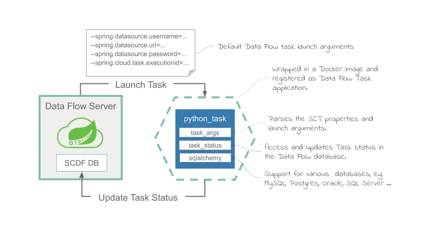
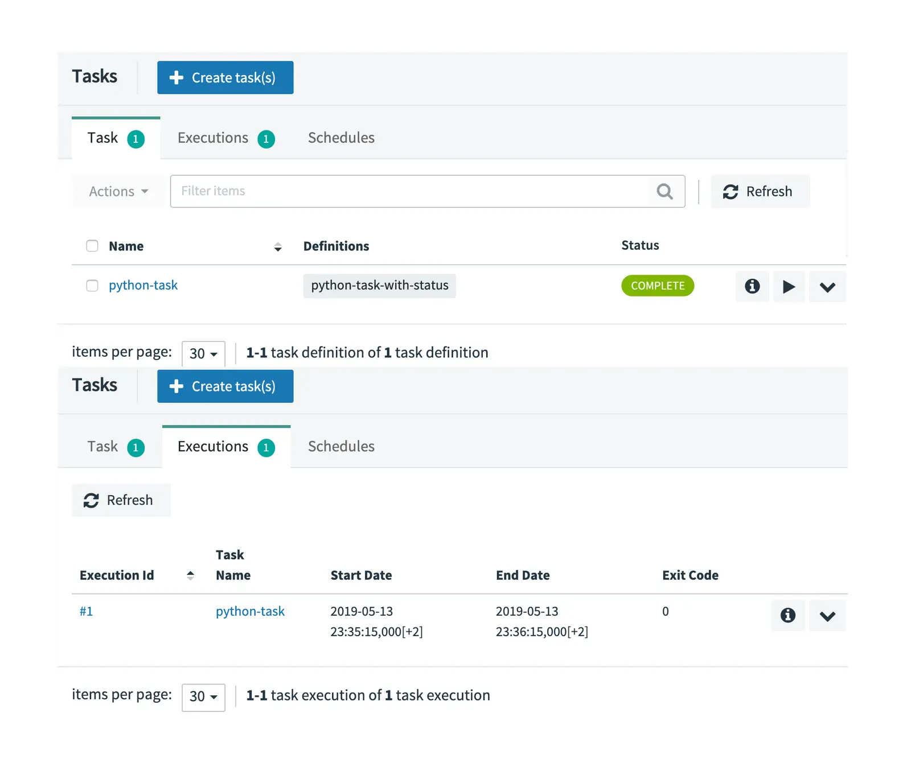
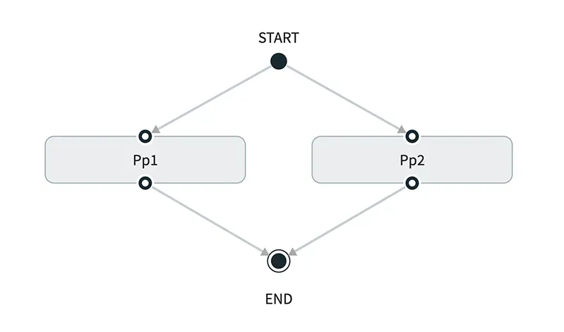
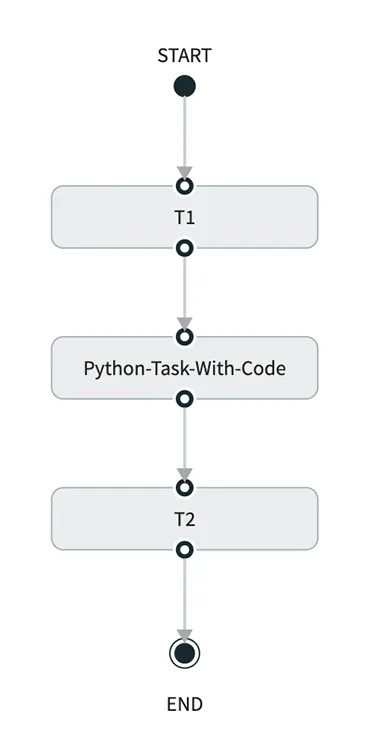

---

이 레시피에선 커스텀 파이썬 스크립트를 [Data Flow  태스크](https://docs.spring.io/spring-cloud-dataflow/docs/2.9.1/reference/htmlsingle/#spring-cloud-dataflow-task)로 실행하는 방법과, 이후 이 태스크들을 [Composed 태스크](https://docs.spring.io/spring-cloud-dataflow/docs/2.9.1/reference/htmlsingle/#spring-cloud-dataflow-composed-tasks)로 조율<sup>orchestration</sup>하는 방법을 보여준다.

이때는 파이썬 스크립트를, SCDF의 `Local`, `Kubernetes` 구현체에서 사용할 수 있는 도커 이미지에 번들링해야 한다.

다음은 이 솔루션에 사용할 아키텍처와 관련 컴포넌트들을 보여주는 다이어그램이다:



Data Flow가 파이썬 스크립트를 태스크로 시작하면, 실행된 스크립트는 성공이나 실패 상태로 완료된다. 파이썬 스크립트는 표준 Spring Cloud Task 애플리케이션이 아니기 때문에, Data Flow에서 사용하는 공유 데이터베이스로 상태를 업데이트하고 라이프사이클을 관리하는 건 사용자의 몫이다. 여기서는 유틸티리를 이용해 시작 인자들을 처리하고 Data Flow 데이터베이스로 태스크 상태를 관리한다.

소스 코드는 샘플 깃허브 [레포지토리](https://github.com/spring-cloud/spring-cloud-dataflow-samples/tree/master/dataflow-website/recipes/polyglot/polyglot-python-task)에서 확인할 수 있으며, [polyglot-python-task.zip](https://github.com/spring-cloud/spring-cloud-dataflow-samples/raw/master/dataflow-website/recipes/polyglot/polyglot-python-task.zip)을 클릭하면 압축된 아카이브 파일을 다운받을 수 있다. 직접 프로젝트를 빌드해서 사용하려면 [빌드](#build) 가이드를 따라하면 된다.

### 목차
- [Development](#development)
  * [Build](#build)
- [Deployment](#deployment)
- [Use with Composed Tasks](#use-with-composed-tasks)

---

## Development

아래 예시에 있는 [python_task.py](https://github.com/spring-cloud/spring-cloud-dataflow-samples/blob/master/dataflow-website/recipes/polyglot/polyglot-python-task/python_task.py)는 Spring Cloud Task로 등록할 수 있는 샘플 파이썬 스크립트다. 이 파이썬 스크립트를 시작하면 확인 메세지를 출력한다. 그런 다음 60초 동안 실행을 멈춰있다가<sup>sleep</sup> 종료된다. 태스크가 실패하는 상황은 실행 인자에 `--error.message=<Text>`가 있으면 스크립트에서 예외를 던지는 식으로 시뮬레이션한다.

```python
from util.task_status import TaskStatus
from util.task_args import get_task_id, get_db_url, get_task_name, get_cmd_arg

try:
    # Connect to SCDF's database.
    status = TaskStatus(get_task_id(), get_db_url())

    # Set task's status to RUNNING.
    status.running()

    # Do something.
    print('Start task:{}, id:{}'.format(get_task_name(), get_task_id()))

    print('Wait for 60 seconds ...')
    sys.stdout.flush()
    time.sleep(60)

    if get_cmd_arg('error.message') is not None:
        raise Exception(get_cmd_arg('error.message'))

    # Set task's status to COMPLETED.
    status.completed()

except Exception as exp:
    # Set task's status to FAILED.
    status.failed(1, 'Task failed: {}'.format(exp))
```

> 파이썬 스크립트는 `Spring Cloud Task`가 관리하지 않기 때문에, Data Flow 데이터베이스로 진행 상황을 업데이트하고 관리하는 건 사용자의 몫이다.

이 커스텀 스크립트는 입력 인자를 파싱하거나, Data Flow에서 실행 상태를 관리할 땐 아래 유틸리티들을 이용한다:

- [task_status.py](https://github.com/spring-cloud/spring-cloud-dataflow-samples/blob/master/dataflow-website/recipes/polyglot/polyglot-python-task/util/task_status.py)는 Data Flow `TASK_EXECUTION` 테이블에 접근해 태스크의 라이프사이클 이벤트를 반영하도록 데이터를 업데이트하는 일을 도와준다. `TaskStatus` 클래스는 `task id`와 `sqlalchemy url` 인자를 받으며 (커맨드라인 인자에서 가져온다), 태스크 상태를 `running`, `completed` 또는 `failed(with exitCode, errorMessage)`로 설정할 수 있는 API를 제공한다. `task_status`는 태스크를 실행할 때마다 Data Flow에서 자동으로 제공하는 아래 실행 인자들을 사용해 Data Flow 데이터베이스에 액세스한다:

  ```bash
  --spring.datasource.username=root
  --spring.datasource.password=yourpassword
  --spring.datasource.url=jdbc:mysql://<mysql-host>:<port>/mysq
  --spring.cloud.task.executionid=26
  ```

  `spring.cloud.task.executionid` 프로퍼티는 Data Flow 내부에서 알고 있는 태스크 ID로, `TASK_EXECUTION` 테이블에 저장된 값이다.

- [task_args.py](https://github.com/spring-cloud/spring-cloud-dataflow-samples/blob/master/dataflow-website/recipes/polyglot/polyglot-python-task/util/task_args.py) 유틸리티는 디폴트 [엔트리 포인트 스타일](../installation.kubernetes.helm/#entry-point-style)(즉, exec 스타일)에서 태스크 인자를 추출하는 일을 도와준다. 이 유틸리티에선 여러 가지 데이터베이스를 위한 [sqlalchemy](https://www.sqlalchemy.org/) URL도 구성해줘서, SCDF 데이터베이스 URL을 가져올 수 있다 (현재는 MySQL만 테스트를 마쳤다). [get*db*url()](https://github.com/spring-cloud/spring-cloud-dataflow-samples/blob/master/dataflow-website/recipes/polyglot/polyglot-python-task/util/task_args.py#L24) 코드를 확인해봐라.

`python_task.py`를 Data Flow 태스크로 동작시키려면, 도커 이미지에 번들링해서 `DockerHub`에 업로드해야 한다. 아래 [Dockerfile](https://github.com/spring-cloud/spring-cloud-dataflow-samples/blob/master/dataflow-website/recipes/polyglot/polyglot-python-task/Dockerfile)은 파이썬 스크립트를 도커 이미지로 번들링하는 방법을 보여준다:

```dockerfile
FROM python:3.7.3-slim

RUN apt-get update
RUN apt-get install build-essential -y
RUN apt-get install default-libmysqlclient-dev -y
RUN pip install mysqlclient
RUN pip install sqlalchemy

ADD python_task.py /
ADD util/* /util/

ENTRYPOINT ["python","/python_task.py"]
CMD []
```

이 Dockerfile에선 필수 의존성을 설치하고, 태스크 스크립트(`ADD python_task.py`)와 유틸리티(`util` 폴더 아래에 있는 스크립트)를 추가한다.

> 커맨드는 비워두고(`[]`) 엔트리 포인트를 명시한다.

### Build

1. [샘플 프로젝트](https://github.com/spring-cloud/spring-cloud-dataflow-samples)를 체크아웃 받고 `polyglot-python-task` 폴더로 이동한다:
  ```sh
git clone https://github.com/spring-cloud/spring-cloud-dataflow-samples
cd ./spring-cloud-dataflow-samples/dataflow-website/recipes/polyglot/polyglot-python-task/
  ```

2. 도커 이미지를 빌드하고 도커허브에 푸시한다:
  ```shell
docker build -t springcloud/python-task-with-status:0.1 .
docker push springcloud/python-task-with-status:0.1
  ```
  팁: `springcloud`는 각자 환경에 맞는 도커허브 프리픽스로 변경해라.

3. 도커 이미지를 Data Flow `task` 애플리케이션으로 등록한다:
  ```shell
app register --type task  --name python-task-with-status --uri docker://springcloud/python-task-with-status:0.1
  ```

---

## Deployment

[설치 가이드](../installation.kubernetes/)에 따라 쿠버네티스 환경에 Data Flow를 세팅한다.

파이썬 스크립트를 Data Flow 태스크로 만들고 실행한다:

```bash
task create --name python-task --definition "python-task-with-status"
task launch --name python-task
```

> 태스크의 출력은 `kubectl get all`, `kubectl logs -f po/python-task-XXXXXX`를 사용해 모니터링한다. python-task의 상태는 Data Flow UI의 Task 메뉴나 쉘(`task list`)을 통해 모니터링한다.

태스크가 문제 없이 실행되면 Data Flow 태스크 UI에서 다음과 같은 화면을 조회할 수 있을 거다:



이번에는 `python-task`를 `--error.message=MyTestError` 인자를 사용해서 다시 실행해보자 (에러 상황을 시뮬레이션해본다):

```sh
task launch --name python-task --arguments "--error.message=MyTestError"
```

Data Flow Task UI에서 두 번째 태스크 실행(#2)은 실패했음을 확인할 수 있다:


---

## Use with Composed Tasks

태스크 상태 관리할 수 있다면 [Composed 태스크](https://docs.spring.io/spring-cloud-dataflow/docs/2.9.1/reference/htmlsingle/#spring-cloud-dataflow-composed-tasks)에서도 도커와 파이썬 태스크를 사용할 수 있다.

다음은 병렬로 실행하는 태스크를 정의하는 예시다:

```bash
task create compose2 --definition "<pp1: python-task-with-status || pp2: python-task-with-status>"
task launch --name compose2
```

위 예시는 다음과 같이 python-task를 병렬로 두 번 실행한다:



반대로 아래 composed 태스크는 정의한 태스크들을 순차적으로 실행한다:

```bash
task create sequence1 --definition "t1: timestamp && python-task-with-status && t2: timestamp”
task launch --name sequence1
```

{: .center-image }