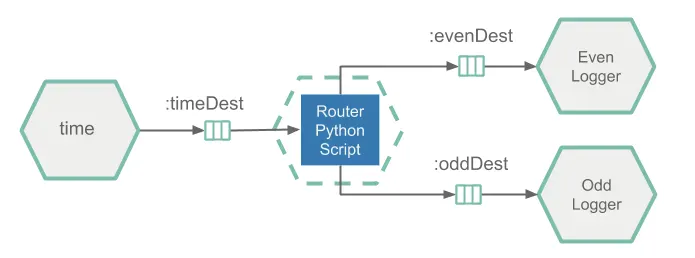
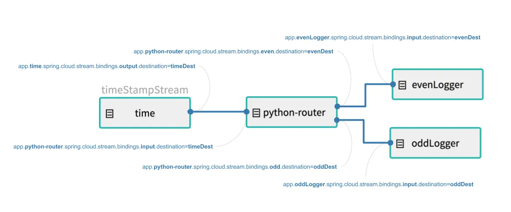

---

이 레시피에선 파이썬 스크립트를 Data Flow [애플리케이션](https://docs.spring.io/spring-cloud-dataflow/docs/2.9.1/reference/htmlsingle/#spring-cloud-dataflow-stream-app-dsl)으로 배포하는 방법을 보여준다. Data Flow는 다른 애플리케이션 타입들(`source`, `processor`, `sink`)과는 달리, `app` 애플리케이션 타입을 배포할 땐 프로듀서와 컨슈머를 연결하는 배포 프로퍼티를 설정하지 않는다. 애플리케이션들을 배포할 때 애플리케이션들이 서로 통신할 수 있도록 배포 프로퍼티를 이용해 "연결<sup>wire up</sup>"해주는 일은 개발자의 몫이다.

이 레시피에선 `input` 스트림 타임스탬프를 `even`이나 `odd` 다운스트림 채널로 전달하는 데이터 처리 파이프라인을 만들어 본다. 기술적으로는 [다이나믹 라우터](https://www.enterpriseintegrationpatterns.com/patterns/messaging/DynamicRouter.html) 통합 패턴을 구현한다. 이 파이프라인은 `timeDest` 입력 채널에서 `timestamps` 메세지를 가져온다. 타임스탬프 값에 따라 메세지를 `evenDest`, `oddDest` 다운스트림 채널 중 하나로 라우팅한다.

다음은 이 데이터 처리 파이프라인의 아키텍처를 보여주는 다이어그램이다:



타임스탬프 소스는 미리 빌드해서 제공하는 [Time Source](https://github.com/spring-cloud/stream-applications/tree/v2021.0.1/applications/source/time-source)를 사용하지만, Data Flow에는 `App` 타입으로 등록한다. 이 애플리케이션은 `timeDest`라는 다운스트림 카프카 토픽에 타임스탬프를 끊임없이 전송한다.

파이썬 스크립트로 구현하고 도커 이미지로 패키징해볼 `Router` 앱은, 카프카 토픽 `timeDest`에서 타임스탬프를 컨슘하고, 이 타임스탬프 값에 따라 메세지를 다운스트림에 있는 카프카 토픽 `evenDest`나 `oddDest`에 라우팅한다.

`Even Logger`와 `Odd Logger`는 미리 빌드에서 제공하는 [Log Sink](https://github.com/spring-cloud/stream-applications/tree/v2021.0.1/applications/sink/log-sink) 애플리케이션이지만, Data Flow에는 `App` 타입으로 등록한다. 로거는 `evenDest`나 `oddDest` 토픽을 컨슘해서 콘솔에 메세지를 출력한다.

메세징 미들웨어엔 아파치 카프카를 사용한다.

### 목차

- [Development](#development)
  + [Build](#build)
- [Deployment](#deployment)

---

## Development

소스 코드는 샘플 깃허브 [레포지토리](https://github.com/spring-cloud/spring-cloud-dataflow-samples/tree/master/dataflow-website/recipes/polyglot/polyglot-python-app)에서 확인할 수 있으며, [polyglot-python-app.zip](https://github.com/spring-cloud/spring-cloud-dataflow-samples/raw/master/dataflow-website/recipes/polyglot/polyglot-python-app.zip)을 눌러 압축된 아카이브를 다운받아도 된다.

타임스탬프 라우터 앱 로직은 [python*router*app.py](https://github.com/spring-cloud/spring-cloud-dataflow-samples/blob/master/dataflow-website/recipes/polyglot/polyglot-python-app/python_router_app.py)가 구현하고 있다:

```python
from kafka import KafkaConsumer, KafkaProducer
from kafka.admin import KafkaAdminClient, NewTopic
from kafka.errors import TopicAlreadyExistsError

from util.actuator import Actuator
from util.arguments import get_kafka_brokers, get_env_info, get_channel_topic

class Router:

    def __init__(self, info, kafka_brokers, input_topic, even_topic, odd_topic):

        self.kafka_brokers = kafka_brokers
        self.input_topic = input_topic
        self.even_topic = even_topic
        self.odd_topic = odd_topic

        # Serve the liveliness and readiness probes via http server in a separate thread.
        Actuator.start(port=8080, info=info)

        # Ensure the output topics exist.
        self.__create_topics_if_missing([self.input_topic, self.even_topic, self.odd_topic])

        self.consumer = KafkaConsumer(self.input_topic, bootstrap_servers=self.kafka_brokers)
        self.producer = KafkaProducer(bootstrap_servers=self.kafka_brokers)

    def __create_topics_if_missing(self, topic_names):
        admin_client = KafkaAdminClient(bootstrap_servers=self.kafka_brokers, client_id='test')
        for topic in topic_names:
            try:
                new_topic = NewTopic(name=topic, num_partitions=1, replication_factor=1)
                admin_client.create_topics(new_topics=[new_topic], validate_only=False)
            except TopicAlreadyExistsError:
                print ('Topic: {} already exists!')

    def process_timestamps(self):
        while True:
            for message in self.consumer:
                if message.value is not None:
                    if self.is_even_timestamp(message.value):
                        self.producer.send(self.even_topic, b'Even timestamp: ' + message.value)
                    else:
                        self.producer.send(self.odd_topic, b'Odd timestamp:' + message.value)

    @staticmethod
    def is_even_timestamp(value):
        return int(value[-1:]) % 2 == 0


Router(
    get_env_info(),
    get_kafka_brokers(),
    get_channel_topic('input'),
    get_channel_topic('even'),
    get_channel_topic('odd')
).process_timestamps()
```

> 파이썬 스크립트 내에서 `print` 명령을 사용할 때는, 출력 버퍼가 가득 차 카프카의 컨슈머-프로듀서 흐름이 중단되지 않도록 반드시 `sys.stdout.flush()`로 플러시해줘야 한다.

- 카프카 메세지를 컨슘하고 생성할 때는 [`kafka-python`](https://github.com/dpkp/kafka-python) 라이브러리를 사용한다. `process_timestamps` 메소드에선 입력 채널에서 받은 타임스탬프를 끊임 없이 컨슘하고, 해당 짝홀 값을 출력 채널로 라우팅한다.
- health, liveness, info 등과 같이 실행 중인 애플리케이션에 대한 운영 정보를 노출할 땐 [actuator.py](https://github.com/spring-cloud/spring-cloud-dataflow-samples/blob/master/dataflow-website/recipes/polyglot/polyglot-python-app/util/actuator.py) 유틸리티 안에 있는 [`Actuator`](https://github.com/spring-cloud/spring-cloud-dataflow-samples/blob/master/dataflow-website/recipes/polyglot/polyglot-python-app/util/actuator.py#L7) 클래스를 사용한다. 여기서는 별도 스레드에서 임베디드 HTTP 서버를 실행하고 `/actuator/health`와 `/actuator/info` 엔드포인트를 노출해 쿠버네티스의 liveness, readiness 프로브 요청을 처리한다.
- [arguments.py](https://github.com/spring-cloud/spring-cloud-dataflow-samples/blob/master/dataflow-website/recipes/polyglot/polyglot-python-app/util/arguments.py) 유틸리티는 커맨드라인 인자와 환경 변수에서 필요한 입력 파라미터를 가져오는 일을 도와준다. 이 유틸리티에선 디폴트 [엔트리 포인트 스타일](../installation.kubernetes.helm/#entry-point-style)(즉, exec 스타일)을 가정한다. 참고로, 카프카 브로커 커넥션 프로퍼티는 Data Flow가 환경 변수로 전달해준다.

`python_router_app.py`를 Data Flow `app`으로 동작시키려면, 도커 이미지에 번들링해서 `DockerHub`에 업로드해야 한다. 아래 [Dockerfile](https://github.com/spring-cloud/spring-cloud-dataflow-samples/blob/master/dataflow-website/recipes/polyglot/polyglot-python-app/Dockerfile)은 파이썬 스크립트를 도커 이미지로 번들링하는 방법을 보여준다:

```dockerfile
FROM python:3.7.3-slim
RUN pip install kafka-python
RUN pip install flask
ADD /util/* /util/
ADD python_router_app.py /
ENTRYPOINT ["python","/python_router_app.py"]
CMD []
```

이 Dockerfile에선 필수 의존성을 설치하고, 파이썬 스크립트(`ADD python_router_app.py`)와 유틸리티(`util` 폴더 아래에 있는 스크립트)를 추가하고, 커맨드 항목을 설정한다.

### Build

이제 도커 이미지를 빌드하고 도커허브 레지스트리에 푸시하면 된다.

[샘플 프로젝트](https://github.com/spring-cloud/spring-cloud-dataflow-samples)를 체크아웃 받고 `polyglot-python-app` 폴더로 이동한다:

```bash
git clone https://github.com/spring-cloud/spring-cloud-dataflow-samples
cd ./spring-cloud-dataflow-samples/dataflow-website/recipes/polyglot/polyglot-python-app/
```

`polyglot-python-app` 폴더 안에서 `polyglot-python-app` 도커 이미지를 빌드하고 도커허브에 푸시한다:

```bash
docker build -t springcloud/polyglot-python-app:0.2 .
docker push springcloud/polyglot-python-app:0.2
```

> `springcloud`는 각자 환경에 맞는 도커허브 프리픽스로 변경해라.

도커허브에 올라가고 나면, Data Flow에서 이미지를 등록하고 배포할 수 있다.

---

## Deployment

[설치 가이드](../installation.kubernetes/)에 따라 쿠버네티스 환경에 Data Flow를 세팅한다.

minikube에서 Data Flow URL을 가져와서 (`minikube service --url scdf-server`), Data Flow 쉘에 세팅해준다:

```bash
dataflow config server --uri http://192.168.99.100:30868
```

SCDF `time`, `log` 앱 스타터를 임포트하고, `polyglot-python-app` 이미지를 `python-router`라는 이름을 사용해 `app` 타입으로 등록한다.

```bash
app register --name time --type app --uri docker:springcloudstream/time-source-kafka:2.1.0.RELEASE --metadata-uri maven://org.springframework.cloud.stream.app:time-source-kafka:jar:metadata:2.1.0.RELEASE

app register --name log --type app --uri docker:springcloudstream/log-sink-kafka:2.1.1.RELEASE --metadata-uri maven://org.springframework.cloud.stream.app:log-sink-kafka:jar:metadata:2.1.1.RELEASE

app register --type app --name python-router --uri docker://springcloud/polyglot-python-app:0.2
```

`docker://springcloud/polyglot-python-app:0.2`는 [도커허브 레포지토리](https://hub.docker.com/r/springcloud/polyglot-python-app)에서 리졸브된다.

타임스탬프 라우팅 스트림 파이프라인을 생성한다:

```bash
stream create --name timeStampStream --definition "time || python-router || evenLogger: log || oddLogger: log"
```

> 이 스트림 정의에선 DSL 안에 [레이블](../feature-guides.stream.labels)을 사용하고 있다.

이렇게 하면 아래와 같은 스트림 파이프라인이 만들어진다:


> `time`, `log`, `python-router` 앱은 [App](https://docs.spring.io/spring-cloud-dataflow/docs/2.9.1/reference/htmlsingle/#spring-cloud-dataflow-stream-app-dsl) 타입으로 등록했기 때문에, 입출력 바인딩(즉, 채널)을 여러 개 가질 수 있다. Data Flow는 데이터가 어떤 애플리케이션에서 어떤 애플리케이션으로 흐르는지에 대해 아무런 가정도 하지 않는다. 애플리케이션들을 배포할 때 애플리케이션들이 서로 통신할 수 있도록 "연결<sup>wire up</sup>"해주는 일은 개발자의 몫이다.

이 점을 기억해두고, [polyglot-python-app-deployment.properties](https://github.com/spring-cloud/spring-cloud-dataflow-samples/blob/master/dataflow-website/recipes/polyglot/polyglot-python-app/polyglot-python-app-deployment.properties) 파일에 있는 배포 프로퍼티로 타임스탬프 스트림 파이프라인을 배포해보자:

```bash
stream deploy --name timeStampStream --propertiesFile <polyglot-python-app folder>/polyglot-python-app-deployment.properties
```

이 배포 프로퍼티들은 time, python-router, logger 애플리케이션을 연결하는 데 사용할 카프카 토픽을 정의하고 있다:

```properties
app.time.spring.cloud.stream.bindings.output.destination=timeDest

app.python-router.spring.cloud.stream.bindings.input.destination=timeDest
app.python-router.spring.cloud.stream.bindings.even.destination=evenDest
app.python-router.spring.cloud.stream.bindings.odd.destination=oddDest

app.evenLogger.spring.cloud.stream.bindings.input.destination=evenDest
app.oddLogger.spring.cloud.stream.bindings.input.destination=oddDest
```

> Data Flow 컨벤션에 따라, app.python-router.xxx 프리픽스 뒤에 명시한 프로퍼티는 timeStampStream 스트림의 python-router 앱에 매핑된다.

타임스탬프 채널은 카프카 토픽 `timeDest`에 바인딩된다. 라우터의 짝수 출력 채널은 `evenDest` 토픽에, 홀수 채널은 `oddDest` 토픽에 바인딩된다. 배포 후엔 다음과 같이 데이터가 흐른다:



- `kubectl get all` 명령어를 사용해서 배포돼있는 k8s 컨테이너들의 상태를 조회해보자. 파이프라인의 각 출력을 관찰하려면 `kubectl logs -f xxx`를 사용해라.

  예를 들어 `kubectl logs -f po/timestampstream-evenlogger-xxx`는 다음과 같은 로그를 보여줄 거다:

  ```bash
  2019-05-17 17:56:36.241  INFO 1 --- log-sink   : Even timestamp:05/17/19 17:56:36
  2019-05-17 17:56:38.301  INFO 1 --- log-sink   : Even timestamp:05/17/19 17:56:38
  2019-05-17 17:56:40.402  INFO 1 --- log-sink   : Even timestamp:05/17/19 17:56:40
  ...
  ```

  `kubectl logs -f po/timestampstream-oddlogger-xxx`는 다음과 같은 로그를 보여줄 거다:

  ```bash
  2019-05-17 17:56:37.447  INFO 1 --- log-sink   : Odd timestamp:05/17/19 17:56:37
  2019-05-17 17:56:39.358  INFO 1 --- log-sink   : Odd timestamp:05/17/19 17:56:39
  2019-05-17 17:56:41.452  INFO 1 --- log-sink   : Odd timestamp:05/17/19 17:56:41
  ...
  ```