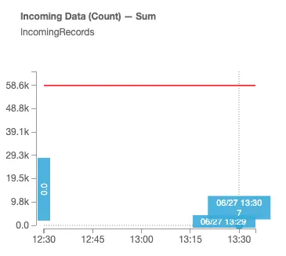

<script>defaultLanguages = ['producer']</script>

---

스프링 팀은 현재 커뮤니티의 도움을 받아 Spring Cloud Stream Kinesis 바인더를 유지보수하고 있다. 이 바인더 구현체에 대한 자세한 설명은 [spring-cloud/spring-cloud-stream-binder-aws-kinesis](https://github.com/spring-cloud/spring-cloud-stream-binder-aws-kinesis)에서 확인할 수 있다.

이 문서에선 Kinesis 바인더를 Spring Cloud Stream과 함께 사용하는 간단한 유스 케이스를 하나 리뷰해보겠다.

### 목차

- [Prerequisite](#prerequisite)
- [Applications](#applications)
- [Deployment](#deployment)
- [Results](#results)

---

## Prerequisite

데모에 필요한 유일한 요구 사항은 AWS 계정에서 모을 수 있는 credential `Access Key`, `Secret Key`, `Region`이다.

아니면 애플리케이션들을 AWS EC2 인스턴스로 직접 실행하기로 했다면, credential을 직접 명시하지 않아도 된다. 부트스트랩하는 동안 자동으로 발견해 설정될 거다.

---

## Applications

샘플 프로듀서, 컨슈머 애플리케이션은 [spring-cloud-dataflow-samples/kinesisdemo](https://github.com/spring-cloud/spring-cloud-dataflow-samples/tree/master/dataflow-website/recipes/kinesisdemo)에서 레포지토리를 클론받아 뒤에 나오는 실습 내용을 따라가도 된다.

2초 간격으로 새로운 랜덤 UUID를 생성하는 간단한 프로듀서로 시작해보자. UUID를 생성할때마다 Kinesis 스트림에 페이로드로 전송하며, 같은 Kinesis 스트림에 바인딩된 샘플 컨슈머는 이 페이로드를 컨슘해 결과를 로그에 남긴다.

다음은 이 프로듀서와 컨슈머 애플리케이션의 코드다:

<div class="switch-language-wrapper producer consumer">
<span class="switch-language producer">KinesisProducerApplication</span>
<span class="switch-language consumer">KinesisConsumerApplication</span>
</div>
<div class="language-only-for-producer producer consumer"></div>
```java
@EnableScheduling
@EnableBinding(Source.class)
@SpringBootApplication
public class KinesisProducerApplication {

	public static void main(String[] args) {
		SpringApplication.run(KinesisProducerApplication.class, args);
	}

	@Autowired
	private Source source;

	@Scheduled(fixedRate = 2000L)
	public void sendMessage() {
		UUID id = UUID.randomUUID();
		System.out.println("Before sending : " + id);
		source.output().send(MessageBuilder.withPayload(id).build());
		System.out.println("After sending : " + id);
	}
}
```
<div class="language-only-for-consumer producer consumer"></div>
```java
@EnableBinding(Sink.class)
@SpringBootApplication
public class KinesisConsumerApplication {

	public static void main(String[] args) {
		SpringApplication.run(KinesisConsumerApplication.class, args);
	}

	@StreamListener("input")
	public void input(String foo) {
		System.out.println("Hello: " + foo);
	}
}
```

> 두 애플리케이션 모두 클래스패스에 `spring-cloud-stream-binder-kinesis` 의존성이 있어야 한다. 자세한 내용은 [spring-cloud-dataflow-samples/kinesisdemo](https://github.com/spring-cloud/spring-cloud-dataflow-samples/tree/master/dataflow-website/recipes/kinesisdemo) 데모를 참고해라.

다음은 프로듀서와 컨슈머의 바인더 설정이다:

<div class="switch-language-wrapper producer consumer">
<span class="switch-language producer">KinesisProducer Configuration</span>
<span class="switch-language consumer">KinesisConsumer Configuration</span>
</div>
<div class="language-only-for-producer producer consumer"></div>
```yaml
spring:
  cloud:
    stream:
      bindings:
        output:
          destination: test-kinesis-stream
          content-type: text/plain

cloud:
  aws:
    credentials:
      accessKey: # <YOUR_ACCESS_KEY>
      secretKey: # <YOUR_SECRET_KEY>
    region:
      static: # <YOUR_REGION>
    stack:
      auto: false
```
<div class="language-only-for-consumer producer consumer"></div>
```yaml
spring:
  cloud:
    stream:
      bindings:
        input:
          destination: test-kinesis-stream
          group: test-kinesis-stream-group
          content-type: text/plain

cloud:
  aws:
    credentials:
      accessKey: # <YOUR_ACCESS_KEY>
      secretKey: # <YOUR_SECRET_KEY>
    region:
      static: # <YOUR_REGION>
    stack:
      auto: false
```

> `<YOUR_ACCESS_KEY>`, `<YOUR_SECRET_KEY>`, `<YOUR_REGION>`은 가지고 있는 credential 정보로 변경해야 한다.

---

## Deployment

AWS Kinesis로 테스트할 준비가 됐다면, 메이븐으로 빌드한 다음 프로듀서와 컨슈머 애플리케이션을 시작하면 된다.

클론받은 디렉토리에서 프로듀서를 시작해라:

```bash
java -jar kinesisproducer/target/kinesisproducer-0.0.1-SNAPSHOT.jar
```

클론받은 디렉토리에서 컨슈머를 시작해라:

```bash
java -jar kinesisconsumer/target/kinesisconsumer-0.0.1-SNAPSHOT.jar
```

---

## Results

Kinesis 스트림 `test-kinesis-stream`은 프로듀서 애플리케이션이 부트스트랩할 때 자동으로 생성되는 것을 확인할 수 있다.


두 애플리케이션을 모두 실행하고 나면 콘솔에 다음과 같은 로그가 출력되는 것을 볼 수 있을 거다.

프로듀서:


컨슈머:


7개의 레코드를 기록한 후에 애플리케이션을 중지했으므로, AWS 콘솔에 있는 모니터링 페이지에서도 Kinesis에서 7개의 레코드를 처리했음을 확인할 수 있다.

{: .center-image }

여기선 단순한 데모만 보여줬지만, Kinesis 바인더는 프로듀서와 컨슈머 양쪽 다 포괄적인 바인더 설정들을 제공한다 ([DynamoDB Streams](https://github.com/spring-cloud/spring-cloud-stream-binder-aws-kinesis/blob/master/spring-cloud-stream-binder-kinesis-docs/src/main/asciidoc/overview.adoc#dynamodb-streams)도 지원한다!). 자세한 내용은 [바인더 문서](https://github.com/spring-cloud/spring-cloud-stream-binder-aws-kinesis/blob/master/spring-cloud-stream-binder-kinesis-docs/src/main/asciidoc/overview.adoc#configuration-options)를 참고해라.