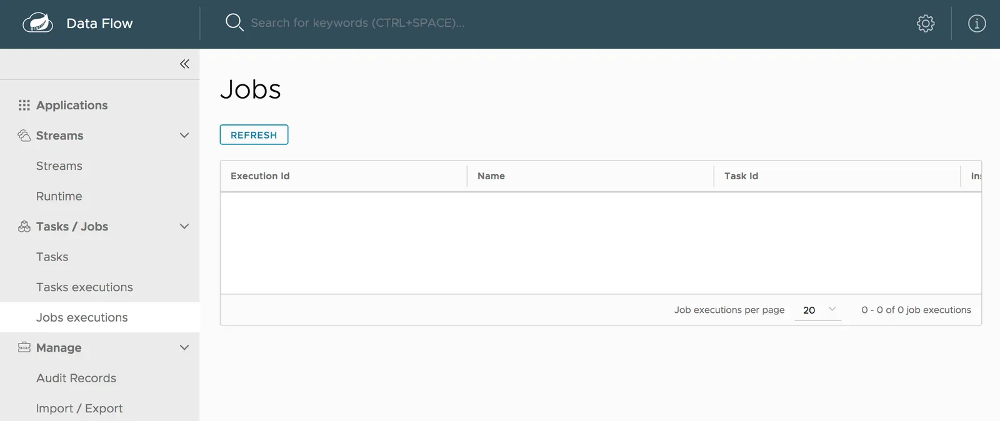

---

이 레시피에선 Spring Cloud Streams가 아닌 스프링 배치(및 Spring Cloud Task)만을 사용해 Spring Cloud Data Flow를 구성하는 방법을 다룬다. 이렇게 설정했을 때는 다른 기능은 없이 배치 job과 태스크를 제어하는 용도로 Spring Cloud Data Flow를 사용할 수 있다.

Spring Cloud Data Flow로 배치 job을 관리하는 자세한 방법은 [배치 개발자 가이드](../feature-guides.batch)를 참고해라.

### 목차

- [Prerequisites](#prerequisites)
  + [Installing the Server](#installing-the-server)
  + [Setting up Environment Variables](#setting-up-environment-variables)
  + [Running the Server](#running-the-server)
- [Viewing the Dashboard](#viewing-the-dashboard)
- [Using Spring Cloud Data Flow Shell](#using-spring-cloud-data-flow-shell)

---

## Prerequisites

Batch-only 모드에선 Spring Cloud Data Flow 서버만 있으면 된다. Spring Cloud Data Flow 쉘이나 Spring Cloud Skipper는 필요하지 않지만, 원한다면 계속 사용해도 상관은 없다.

Spring Cloud Data Flow를 배치 처리에 사용하되, 스트림 처리에는 사용하지 않으려면, Spring Cloud Data Flow 서버를 제어해줄 몇 가지 설정만 정의해주면 된다. 구체적으로는 다음과 같은 설정이 필요하다:

- 스트림 오케이스트레이션 기능을 끄기 위한 `SPRING_CLOUD_DATAFLOW_FEATURES_STREAMS_ENABLED=false`.
- 배치는 로컬 환경을 위한 스케줄링을 지원하지 않기 때문에, 스케줄링 기능을 끄기 위한 `SPRING_CLOUD_DATAFLOW_FEATURES_SCHEDULES_ENABLED=false`.
- 배치 처리를 활성화해줄 `SPRING_CLOUD_DATAFLOW_FEATURES_TASKS_ENABLED=true`.

배치 처리에선 외부 데이터 저장소가 필요하다. 외부 데이터 저장소를 세팅하려면 데이터베이스의 커넥션 설정을 명시해야 한다. 이런 세팅들은 다음 섹션에서 다룬다. 자세한 내용은 [메인 스프링 배치 개발자 가이드](../batch-developer-guides.batch-development.spring-batch-jobs#local)를 참고해라.

Spring Cloud Data Flow는 추가 설정 없이도 MySQL(MariaDB 드라이버 포함), HSQLDB, PostgreSQL을 지원한다. 다른 데이터베이스들도 설정을 추가해주면 사용할 수 있다. 자세한 내용은 [Spring Cloud Data Flow 레퍼런스 가이드](https://docs.spring.io/spring-cloud-dataflow/docs/2.5.0.BUILD-SNAPSHOT/reference/htmlsingle/#configuration-kubernetes-rdbms)를 참고해라.

### Installing the Server

아래 명령어를 실행해서 Spring Cloud Data Flow 서버를 설치해라:

```bash
wget https://repo.spring.io/release/org/springframework/cloud/spring-cloud-dataflow-server/2.9.1/spring-cloud-dataflow-server-2.9.1.jar
```

### Setting up Environment Variables

기능을 활성/비활성화하고 외부 데이터 저장소를 설정할 땐 환경 변수를 이용할 수 있다. 다음은 필수 환경 변수들을 설정하는 방법을 보여준다:

```bash
export SPRING_CLOUD_DATAFLOW_FEATURES_STREAMS_ENABLED=false
export SPRING_CLOUD_DATAFLOW_FEATURES_SCHEDULES_ENABLED=false
export SPRING_CLOUD_DATAFLOW_FEATURES_TASKS_ENABLED=true
export spring_datasource_url=jdbc:mariadb://localhost:3306/task
export spring_datasource_username=root
export spring_datasource_password=password
export spring_datasource_driverClassName=org.mariadb.jdbc.Driver
export spring_datasource_initialization_mode=always
```

주의: 스트리밍과 배치 처리를 모두 비활성화하면 안 된다. Spring Cloud Data Flow를 사용하려면 최소한 하나는 활성화해야 한다.

아직 `task`라는 데이터베이스가 없다면 새로 하나를 만들어야 한다. 아니면 태스크를 저장하고 있는 데이터베이스가 있다면, 데이터 소스 URL에 있는 db명을 해당 데이터베이스 이름으로 변경하면 된다.

여기서는 시연을 위해 `root`와 `password`를 username, password로 사용한다. 실제 애플리케이션에선 절대 이렇게 사용하면 안 된다.

### Running the Server

환경 변수에 세부 설정 정보를 세팅하고서 다음 명령어를 실행하면 Spring Cloud Data Flow Server를 batch-only 모드로 시작할 수 있다:

```bash
java -jar spring-cloud-dataflow-server-2.9.1.jar
```

---

## Viewing the Dashboard

서버가 기동되고 나서 웹 브라우저로 `http://localhost:9393/dashboard`에 접속하면 Spring Cloud Data Flow 대시보드를 조회할 수 있다. 여기에서 배치 job을 생성하고 관리하면 된다. 자세한 방법은 [배치 피쳐 가이드](../feature-guides.batch) 토픽들을 참고해라. 다음은 배치 job을 추가할 수 있는 Spring Cloud Data Flow 대시보드의 jobs 페이지를 보여주는 이미지다:



---

## Using Spring Cloud Data Flow Shell

Spring Cloud Data Flow 쉘을 이용할 수도 있다. 쉘에 관한 자세한 정보는 [Tooling 페이지에서 쉘 토픽](../concepts.tooling#shell)을 확인해봐라.