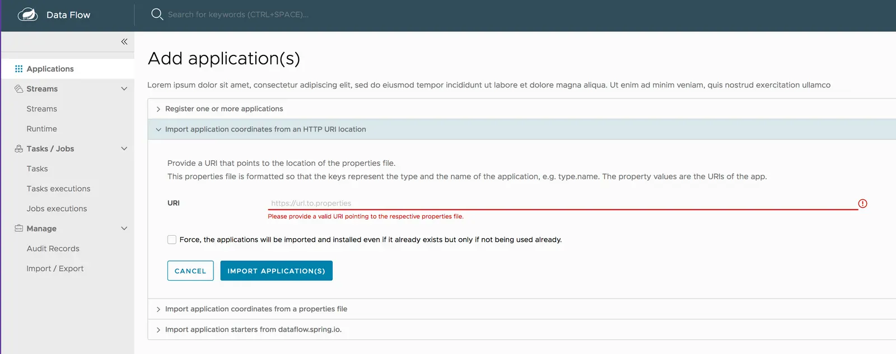

---

> 이 페이지엔 `stream-applications`의 2.x 버전(Einstein.SR9)에 관한 정보가 담겨 있으며, 최신 (2020.0.0 +) 릴리즈와는 호환되지 않는다. 최신 릴리즈에 대한 정보를 찾고 있다면 [pre-packaged applications](../applications.pre-packaged)를 읽어보면 된다.

스프링 팀은 애플리케이션들을 선별해서 미리 패키징해 제공하고 있기 때문에, 이 애플리케이션들을 이용해 다양한 데이터를 통합하고 파이프라인을 조합해서 프로덕션용 Spring Cloud Data Flow를 개발하고, 학습하고, 실험해볼 수 있다.

### 목차

- [Getting Started](#getting-started)
- [Stream Applications](#stream-applications)
- [Task Applications](#task-applications)
- [Bulk Registration of Stream Applications](#bulk-registration-of-stream-applications)

---

## Getting Started

> 기존 데이터 파이프라인에서 `3.x` 애플리케이션을 사용하도록 업그레이드하고 싶다면 [마이그레이션 가이드](../applications.migration)를 읽어봐라.

미리 패키징해서 제공하는 스트리밍 애플리케이션들은 모두:

- 아파치 메이븐 아티팩트 또는 도커 이미지로 사용할 수 있다.
- RabbitMQ나 아파치 카프카를 사용한다.
- [프로메테우스](https://prometheus.io/)와 [InfluxDB](https://www.influxdata.com/)를 이용한 모니터링을 지원한다.
- UI와 쉘의 코드 자동 완성에 사용되는 애플리케이션 프로퍼티 메타데이터를 가지고 있다.

스트림, 태스크 애플리케이션들은  Data Flow UI나 쉘을 사용해서 등록하면 된다.

`app register` 명령어를 사용하면 애플리케이션들을 개별적으로 등록할 수 있고, `app import` 명령어를 사용하면 벌크로 등록할 수 있다.

스트림 애플리케이션을 등록할 땐, 카프카와 RabbitMQ 중 어떤 것을 사용하는지에 따라 그에 맞는 URL을 사용하면 된다:

**Kafka**

- Docker: [https://dataflow.spring.io/kafka-docker-einstein](https://dataflow.spring.io/)
- Maven: [https://dataflow.spring.io/kafka-maven-einstein](https://dataflow.spring.io/)

**RabbitMQ**

- Docker: [https://dataflow.spring.io/rabbitmq-docker-einstein](https://dataflow.spring.io/)
- Maven: [https://dataflow.spring.io/rabbitmq-maven-einstein](https://dataflow.spring.io/)

태스크 애플리케이션은 아래 URL을 사용하면 된다:

- Docker: https://dataflow.spring.io/task-docker-latest
- Maven: https://dataflow.spring.io/task-maven-latest

Data Flow UI에선 아래 이미지에 보이는 것처럼 기본 링크가 미리 채워져 있다:



Data Flow 쉘을 사용한다면, 아래 예시처럼 애플리케이션을 벌크로 임포트하고 등록하면 된다:

```bash
dataflow:>app import --uri https://dataflow.spring.io/kafka-maven-latest
```

> 벌크로 등록할 때 사용하는 `latest` 버전 링크는 릴리즈할 때마다 업데이트된다. 특정 릴리즈 버전을 사용하는 애플리케이션을 위한 별도 [벌크 등록](#bulk-registration-of-stream-applications) 링크도 제공하고 있다.

---

## Stream Applications

스프링 팀이 [스트림 애플리케이션](https://spring.io/projects/spring-cloud-stream-applications#learn)을 개발하고 관리할 땐 보통, 주요 스프링 부트 릴리즈나 Spring Cloud Stream 릴리즈에 일정을 맞춰서 진행한다. 이 애플리케이션들은 [스프링 public 메이븐 레포지토리](https://repo.spring.io/release/org/springframework/cloud/stream/app/)와 [도커허브](https://hub.docker.com/u/springcloudstream)에 올라간다. 미리 패키징해서 제공하는 스트림 애플리케이션은 결국 특정한 바인더 구현체를 사용해 빌드한 스프링 부트 executable jar다. 모든 스트림 앱은 RabbitMQ와 카프카를 사용하는 executable 애플리케이션을 별도로 나눠서 제공한다.

다음은 현재 사용할 수 있는 스트림 애플리케이션들을 정리한 테이블이다:

| Source                                                       | Processor                                                    | Sink                                                         |
| ------------------------------------------------------------ | ------------------------------------------------------------ | ------------------------------------------------------------ |
| [cdc-debezium](https://docs.spring.io/spring-cloud-stream-app-starters/docs/current/reference/htmlsingle/#spring-cloud-stream-modules-cdc-debezium-source) | [aggregator](https://docs.spring.io/spring-cloud-stream-app-starters/docs/current/reference/htmlsingle/#spring-cloud-stream-modules-aggregator-processor) | [cassandra](https://docs.spring.io/spring-cloud-stream-app-starters/docs/current/reference/htmlsingle/#spring-cloud-stream-modules-cassandra-sink) |
| [file](https://docs.spring.io/spring-cloud-stream-app-starters/docs/current/reference/htmlsingle/#spring-cloud-stream-modules-file-source) | [bridge](https://docs.spring.io/spring-cloud-stream-app-starters/docs/current/reference/htmlsingle/#spring-cloud-stream-modules-bridge-processor) | [counter](https://docs.spring.io/spring-cloud-stream-app-starters/docs/current/reference/htmlsingle/#spring-cloud-stream-modules-counter-sink) |
| [ftp](https://docs.spring.io/spring-cloud-stream-app-starters/docs/current/reference/htmlsingle/#spring-cloud-stream-modules-ftp-source) | [counter](https://docs.spring.io/spring-cloud-stream-app-starters/docs/current/reference/htmlsingle/#spring-cloud-stream-modules-counter-processor) | [file](https://docs.spring.io/spring-cloud-stream-app-starters/docs/current/reference/htmlsingle/#spring-cloud-stream-modules-file-sink) |
| [gemfire](https://docs.spring.io/spring-cloud-stream-app-starters/docs/current/reference/htmlsingle/#spring-cloud-stream-modules-gemfire-source) | [filter](https://docs.spring.io/spring-cloud-stream-app-starters/docs/current/reference/htmlsingle/#spring-cloud-stream-modules-filter-processor) | [ftp](https://docs.spring.io/spring-cloud-stream-app-starters/docs/current/reference/htmlsingle/#spring-cloud-stream-modules-ftp-sink) |
| [gemfire-cq](https://docs.spring.io/spring-cloud-stream-app-starters/docs/current/reference/htmlsingle/#spring-cloud-stream-modules-gemfire-cq-source) | [groovy-filter](https://docs.spring.io/spring-cloud-stream-app-starters/docs/current/reference/htmlsingle/#spring-cloud-stream-modules-groovy-filter-processor) | [gemfire](https://docs.spring.io/spring-cloud-stream-app-starters/docs/current/reference/htmlsingle/#spring-cloud-stream-modules-gemfire-sink) |
| [http](https://docs.spring.io/spring-cloud-stream-app-starters/docs/current/reference/htmlsingle/#spring-cloud-stream-modules-http-source) | [groovy-transform](https://docs.spring.io/spring-cloud-stream-app-starters/docs/current/reference/htmlsingle/#spring-cloud-stream-modules-groovy-transform-processor) | [hdfs](https://docs.spring.io/spring-cloud-stream-app-starters/docs/current/reference/htmlsingle/#spring-cloud-stream-modules-hdfs-sink) |
| [jdbc](https://docs.spring.io/spring-cloud-stream-app-starters/docs/current/reference/htmlsingle/#spring-cloud-stream-modules-jdbc-source) | [grpc](https://docs.spring.io/spring-cloud-stream-app-starters/docs/current/reference/htmlsingle/#spring-cloud-stream-modules-grpc-processor) | [jdbc](https://docs.spring.io/spring-cloud-stream-app-starters/docs/current/reference/htmlsingle/#spring-cloud-stream-modules-jdbc-sink) |
| [jms](https://docs.spring.io/spring-cloud-stream-app-starters/docs/current/reference/htmlsingle/#spring-cloud-stream-modules-jms-source) | [header-enricher](https://docs.spring.io/spring-cloud-stream-app-starters/docs/current/reference/htmlsingle/#spring-cloud-stream-modules-header-enricher-processor) | [log](https://docs.spring.io/spring-cloud-stream-app-starters/docs/current/reference/htmlsingle/#spring-cloud-stream-modules-log-sink) |
| [load-generator](https://docs.spring.io/spring-cloud-stream-app-starters/docs/current/reference/htmlsingle/#spring-cloud-stream-modules-load-generator-source) | [httpclient](https://docs.spring.io/spring-cloud-stream-app-starters/docs/current/reference/htmlsingle/#spring-cloud-stream-modules-httpclient-processor) | [mongodb](https://docs.spring.io/spring-cloud-stream-app-starters/docs/current/reference/htmlsingle/#spring-cloud-stream-modules-mongodb-sink) |
| [loggregator](https://docs.spring.io/spring-cloud-stream-app-starters/docs/current/reference/htmlsingle/#spring-cloud-stream-modules-loggregator-source) | [image-recognition](https://docs.spring.io/spring-cloud-stream-app-starters/docs/current/reference/htmlsingle/#spring-cloud-stream-modules-image-recognition-processor) | [mqtt](https://docs.spring.io/spring-cloud-stream-app-starters/docs/current/reference/htmlsingle/#spring-cloud-stream-modules-mqtt-sink) |
| [mail](https://docs.spring.io/spring-cloud-stream-app-starters/docs/current/reference/htmlsingle/#spring-cloud-stream-modules-mail-source) | [object-detection](https://docs.spring.io/spring-cloud-stream-app-starters/docs/current/reference/htmlsingle/#spring-cloud-stream-modules-object-detection-processor) | [pgcopy](https://docs.spring.io/spring-cloud-stream-app-starters/docs/current/reference/htmlsingle/#spring-cloud-stream-modules-pgcopy-sink) |
| [mongodb](https://docs.spring.io/spring-cloud-stream-app-starters/docs/current/reference/htmlsingle/#spring-cloud-stream-modules-mongodb-source) | [pmml](https://docs.spring.io/spring-cloud-stream-app-starters/docs/current/reference/htmlsingle/#spring-cloud-stream-modules-pmml-processor) | [rabbit](https://docs.spring.io/spring-cloud-stream-app-starters/docs/current/reference/htmlsingle/#spring-cloud-stream-modules-rabbit-sink) |
| [mqtt](https://docs.spring.io/spring-cloud-stream-app-starters/docs/current/reference/htmlsingle/#spring-cloud-stream-modules-mqtt-source) | [pose-estimation](https://docs.spring.io/spring-cloud-stream-app-starters/docs/current/reference/htmlsingle/#spring-cloud-stream-modules-pose-estimation-processor) | [redis-pubsub](https://docs.spring.io/spring-cloud-stream-app-starters/docs/current/reference/htmlsingle/#spring-cloud-stream-modules-redis-pubsub-sink) |
| [rabbit](https://docs.spring.io/spring-cloud-stream-app-starters/docs/current/reference/htmlsingle/#spring-cloud-stream-modules-rabbit-source) | [python-http](https://docs.spring.io/spring-cloud-stream-app-starters/docs/current/reference/htmlsingle/#spring-cloud-stream-modules-python-http-processor) | [router](https://docs.spring.io/spring-cloud-stream-app-starters/docs/current/reference/htmlsingle/#spring-cloud-stream-modules-router-sink) |
| [s3](https://docs.spring.io/spring-cloud-stream-app-starters/docs/current/reference/htmlsingle/#spring-cloud-stream-modules-s3-source) | [python-jython](https://docs.spring.io/spring-cloud-stream-app-starters/docs/current/reference/htmlsingle/#spring-cloud-stream-modules-python-jython-processor) | [s3](https://docs.spring.io/spring-cloud-stream-app-starters/docs/current/reference/htmlsingle/#spring-cloud-stream-modules-s3-sink) |
| [sftp](https://docs.spring.io/spring-cloud-stream-app-starters/docs/current/reference/htmlsingle/#spring-cloud-stream-modules-sftp-source) | [scriptable-transform](https://docs.spring.io/spring-cloud-stream-app-starters/docs/current/reference/htmlsingle/#spring-cloud-stream-modules-scriptable-transform-processor) | [sftp](https://docs.spring.io/spring-cloud-stream-app-starters/docs/current/reference/htmlsingle/#spring-cloud-stream-modules-sftp-sink) |
| [sftp-dataflow](https://docs.spring.io/spring-cloud-stream-app-starters/docs/current/reference/htmlsingle/#spring-cloud-stream-modules-sftp-dataflow-source) | [splitter](https://docs.spring.io/spring-cloud-stream-app-starters/docs/current/reference/htmlsingle/#spring-cloud-stream-modules-splitter-processor) | [task-launcher-dataflow](https://docs.spring.io/spring-cloud-stream-app-starters/docs/current/reference/htmlsingle/#spring-cloud-stream-modules-task-launcher-dataflow-sink) |
| [syslog](https://docs.spring.io/spring-cloud-stream-app-starters/docs/current/reference/htmlsingle/#spring-cloud-stream-modules-syslog-source) | [tasklaunchrequest-transform](https://docs.spring.io/spring-cloud-stream-app-starters/docs/current/reference/htmlsingle/#spring-cloud-stream-modules-tasklaunchrequest-transform-processor) | [tcp](https://docs.spring.io/spring-cloud-stream-app-starters/docs/current/reference/htmlsingle/#spring-cloud-stream-modules-tcp-sink) |
| [tcp](https://docs.spring.io/spring-cloud-stream-app-starters/docs/current/reference/htmlsingle/#spring-cloud-stream-modules-tcp-source) | [tcp-client](https://docs.spring.io/spring-cloud-stream-app-starters/docs/current/reference/htmlsingle/#spring-cloud-stream-modules-tcp-client-processor) | [throughput](https://docs.spring.io/spring-cloud-stream-app-starters/docs/current/reference/htmlsingle/#spring-cloud-stream-modules-throughput-sink) |
| [tcp-client](https://docs.spring.io/spring-cloud-stream-app-starters/docs/current/reference/htmlsingle/#spring-cloud-stream-modules-tcp-client-source) | [tensorflow](https://docs.spring.io/spring-cloud-stream-app-starters/docs/current/reference/htmlsingle/#spring-cloud-stream-modules-tensorflow-processor) | [websocket](https://docs.spring.io/spring-cloud-stream-app-starters/docs/current/reference/htmlsingle/#spring-cloud-stream-modules-websocket-sink) |
| [time](https://docs.spring.io/spring-cloud-stream-app-starters/docs/current/reference/htmlsingle/#spring-cloud-stream-modules-time-source) | [transform](https://docs.spring.io/spring-cloud-stream-app-starters/docs/current/reference/htmlsingle/#spring-cloud-stream-modules-transform-processor) |                                                              |
| [trigger](https://docs.spring.io/spring-cloud-stream-app-starters/docs/current/reference/htmlsingle/#spring-cloud-stream-modules-trigger-source) | [twitter-sentiment](https://docs.spring.io/spring-cloud-stream-app-starters/docs/current/reference/htmlsingle/#spring-cloud-stream-modules-twitter-sentiment-processor) |                                                              |
| [triggertask](https://docs.spring.io/spring-cloud-stream-app-starters/docs/current/reference/htmlsingle/#spring-cloud-stream-modules-triggertask-source) |                                                              |                                                              |
| [twitterstream](https://docs.spring.io/spring-cloud-stream-app-starters/docs/current/reference/htmlsingle/#spring-cloud-stream-modules-twitterstream-source) |                                                              |                                                              |

---

## Task Applications

스프링 팀이 [태스크/배치 애플리케이션](https://cloud.spring.io/spring-cloud-task-app-starters/)을 개발하고 관리할 땐 보통, 주요 스프링 부트 릴리즈나 Spring Cloud Task, 스프링 배치 릴리즈에 일정을 맞춰서 계획한다. 이 애플리케이션들은 [스프링 public 메이븐 레포지토리](https://hub.docker.com/u/springcloudtask)와 [도커허브](https://hub.docker.com/u/springcloudstream)에 올라간다.

현재 사용할 수 있는 태스크와 배치 애플리케이션들은 다음과 같다:

[timestamp](https://docs.spring.io/spring-cloud-task-app-starters/docs/current/reference/htmlsingle/#spring-cloud-task-modules-tasks)
[timestamp-batch](https://docs.spring.io/spring-cloud-task-app-starters/docs/current/reference/htmlsingle/#_timestamp_batch_task)

---

## Bulk Registration of Stream Applications

Spring Cloud Data Flow에선 표준 properties 파일을 이용해 애플리케이션을 벌크 등록할 수 있다. 편의를 위해 기본 제공하는 모든 스트림, 태스크/배치 앱들의 애플리케이션 URI(메이븐이나 도커 전용)를 가지고 있는 스태틱 프로퍼티 파일도 게시하고 있으므로, 바로 활용해도 좋다. 이 파일을 사용하면 모든 애플리케이션 URI를 한 번에 등록할 수 있다. 아니면 개별적으로 등록해도 되고, 필요한 애플리케이션 URI만 들어있는 자체 커스텀 프로퍼티 파일을 만들어도 된다. SCDF를 처음 시작할 때는 앱들을 벌크로 등록해서 쓰면 편리할 거다. 너무 복잡하게 가기보단, 커스텀 프로퍼티 파일을 만들어 필요한 애플리케이션 URI 목록만 "집중해서" 관리하는 것을 권장한다.