---

Spring Cloud Data Flow를 사용하면 단일 인스턴스로 애플리케이션 기동을 다양한 플랫폼으로 조율<sup>orchestration</sup>할 수 있다. 여기서 말하는 플랫폼은 애플리케이션을 기동시킬 수 있는 위치를 말한다. 이 문서에선 쿠버네티스 클러스터와 네임스페이스, 클라우드 파운드리 organization와 space, 또는 물리적인 서버를 의미한다. 이 문서에선 멀티 플랫폼 배포라는 혜택을 누리는 방법을 몇 가지 소개한다.

### 목차

- [Launching Tasks Across Multiple Kubernetes Name Spaces](#launching-tasks-across-multiple-kubernetes-name-spaces)
  + [Configuring Spring Cloud Data Flow and Setting up the Environment](#configuring-spring-cloud-data-flow-and-setting-up-the-environment)
  + [Registering Pre-built Tasks](#registering-pre-built-tasks)
  + [Create Task Definitions](#create-task-definitions)
  + [Launching Tasks](#launching-tasks)
  + [Scheduling Tasks](#scheduling-tasks)
- [Launching Tasks Across Multiple Platforms from an External Spring Cloud Data Flow](#launching-tasks-across-multiple-platforms-from-an-external-spring-cloud-data-flow)
  + [Configuring Spring Cloud Data Flow](#configuring-spring-cloud-data-flow)
  + [Configuring Database Service in Kubernetes to Connect to an External Database](#configuring-database-service-in-kubernetes-to-connect-to-an-external-database)
  + [Registering Applications](#registering-applications)
  + [Launching Tasks](#launching-tasks-1)
  + [Scheduling Tasks](#scheduling-tasks-1)
- [Launching Tasks on Different Types of Platforms](#launching-tasks-on-different-types-of-platforms)
  + [Configuring Spring Cloud Data Flow](#configuring-spring-cloud-data-flow-1)
  + [Registering Applications](#registering-applications-1)
  + [Create Task Definitions](#create-task-definitions-1)
  + [Launching Tasks](#launching-tasks-2)
  + [Scheduling Tasks](#scheduling-tasks-2)

---

## Launching Tasks Across Multiple Kubernetes Name Spaces

다음은 태스크를 여러 가지 네임스페이스에서 기동시키는 모습을 나타낸 이미지다:

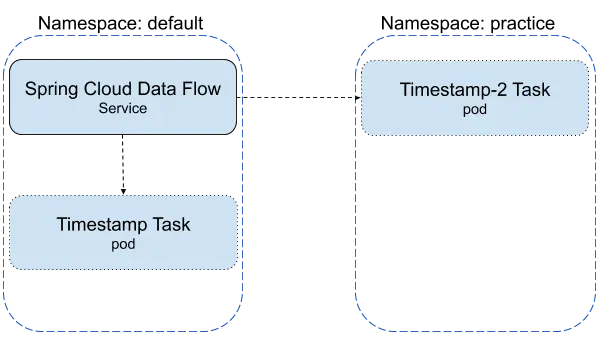

여기선 Spring Cloud Data Flow는 쿠버네티스 클러스터의 default 네임스페이스에서 실행 중이며, 태스크를 기동시킬 땐 default 네임스페이스와 practice 네임스페이스 두 곳을 사용하려 한다. 여기서 실습해볼 때는 SCDF에서 제공하는 YAML 파일을 이용해 Minikube 환경에 Spring Cloud Data Flow를 배포한다.

### Configuring Spring Cloud Data Flow and Setting up the Environment

1. [kubectl로 배포하기](../installation.kubernetes.kubectl)에서 설명하고 있는 방법대로 SCDF 레포지토리를 다운로드한다. 하지만 여기서는 [메세지 브로커 선택하기](../installation.kubernetes.kubectl/#choose-a-message-broker) 섹션으로 넘어가기 전에 먼저 네임스페이스를 생성하고 Spring Cloud Data Flow에 플랫폼 설정을 추가해줘야 한다.

2. 아래 명령어를 실행해서 `practice` 네임스페이스를 생성한다 (`default`는 이미 만들어져 있다):

```sh
kubectl create namespace practice
```

{:start="3"}
3. Spring Cloud Data Flow에서 사용할 플랫폼들을 설정한다. 텍스트 편집기로 `<SCDF Dir>/src/kubernetes/server/server-deployment.yaml` 파일을 열고 `SPRING_APPLICATION_JSON` 프로퍼티 값을 다음과 같이 변경한다:

```yaml
- name: SPRING_APPLICATION_JSON
  value: '{ "maven": { "local-repository": null, "remote-repositories": { "repo1": { "url": "https://repo.spring.io/libs-snapshot"} } },"spring.cloud.dataflow.task":{"platform.kubernetes.accounts":{"default":{"namespace" : "default"},"practice":{"namespace" : "practice"}}} }'
```

{:start="4"}
4. [메세지 브로커 선택하기](../installation.kubernetes.kubectl/#choose-a-message-broker)로 넘어가 가이드를 따라 모든 스텝을 완료해라.

5. Spring Cloud Data Flow로 멀티 네임스페이스에서 태스크를 시작하려면, Spring Cloud Data Flow 서비스에 대한 RBAC 정책을 업데이트해야 한다. 아래 명령어를 실행하면 된다:

```sh
kubectl create clusterrolebinding scdftestrole --clusterrole cluster-admin --user=system:serviceaccount:default:scdf-sa
```

> 여기서는 `scdf-sa` 사용자의 클러스터 롤을 `cluster-admin`으로 설정하고 있다. 프로덕션에 권장하는 설정은 아니지만 여기서는 단순히 시연을 위해 보여준다.

### Registering Pre-built Tasks

여기에선 Spring Cloud Data Flow가 미리 빌드해서 제공하는 timestamp 애플리케이션을 사용해 실습해볼 거다. 기본 제공하는 태스크 애플리케이션들을 아직 등록하지 않았다면:

1. 브라우저에서 Spring Cloud Data Flow UI를 띄운다.
2. 페이지 왼편에 있는 **Applications** 탭을 클릭한다.
3. 페이지 상단에 있는 **ADD APPLICATION(S)** 버튼을 클릭한다.
   
4. **Add Applications(s)** 페이지가 뜨면 `Import application starters from dataflow.spring.io.` 옵션을 클릭한다.
   
5. 라디오 버튼에서 **Task application starters for Docker**를 클릭한다.
   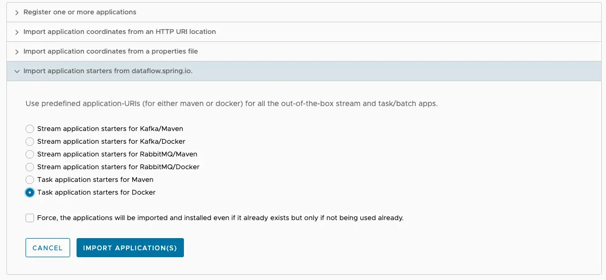
6. 페이지 하단에서 **IMPORT APPLICATION(S)** 버튼을 클릭한다.

### Create Task Definitions

이 섹션에선 두 가지 태스크 정의 `timestamp-task`, `timestamp-task-2`를 만들어본다. 정의한 태스크는 각각 다른 플랫폼에서 기동시켜볼 거다.

`timestamp-task` 정의를 생성하려면:

1. UI 왼편에 있는 **Tasks** 탭을 클릭한다.
   
2. 페이지에 있는 **CREATE TASK** 버튼을 클릭한다.
3. 텍스트 상자에 `timestamp`를 입력한다.
4. **CREATE TASK** 버튼을 클릭한다.
   
5. **Create Task** 대화 상자가 뜨면 **Name** 필드에 `timestamp-task`를 입력한다.
6. **CREATE THE TASK** 버튼을 클릭한다.
   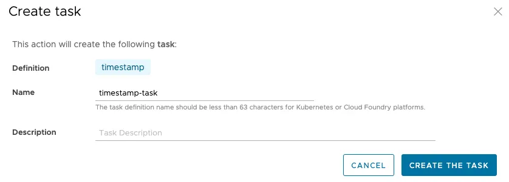

앞에서 보여준 `timestamp-task` 가이드와 동일하게 `timestamp-task-2` 정의를 생성해라. 단, 이때는 `Create Task` 대화 상자가 뜨면 이름에 `timestamp-task-2`를 입력한다.

이제 다음과 같이 두 가지 태스크 정의가 생성된 것을 확인할 수 있다:


### Launching Tasks

이 섹션에선 default 플랫폼에서 `timestamp-task`를 실행한 다음 practice 플랫폼에서 `timestamp-task-2`를 실행해볼 거다. 그러려면:

1. 태스크 정의 `timestamp-task` 옆에 있는 옵션 컨트롤을 클릭하고 **Launch** 옵션을 선택한다.
   
2. 이제 `timestamp-task`를 실행할 플랫폼을 선택한다 (`default` 네임스페이스).
   
3. 페이지 하단에 있는 **LAUNCH THE TASK** 버튼을 클릭한다.

포드가 잘 실행됐는지 검증하려면 task execution 페이지에서 결과를 확인해보거나, 아래 `kubectl` 명령어를 실행해 `default` 네임스페이스에 있는 포드들을 조회해보면 된다:

```sh
kubectl get pods --namespace default
NAME                         READY   STATUS      RESTARTS   AGE
mysql-b94654bd4-k8vr7        1/1     Running     1          7h38m
rabbitmq-545bb5b7cb-dn5rd    1/1     Running     39         124d
scdf-server-dff599ff-68949   1/1     Running     0          8m27s
skipper-6b4d48ddc4-9p2x7     1/1     Running     0          12m
timestamp-task-v9jrm66p55    0/1     Completed   0          87s
```

`practice` 네임스페이스에서 태스크를 실행하려면:

1. `timestamp-task-2` 태스크 정의 옆에 있는 옵션 컨트롤을 클릭하고 **Launch** 옵션을 선택한다.
   
2. `timestamp-task-2`를 실행할 플랫폼을 선택한다 (`practice` 네임스페이스).
   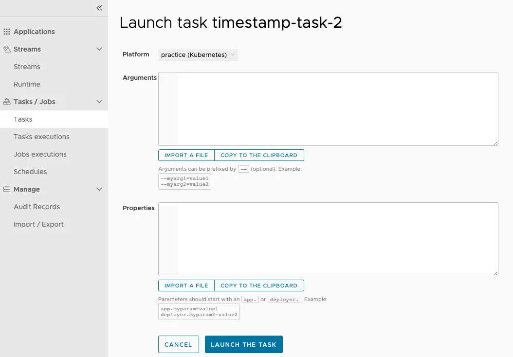
3. 페이지 하단에 있는 **LAUNCH THE TASK** 버튼을 클릭한다.

포드가 잘 실행됐는지 검증하려면 task execution 페이지에서 결과를 확인해보거나, 아래 `kubectl` 명령어를 실행해 `practice` 네임스페이스에 있는 포드들을 조회해보면 된다:

```sh
kubectl get pods --namespace practice
NAME                          READY   STATUS      RESTARTS   AGE
timestamp-task-2-nwvk4r89vy   0/1     Completed   0          59s
```

### Scheduling Tasks

이 섹션에선 두 가지 스케줄을 각각 다른 플랫폼에 생성해본다. 먼저 Spring Cloud Data Flow의 쉘을 이용해 `default` 플랫폼에서 1분에 한 번씩 `timestamp-task`를 시작하는 스케줄을 만들어보자. 그러려면:

1. Spring Cloud Data Flow 쉘에서 아래 명령어를 실행해 태스크를 예약한다:

```sh
task schedule create --name timestamp-task-sched --definitionName timestamp-task --expression "*/1 * * * *" --platform default
```

다음과 같은 문구가 보일 거다:

```sh
dataflow:>task schedule create --name timestamp-task-sched --definitionName timestamp-task --expression "*/1 * * * *" --platform default
Created schedule 'timestamp-task-sched'
```

{:start="2"}
2. `task schedule list --platform default` 명령어를 실행해 스케줄이 잘 생성되었는지 확인해보자:

```sh
dataflow:>task schedule list --platform default
╔════════════════════╤════════════════════╤════════════════════════════════════════════════════╗
║   Schedule Name    │Task Definition Name│                     Properties                     ║
╠════════════════════╪════════════════════╪════════════════════════════════════════════════════╣
║timestamp-task-sched│timestamp-task      │spring.cloud.scheduler.cron.expression = */1 * * * *║
╚════════════════════╧════════════════════╧════════════════════════════════════════════════════╝
```

{:start="3"}
3. CronJob이 예약한 애플리케이션을 정상적으로 생성하고 실행했는지 검증하려면, SCDF 쉘에서 `task execution list`를 실행해 결과를 확인해보면 된다 (아니면 아래 있는 `kubectl` 명령어를 실행해서 1분 뒤에 `timestamp-task-sched` 포드가 나타나는지 확인해봐도 된다):

```sh
kubectl get pods --namespace default
NAME                                    READY   STATUS      RESTARTS   AGE
mysql-b94654bd4-k8vr7                   1/1     Running     1          29h
rabbitmq-545bb5b7cb-dn5rd               1/1     Running     39         125d
scdf-server-845879c9b7-xs8t6            1/1     Running     3          4h45m
skipper-6b4d48ddc4-bkvph                1/1     Running     0          4h48m
timestamp-task-sched-1591904880-p48cx   0/1     Completed   0          33s
```

{:start="4"}
4. 스케줄을 삭제하려면 아래 명령어를 실행해라:

```sh
dataflow:>task schedule destroy --name timestamp-task-sched --platform default
Deleted task schedule 'timestamp-task-sched'
```

이번에는 Spring Cloud Data Flow 쉘을 이용해 `practice` 플랫폼에서 1분에 한 번씩 `timestamp-task-2`를 시작하는 스케줄을 만들어보자.

1. Spring Cloud Data Flow 쉘에서 아래 명령어를 실행해 태스크를 예약한다:

```sh
task schedule create --name timestamp-task-2-sched --definitionName timestamp-task --expression "*/1 * * * *" --platform practice
```

다음과 같은 문구가 보일 거다:

```sh
dataflow:>task schedule create --name timestamp-task-2-sched --definitionName timestamp-task --expression "*/1 * * * *" --platform practice
Created schedule 'timestamp-task-2-sched'
```

{:start="2"}
2. `task schedule list --platform practice` 명령어를 실행해 스케줄이 잘 생성되었는지 확인해보자:

```sh
dataflow:>task schedule list --platform practice
╔══════════════════════╤════════════════════╤════════════════════════════════════════════════════╗
║    Schedule Name     │Task Definition Name│                     Properties                     ║
╠══════════════════════╪════════════════════╪════════════════════════════════════════════════════╣
║timestamp-task-2-sched│timestamp-task-2    │spring.cloud.scheduler.cron.expression = */1 * * * *║
╚══════════════════════╧════════════════════╧════════════════════════════════════════════════════╝
```

{:start="3"}
3. SCDF 쉘에서 `task execution list`를 실행해 결과를 확인해보면 된다. 아니면 아래 있는 `kubectl` 명령어를 실행해봐도 된다:

```sh
glennrenfro ~/scripts: kubectl get pods --namespace practice
NAME                                      READY   STATUS      RESTARTS   AGE
timestamp-task-2-sched-1591905600-rnfks   0/1     Completed   0          17s
```

{:start="4"}
4. 스케줄을 삭제하려면 아래 명령어를 실행해라:

```sh
dataflow:>task schedule destroy --name timestamp-task-2-sched --platform practioce
Deleted task schedule 'timestamp-task-2-sched'
```

---

## Launching Tasks Across Multiple Platforms from an External Spring Cloud Data Flow

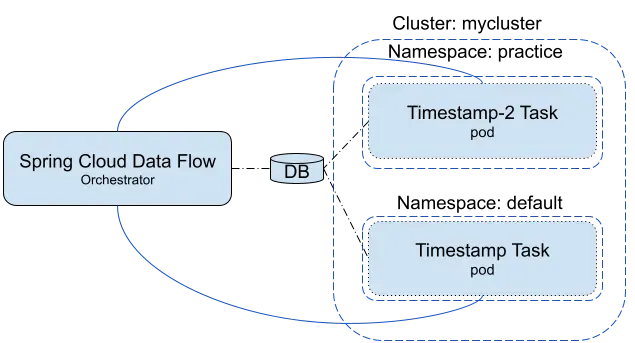

이번엔 Spring Cloud Data Flow와 Spring Cloud Data Flow의 데이터 스토어 자체는 쿠버네티스 클러스터 밖에서 실행 중이다. 태스크를 기동시킬 땐 default 네임스페이스와 practice 네임스페이스 두 곳을 사용하면서, 태스크 실행 내역은 SCDF로 모니터링하려고 한다.

### Configuring Spring Cloud Data Flow

이 실습 내용을 따라해보려면 쉘에 액세스할 수 있어야 한다. 아래와 같이 환경 프로퍼티를 설정한 뒤 Spring Cloud Data Flow를 실행시켜라:

```sh
export spring_datasource_url=<your database url>
export spring_datasource_username=<your username>
export spring_datasource_password=<your password>
export spring_datasource_driverClassName=<your driverClassName>
export spring_profiles_active=cloud
export jbp_config_spring_auto_reconfiguration='{enabled: false}'
export spring_cloud_dataflow_features_schedulesEnabled=true
export spring_cloud_dataflow_features_tasks_enabled=true
export SPRING_APPLICATION_JSON="{\"spring.cloud.dataflow.task\":{\"platform.local.accounts\":{\"default\":{\"timeout\" : \"60\"}},\"platform.kubernetes.accounts\":{\"kzone\":{\"namespace\" : \"default\"},\"practice\":{\"namespace\" : \"practice\"}}}}"

java -jar spring-cloud-dataflow-server/target/spring-cloud-dataflow-server-<version>.jar
```

### Configuring Database Service in Kubernetes to Connect to an External Database

이번 실습에서 실행시켜볼 태스크는, SCDF에서 사용 중인 외부 데이터베이스에 연결된 데이터베이스 서비스에 접근할 수 있어야 한다. 이를 위해 데이터베이스 서비스와 외부 데이터베이스를 참조하는 엔드포인트를 생성해보자. 이 예시에선 MySql 데이터베이스에 연결한다.

1. 데이터베이스 서비스를 세팅한다:

```yaml
apiVersion: v1
kind: Service
metadata:
  name: mysql-mac
spec:
  ports:
    - protocol: TCP
      port: 1443
      targetPort: 3306
```

{:start="2"}
2. 로컬 머신에서 실행 중인 MySql에 접근할 수 있는 엔드포인트를 세팅한다:

```yaml
apiVersion: v1
kind: Endpoints
metadata:
  name: mysql-mac
subsets:
  - addresses:
      - ip: 192.168.1.72
    ports:
      - port: 3306
```

{:start="3"}
3. 이제 새로 생성한 `mysql-mac` 서비스의 `cluster ip`를 확인해보자. 태스크를 시작하고 예약할 땐 이 ip를 사용한다. 다음 명령어를 실행하면 된다 (이 경우 로컬 머신에서 실행 중인 MySql 인스턴스).

```sh
kubectl get svc mysql-mac
```

다음과 같은 결과가 보일 거다:

```sh
NAME        TYPE        CLUSTER-IP      EXTERNAL-IP   PORT(S)    AGE
mysql-mac   ClusterIP   <ext db conn>   <none>        1443/TCP   44m
```

### Registering Applications

이번 실습에 필요한 애플리케이션들을 등록하려면 이 [섹션](#registering-pre-built-tasks)에 있는 가이드를 보고 따라하면 된다.

### Launching Tasks

태스크를 시작할 땐 아래 커맨드라인 인자를 추가한다 (`<ext db conn>`은 `kubectl get svc mysql-mac`으로 조회한 CLUSTER-IP로 변경해라).

```sh
--spring.datasource.url=jdbc:mysql://<ext db conn>:1443/<your db>
```

다음 이미지에 보이는 것처럼 설정해주면 된다:

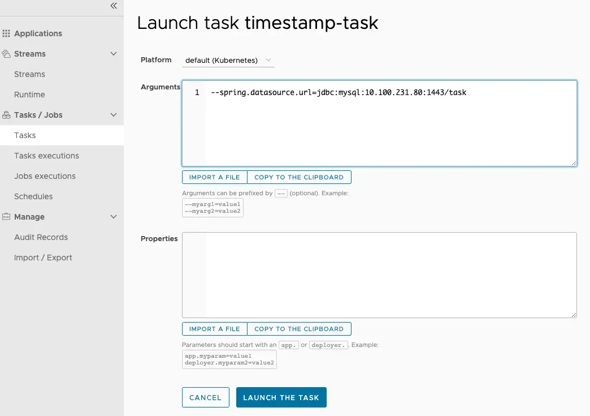

태스크가 잘 실행되었는지 확인해보려면, 페이지 왼편에 있는 **Task executions** 탭을 선택하고 다음과 같은 내역을 조회해보면 된다:


`default` 네임스페이스의 포드 목록을 조회해봐도 실행 내역을 검증할 수 있다:

```sh
kubectl get pods --namespace default
NAME                          READY   STATUS      RESTARTS   AGE
timestamp-task-kzkpqjp936     0/1     Completed   0          38s
```

`timestamp-task-2`를 시작할 때도 아래 커맨드라인 인자를 추가해준다:

```sh
--spring.datasource.url=jdbc:mysql://<ext db conn>:1443/<your db>
```

다음 이미지에 보이는 것처럼 설정해주면 된다:


태스크가 잘 실행되었는지 확인해보려면, 페이지 왼편에 있는 **Task executions** 탭을 선택하고 다음과 같은 내역을 조회해보면 된다:


다음과 같이 `practice` 네임스페이스의 포드 목록을 조회해봐도 실행 내역을 검증할 수 있다:

```sh
kubectl get pods --namespace practice
NAME                          READY   STATUS      RESTARTS   AGE
timestamp-task-2-pkwzevl0mp   0/1     Completed   0          48s
```

### Scheduling Tasks

이 섹션에선 두 가지 스케줄을 각각 다른 플랫폼에 생성해본다. 먼저 Spring Cloud Data Flow의 쉘을 이용해 `default` 플랫폼에서 1분에 한 번씩 `timestamp-task`를 시작하는 스케줄을 만들어보자.

1. Spring Cloud Data Flow 쉘에서 아래 명령어를 실행해 태스크를 예약한다:

```sh
task schedule create --name timestamp-task-sched --definitionName timestamp-task --expression "*/1 * * * *" --platform default --properties "app.docker-timestamp.spring.datasource.url=jdbc:mysql://<ext db conn>:1443/<your db>"
```

다음과 같은 문구가 보일 거다:

```sh
dataflow:>task schedule create --name timestamp-task-sched --definitionName timestamp-task --expression "*/1 * * * *" --platform default --properties "app.docker-timestamp.spring.datasource.url=jdbc:mysql://10.100.231.80:1443/task"
Created schedule 'timestamp-task-sched'
```

{:start="2"}
2. 스케줄이 잘 생성됐는지 확인하려면 `task schedule list --platform default` 명령어를 실행해보면 된다:

```sh
dataflow:>task schedule list --platform default
╔════════════════════╤════════════════════╤════════════════════════════════════════════════════╗
║   Schedule Name    │Task Definition Name│                     Properties                     ║
╠════════════════════╪════════════════════╪════════════════════════════════════════════════════╣
║timestamp-task-sched│timestamp-task      │spring.cloud.scheduler.cron.expression = */1 * * * *║
╚════════════════════╧════════════════════╧════════════════════════════════════════════════════╝
```

{:start="3"}
3. CronJob이 예약한 애플리케이션을 정상적으로 생성하고 실행했는지 검증하려면, SCDF 쉘에서 `task execution list`를 실행하거나, 아래 있는 `kubectl` 명령어를 실행해서 1분 뒤에 `timestamp-task-sched` 포드가 나타나는지 확인해보면 된다:

```sh
kubectl get pods --namespace default
NAME                                    READY   STATUS      RESTARTS   AGE
timestamp-task-sched-1592229780-f5w6w   0/1     Completed   0          15s
```

{:start="4"}
4. 스케줄을 삭제하려면 아래 명령어를 실행해라:

```sh
dataflow:>task schedule destroy --name timestamp-task-sched --platform default
Deleted task schedule 'timestamp-task-sched'
```

이번에는 Spring Cloud Data Flow 쉘을 이용해 `practice` 플랫폼에서 1분에 한 번씩 `timestamp-task-2`를 시작하는 스케줄을 만들어보자.

1. Spring Cloud Data Flow 쉘에서 아래 명령어를 실행해 태스크를 예약한다:

```sh
task schedule create --name timestamp-task-2-sched --definitionName timestamp-task --expression "*/1 * * * *" --platform practice --properties "app.docker-timestamp.spring.datasource.url=jdbc:mysql://<ext db conn>:1443/<your db>"
```

다음과 같은 문구가 보일 거다:

```sh
dataflow:>task schedule create --name timestamp-task-2-sched --definitionName timestamp-task --expression "*/1 * * * *" --platform practice --properties "app.docker-timestamp.spring.datasource.url=jdbc:mysql://10.100.231.80:1443/task"
Created schedule 'timestamp-task-2-sched'
```

{:start="2"}
2. 스케줄이 잘 생성됐는지 확인하려면 `task schedule list --platform practice` 명령어를 실행해보면 된다:

```shell
dataflow:>task schedule list --platform practice
╔══════════════════════╤════════════════════╤════════════════════════════════════════════════════╗
║    Schedule Name     │Task Definition Name│                     Properties                     ║
╠══════════════════════╪════════════════════╪════════════════════════════════════════════════════╣
║timestamp-task-2-sched│timestamp-task-2    │spring.cloud.scheduler.cron.expression = */1 * * * *║
╚══════════════════════╧════════════════════╧════════════════════════════════════════════════════╝

dataflow:>task schedule destroy --name timestamp-task-2-sched --platform practice
Deleted task schedule 'timestamp-task-2-sched'
```

{:start="3"}
3. CronJob이 예약한 애플리케이션을 정상적으로 생성하고 실행했는지 검증하려면, SCDF 쉘에서 `task execution list`를 실행하거나, 아래 있는 `kubectl` 명령어를 실행해서 1분 뒤에 `timestamp-task-2-sched` 포드가 나타나는지 확인해보면 된다:

```sh
glennrenfro ~/scripts: kubectl get pods --namespace practice
NAME                                      READY   STATUS      RESTARTS   AGE
timestamp-task-2-sched-1592230980-bngbc   0/1     Completed   0          19s
```

{:start="4"}
4. 스케줄을 삭제하려면 아래 명령어를 실행해라:

```sh
dataflow:>task schedule destroy --name timestamp-task-2-sched --platform practice
Deleted task schedule 'timestamp-task-2-sched'
```

---

## Launching Tasks on Different Types of Platforms

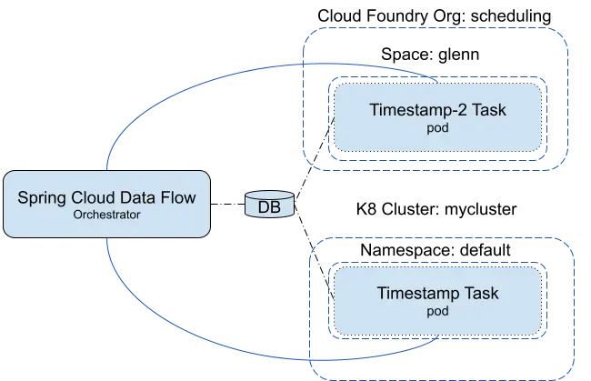

이번에는 Spring Cloud Data Flow는 쿠버네티스도 클라우드 파운드리도 아닌 외부 플랫폼에서 실행 중이며, 태스크를 기동시킬 땐 쿠버네티스와 클라우드 파운드리를 두 곳 다 사용하려 한다.

### Configuring Spring Cloud Data Flow

이 실습 내용을 따라해보려면 쉘에 액세스할 수 있어야 한다. 아래와 같이 환경 프로퍼티를 설정한 뒤 Spring Cloud Data Flow를 실행시켜라:

```sh
export spring_datasource_url=<your database url>
export spring_datasource_username=<your username>
export spring_datasource_password=<your password>
export spring_datasource_driverClassName=<your database driverClassNanme>
export spring_profiles_active=cloud
export jbp_config_spring_auto_reconfiguration='{enabled: false}'
export spring_cloud_dataflow_features_schedulesEnabled=true
export spring_cloud_dataflow_features_tasks_enabled=true
export SPRING_APPLICATION_JSON="{\"spring.cloud.dataflow.task\":{\"platform.kubernetes.accounts\":{\"kzone\":{\"namespace\" : \"default\"}},\"platform.cloudfoundry.accounts\":{\"cfzone\":{\"connection\":{\"url\":\"https://myconnection\",\"domain\":\"mydomain\",\"org\":\"myorg\",\"space\":\"myspace\",\"username\":\"admin\",\"password\":\"password\",\"skipSslValidation\":true},\"deployment\":{\"deleteRoutes\":false,\"services\":\"garsql,atscheduler\",\"enableRandomAppNamePrefix\":false,\"memory\":3072,\"schedulerUrl\":\"<myschedulerurl>\"},}}}}{\"spring.cloud.dataflow.task\":{\"platform.kubernetes.accounts\":{\"kzone\":{\"namespace\" : \"default\"}}}}{\"spring.cloud.dataflow.task\":{\"platform.local.accounts\":{\"local\":{\"timeout\" : \"60\"}}}}"

java -jar spring-cloud-dataflow-server/target/spring-cloud-dataflow-server-2.6.0.BUILD-SNAPSHOT.jar
```

> 이번 실습에선 클라우드 파운드리와 쿠버네티스 환경에서 모두 액세스할 수 있는 외부 데이터베이스가 있다고 가정한다.

### Registering Applications

이번 실습에선 SCDF로 timestamp 애플리케이션의 도커 이미지와 메이븐 아티팩트를 둘 다 기동시켜 볼 거다.

애플리케이션을 등록하려면:

1. [기본 제공하는 태스크 등록하기](#registering-pre-built-tasks) 가이드에서 설명하는대로 SCDF에서 제공하는 샘플 도커 태스크 앱들을 등록한다.
2. timestamp의 메이븐 인스턴스는 다음과 같이 등록한다:
3. 아래 이미지에서 페이지 상단에 있는 **ADD APPLICATON(S)** 버튼을 클릭한다:
   
4. **Add Applications(s)** 페이지가 뜨면 다음과 같이 라디오 버튼에서 **Register one or more applications**를 클릭한다:
   
5. 아래 이미지에 보이는 것과 같이 앱 정보를 입력한다:
   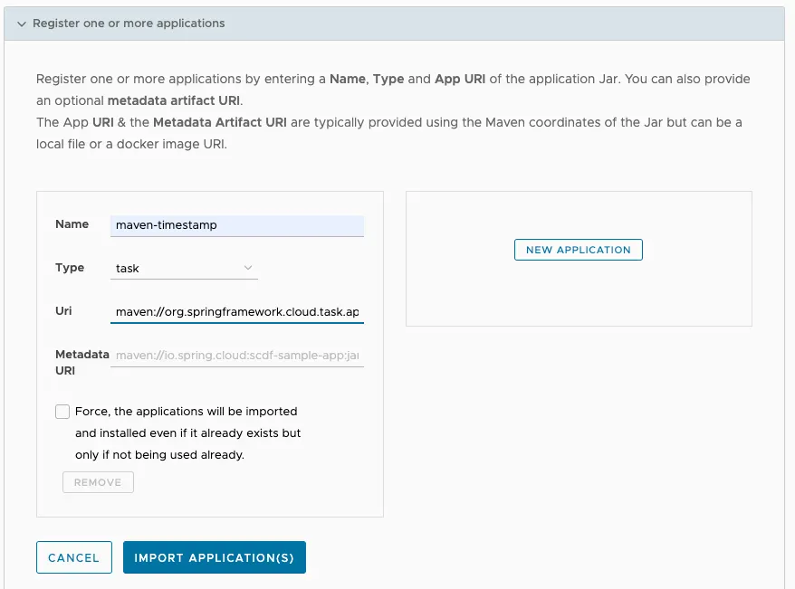
6. 페이지 하단에 있는 **IMPORT APPLICATION(S)** 버튼을 클릭한다.

### Create Task Definitions

이 섹션에선 두 가지 태스크 정의 `k8-timestamp`, `cf-timestamp`를 만들어본다. 정의한 태스크는 각각 다른 플랫폼에서 기동시켜볼 거다.

`k8-timestamp` 정의를 생성하려면:

1. 아래 이미지에서 UI 왼편에 있는 **Tasks** 탭을 클릭한다:
   
2. **CREATE TASK** 버튼을 클릭한다.
3. 텍스트 상자에 `timestamp`를 입력한다.
4. 아래 이미지에서 보이는 **CREATE TASK** 버튼을 클릭한다:
   
5. **Create Task** 대화 상자가 뜨면 **Name** 필드에 `k8-timestamp`를 입력한다.
6. 아래 이미지에서 보이는 **CREATE THE TASK** 버튼을 클릭한다:
   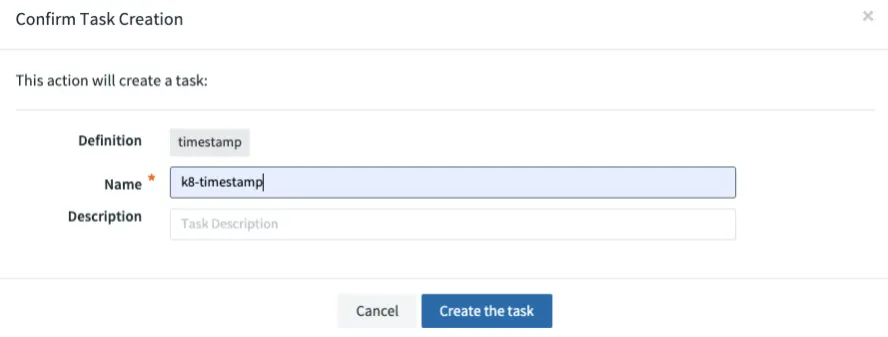

`cf-timestamp` 정의를 생성하려면:

1. 아래 이미지에서 UI 왼편에 있는 **Tasks** 탭을 클릭한다:
   
2. **CREATE TASK** 버튼을 클릭한다.
3. 텍스트 상자에 `maven-timestamp`를 입력한다.
4. 아래 이미지에서 보이는 **CREATE TASK** 버튼을 클릭한다:
   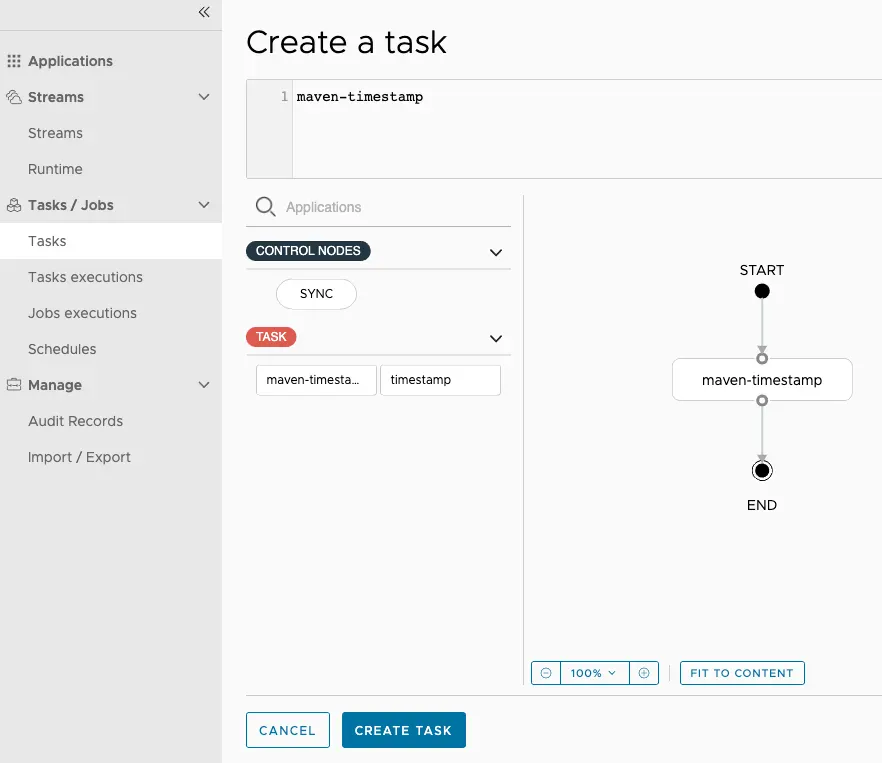
5. **Create Task** 대화 상자가 뜨면 **Name** 필드에 `cf-timestamp`를 입력한다.
6. 아래 이미지에서 보이는 **CREATE THE TASK** 버튼을 클릭한다:
   

이제 다음과 같이 두 가지 태스크 정의가 생성된 것을 확인할 수 있다:


### Launching Tasks

이 섹션에선 `cfzone` (클라우드 파운드리) 플랫폼에서 `cf-timestamp`를 실행한 다음 `kzone` (쿠버네티스) 플랫폼에서 `k8-timestamp`를 실행해볼 거다.

1. 태스크 정의 `cf-timestamp` 왼쪽에 있는 옵션 컨트롤을 클릭하고 **Launch** 옵션을 선택한다:
   
2. 이제 `cf-timestamp`를 실행할 플랫폼을 선택한다 (`cfzone` 네임스페이스).
   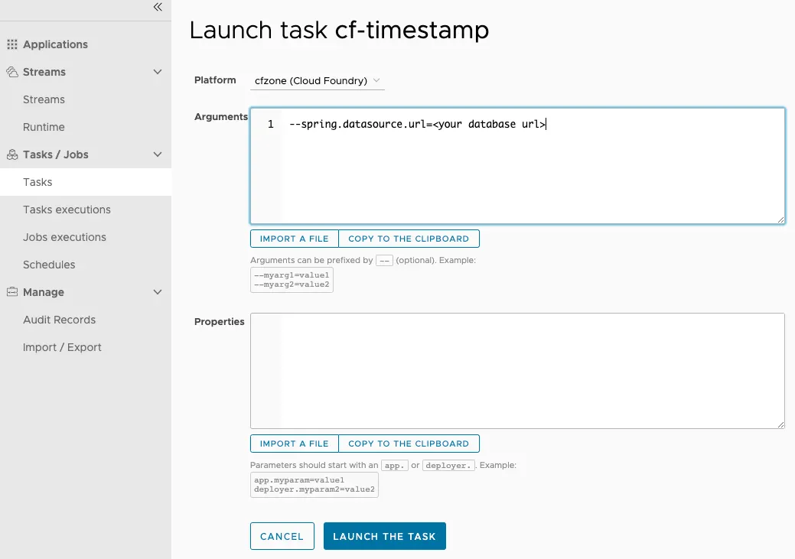
3. 페이지 하단에 있는 **LAUNCH THE TASK** 버튼을 클릭한다.

애플리케이션이 잘 실행됐는지 검증하려면 task execution 페이지에서 결과를 확인해보거나, 아래 `cf apps` 명령어를 실행해 설정한 org와 space에 있는 애플리케이션을 조회해보면 된다:

```sh
cf tasks cf-timestamp
Getting tasks for app cf-timestamp in org scheduling / space glenn as admin...
OK

id   name                                                                          state       start time                      command
7    cf-timestamp                                                                  SUCCEEDED   Mon, 15 Jun 2020 18:09:00 UTC   JAVA_OPTS="-agentpath:$PWD/.java-buildpack/open_jdk_jre/bin/jvmkill-1.16.0_RELEASE=printHeapHistogram=1 -Djava.io.tmpdir=$TMPDIR -XX:ActiveProcessorCount=$(nproc) -Djava.ext.dirs=$PWD/.java-buildpack/container_security_provider:$PWD/.java-buildpack/open_jdk_jre/lib/ext -Djava.security.properties=$PWD/.java-buildpack/java_security/java.security $JAVA_OPTS" && CALCULATED_MEMORY=$($PWD/.java-buildpack/open_jdk_jre/bin/java-buildpack-memory-calculator-3.13.0_RELEASE -totMemory=$MEMORY_LIMIT -loadedClasses=14335 -poolType=metaspace -stackThreads=250 -vmOptions="$JAVA_OPTS") && echo JVM Memory Configuration: $CALCULATED_MEMORY && JAVA_OPTS="$JAVA_OPTS $CALCULATED_MEMORY" && MALLOC_ARENA_MAX=2 SERVER_PORT=$PORT eval exec $PWD/.java-buildpack/open_jdk_jre/bin/java $JAVA_OPTS -cp $PWD/. org.springframework.boot.loader.JarLauncher
```

이제 `kzone` (쿠버네티스) 플랫폼에 있는 default 네임스페이스에서 태스크를 시작해보자:

1. `k8-timestamp` 태스크 정의 옆에 있는 옵션 컨트롤을 클릭하고 **Launch** 옵션을 선택한다:
   
2. 이제 `k8-timestamp`를 실행할 플랫폼을 선택한다 (`kzone` 네임스페이스).
   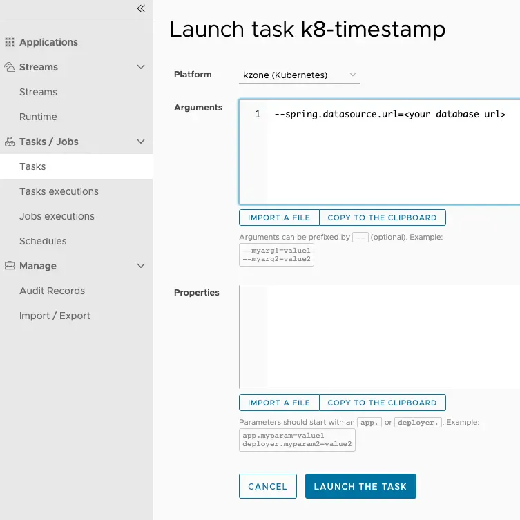
3. 페이지 하단에 있는 **LAUNCH THE TASK** 버튼을 클릭한다.

포드가 잘 실행됐는지 검증하려면 task execution 페이지에서 결과를 확인해보거나, 아래 `kubectl` 명령어를 실행해 `default` 네임스페이스에 있는 포드들을 조회해보면 된다:

```sh
kubectl get pods
NAME                        READY   STATUS      RESTARTS   AGE
k8-timestamp-rpqw00d175     0/1     Completed   0          39s
```

### Scheduling Tasks

이 섹션에선 두 가지 스케줄을 각각 다른 플랫폼에 생성해본다. Spring Cloud Data Flow의 쉘을 이용해 `cfzone` 클라우드 파운드리 플랫폼에서 1분에 한 번씩 `cf-timestamp`를 시작하는 스케줄을 만들고, minikube의 `default` 네임스페이스에서  `k8-timestamp`를 실행하는 스케줄을 생성한다.

1. 클라우드 파운드리 전용 스케줄을 생성한다:

```sh
task schedule create --name timestamp-task-cf-sched --definitionName cf-timestamp --expression "*/1 * ? * *"  --platform cfzone --properties "app.maven-timestamp.spring.datasource.url=<your database url>"
```

{:start="2"}  
2. 스케줄이 잘 생성됐는지 검증하려면, `task schedule list --platform cfzone` 명령어를 실행하고 결과를 확인해보면 된다:

```sh
task schedule list --platform cfzone
╔═══════════════════════╤════════════════════╤════════════════════════════════════════════════════╗
║     Schedule Name     │Task Definition Name│                     Properties                     ║
╠═══════════════════════╪════════════════════╪════════════════════════════════════════════════════╣
║timestamp-task-cf-sched│cf-timestamp        │spring.cloud.scheduler.cron.expression = */1 * ? * *║
╚═══════════════════════╧════════════════════╧════════════════════════════════════════════════════╝
```

{:start="3"}
3. 설정한 org, space에서 `cf apps` 명령어를 실행해서, 이 태스크에 정의한 애플리케이션이 클라우드 파운드리에 배포되었는지 검증해보자:

```sh
cf apps
Getting apps in org scheduling / space glenn as admin...
name                    requested state   instances   memory   disk   urls
cf-timestamp            stopped           0/1         3G       1G
```

{:start="4"}
4. 설정한 org, space에서 `cf job-history timestamp-task-cf-sched` 명령어를 실행해서, 실제로 예약한 `timestamp-task-cf-sched`가 실행됐는지 확인해보자:

```sh
cf job-history timestamp-task-cf-sched
Getting scheduled job history for timestamp-task-cf-sched in org scheduling / space glenn as admin
1 - 6 of 6 Total Results
Execution GUID                         Execution State   Scheduled Time                  Execution Start Time            Execution End Time              Exit Message
4c588ee2-833d-47a6-84cb-ebfcc90857e9   SUCCEEDED         Mon, 15 Jun 2020 18:07:00 UTC   Mon, 15 Jun 2020 18:07:00 UTC   Mon, 15 Jun 2020 18:07:00 UTC   202 - Cloud Controller Accepted Task
```

{:start="5"}
5. SCDF 쉘에서 `task schedule destroy` 명령어를 실행해 스케줄을 삭제한다:

```sh
task schedule destroy --name timestamp-task-k8-sched --platform kzone
Deleted task schedule 'timestamp-task-k8-sched'
```

{:start="6"}
6. 쿠버네티스 플랫폼 전용 스케줄을 생성한다:

```sh
task schedule create --name timestamp-task-k8-sched --definitionName k8-timestamp --expression "*/1 * * * *" --platform kzone --properties "app.timestamp.spring.datasource.url=<your database url>"
```

{:start="7"}
7. `task schedule list --platform kzone` 명령어를 실행해 스케줄이 생성됐는지 확인해보자:

```sh
task schedule list --platform kzone
╔═══════════════════════╤════════════════════╤════════════════════════════════════════════════════╗
║     Schedule Name     │Task Definition Name│                     Properties                     ║
╠═══════════════════════╪════════════════════╪════════════════════════════════════════════════════╣
║timestamp-task-k8-sched│k8-timestamp        │spring.cloud.scheduler.cron.expression = */1 * * * *║
╚═══════════════════════╧════════════════════╧════════════════════════════════════════════════════╝
```

{:start="8"}
8. 이제 default 네임스페이스에서 `kubectl get pods` 명령어를 실행해서, 이 태스크에 정의한 애플리케이션이 쿠버네티스에 배포되었는지 검증해보자:

```sh
glennrenfro ~/scripts: kubectl get pods
NAME                                       READY   STATUS      RESTARTS   AGE
timestamp-task-k8-sched-1592246880-4fx2p   0/1     Completed   0          14s
```

{:start="9"}
9. 이제 SCDF 쉘에서 `task schedule destroy` 명령어를 실행해 스케줄을 삭제한다:

```sh
task schedule destroy --name timestamp-task-k8-sched --platform kzone
Deleted task schedule 'timestamp-task-k8-sched'
```