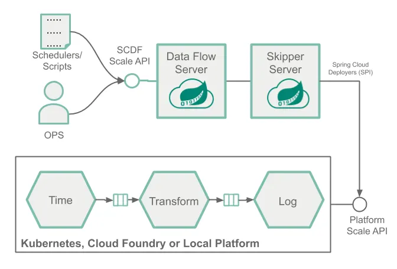

---

Spring Cloud Data Flow 스케일링의 기본 개념을 알아보려면 [스케일링](../feature-guides.stream.scaling) 가이드를 읽어봐라.

### 목차

- [Overview](#overview)
- [Prerequisite](#prerequisite)
- [Scaling Recipe](#scaling-recipe)
  + [Create a Data Pipeline](#create-a-data-pipeline)
  + [Deploy a Data Pipeline with Data Partitioning](#deploy-a-data-pipeline-with-data-partitioning)
  + [Increase the Data Pipeline Load](#increase-the-data-pipeline-load)
  + [Scale-Out](#scale-out)
  + [Decrease the Data Pipeline Load and Scale-In](#decrease-the-data-pipeline-load-and-scale-in)
    
---

## Overview

여기서는 아래 이미지에 보이는 것처럼, 스트리밍 데이터 파이프라인을 배포한 뒤, 리소스 고갈 상태를 시뮬레이션해보고 (ex. CPU 스파이크), SCDF 쉘을 이용해서 수동으로 컨슈머 애플리케이션 인스턴스 수를 조정해 늘어난 부하를 처리해본다.

{: .center-image }

운영자와 개발자는 애플리케이션의 부하가 높아지면 이 방법으로 개입해서 확장할 수 있다. 예를 들어 쇼핑몰을 운영한다면, 블랙 프라이데이같이 접속자가 많아져 부담이 큰 날을 미리 대비해서 확장이 가능한 시스템을 설계하고 싶을 거다.

프로메테우스를 통한 SCDF 모니터링 기능을 통해 스케일 아웃/스케일 인 동작을 좀 더 정교하게 자동화하고 싶다면, 오토스케일링 룰을 구성하고 설정해주면 된다. 자세한 방법은 [SCDF와 프로메테우스를 이용한 스트리밍 데이터 파이프라인 오토스케일링](../recipes.scaling.autoscaling) 레시피를 참고해라.

---

## Prerequisite

이 레시피에선 쿠버네티스 플랫폼을 사용한다. [Kubectl](../installation.kubernetes.kubectl)이나 [Helm](../installation.kubernetes.helm) 설치 가이드를 따라 Spring Cloud Data Flow와 카프카 브로커를 세팅해라. 그 다음 아래 명령어를 실행해라:

```shell
helm install --name my-release stable/spring-cloud-data-flow --set kafka.enabled=true,rabbitmq.enabled=false,kafka.persistence.size=10Gi
```

그 다음 최신 [kafka-docker](https://dataflow.spring.io/kafka-docker-latest) 앱 스타터들을 등록해라.

그 다음엔 SCDF 쉘을 시작하고 Data Flow 서버에 연결한다:

```shell
server-unknown:>dataflow config server http://<SCDF IP>
```

---

## Scaling Recipe

이 섹션에선 애플리케이션을 확장하는 방법을 보여준다.

### Create a Data Pipeline

데이터 파이프라인을 생성하려면 아래 명령어를 실행해라:

```shell
stream create --name scaletest --definition "time --fixed-delay=995 --time-unit=MILLISECONDS | transform --expression=\"payload + '-' + T(java.lang.Math).exp(700)\" | log"
```

이 `time` 소스는 고정 간격(995ms = ~1msg/s)으로 현재 타임스탬프 메세지를 생성하고, `transform` 프로세서는 수학 연산을 실행해서 높은 CPU 처리를 시뮬레이션하고 있으며, `log` 싱크는 변환된 메세지 페이로드를 출력한다.

### Deploy a Data Pipeline with Data Partitioning

데이터 파티셔닝을 이용해 파이프라인을 배포하려면 아래 명령어를 실행해라:

```shell
stream deploy --name scaletest --properties "app.time.producer.partitionKeyExpression=payload,app.transform.spring.cloud.stream.kafka.binder.autoAddPartitions=true,app.transform.spring.cloud.stream.kafka.binder.minPartitionCount=4"
```

`producer.partitionKeyExpression=payload` 프로퍼티는 파티셔닝에 쓸 time의 출력을 바인딩한다. 파티션 키 표현식은 메세지 페이로드(ex. 현재 타임스탬프의 `toString()` 값)를 이용해 데이터를 다운스트림 출력 채널로 파티셔닝할 방법을 결정한다. 배포 프로퍼티 `spring.cloud.stream.kafka.binder.autoAddPartitions`는 카프카 바인더에게 필요하면 새 파티션을 생성하도록 지시한다. 토픽을 미리 충분히 파티셔닝해두지 않았다면 이 프로퍼티가 필요하다. `spring.cloud.stream.kafka.binder.minPartitionCount` 프로퍼티는 카프카 바인더에서 transform 프로세서가 구독하는 토픽에 설정할 최소 파티션 수다.

`scaletest` 스트림을 배포하면 다음과 같은 내역을 조회할 수 있다:


현재는 각 애플리케이션 당 인스턴스가 하나씩 할당돼 있다.

SCDF의 내장 그라파나 대시보드를 이용해 [스트림 애플리케이션의 처리량과 기타 다른 메트릭들](../feature-guides.stream.monitoring#prometheus-1)을 검토해보자.


`time`, `transform`, `log` 애플리케이션은 메세지 처리량(~1msg/s)을 동일하게 유지하고 있다. `transform`은 현재 부하를 모두 처리해주고 있다.

### Increase the Data Pipeline Load

이제 time 소스의 메세지 생성 속도를 높여서 부하를 만들어보자. time 소스의 `time-unit` 프로퍼티를 `MILLISECONDS`에서 `MICROSECONDS`로 변경하면, 입력 속도가 초당 메세지 1개에서 수천 개로 늘어난다. 참고로, [스트림 롤링 업데이트](../stream-developer-guides.continuous-delivery) 기능을 사용하면 전체 스트림을 중단하지 않고 time 애플리케이션에서만 롤링 업데이트를 진행할 수 있다:

```shell
stream update --name scaletest --properties "app.time.trigger.time-unit=MICROSECONDS"
```

이제 `time` 소스는 메세지를 `~5000msg/s` 속도로 방출한다. 하지만 `transform` 프로세서는 약 `1000msg/s` 정도에 머물러있다. 결국 전체 스트림의 처리량은 일정 수준에서 멈춘다. 아래 이미지에서 확인할 수 있듯이 `transform`이 병목이 되고 있음을 의미한다:


### Scale-Out

SCDF 쉘을 사용해서 `transform` 인스턴스를 4개로 확장해보자:

```shell
stream scale app instances --name scaletest --applicationName transform --count 4
```

위 명령어를 실행하면, 아래 이미지에 보이는 것처럼 transform 인스턴스 3개가 추가로 더 배포된다:


`transform` 프로세서 인스턴스를 추가로 배포한 덕분에, 전체 데이터 파이프라인은 `time` 소스의 생산 속도를 따라잡는다.


### Decrease the Data Pipeline Load and Scale-In

이제 소스의 데이터 생성 속도를 원래 속도(1msg/s)로 다시 낮춰보자:

```shell
stream update --name scaletest --properties "app.time.trigger.time-unit=MILLISECONDS"
```

새로 추가한 `transform` 프로세서 인스턴스가 있다고 해서 더 이상 전체적인 처리량이 높아지진 않는다. 다음과 같이 인스턴스 수에 여유가 있을 땐 다시 축소<sup>scale back</sup>(제거)해도 된다:


이럴 땐 transform 애플리케이션의 인스턴스 수를 원래대로 줄이면 된다. 인스턴스 수를 줄이려면 다음 명령어를 실행해라:

```shell
stream scale app instances --name scaletest --applicationName transform --count 1
```

그러고 나면 다음과 같은 지표를 확인할 수 있을 거다:

