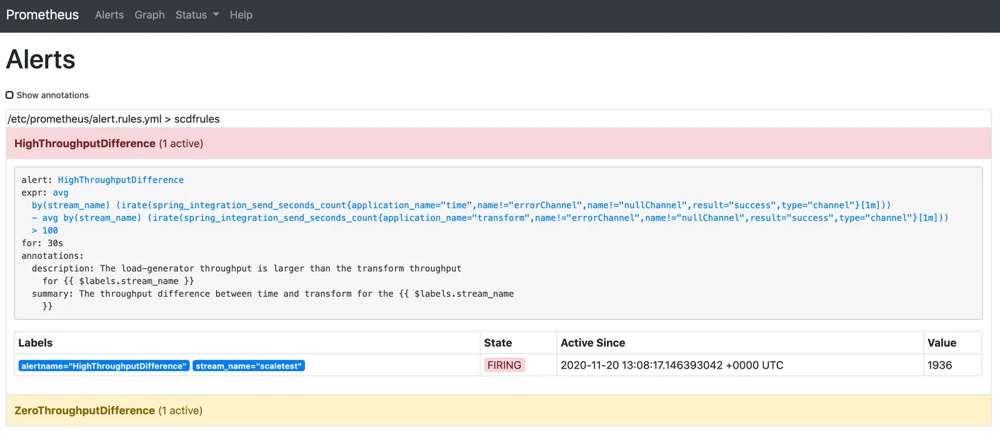
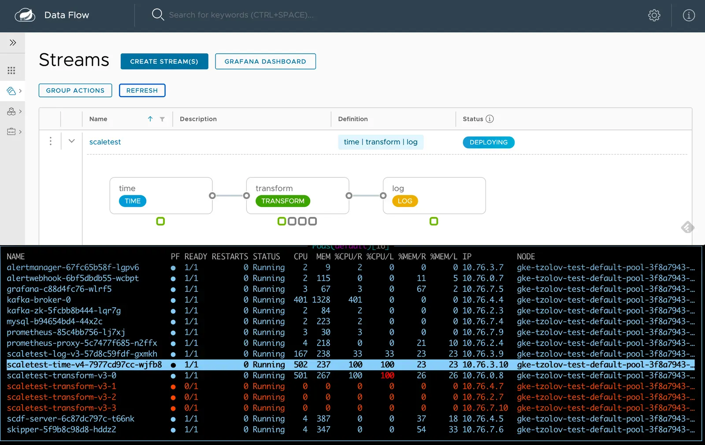
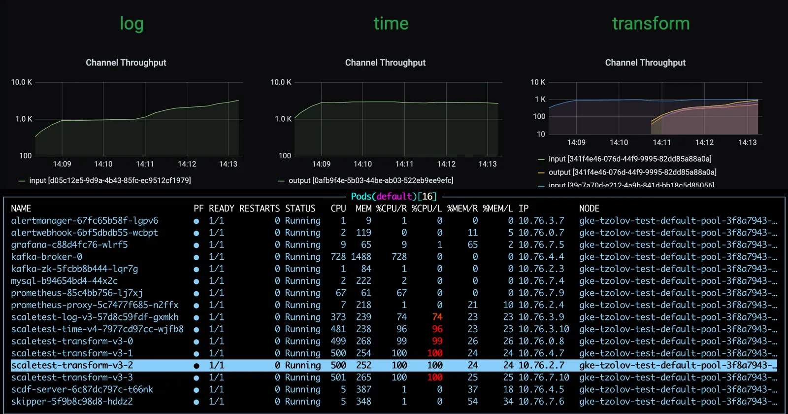

<script>defaultLanguages = ['kubectl']</script>

---

Spring Cloud Data Flow 스케일링의 기본 개념을 알아보려면 [스케일링](../feature-guides.stream.scaling) 가이드를 읽어봐라.

### 목차

- [Overview](#overview)
- [Prerequisite](#prerequisite)
- [Autoscaling Recipe](#autoscaling-recipe)
  + [Create a Data Pipeline](#create-a-data-pipeline)
  + [Deploy a Data Pipeline with Data Partitioning](#deploy-a-data-pipeline-with-data-partitioning)
  + [Increase a Data Pipeline Load](#increase-a-data-pipeline-load)
  + [Reduce a Data Pipeline Load](#reduce-a-data-pipeline-load)

---

## Overview

이 솔루션에선 [프로메테우스 Alert rule](../../Prometheus/alerting-rules)을 이용해서, 애플리케이션 처리량 메트릭을 기반으로 스케일 아웃<sup>scale out</sup>, 스케일 인<sup>scale in</sup> alert를 정의해본다. alert는 [프로메테우스 AlertManager](../../Prometheus/alertmanager)와 커스텀 [웹훅](https://github.com/prometheus/alertmanager)을 통해 관리한다. 웹훅에선 alert가 시행<sup>fire</sup>되면 SCDF의 [Scale API](https://docs.spring.io/spring-cloud-dataflow/docs/2.9.1/reference/htmlsingle/#api-guide-resources-stream-deployment-scale) 호출을 트리거한다.

스트리밍 데이터 파이프라인 `time | transform | log`로 예시를 들어보자. 여기에선 `time`과 `transform` 애플리케이션 간의 처리 속도를 측정하는 방법을 소개한다. 따라서 속도차를 alert의 결정 요소로 활용할 수 있다. 이 문서에선 임계치로 정의한 메트릭이 설정한 rule을 초과했을 때 어떻게 alert가 트리거되고, 어떻게 오토스케일을 호출하게 되는지 설명한다. 다음은 이 alert rule의 로직을 보여주는 슈도 코드다:

```java
rateDifference = rate(time) - rate(transform)                         // (1)
if rateDifference > 500 for 1 minute do fire HighThroughputDifference // (2)
if rateDifference == 0 for 3 minutes do fire ZeroThroughputDifference // (3)
```
<small><span style="background-color: #a9dcfc; border-radius: 50px;">(1)</span> `time`과 `transform` 애플리케이션의 실시간 처리량의 차이(즉, 속도차)를 계산하는 쿼리 표현식</small>.<br>
<small><span style="background-color: #a9dcfc; border-radius: 50px;">(2)</span> **1분** 동안 속도차가 `500msg/s`를 넘어가면 시행<sup>fire</sup>되는 alert 룰 `HighThroughputDifference`.</small><br>
<small><span style="background-color: #a9dcfc; border-radius: 50px;">(3)</span> 최소 **3분** 동안 속도차가 `0 msg/s`로 유지되면 시행<sup>fire</sup>되는 alert 룰 `ZeroThroughputDifference`.</small>

다음은 고수준 아키텍처를 나타낸 다이어그램이다:

{: .center-image }

[Data Flow 메트릭 아키텍처](../concepts.monitoring)는 Micrometer 라이브러리의 도움을 받아 설계했다. 성능 분석을 위해 다양한 애플리케이션 메트릭을 수집할 모니터링 백엔드로 프로메테우스를 활용할 수 있으며, 프로메테우스에선  alert도 설정할 수 있다.

프로메테우스에서 알림을 전송하는 일은 다음과 같이 나뉜다:

- `Alert Rules`: 프로메테우스 내부에 정의하며, 프로메테우스 서비스가 트리거링한다.
- `Alertmanager`: alert가 시행<sup>fire</sup>되면 받아서 관리하고, 미리 등록해둔 웹훅에 통지<sup>notification</sup>하는 독립형 서비스.

[Alert rule](../../Prometheus/alerting-rules)은 [PQL<sup>Prometheus Expression Language</sup>](../../Prometheus/querying.basics/)을 기반으로 작성한다. 이 alert 룰을 사용해 스케일 alert를 정의하고 `Alertmanager`로 전송할 수 있다. 예를 들어 스케일 아웃<sup>scale out</sup> alert 룰은 다음과 같이 정의할 수 있다:

```yaml
alert: HighThroughputDifference
expr:  avg(irate(spring_integration_send_seconds_count{application_name="time"}[1m])) by(stream_name) -
       avg(irate(spring_integration_send_seconds_count{application_name="transform"}[1m])) by(stream_name) > 500
for: 30s
```

> 여기에서 사용하는 alert 룰들은 [alert.rule.yml](https://github.com/spring-cloud/spring-cloud-dataflow-samples/blob/master/dataflow-website/recipes/scaling/kubernetes/helm/prometheus/prometheus-configmap.yaml#L8-L23)에서 확인할 수 있다 (kubectl로 설치할 땐 [여기](https://github.com/spring-cloud/spring-cloud-dataflow-samples/blob/master/dataflow-website/recipes/scaling/kubernetes/prometheus/prometheus-configmap.yaml#L8-L23)에서).

> `spring_integration_send_seconds_count` 메트릭은 메세지 속도를 계산하는 데 사용하는 메트릭으로, `spring integration`의 [마이크로미터 기능](https://docs.spring.io/spring-integration/docs/5.2.2.RELEASE/reference/html/system-management.html#micrometer-integration)을 통해 수집한다.

[Alertmanager](../../Prometheus/alertmanager)는 alert를 관리하는 독립형 서비스로, silencing, inhibition, aggregation과 함께 미리 설정해둔 웹훅에 알림을 전송하는 일을 담당한다.

[AlertWebHookApplication](https://github.com/spring-cloud/spring-cloud-dataflow-samples/blob/master/dataflow-website/recipes/scaling/scdf-alert-webhook/src/main/java/io/spring/cloud/dataflow/alert/webhook/AlertWebHookApplication.java)은 커스텀 스프링 부트 애플리케이션이며 (스프링 부트 앱 [scdf-alert-webhook](https://github.com/spring-cloud/spring-cloud-dataflow-samples/tree/master/dataflow-website/recipes/scaling/scdf-alert-webhook)에 들어 있다), [config.yml](https://github.com/spring-cloud/spring-cloud-dataflow-samples/blob/master/dataflow-website/recipes/scaling/kubernetes/alertmanager/prometheus-alertmanager-configmap.yaml#L8-L15)에서 이 애플리케이션을 [Alertmanager Webhook Receiver](../../Prometheus/alerting.configuration#webhook_config)로 등록한다. 이 `AlertWebHookApplication`은 프로메테우스로부터 alert를 통지<sup>notification</sup>받는다 (JSON 형식으로). 통지를 받고 나면 [SCDF의 Scale API](https://docs.spring.io/spring-cloud-dataflow/docs/2.9.1/reference/htmlsingle/#api-guide-resources-stream-deployment-scale)의 도움을 받아 스케일 아웃<sup>scale out</sup> 요청을 트리거하고, SCDF의 alert 스트리밍 데이터 파이프라인에서 참조하는 애플리케이션에는 오토스케일링이 적용된다.

> alert 통보<sup>notification</sup>에는 alert PQL 표현식에서 사용한 메트릭 레이블도 담겨있다. 따라서 이 예시에선 `stream_name` 레이블이 함께 전달돼서, `AlertWebHookApplication`은 스케일링을 적용할 데이터 파이프라인의 이름을 결정할 수 있다.

[Data Flow Scale REST API](https://docs.spring.io/spring-cloud-dataflow/docs/2.9.1/reference/htmlsingle/#api-guide-resources-stream-deployment-scale)는 플랫폼에 관계없이 데이터 파이프라인 애플리케이션들을 확장할 수 있는 메커니즘을 제공한다.

`AlertWebHookApplication`은 `spring.cloud.dataflow.client.server-uri` 프로퍼티로 Scale API 엔드포인트를 설정한다. 전체적인 배포 설정은 [alertwebhook-deployment.yaml](https://github.com/spring-cloud/spring-cloud-dataflow-samples/blob/master/dataflow-website/recipes/scaling/kubernetes/alertwebhook/alertwebhook-deployment.yaml)을 참고해라.

다음은 Data Flow의 오토스케일링 흐름을 보여주는 동영상이다:


<iframe src="https://www.youtube.com/embed/IDH6X1pmgxc" style="border: 0px; width: 832px; height: 417px;"></iframe>


---

## Prerequisite

> 이 레시피에선 쿠버네티스 플랫폼을 사용한다.

이 레시피는 5개의 노드를 가지고 있는 GKE 클러스터에서 테스트를 마쳤다.

앱 인스턴스를 여러 개 실행해 CPU를 대량으로 사용하기 때문에, 이 레시피를 minikube에서 실행하는 건 거의 불가능하다.

<div class="switch-language-wrapper kubectl helm">
<span class="switch-language kubectl">For Kubectl installation</span>
<span class="switch-language helm">For Helm installation</span>
</div>
<div class="language-only-for-kubectl kubectl helm"></div>
<div style="border: 1px solid #ddd; padding: 15px; margin-bottom: 20px; background-color: #f9f9f9;">
<p><a href="../installation.kubernetes.kubectl">Kubectl</a> 가이드를 따라 Spring Cloud Data Flow와 카프카 브로커를 세팅해라.</p>
<p>그 다음 <code class="highlighter-rouge">Alertmanager</code>와 <code class="highlighter-rouge">AlertWebHook</code>을 설치하고 <code class="highlighter-rouge">Prometheus</code> 서비스들을 재구성한다:</p>
<div class="language-shell highlighter-rouge"><div class="highlight"><pre class="highlight"><code>kubectl apply <span class="nt">-f</span> https://raw.githubusercontent.com/spring-cloud/spring-cloud-dataflow-samples/master/dataflow-website/recipes/scaling/kubernetes/alertwebhook/alertwebhook-svc.yaml
kubectl apply <span class="nt">-f</span> https://raw.githubusercontent.com/spring-cloud/spring-cloud-dataflow-samples/master/dataflow-website/recipes/scaling/kubernetes/alertwebhook/alertwebhook-deployment.yaml
kubectl apply <span class="nt">-f</span> https://raw.githubusercontent.com/spring-cloud/spring-cloud-dataflow-samples/master/dataflow-website/recipes/scaling/kubernetes/alertmanager/prometheus-alertmanager-service.yaml
kubectl apply <span class="nt">-f</span> https://raw.githubusercontent.com/spring-cloud/spring-cloud-dataflow-samples/master/dataflow-website/recipes/scaling/kubernetes/alertmanager/prometheus-alertmanager-deployment.yaml
kubectl apply <span class="nt">-f</span> https://raw.githubusercontent.com/spring-cloud/spring-cloud-dataflow-samples/master/dataflow-website/recipes/scaling/kubernetes/alertmanager/prometheus-alertmanager-configmap.yaml
wget https://raw.githubusercontent.com/spring-cloud/spring-cloud-dataflow-samples/master/dataflow-website/recipes/scaling/kubernetes/prometheus/prometheus-configmap.yaml
kubectl patch cm my-release-prometheus-server <span class="nt">--patch</span> <span class="s2">"</span><span class="k">$(</span><span class="nb">cat</span> ./prometheus-configmap.yaml<span class="k">)</span><span class="s2">"</span>
kubectl delete pods <span class="nt">-l</span> <span class="nv">app</span><span class="o">=</span>prometheus
</code></pre></div></div>
<p><code class="highlighter-rouge">my-release-prometheus-server</code>는 현재 프로메테우스 CM으로 변경해라. 설정들을 조회해보려면 <code class="highlighter-rouge">kubectl get cm</code>을 실행하면 된다.</p>
</div>
<div class="language-only-for-helm kubectl helm"></div>
<div style="border: 1px solid #ddd; padding: 15px; margin-bottom: 20px; background-color: #f9f9f9;">
<p><a href="../installation.kubernetes.helm">Helm</a> 가이드를 따라 Spring Cloud Data Flow와 카프카 브로커를 세팅해라. 스토리지 공간은 최소 <code class="highlighter-rouge">10Gi</code>로 설정하고, <code class="highlighter-rouge">features.monitoring.enabled=true</code>를 사용하면 된다.</p>
<div class="language-shell highlighter-rouge"><div class="highlight"><pre class="highlight"><code>helm <span class="nb">install</span> <span class="nt">--name</span> my-release stable/spring-cloud-data-flow <span class="nt">--set</span> features.monitoring.enabled<span class="o">=</span><span class="nb">true</span>,kafka.enabled<span class="o">=</span><span class="nb">true</span>,rabbitmq.enabled<span class="o">=</span><span class="nb">false</span>,kafka.persistence.size<span class="o">=</span>10Gi
</code></pre></div></div>
<p>그 다음 <code class="highlighter-rouge">Alertmanager</code>와 <code class="highlighter-rouge">AlertWebHook</code>을 설치하고 <code class="highlighter-rouge">Prometheus</code> 서비스들을 재구성한다:</p>
<div class="language-shell highlighter-rouge"><div class="highlight"><pre class="highlight"><code>kubectl apply <span class="nt">-f</span> https://raw.githubusercontent.com/spring-cloud/spring-cloud-dataflow-samples/master/dataflow-website/recipes/scaling/kubernetes/helm/alertwebhook/alertwebhook-svc.yaml
kubectl apply <span class="nt">-f</span> https://raw.githubusercontent.com/spring-cloud/spring-cloud-dataflow-samples/master/dataflow-website/recipes/scaling/kubernetes/helm/alertwebhook/alertwebhook-deployment.yaml
kubectl apply <span class="nt">-f</span> https://raw.githubusercontent.com/spring-cloud/spring-cloud-dataflow-samples/master/dataflow-website/recipes/scaling/kubernetes/alertmanager/prometheus-alertmanager-service.yaml
kubectl apply <span class="nt">-f</span> https://raw.githubusercontent.com/spring-cloud/spring-cloud-dataflow-samples/master/dataflow-website/recipes/scaling/kubernetes/alertmanager/prometheus-alertmanager-deployment.yaml
kubectl apply <span class="nt">-f</span> https://raw.githubusercontent.com/spring-cloud/spring-cloud-dataflow-samples/master/dataflow-website/recipes/scaling/kubernetes/alertmanager/prometheus-alertmanager-configmap.yaml
wget https://raw.githubusercontent.com/spring-cloud/spring-cloud-dataflow-samples/master/dataflow-website/recipes/scaling/kubernetes/helm/prometheus/prometheus-configmap.yaml
kubectl patch cm my-release-prometheus-server <span class="nt">--patch</span> <span class="s2">"</span><span class="k">$(</span><span class="nb">cat</span> ./prometheus-configmap.yaml<span class="k">)</span><span class="s2">"</span>
</code></pre></div></div>
</div>
최신 [kafka-docker](https://dataflow.spring.io/kafka-docker-latest) 앱 스타터들을 등록해라.

```shell
app import --uri https://dataflow.spring.io/kafka-docker-latest
```

SCDF 쉘을 시작하고 Data Flow 서버에 연결한다:

```shell
server-unknown:>dataflow config server http://<SCDF IP>
```

---

## Autoscaling Recipe

이 섹션에선 오토스케일링을 세팅하는 방법을 보여준다.

### Create a Data Pipeline

```shell
stream create --name scaletest --definition "time --fixed-delay=995 --time-unit=MILLISECONDS | transform --expression=\"payload + '-' + T(java.lang.Math).exp(700)\" | log"
```

이 `time` 소스는 고정 간격(995ms = ~1msg/s)으로 현재 타임스탬프 메세지를 생성하고, `transform` 프로세서는 수학 연산을 실행해서 높은 CPU 처리를 시뮬레이션하고 있으며, `log` 싱크는 변환된 메세지 페이로드를 출력한다.

### Deploy a Data Pipeline with Data Partitioning

```shell
stream deploy --name scaletest --properties "app.time.producer.partitionKeyExpression=payload,app.transform.spring.cloud.stream.kafka.binder.autoAddPartitions=true,app.transform.spring.cloud.stream.kafka.binder.minPartitionCount=4"
```

`producer.partitionKeyExpression=payload` 프로퍼티는 파티셔닝에 쓸 소스의 출력을 바인딩한다. 파티션 키 표현식은 메세지 페이로드(즉, 현재 타임스탬프의 `toString()` 값)를 이용해 데이터를 다운스트림 출력 채널로 파티셔닝할 방법을 결정한다. 배포 프로퍼티 `spring.cloud.stream.kafka.binder.autoAddPartitions`는 카프카 바인더에게 필요하면 새 파티션을 생성하도록 지시한다. 토픽을 미리 충분히 파티셔닝해두지 않았다면 이 프로퍼티가 필요하다. `spring.cloud.stream.kafka.binder.minPartitionCount` 프로퍼티는 카프카 바인더에서 transform 프로세서가 구독하는 토픽에 설정할 최소 파티션 수다.


SCDF의 내장 그라파나 대시보드를 이용해 [스트림 애플리케이션의 처리량과 기타 다른 메트릭들](../feature-guides.stream.monitoring#prometheus-1)을 검토해보자.


`time`, `transform`, `log` 애플리케이션은 메세지 처리량(~1msg/s)을 동일하게 유지하고 있다. `transform`은 현재 부하를 모두 처리해주고 있다.

### Increase a Data Pipeline Load

이제 time 소스의 메세지 생성 속도를 높여서 부하를 만들어보자. time 소스의 `time-unit` 프로퍼티를 `MILLISECONDS`에서 `MICROSECONDS`로 변경하면, 입력 속도가 초당 메세지 1개에서 수천 개로 늘어난다. 참고로, [스트림 롤링 업데이트](../stream-developer-guides.continuous-delivery) 기능을 사용하면 전체 스트림을 중단하지 않고 time 애플리케이션에서만 롤링 업데이트를 진행할 수 있다:

```shell
stream update --name scaletest --properties "app.time.trigger.time-unit=MICROSECONDS"
```

그러면 `time` 앱은 새 time-unit 프로퍼티로 다시 배포된다:


이제 `time` 소스는 메세지를 `~5000msg/s` 속도로 방출한다. 하지만 `transform` 프로세서는 약 `1000msg/s` 정도에 머물러있다. 결국 전체 스트림의 처리량은 일정 수준에서 멈춘다. `transform`이 병목이 되고 있음을 의미한다.


이때 프로메테우스 alert 룰 `HighThroughputDifference`는 속도가 일치하지 않는 것을 감지하고 스케일 아웃<sup>scale out</sup> alert를 시행<sup>fire</sup>한다:



그러고 나면 transform 인스턴스 3개가 추가로 더 배포된다:



`transform` 프로세서 인스턴스를 추가로 배포한 덕분에, 전체 데이터 파이프라인은 `time` 소스의 생산 속도를 따라잡는다.



### Reduce a Data Pipeline Load

이제 소스의 데이터 생성 속도를 원래 속도(1msg/s)로 다시 낮춘다고 가정해보자:

```shell
stream update --name scaletest --properties "app.time.trigger.time-unit=MILLISECONDS"
```

새로 추가한 `transform` 프로세서 인스턴스가 있다고 해서 더 이상 전체적인 처리량이 높아지진 않는다. 결국 속도차는 0이 되고 `ZeroThroughputDifference` alert가 시행<sup>fire</sup>된다. 결과적으로 이 alert는 스케일 인<sup>scale in</sup> 작업을 트리거하고, 여유 인스턴스들은 다시 축소된다:


단일 `transform` 인스턴스에선, 전체 데이터 파이프라인의 처리량이 다시 `~1 msg/s`로 돌아간다.