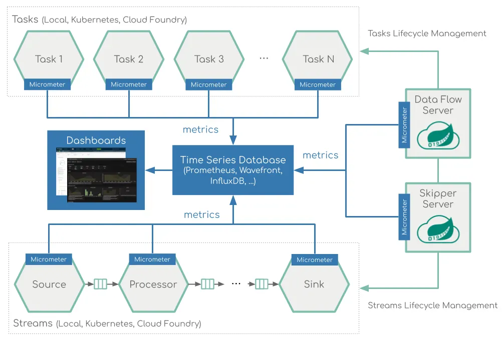
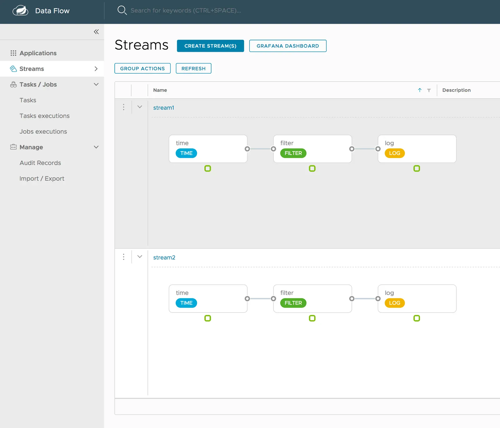
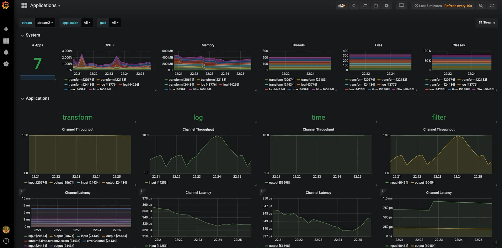
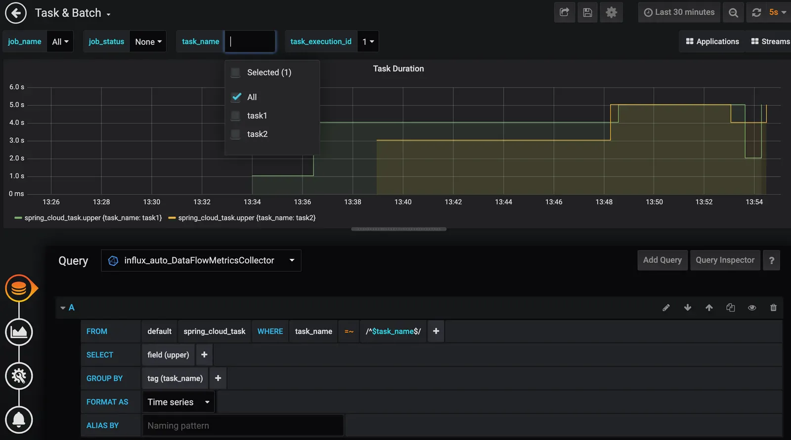

---

서버 인프라와 배포한 스트림/태스크 파이프라인의 상태, 성능 정보를 파악할 수 있는 핵심 메트릭을 전송하는 일은 Data Flow 모니터링 아키텍처가 도와준다.

Micrometer 라이브러리를 중심으로 설계한 Data Flow 모니터링에선 [프로메테우스](https://prometheus.io/), [Wavefront](https://www.wavefront.com/), [InfluxDB](https://www.influxdata.com/)같이 가장 많이 사용하는 모니터링 시스템을 활용할 수 있다.



[Wavefront](https://docs.wavefront.com/wavefront_introduction.html)는 지표를 3D로 관찰할 수 있는 (메트릭, 히스토그램, trace, span) 고성능 스트리밍 분석 플랫폼이다. 전체 애플리케이션 스택에 걸쳐 있는 수많은 서비스와 소스에서 데이터를 수집하면서, 동시에 매우 빠르게 데이터를 수집<sup>ingestion</sup>하고 동시에 수 많은 질의를 수행하도록 확장할 수 있다.

[프로메테우스](https://prometheus.io/)는 타겟 애플리케이션에 미리 설정해둔 엔드포인트에서 메트릭을 가져오고, 실시간으로 시계열 데이터를 선택하고 집계할 수 있는 쿼리 언어를 제공하는 인기 있는 pull 기반 시계열 데이터베이스다.

> Data Flow 아키텍처에선 `long-lived`(스트림) 애플리케이션과 `short-lived`(태스크) 애플리케이션 지원을 위해 동일하게 [Prometheus RSocket Proxy](https://github.com/micrometer-metrics/prometheus-rsocket-proxy)를 이용한다.

[InfluxDB](https://www.influxdata.com/)는 인기 있는 오픈 소스 push 기반 시계열 데이터베이스다. 다운샘플링, 원치 않는 데이터 자동 만료/삭제, 백업/복원을 지원한다. 데이터 분석은 SQL과 유사한 쿼리 언어를 통해 수행한다.

Data Flow를 사용하면 선택한 모니터링 시스템을 선언만으로 설정할 수 있다. 스프링 부트 [메트릭 설정](../../Spring%20Boot/metrics#861-getting-started)을 이용해 Data Flow 모니터링 기능을 활성화하고 설정하면 된다. 보통은 Data Flow와 Skipper 서버 설정에 아래 내용을 추가한다:

```properties
management.metrics.export.<your-meter-registry>.enabled=true # (1)
management.metrics.export.<your-meter-registry>.<meter-specific-properties>=... # (2) 
```
<small><span style="background-color: #a9dcfc; border-radius: 50px;">(1)</span> `<your-meter-registry>`를 `influx`나 `wavefront`, `prometheus`로 치환해라. (참고: 프로메테우스를 사용한다면 Prometheus Rsocket 프록시도 활성해라: `management.metrics.export.prometheus.rsocket.enabled=true`).</small><br>
<small><span style="background-color: #a9dcfc; border-radius: 50px;">(2)</span> [Wavefront](../../Spring%20Boot/metrics#wavefront), [InfluxDB](../../Spring%20Boot/metrics#influx), [Prometheus](../../Spring%20Boot/metrics#prometheus)/[RSocket Proxy](https://github.com/micrometer-metrics/prometheus-rsocket-proxy)를 위해 제공하는 스프링 부트, Micrometer 전용 설정을 사용한다.</small>

기본적으론 서버 인프라 모니터링과 데이터 파이프라인 모니터링 둘다 이 Micrometer 설정을 사용한다.

Data Flow에서는 처음 시작하는 사람들을 위해 커스텀할 수 있는 [그라파나](https://grafana.com/)와 [Wavefront](https://docs.wavefront.com/ui_dashboards.html) 대시보드를 제공하고 있다.

[Wavefront Data Flow SaaS](https://www.wavefront.com/integrations/scdf) 타일<sup>tile</sup>을 선택해도 된다.

모니터링 인프라를 설정하는 자세한 방법은 아래 피처 가이드를 참고해라:

- [서버 모니터링 피처 가이드](https://dataflow.spring.io/docs/feature-guides/general/server-monitoring/)
- [스트림 모니터링 피처 가이드](https://dataflow.spring.io/docs/feature-guides/streams/monitoring/)
- [태스크 모니터링 피처 가이드](https://dataflow.spring.io/docs/feature-guides/batch/monitoring/)

다음은 Data Flow에서 모니터링과 그라파나 버튼을 활성화한 모습을 보여주는 이미지다:



다음은 그라파나 대시보드에 있는 스트림 애플리케이션 뷰다:



다음은 그라파나 대시보드에 있는 태스크 & 배치 애플리케이션 뷰다:



다음은 Wavefront 스트림 애플리케이션 대시보드다:


이어서 Data Flow 모니터링 인프라를 설정하는 세부 방법은 [서버 모니터링 피처 가이드](https://dataflow.spring.io/docs/feature-guides/general/server-monitoring/), [스트림 모니터링 피처 가이드](https://dataflow.spring.io/docs/feature-guides/streams/monitoring/), [태스크 모니터링 피처 가이드](https://dataflow.spring.io/docs/feature-guides/batch/monitoring/)를 읽어봐라.
