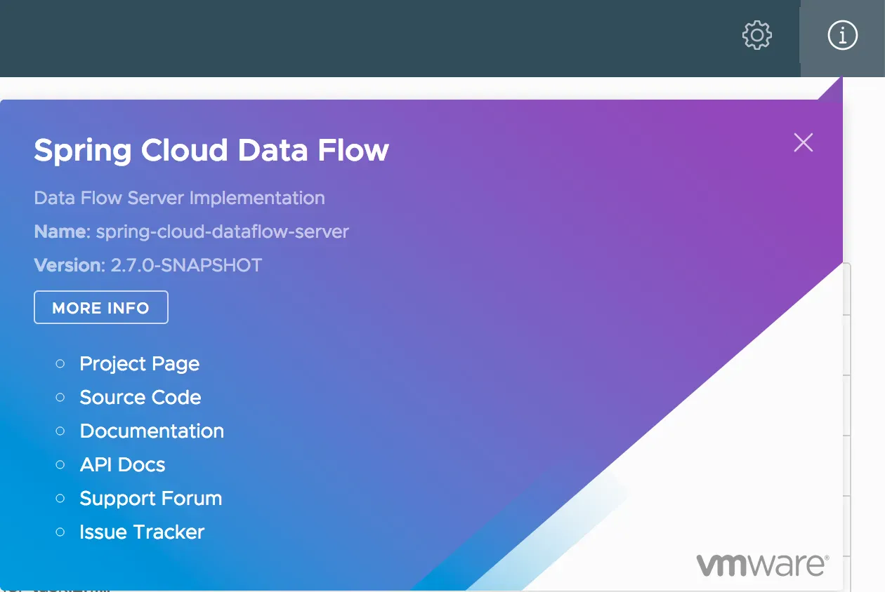
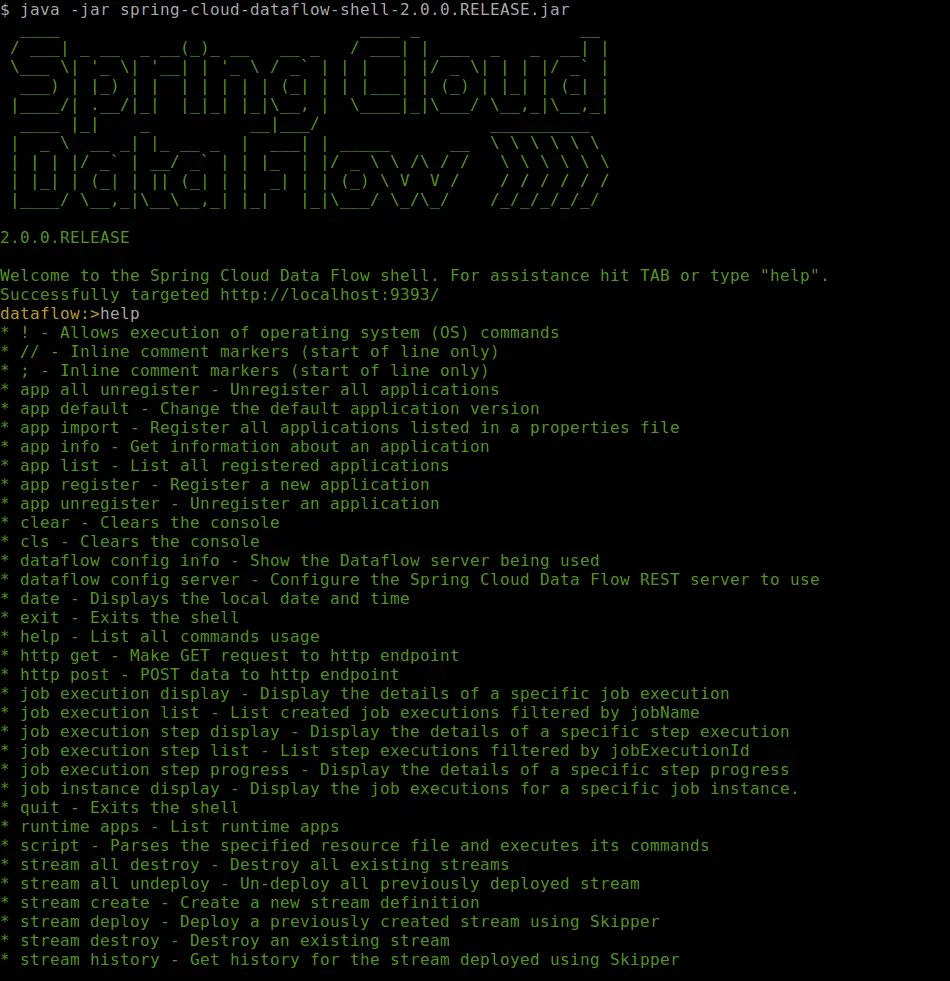

---

Spring Cloud Data Flow와 상호 작용할 땐 주로 대시보드와 쉘을 이용한다. 그외에도 curl을 통해 RESTful API를 활용할 수 있으며, 이 RESTful API를 호출하는 자바 클라이언트 라이브러리를 이용해 애플리케이션을 작성할 수도 있다. 이번 섹션에선 대시보드와 쉘이 가지고 있는 기능들을 소개한다.

### 목차

- [Dashboard](#dashboard)
- [Shell](#shell)
- [RESTful API](#restful-api)
- [Java Client](#java-client)

---

## Dashboard

Spring Cloud Data Flow는 대시보드라고 부르는 브라우저 기반 GUI를 제공한다. 왼편에 있는 여러 가지 탭들은 Data Flow의 기능들을 구성하고 있다:

- **Apps**: 등록되어 있는 모든 애플리케이션들을 조회하고, 애플리케이션을 새로 등록하거나 기존 애플리케이션의 등록을 취소할 수 있다.
- **Runtime**: 실행 중인 모든 애플리케이션들을 조회할 수 있다.
- **Streams**: 스트림 정의를 조회, 설계, 생성, 배포, 파기할 수 있다.
- **Tasks**: 태스크 정의를 조회, 생성, 기동, 예약, 파기할 수 있다.
- **Jobs**: 스프링 배치 job의 상세 히스토리를 조회하고, job을 재시작할 수 있다.
- **Audit Records**: 기록된 감사audit 이벤트에 액세스할 수 있다.
- **About**: 지원 요청 시 필요한 릴리즈 정보와, 도큐먼트 링크, Data Flow 쉘 다운로드 링크를 제공한다.

다음 이미지는 About 탭을 보여주고 있다 (대시보드 UI의 전반적인 구조도 함께):

---

## Shell

대시보드 대신 쉘로도 Data Flow와 상호 작용할 수 있다. 쉘에는 앞에 있는 [대시보드](#dashboard) 섹션에서 설명한 태스크 대부분을 동일하게 수행할 수 있는 명령어가 있다. 한 가지 예외는 감사audit 레코드 조회다.

쉘은 명령어와 스트림,배치 DSL 정의에 탭 자동 완성을 지원한다. 쉘을 Data Flow 서버에 연결할 수 있는 커맨드라인 옵션도 가지고 있다.

명령어 목록은 `help`를 입력하면 확인할 수 있으며, 각 커맨드별 도움말은 `help <command>`를 입력하면 조회할 수 있다. 다음 이미지는 커맨드 리스트 일부를 보여주고 있다:

---

## RESTful API

Data Flow의 RESTful API는 HTTP verb를 사용함에 있어 최대한 표준 HTTP와 REST 컨벤션을 따르고 있다. 예를 들어 리소스를 조회할 땐 `GET`을, 새 리소스를 생성할 땐 `POST`를 사용한다. 대시보드와 UI 모두 이 API를 사용한다.

Data Flow는 하이퍼미디어를 사용하며, 응답에 있는 리소스들은 다른 리소스에 대한 링크가 포함돼있다. 응답들은 [HALHypertext Application from resource-to-resource Language](http://stateless.co/hal_specification.html) 형식을 따른다. 링크는 `_links` 키 아래에서 찾을 수 있다. API 사용자가 직접 URI를 만드는 게 아니다. 그대신 링크를 통해 탐색해야 한다.

---

## Java Client

코드를 통해 Data Flow와 상호 작용하는 방법은 [자바 클라이언트](https://dataflow.spring.io/docs/feature-guides/streams/java-dsl/)를 위한 피쳐 가이드에서 자세히 다룬다.