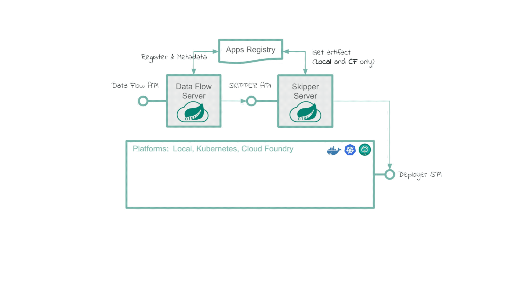
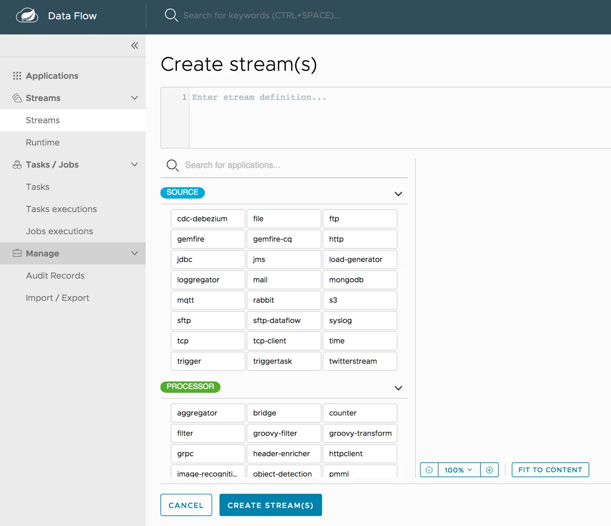
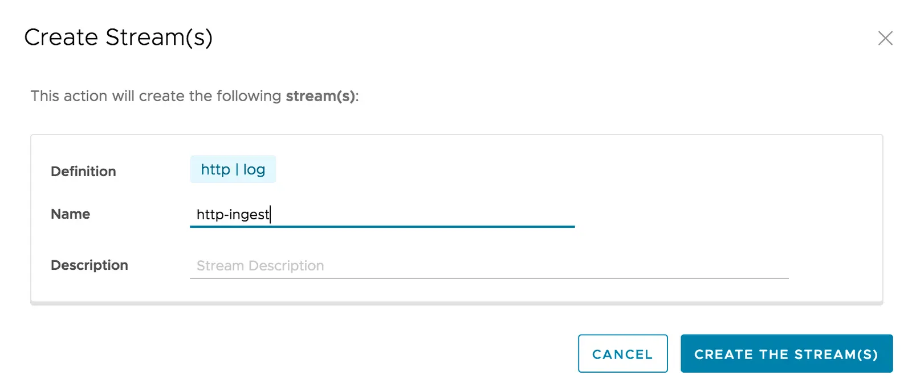
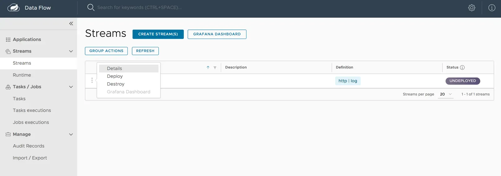
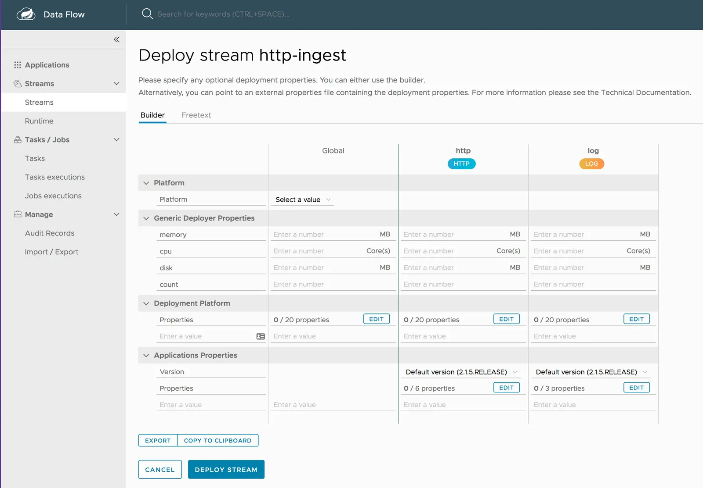
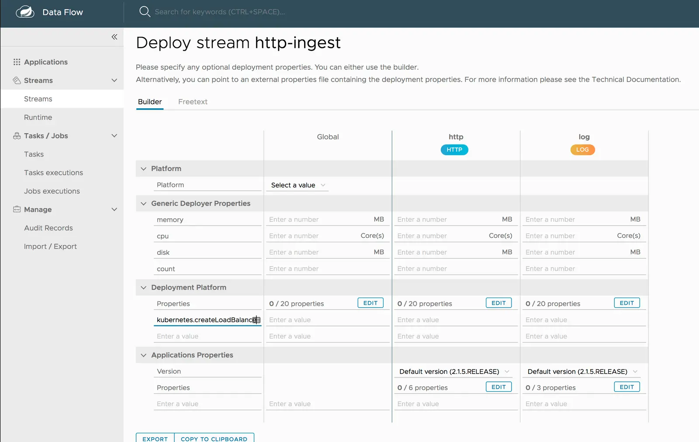

---

Spring Cloud Data Flow는 대표적인 스트리밍 유스 케이스 구현에 바로 쓸 수 있는 애플리케이션을 70개 이상 미리 빌드해서 제공하고 있다. 이 가이드에선 이 애플리케이션 중 두 가지를 이용해서 외부 HTTP 요청으로 받은 데이터를 생산<sup>produce</sup>하고, 페이로드를 터미널에 기록하는 식으로 해당 데이터를 컨슘<sup>consume</sup>하는 간단한 데이터 파이프라인을 구성해본다.

미리 빌드된 이 애플리케이션들을 Data Flow에 등록하기 위한 가이드는 [설치 가이드](../installation)에 나와 있다.

### 목차

- [Stream DSL overview](#stream-dsl-overview)
- [Creating the Stream](#creating-the-stream)
- [Deploying a Stream](#deploying-a-stream)
- [Verifying Output](#verifying-output)
  + [Local](#local)
    * [Test Data](#test-data)
    * [Results](#results)
  + [Cloud Foundry](#cloud-foundry)
      * [Test Data](#test-data-1)
      * [Results](#results-1)
  + [Kubernetes](#kubernetes)
      * [Test Data](#test-data-2)
      * [Results](#results-2)
- [Deleting a Stream](#deleting-a-stream)
- [Updating and Rolling back a Stream](#updating-and-rolling-back-a-stream)
- [Monitoring](#monitoring)

---

## Stream DSL overview

스트림은 자바 코드 뿐만 아니라 쉘이나 대시보드를 통해 DSL<sup>Domain Specific Language</sup>로 생성할 수 있다. 대시보드를 사용하면 애플리케이션을 드래그 앤 드롭으로 팔레트에 옮기고 시각적으로도 연결할 수 있다. 대시보드는 양방향이기 때문에, UI를 통한 시각적 작업은 DSL을 업데이트하게 된다. 마찬가지로 DSL을 수정하면 스트림 뷰도 업데이트된다.

DSL은 유닉스 파이프와 필터 구문으로 모델링했다. 예를 들어 `http | log`로 정의한 스트림 DSL은 HTTP post로 받은 데이터를 메세징 미들웨어로 전송하는 `http` 애플리케이션을 나타낸다. `log` 애플리케이션은 메세징 미들웨어에서 해당 데이터를 가지고 있는 메세지를 받아 터미널에 기록한다. DSL에 있는 각 이름은 애플리케이션 등록 프로세스를 통해 애플리케이션에 연결된다. 이 애플리케이션들은 `|` 기호를 통해 연결되는데, 이 기호는 애플리케이션 사이에 있는 "파이프" 역할을 담당하는 메세징 미들웨어를 나타낸다.

다음은 스트림 처리 라이프사이클을 도식화한  다이어그램이다:



---

## Creating the Stream

스트림을 생성하려면:

1. 메뉴에서 **Streams**를 클릭해라.

2. **Create Stream(s)** 버튼을 클릭해라.

   화면이 다음과 같이 바뀔 거다:

   

3. 텍스트 영역에 `http | log`를 입력해라.

4. **Create Stream**을 클릭한다.

5. 스트림 이름에는 다음과 같이 `http-ingest`를 입력해라:
   
   

6. **Create the stream** 버튼을 클릭한다.

   스트림 정의 페이지로 이동할 거다.
   
   

---

## Deploying a Stream

스트림을 정의했으므로 이제 스트림을 배포할 수 있다. 배포하려면:

1. 앞에서 생성한 `http-ingest` 정의 옆에 있는 play (deploy) 버튼을 클릭한다.
   
   

   UI에선 `http-ingest` 스트림의 앱에 적용할 수 있는 가능한 프로퍼티들을 보여준다. 아래 이미지에 나오는 예시에선 기본값을 사용한다:
   
   

   > 로컬 Data Flow 서버를 사용한다면 아래 배포 프로퍼티를 추가해서 충돌이 없는 포트를 설정해라:
   >
   > 

   > Spring Cloud Data Flow를 쿠버네티스 환경에 배포한다면, `http` 소스 애플리케이션에서 서비스를 외부에 노출할 수 있도록 다음과 같이 배포 프로퍼티  `kubernetes.createLoadBalancer`를 `true`로 설정해라:
   >
   > 

2. **Deploy Stream** 버튼을 클릭해라.

   UI는 정의 페이지로 되돌아간다.

   스트림은 이제 `deploying` 상태에 있으며, 배포가 완료되고 나면 `deployed`로 바뀐다. 업데이트된 상태를 보려면 브라우저를 리프레시해야 할 수도 있다.

---

## Verifying Output

애플리케이션이 배포되고 나면 출력 로그를 확인할 수 있다. 그 방법은 애플리케이션을 어디에서 실행하느냐에 따라 다르다:

- [로컬](#local)
- [클라우드 파운드리](#cloud-foundry)
- [쿠버네티스](#kubernetes)

### Local

여기서는 로컬 서버에서 애플리케이션을 실행할 때 출력 로그를 검증하는 방법을 설명한다.

#### Test Data

스트림이 배포를 마치고 실행 중이라면 데이터를 전송해볼 수 있다. 아래 curl 커맨드를 사용하면 된다:

```bash
curl http://localhost:20100 -H "Content-type: text/plain" -d "Happy streaming"
```

#### Results

스트림이 배포됐다면 스트림의 로그를 볼 수 있다. 그러려면:

1. 메뉴에서 **Runtime**을 클릭한다.

2. `http-ingest.log`를 클릭해라.

3. 대시보드에서 `stdout` 텍스트 박스에 있는 경로를 복사해라.

4. 콘솔 창을 하나 더 열어 다음을 입력하고, `/path/from/stdout/textbox/in/dashboard`는 앞에서 복사한 값으로 바꿔라:

   ```sh
   $ docker exec -it skipper tail -f /path/from/stdout/textbox/in/dashboard
   ```

   새 창에 log 싱크의 출력 결과가 보일 거다. 아래와 같은 내용이 출력되어야 한다.

```console
log-sink                                 : Happy streaming
```

전송한 http 요청만큼 로그가 출력되면 Ctrl+C를 눌러 `tail` 커맨드를 종료해라.

### Cloud Foundry

여기서는 클라우드 파운드리에서 애플리케이션을 실행할 때 출력 로그를 검증하는 방법을 설명한다.

#### Test Data

스트림이 배포를 마치고 클라우드 파운드리에서 실행 중이라면 데이터를 전송해볼 수 있다. 아래 curl 커맨드를 사용하면 된다:

```bash
curl http://http-ingest-314-log-v1.cfapps.io -H "Content-type: text/plain" -d "Happy streaming"
```

#### Results

다음과 같이 실행 중인 애플리케이션들을 재확인하고 배포한 애플리케이션을 찾으면 된다:

```sh
$ cf apps                                                                                                                                                                                                                                         [1h] ✭
Getting apps in org ORG / space SPACE as email@pivotal.io...

name                         requested state   instances   memory   disk   urls
http-ingest-314-log-v1       started           1/1         1G       1G     http-ingest-314-log-v1.cfapps.io
http-ingest-314-http-v1      started           1/1         1G       1G     http-ingest-314-http-v1.cfapps.io
skipper-server               started           1/1         1G       1G     skipper-server.cfapps.io
dataflow-server              started           1/1         1G       1G     dataflow-server.cfapps.io
```

이제 로그는 아래처럼 확인할 수 있다:

```sh
cf logs http-ingest-314-log-v1
...
...
2017-11-20T15:39:43.76-0800 [APP/PROC/WEB/0] OUT 2017-11-20 23:39:43.761  INFO 12 --- [ http-ingest-314.ingest-314-1] log-sink                                 : Happy streaming
```

### Kubernetes

여기서는 쿠버네티스에서 애플리케이션을 실행할 때 출력 로그를 검증하는 방법을 설명한다.

명령어를 통해 HTTP 서비스 URL을 가져와라.

로드 밸런서를 지원하는 클러스터에 배포하고 있다면, 아래 명령어로 HTTP 서비스 주소를 알아낼 수 있다:

```bash
export SERVICE_URL="$(kubectl get svc --namespace default http-ingest-http-v1 -o jsonpath='{.status.loadBalancer.ingress[0].ip}'):8080"
```

LoadBalancer IP를 사용할 수 있으려면 몇 분 정도 소요될 수 있다. `kubectl get svc -w http-ingest-http-v1`을 실행하면 서버의 상태를 지켜볼 수 있다.

Minikube를 사용한다면 아래 명령어로 서버의 URL을 가져올 수 있다:

```bash
export SERVICE_URL=$(minikube service --url test-http-v1)
```

이제 다음 명령어를 입력하면 애플리케이션의 HTTP URL을 볼 수 있다:

```sh
echo $SERVICE_URL
```

#### Test Data

스트림이 배포를 마치고 쿠버네티스에서 실행 중이라면 데이터를 전송해볼 수 있다. 아래 curl 커맨드를 사용하면 된다:

```bash
curl $SERVICE_URL -H "Content-type: text/plain" -d "Happy streaming"
```

#### Results

결과는 아래 예시와 유사할 거다:

```bash
kubectl get pods
NAME                              READY     STATUS    RESTARTS   AGE
http-ingest-log-v1-0-2k4r8          1/1       Running   0          2m
http-ingest-http-v1-qhdqq           1/1       Running   0          2m
mysql-777890292-z0dsw               1/1       Running   0          49m
rabbitmq-317767540-2qzrr            1/1       Running   0          49m
scdf-server-2734071167-bjd3g        1/1       Running   0          12m
skipper-2408247821-50z31            1/1       Running   0          15m
```

이제 다음과 같이 로그를 검증해보면 된다:

```bash
kubectl logs -f http-ingest-log-v1-0-2k4r8
...
...
2017-10-30 22:59:04.966  INFO 1 --- [ http-ingest.http.http-ingest-1] log-sink                                 : Happy streaming
```

---

## Deleting a Stream

생성한 스트림은 삭제할 수 있다. 스트림을 삭제하고 싶으면:

1. 메뉴에서 **Streams**를 클릭해라.
2. `http-ingest` 행에서 를 클릭해라.
3. **Destroy Stream**을 클릭해라.
4. 컨펌 메시지가 보이면 **Destroy Stream Definition(s)**을 클릭해라.

---

## Updating and Rolling back a Stream

이 내용은 [Continuous Delivery](../stream-developer-guides.continuous-delivery) 가이드를 확인하면 된다.

---


## Monitoring

이 내용은 [스트림 모니터링](https://dataflow.spring.io/docs/feature-guides/streams/monitoring/) 가이드를 확인하면 된다.