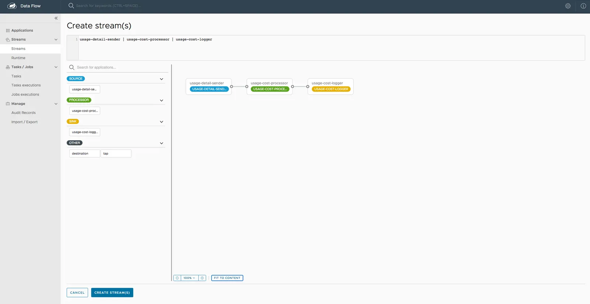
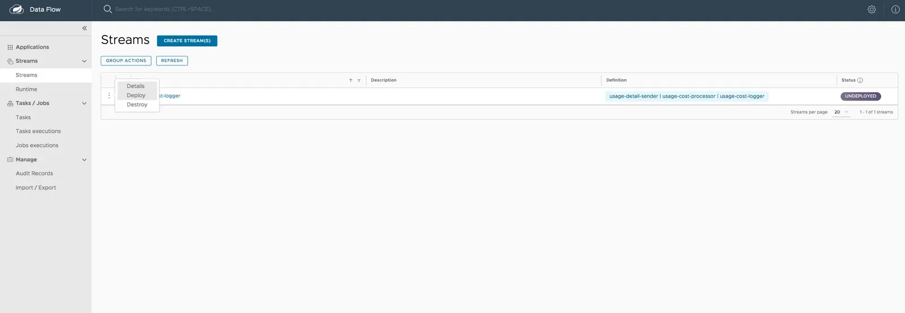
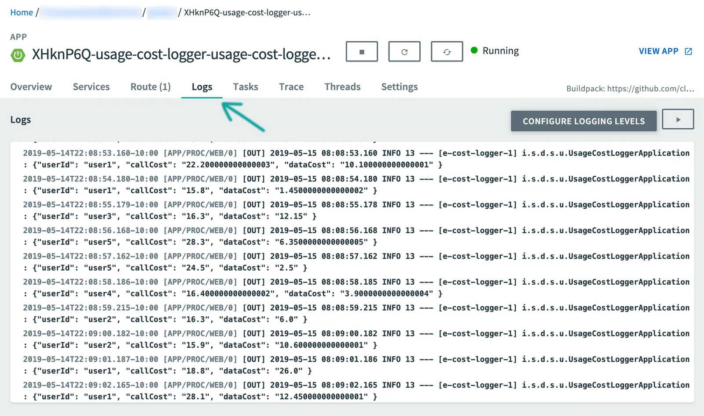

---

이 섹션에선 스트림 애플리케이션을 Data Flow에 등록하고, Stream DSL을 생성해서 클라우드 파운드리, 쿠버네티스, 로컬 머신에 이 스트림을 배포하는 방법을 보여준다.

앞에서는 `Source`, `Processor`, `Sink` 스트리밍 애플리케이션을 만들고 여러 가지 플랫폼에 독립형 애플리케이션으로 배포해봤다. 이번 가이드에선 이 애플리케이션들을 Data Flow에 등록하고, Stream DSL을 생성해서 클라우드 파운드리, 쿠버네티스, 로컬 머신에  스트림을 배포해본다.


### 목차

- [Development](#development)
  + [The Data Flow Dashboard](#the-data-flow-dashboard)
  + [Application Registration](#application-registration)
  + [Creating the Stream Definition](#creating-the-stream-definition)
- [Deployment](#deployment)
  + [Local](#local)
  + [Cloud Foundry](#cloud-foundry)
  + [Kubernetes](#kubernetes)
    * [Registering Applications with Spring Cloud Data Flow server](#registering-applications-with-spring-cloud-data-flow-server)
    * [Stream Deployment](#stream-deployment)
- [Comparison with Standalone Deployment](#comparison-with-standalone-deployment)

---

## Development

이전 가이드에서 다뤘던 샘플 애플리케이션들은 전부 메이븐 레포지토리 `https://repo.spring.io`에 있는 `maven`과 `docker` 아티팩트로 이용할 수 있다.

`UsageDetailSender` 소스는 다음 중 하나를 사용해라:

```sh
maven://io.spring.dataflow.sample:usage-detail-sender-rabbit:0.0.1-SNAPSHOT
```

```sh
docker://springcloudstream/usage-detail-sender-rabbit:0.0.1-SNAPSHOT
```

`UsageCostProcessor` 프로세서는 다음 중 하나를 사용해라:

```sh
maven://io.spring.dataflow.sample:usage-cost-processor-rabbit:0.0.1-SNAPSHOT
```

```sh
docker://springcloudstream/usage-cost-processor-rabbit:0.0.1-SNAPSHOT
```

`UsageCostLogger` 싱크는 다음 중 하나를 사용해라:

```sh
maven://io.spring.dataflow.sample:usage-cost-logger-rabbit:0.0.1-SNAPSHOT
```

```sh
docker://springcloudstream/usage-cost-logger-rabbit:0.0.1-SNAPSHOT
```

### The Data Flow Dashboard

지원하는 플랫폼에 Data Flow를 [설치](../installation)하고 기동시켜 놨다면, 브라우저를 열어 `<data-flow-url>/dashboard`에 접속해라. 이때 `<data-flow-url>`은 플랫폼에 따라 달라진다. 설치한 Data Flow의 베이스 URL을 알아내고 싶다면 [설치 가이드](../installation)를 참고해라. Data Flow를 로컬 머신에서 실행 중이라면 http://localhost:9393/dashboard로 이동해라.

### Application Registration

Spring Cloud Data Flow에 애플리케이션을 등록할 땐 지정한 리소스 이름을 통해 등록한다. 따라서 Data Flow DSL을 사용해 스트리밍 파이프라인을 설정하고 구성할 땐 이 리소스 이름을 참조하면 된다. 애플리케이션을 등록하면, 논리적인 애플리케이션 이름과 타입이 URI로 제공한 물리적인 리소스와 연결된다.

이 URI는 [스키마](https://docs.spring.io/spring-cloud-dataflow/docs/current/reference/htmlsingle/#spring-cloud-dataflow-register-stream-apps)를 따르고 있으며, 메이븐 아티팩트나 도커 이미지, 또는 실제 `http(s)`나 `file` URL을 나타낼 수 있다. Data Flow에선 스트리밍 컴포넌트나 태스크, 독립 실행형 애플리케이션과 같은 롤을 나타내는 몇 가지 논리적인 애플리케이션 타입을 정의하고 있다. 스트리밍 애플리케이션에선, 예상하고 있겠지만, `Source`, `Processor`, `Sink` 타입을 사용한다.

Data Flow 대시보드에는 다음과 같이 소스, 프로세서, 싱크 애플리케이션을 등록할 수 있는 Application Registration 뷰가 포함돼 있다.


이번에는 앞에서 만들었던 애플리케이션을 등록해본다. 애플리케이션을 등록할 땐 아래 내용들을 제공해서 등록한다:

- Location URI (메이븐, HTTP, 도커, 파일 등)
- 애플리케이션 버전
- 애플리케이션 타입 (소스, 프로세서, 싱크)
- 애플리케이션 이름

다음은 이전 가이드에서 만들었던 애플리케이션들을 정리해놓은 테이블이다:

| App Name               | App Type  | App URI                                                      |
| ---------------------- | --------- | ------------------------------------------------------------ |
| `usage-detail-sender`  | Source    | maven://io.spring.dataflow.sample:usage-detail-sender-rabbit:0.0.1-SNAPSHOT |
| `usage-cost-processor` | Processor | maven://io.spring.dataflow.sample:usage-cost-processor-rabbit:0.0.1-SNAPSHOT |
| `usage-cost-logger`    | Sink      | maven://io.spring.dataflow.sample:usage-cost-logger-rabbit:0.0.1-SNAPSHOT |

> Spring Cloud Data Flow 서버를 도커 환경에서 실행한다면, 애플리케이션 아티팩트 URI가  접근할 수 있는 URI인지 확인해봐야 한다. 예를 들어 애플리케이션이 있는 곳에 접근할 수 있도록 설정해놓지 않았다면 SCDF나 Skipper 도커 컨테이너에선 `file:/`에 액세스하지 못 할 거다. 애플리케이션 URI에는 `http://`나, `maven://`, `docker://`를 사용하길 권장한다.

이번 예시에선 Spring Cloud Data Flow와 Skipper 서버를 로컬 개발 환경에서 실행한다고 가정한다.

소스 애플리케이션 `UsageDetailSender`부터 등록해보자. 그러려면:

1. Applications 뷰에서 **ADD APPLICATION(S)**를 선택한다. 애플리케이션을 등록할 수 있는 뷰가 보일 거다.

2. **Register one or more applications**를 선택하고, 소스 애플리케이션의 `name`, `type`, `URI`를 입력해라.

3. 다음과 같이 `UsageDetailSender` 애플리케이션(`usage-detail-sender`)의 `maven` 아티팩트를 등록해라:

   > (uri = `maven://io.spring.dataflow.sample:usage-detail-sender-rabbit:0.0.1-SNAPSHOT`)

   `docker` 아티팩트를 사용한다면, 아래 URI로 등록하면 된다:

   > (uri = `docker://springcloudstream/usage-detail-sender-rabbit:0.0.1-SNAPSHOT`)

4. **NEW APPLICATION**을 클릭해서 프로세서의 값을 입력할 폼을 하나 더 띄운다.

5. 다음과 같이 프로세서 애플리케이션 `UsageCostProcessor`(`usage-cost-processor`)의 `maven` 아티팩트를 등록해라:

   > (uri = `maven://io.spring.dataflow.sample:usage-cost-processor-rabbit:0.0.1-SNAPSHOT`)

   `docker` 아티팩트를 사용한다면, 아래 URI로 등록하면 된다:

   > (uri = `docker://springcloudstream/usage-cost-processor-rabbit:0.0.1-SNAPSHOT`)

6. **NEW APPLICATION**을 클릭해서 싱크의 값을 입력할 폼을 하나 더 띄운다.

7. 다음과 같이 싱크 애플리케이션 `UsageCostLogger`(`usage-cost-logger`)의 `maven` 아티팩트를 등록해라:

   > (uri = `maven://io.spring.dataflow.sample:usage-cost-logger-rabbit:0.0.1-SNAPSHOT`)

   `docker` 아티팩트를 사용한다면, 아래 URI로 등록하면 된다:

   > (uri = `docker://springcloudstream/usage-cost-logger-rabbit:0.0.1-SNAPSHOT`)

   

8. **IMPORT APPLICATION(S)**을 클릭해 등록을 완료한다. 이렇게 하면 애플리케이션들을 보여주는 Applications 뷰로 되돌아간다. 다음 이미지는 화면 예시다:

   

### Creating the Stream Definition

스트림 정의를 생성하려면:

1. 왼쪽 네비게이션 바에서 **Streams**를 선택한다. 다음과 같은 메인 Streams 뷰가 보일 거다:

   

2. **Create stream(s)**을 선택하고, 다음 이미지와 같이 스트림 정의를 생성하는 그래픽 에디터를 띄운다:
   
   

   위에서 등록한 `Source`, `Processor`, `Sink` 애플리케이션들은 왼쪽 패널에서 확인할 수 있다.

3. 각 애플리케이션을 캔버스로 끌어다 놓은 다음 핸들을 이용해 애플리케이션들을 연결해라. 캔버스 상태에 따라 바뀌는 상단 텍스트 패널의 Data Flow DSL 정의에 주목해라.

4. `Create Stream`을 클릭해라.

   You can type the name of the stream `usage-cost-logger` when creating the stream.
   
   스트림을 생성할 때 스트림 이름을 `usage-cost-logger`로 입력하면 된다.

---

## Deployment

이 스트림을 배포하려면:

1. 스트림을 배포하려면 화살표 헤드 아이콘을 클릭한다. 추가적인 배포 프로퍼티를 입력할 수 있는 스트림 배포 페이지로 이동할 거다.

2. 다음과 같이 `Deploy`를 선택해라:

   

3. When deploying the stream, choose the target platform accounts from local, Kubernetes, or Cloud Foundry. This is based on the Spring Cloud Skipper server deployer platform account setup.

3. 스트림을 배포할 때는 로컬, 쿠버네티스, 클라운드 파운드리 중에 원하는 타겟 플랫폼 계정을 선택한다. Spring Cloud Skipper 서버 deployer 플랫폼 계정 설정을 기반으로 선택할 수 있다.

   

   모든 애플리케이션이 실행되고 나면 스트림 배포가 완료된다.

   

위 프로세스는 기본적으로 모든 플랫폼에서 동일하다. 이어지는 섹션에선 로컬, 클라우드 파운드리, 쿠버네티스 환경에 Data Flow를 설치했을 때 플랫폼별로 확인할 수 있는 배포 세부 정보를 설명한다.

### Local

> 스트림을 `local` 환경에 배포한다면, 모든 애플리케이션이 `local`에서 서로 다른 포트를 사용할 수 있도록 애플리케이션 프로퍼티 `server.port`에 각각 고유한 값을 설정해야 한다.

스트림을 `local` 개발 환경에 배포하고 나면, 대시보드의 런타임 페이지나 SCDF 쉘 명령어 `runtime apps`를 사용해 런타임 애플리케이션들을 조회할 수 있다. 각 런타임 애플리케이션들이 실행되는 로컬 환경 위치와 해당 로그 파일 위치 정보를 확인 수 있다.

> 도커에서 SCDF를 실행하고 있다면, 아래 명령어로 스트리밍 애플리케이션의 로그 파일에 접근할 수 있다 (출력 문구도 함께 표기했다):
>
> ```sh
> docker exec <stream-application-docker-container-id> tail -f <stream-application-log-file>
> ```
>
> ```sh
> 2019-04-19 22:16:04.864  INFO 95238 --- [container-0-C-1] c.e.demo.UsageCostLoggerApplication      : {"userId": "Mark", "callCost": "0.17", "dataCost": "0.32800000000000007" }
> 2019-04-19 22:16:04.872  INFO 95238 --- [container-0-C-1] c.e.demo.UsageCostLoggerApplication      : {"userId": "Janne", "callCost": "0.20800000000000002", "dataCost": "0.298" }
> 2019-04-19 22:16:04.872  INFO 95238 --- [container-0-C-1] c.e.demo.UsageCostLoggerApplication      : {"userId": "Ilaya", "callCost": "0.175", "dataCost": "0.16150000000000003" }
> 2019-04-19 22:16:04.872  INFO 95238 --- [container-0-C-1] c.e.demo.UsageCostLoggerApplication      : {"userId": "Glenn", "callCost": "0.145", "dataCost": "0.269" }
> 2019-04-19 22:16:05.256  INFO 95238 --- [container-0-C-1] c.e.demo.UsageCostLoggerApplication      : {"userId": "Ilaya", "callCost": "0.083", "dataCost": "0.23800000000000002" }
> 2019-04-19 22:16:06.257  INFO 95238 --- [container-0-C-1] c.e.demo.UsageCostLoggerApplication      : {"userId": "Janne", "callCost": "0.251", "dataCost": "0.026500000000000003" }
> 2019-04-19 22:16:07.264  INFO 95238 --- [container-0-C-1] c.e.demo.UsageCostLoggerApplication      : {"userId": "Janne", "callCost": "0.15100000000000002", "dataCost": "0.08700000000000001" }
> 2019-04-19 22:16:08.263  INFO 95238 --- [container-0-C-1] c.e.demo.UsageCostLoggerApplication      : {"userId": "Sabby", "callCost": "0.10100000000000002", "dataCost": "0.33" }
> 2019-04
> ```

### Cloud Foundry

앞에서 설명하는 가이드대로 스트림 애플리케이션을 클라우드 파운드리에 등록하고 배포하려면 먼저, 클라우드 파운드리에서 Spring Cloud Data Flow 인스턴스를 실행 중인지를 확인해봐야 한다. 클라우드 파운드리 [설치 가이드](../installation.cloudfoundry.cli)를 참고하면 된다.

이 챕터 앞에서 설명한 단계대로 애플리케이션들을 등록하고 스트림을 배포했다면, 다음과 같이 클라우드 파운드리의 Org와 Space에 정상적으로 배포된 애플리케이션을 확인할 수 있다.


Spring Cloud Data Flow 대시보드에서도 스트림 애플리케이션의 런타임 정보를 조회할 수 있다.

스트림의 런타임 상태 외에도, `usage-cost-logger` 싱크에서 만드는 로그가 잘 출력되는지도 확인해 봐야 한다. Cloud Foundry Apps Manager에서 `usage-cost-logger` 싱크 애플리케이션의 **Logs** 탭을 클릭해라. 다음과 같은 로그 구문이 보일 거다:



### Kubernetes

쿠버네티스 환경에 Spring Cloud Data Flow 서버를 띄워놨다면 ([설치 가이드](../installation.kubernetes)를 따라서), 다음과 같은 일들을 진행할 수 있다:

- 스트림 애플리케이션들 등록
- 스트림을 생성, 배포, 관리

#### Registering Applications with Spring Cloud Data Flow server

쿠버네티스 환경에선 애플리케이션 아티팩트에 `docker` 이미지를 사용해야 한다.

`UsageDetailSender` 소스에는 다음을 사용해라:

```sh
docker://springcloudstream/usage-detail-sender-rabbit:0.0.1-SNAPSHOT
```

`UsageCostProcessor` 프로세서에는 다음을 사용해라:

```sh
docker://springcloudstream/usage-cost-processor-rabbit:0.0.1-SNAPSHOT
```

`UsageCostLogger` 싱크에는 다음을 사용해라:

```sh
docker://springcloudstream/usage-cost-logger-rabbit:0.0.1-SNAPSHOT
```

이 애플리케이션들은 [앞서 설명한](#application-registration) 등록 스텝에 따라 등록해주면 된다.

#### Stream Deployment

애플리케이션들을 등록했다면 [위에 있는](#deployment) 스트림 배포 가이드에 따라 스트림을 배포하면 된다.

##### Listing the Pods

포드들을 조회하려면 (서버 컴포넌트들과 스트리밍 애플리케이션을 함께) 다음 명령어를 실행해라 (출력 문구도 함께 표기했다):

```bash
 kubectl get pods
```

```console
NAME                                                         READY   STATUS    RESTARTS   AGE
scdf-release-data-flow-server-795c77b85c-tqdtx               1/1     Running   0          36m
scdf-release-data-flow-skipper-85b6568d6b-2jgcv              1/1     Running   0          36m
scdf-release-mysql-744757b689-tsnnz                          1/1     Running   0          36m
scdf-release-rabbitmq-5fb7f7f644-878pz                       1/1     Running   0          36m
usage-cost-logger-usage-cost-logger-v1-568599d459-hk9b6      1/1     Running   0          2m41s
usage-cost-logger-usage-cost-processor-v1-79745cf97d-dwjpw   1/1     Running   0          2m42s
usage-cost-logger-usage-detail-sender-v1-6cd7d9d9b8-m2qf6    1/1     Running   0          2m41s
```

##### Verifying the Logs

앞 섹션에서 설명한 스텝들을 올바르게 진행한건지 확인해보려면 로그를 검증해야 한다. 다음은 로그에 예상한 값들이 출력되고 있는지를 검증하는 방법을 보여주는 예시다 (출력 문구와 함께 표기했다):

```bash
kubectl logs -f usage-cost-logger-usage-cost-logger-v1-568599d459-hk9b6
```

```sh
2019-05-17 17:53:44.189  INFO 1 --- [e-cost-logger-1] i.s.d.s.u.UsageCostLoggerApplication     : {"userId": "user2", "callCost": "0.7000000000000001", "dataCost": "23.950000000000003" }
2019-05-17 17:53:45.190  INFO 1 --- [e-cost-logger-1] i.s.d.s.u.UsageCostLoggerApplication     : {"userId": "user4", "callCost": "2.9000000000000004", "dataCost": "10.65" }
2019-05-17 17:53:46.190  INFO 1 --- [e-cost-logger-1] i.s.d.s.u.UsageCostLoggerApplication     : {"userId": "user3", "callCost": "5.2", "dataCost": "28.85" }
2019-05-17 17:53:47.192  INFO 1 --- [e-cost-logger-1] i.s.d.s.u.UsageCostLoggerApplication     : {"userId": "user4", "callCost": "1.7000000000000002", "dataCost": "30.35" }
```

---

## Comparison with Standalone Deployment

이번 섹션에선 Spring Cloud Data Flow와 스트림 DSL을 이용해서 스트림을 배포해봤다:

```sh
usage-detail-sender | usage-cost-processor | usage-cost-logger
```

이 세 가지 애플리케이션들을 독립형 애플리케이션으로 배포할 때는, 애플리케이션들을 하나의 스트림으로 연결하기 위해 바인딩 프로퍼티를 설정해야 했다.

반면 Spring Cloud Data Flow를 사용하면, 각 애플리케이션들을 연결해 Data Flow 형성만 잘해주면 세 가지 스트리밍 애플리케이션을 모두 단일 스트림으로 배포할 수 있다.