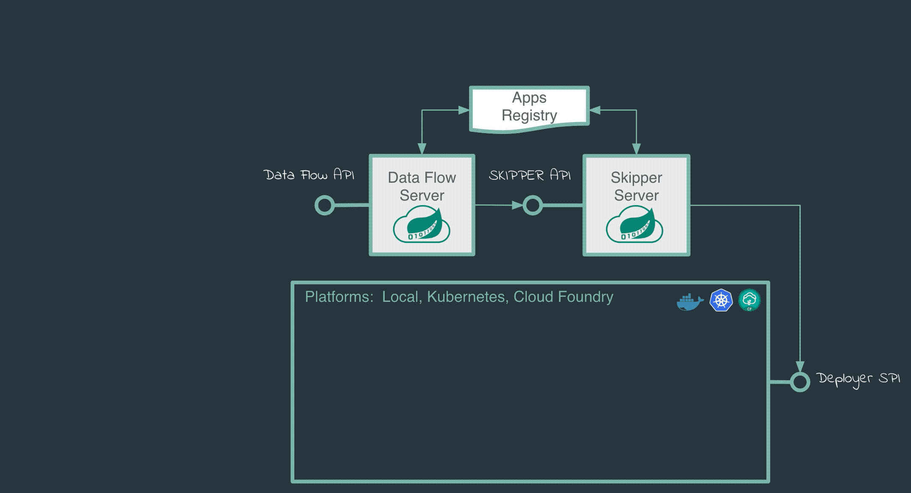

---

한 번씩 스트리밍 데이터 파이프라인을 구성하고 있는 애플리케이션들을 변경해야 할 때가 있다. 버그를 수정하거나 애플리케이션 프로퍼티 설정 값을 바꾼 새 버전으로 올릴 때가 그렇다. 중간에 스트림 처리가 중단되지 않도록, 스트림에서 변경된 애플리케이션들만 롤링 업그레이드를 수행하고자 한다. 더불어 업그레이드가 원하는대로 진행되지 않았다면, 이전 버전 애플리케이션으로 빠르게 롤백할 수 있어야 한다.

Spring Cloud Data Flow는 Skipper 서버를 통해 이벤트 스트리밍 애플리케이션의 continuous delivery를 지원한다.



continuous delivery를 시연해보기 위해 Data Flow를 설치하면 미리 등록돼 있는 기본 제공 스트리밍 애플리케이션을 몇 가지 사용해보겠다.

### 목차

- [Local](#local)
  + [Stream Creation and Deployment](#stream-creation-and-deployment)
  + [Stream Update](#stream-update)
  + [Stream Rollback](#stream-rollback)
    
---

## Local

이 섹션에선 로컬 환경에서 continuous delivery를 사용하는 방법을 설명한다.

### Stream Creation and Deployment

이번 섹션에선 다음과 같은 리소스들을 생성하고 배포해본다:

- `http` 이벤트들을 수집<sup>ingest</sup>하는 소스를 하나 가지고 있는 스트림
- 변환 로직을 실행하는 `transform` 프로세서
- 변환된 이벤트 결과를 보여주는 `log` 싱크

아래 스트림 정의를 사용하면 각 애프리케이션을 `local`에 배포하면서 고유한 서버 포트를 제공할 수 있다:

```sh
stream create http-ingest --definition "http --server.port=9000 | transform --expression=payload.toUpperCase() --server.port=9001 | log --server.port=9002" --deploy
```

스트림이 배포 중인지는 `stream list` 명령어로 알 수 있다:

```sh
stream list
```

다음과 유사한 결과가 출력될 거다:

```console
╔═══════════╤══════════════════════════════════════════════════════════════════════════════════════════════════════════════════════════════╤═════════════════════════════╗
║Stream Name│                                                      Stream Definition                                                       │           Status            ║
╠═══════════╪══════════════════════════════════════════════════════════════════════════════════════════════════════════════════════════════╪═════════════════════════════╣
║http-ingest│http --server.port=9000 | transform --transformer.expression=payload.toUpperCase() --server.port=9001 | log --server.port=9002│The stream is being deployed.║
╚═══════════╧══════════════════════════════════════════════════════════════════════════════════════════════════════════════════════════════╧═════════════════════════════╝
```

스트림을 다 배포하고 나서 이 명령어를 다시 실행해보면 된다:

```sh
stream list
```

출력 내용은 스트림이 배포되었음을 나타내도록 바뀌었을 거다:

```console
╔═══════════╤══════════════════════════════════════════════════════════════════════════════════════════════════════════════════════════════╤═════════════════════════════════════════╗
║Stream Name│                                                      Stream Definition                                                       │                 Status                  ║
╠═══════════╪══════════════════════════════════════════════════════════════════════════════════════════════════════════════════════════════╪═════════════════════════════════════════╣
║http-ingest│http --server.port=9000 | transform --transformer.expression=payload.toUpperCase() --server.port=9001 | log --server.port=9002│The stream has been successfully deployed║
╚═══════════╧══════════════════════════════════════════════════════════════════════════════════════════════════════════════════════════════╧═════════════════════════════════════════╝
```

Spring Cloud Data Flow 쉘에서 몇 가지 데이터를 게시해보자:

```sh
http post --target "http://localhost:9000" --data "spring"
```

`log` 애플리케이션의 로그 파일에서 아래 내용을 확인할 수 있을 거다:

```console
log-sink                                 :  SPRING
```

`stream manifest http-ingest` 명령어는 이 스트림에 있는 모든 애플리케이션들과, 해당 버전에서 가지고 있는 프로퍼티들을 보여준다:

```sh
stream manifest http-ingest
```

다음과 유사한 결과를 볼 수 있을 거다:

```yaml
"apiVersion": "skipper.spring.io/v1"
"kind": "SpringCloudDeployerApplication"
"metadata":
  "name": "http"
"spec":
  "resource": "maven://org.springframework.cloud.stream.app:http-source-rabbit:jar"
  "resourceMetadata": "maven://org.springframework.cloud.stream.app:http-source-rabbit:jar:jar:metadata:2.1.0.RELEASE"
  "version": "2.1.0.RELEASE"
    "applicationProperties":
    "spring.metrics.export.triggers.application.includes": "integration**"
    "spring.cloud.dataflow.stream.app.label": "http"
    "spring.cloud.stream.metrics.key": "http-ingest.http.${spring.cloud.application.guid}"
    "spring.cloud.stream.bindings.output.producer.requiredGroups": "http-ingest"
    "spring.cloud.stream.metrics.properties": "spring.application.name,spring.application.index,spring.cloud.application.*,spring.cloud.dataflow.*"
    "server.port": "9000"
    "spring.cloud.stream.bindings.output.destination": "http-ingest.http"
    "spring.cloud.dataflow.stream.name": "http-ingest"
    "spring.cloud.dataflow.stream.app.type": "source"
  "deploymentProperties":
    "spring.cloud.deployer.group": "http-ingest"
---
"apiVersion": "skipper.spring.io/v1"
"kind": "SpringCloudDeployerApplication"
"metadata":
  "name": "log"
"spec":
  "resource": "maven://org.springframework.cloud.stream.app:log-sink-rabbit:jar"
  "resourceMetadata": "maven://org.springframework.cloud.stream.app:log-sink-rabbit:jar:jar:metadata:2.1.1.RELEASE"
  "version": "2.1.1.RELEASE"
    "applicationProperties":
    "spring.metrics.export.triggers.application.includes": "integration**"
    "spring.cloud.dataflow.stream.app.label": "log"
    "spring.cloud.stream.metrics.key": "http-ingest.log.${spring.cloud.application.guid}"
    "spring.cloud.stream.bindings.input.group": "http-ingest"
    "spring.cloud.stream.metrics.properties": "spring.application.name,spring.application.index,spring.cloud.application.*,spring.cloud.dataflow.*"
    "server.port": "9002"
    "spring.cloud.dataflow.stream.name": "http-ingest"
    "spring.cloud.dataflow.stream.app.type": "sink"
    "spring.cloud.stream.bindings.input.destination": "http-ingest.transform"
  "deploymentProperties":
    "spring.cloud.deployer.group": "http-ingest"
---
"apiVersion": "skipper.spring.io/v1"
"kind": "SpringCloudDeployerApplication"
"metadata":
  "name": "transform"
"spec":
  "resource": "maven://org.springframework.cloud.stream.app:transform-processor-rabbit:jar"
  "resourceMetadata": "maven://org.springframework.cloud.stream.app:transform-processor-rabbit:jar:jar:metadata:2.1.0.RELEASE"
  "version": "2.1.0.RELEASE"
    "applicationProperties":
    "spring.metrics.export.triggers.application.includes": "integration**"
    "spring.cloud.dataflow.stream.app.label": "transform"
    "spring.cloud.stream.metrics.key": "http-ingest.transform.${spring.cloud.application.guid}"
    "spring.cloud.stream.bindings.input.group": "http-ingest"
    "transformer.expression": "payload.toUpperCase()"
    "spring.cloud.stream.metrics.properties": "spring.application.name,spring.application.index,spring.cloud.application.*,spring.cloud.dataflow.*"
    "spring.cloud.stream.bindings.output.producer.requiredGroups": "http-ingest"
    "server.port": "9001"
    "spring.cloud.dataflow.stream.name": "http-ingest"
    "spring.cloud.stream.bindings.output.destination": "http-ingest.transform"
    "spring.cloud.dataflow.stream.app.type": "processor"
    "spring.cloud.stream.bindings.input.destination": "http-ingest.http"
  "deploymentProperties":
    "spring.cloud.deployer.group": "http-ingest"
```

예를 들면 `transform` 애플리케이션은 `"transformer.expression": "payload.toUpperCase()"` 프로퍼티를 가지고 있는 것을 볼 수 있다. `stream history http-ingest` 명령어는 사용 가능한 모든 버전들을 나열해주며, 이 이벤트 스트림에 관련된 히스토리를 알 수 있다:

```sh
stream history --name http-ingest
```

다음과 유사한 결과가 출력될 거다:

```console
╔═══════╤════════════════════════════╤════════╤════════════╤═══════════════╤════════════════╗
║Version│        Last updated        │ Status │Package Name│Package Version│  Description   ║
╠═══════╪════════════════════════════╪════════╪════════════╪═══════════════╪════════════════╣
║1      │Wed May 08 20:45:18 IST 2019│DEPLOYED│http-ingest │1.0.0          │Install complete║
╚═══════╧════════════════════════════╧════════╧════════════╧═══════════════╧════════════════╝
```

### Stream Update

기존에 배포한 스트림에서 `log` 애플리케이션을 다른 버전으로 사용하도록 업데이트하고 싶다면, 스트림 `update` 작업을 수행하면 된다.

먼저 필요한 `log` 애플리케이션의 버전을 등록하면 된다:

```sh
app register --name log --type sink --uri maven://org.springframework.cloud.stream.app:log-sink-rabbit:2.1.0.RELEASE
```

스트림 업데이트는 다음과 같이 수행할 수 있다:

```sh
stream update --name http-ingest --properties "version.log=2.1.0.RELEASE"
```

`stream update`를 수행했다면 아래 명령어를 실행해보면 된다:

```sh
jps
```

그러면 `log` 애플리케이션 `log-sink-rabbit-2.1.0.RELEASE.jar`가 배포되고, 기존 `log-sink-rabbit-2.1.1.RELEASE.jar`는 파기된 것을 확인할 수 있다.

스트림 업데이트가 완료되고 나면, `log` 애플리케이션의 버전이 변경되었는지는 `stream manifest`로 검증할 수 있다:

```sh
stream manifest http-ingest
```

다음과 유사한 결과를 볼 수 있을 거다:

```yaml
"apiVersion": "skipper.spring.io/v1"
"kind": "SpringCloudDeployerApplication"
"metadata":
  "name": "log"
"spec":
  "resource": "maven://org.springframework.cloud.stream.app:log-sink-rabbit:jar"
  "resourceMetadata": "maven://org.springframework.cloud.stream.app:log-sink-rabbit:jar:jar:metadata:2.1.0.RELEASE"
  "version": "2.1.0.RELEASE"
    "applicationProperties":
    "spring.metrics.export.triggers.application.includes": "integration**"
    "spring.cloud.dataflow.stream.app.label": "log"
    "spring.cloud.stream.metrics.key": "http-ingest.log.${spring.cloud.application.guid}"
    "spring.cloud.stream.bindings.input.group": "http-ingest"
    "spring.cloud.stream.metrics.properties": "spring.application.name,spring.application.index,spring.cloud.application.*,spring.cloud.dataflow.*"
    "server.port": "9002"
    "spring.cloud.dataflow.stream.name": "http-ingest"
    "spring.cloud.dataflow.stream.app.type": "sink"
    "spring.cloud.stream.bindings.input.destination": "http-ingest.transform"
  "deploymentProperties":
    "spring.cloud.deployer.count": "1"
    "spring.cloud.deployer.group": "http-ingest"
---
...
...
```

마찬가지로 작업 히스토리는 `stream history` 명령어를 통해 확인할 수 있다:

```sh
stream history --name http-ingest
```

다음과 유사한 결과가 출력될 거다:

```console
╔═══════╤════════════════════════════╤════════╤════════════╤═══════════════╤════════════════╗
║Version│        Last updated        │ Status │Package Name│Package Version│  Description   ║
╠═══════╪════════════════════════════╪════════╪════════════╪═══════════════╪════════════════╣
║2      │Wed May 08 21:34:45 IST 2019│DEPLOYED│http-ingest │1.0.0          │Upgrade complete║
║1      │Wed May 08 21:30:00 IST 2019│DELETED │http-ingest │1.0.0          │Delete complete ║
╚═══════╧════════════════════════════╧════════╧════════════╧═══════════════╧════════════════╝
```

새 버전 앱을 사용하지 않아도 애플리케이션의 설정 프로퍼티를 변경할 수 있다. `transform` 애플리케이션에서 사용한 변환 로직을 변경해 전체 스트림을 재배포하지 않고 `transform` 애플리케이션만 별도로 업데이트하고 싶다고 가정해보자. 이럴 땐 다음 명령어를 사용하면 된다:

```sh
stream update http-ingest --properties "app.transform.expression=payload.toUpperCase().concat('!!!')"
```

`stream manifest http-ingest` 명령어를 다시 실행하면 이제 `transform` 애플리케이션이 각 페이로드 끝에 `!!!`를 붙이는 expression 프로퍼티를 갖도록 바뀐 것을 확인할 수 있다.

이제 변경사항을 테스트해보자:

```sh
http post --target "http://localhost:9000" --data "spring"
```

`log` 애플리케이션의 로그 파일에서 아래 내용을 확인할 수 있을 거다:

```console
log-sink                                 : SPRING!!!
```

`stream history http-ingest` 명령어 실행 결과에선 스트림 히스토리에 새 이벤트가 추가돼 있을 거다.

### Stream Rollback

이벤트 스트림을 특정 버전으로 롤백하려면 `stream rollback http-ingest --releaseVersion <release-version>` 명령어를 사용하면 된다.

이 이벤트 스트림은 초기 버전으로 롤백할 수 있다 (`transform` 애플리케이션에서 대문자 변환만 수행하도록):

```sh
stream rollback http-ingest --releaseVersion 1
```

```sh
http post --target "http://localhost:9000" --data "spring"
```

`log` 애플리케이션의 로그 파일에서 아래 내용을 확인할 수 있을 거다:

```console
log-sink : SPRING
```