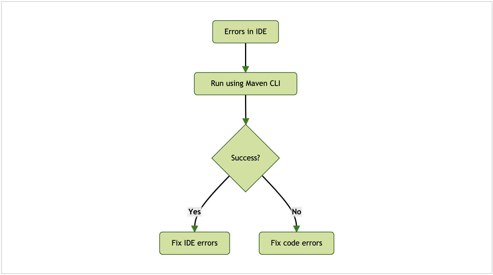
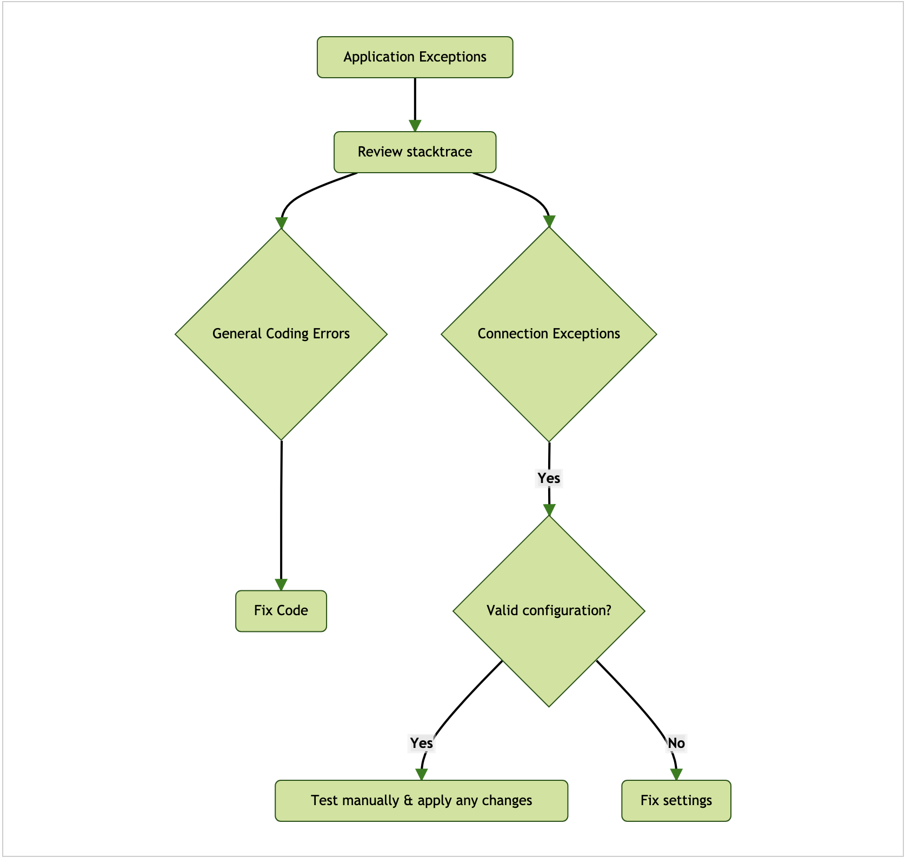
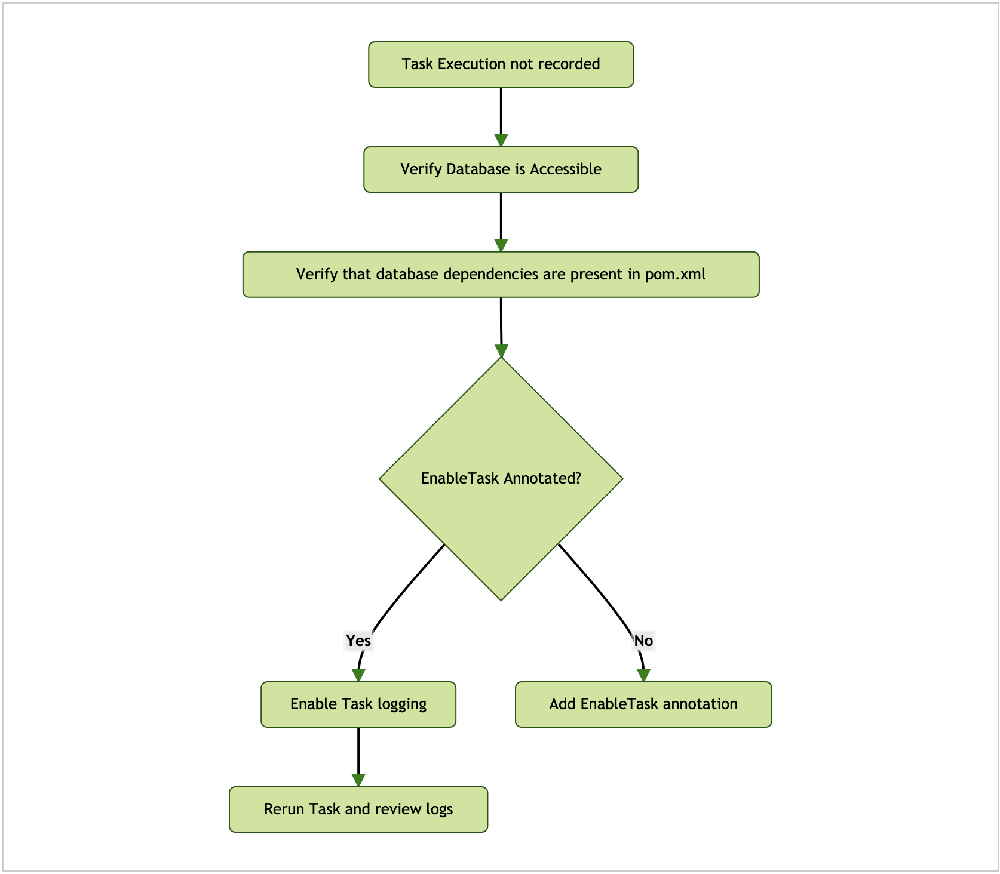
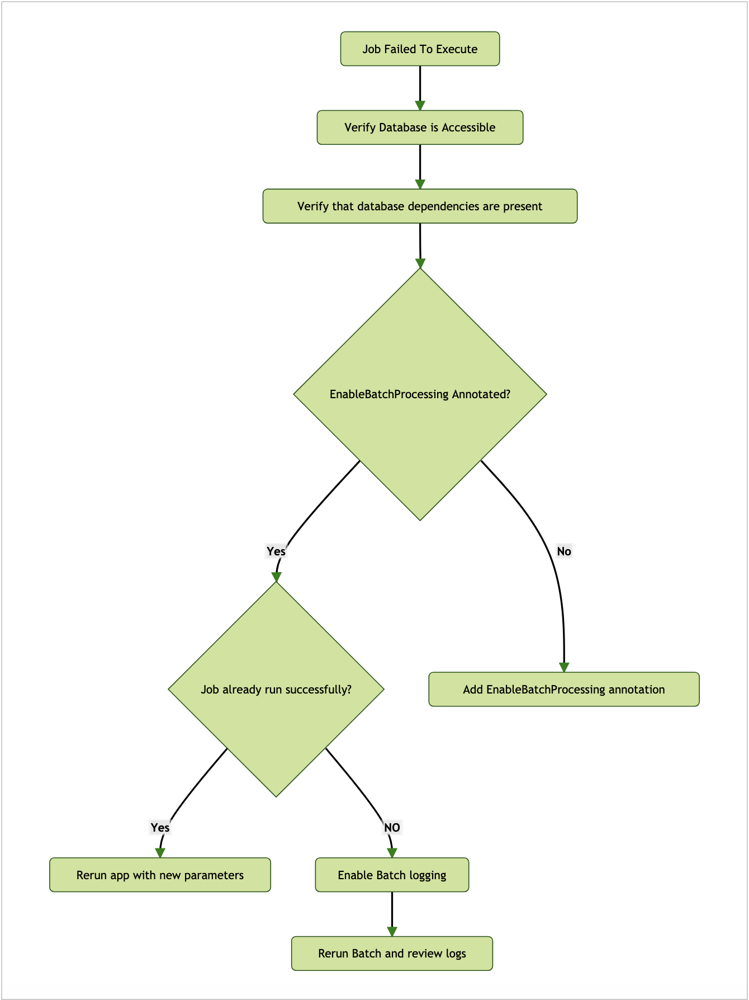
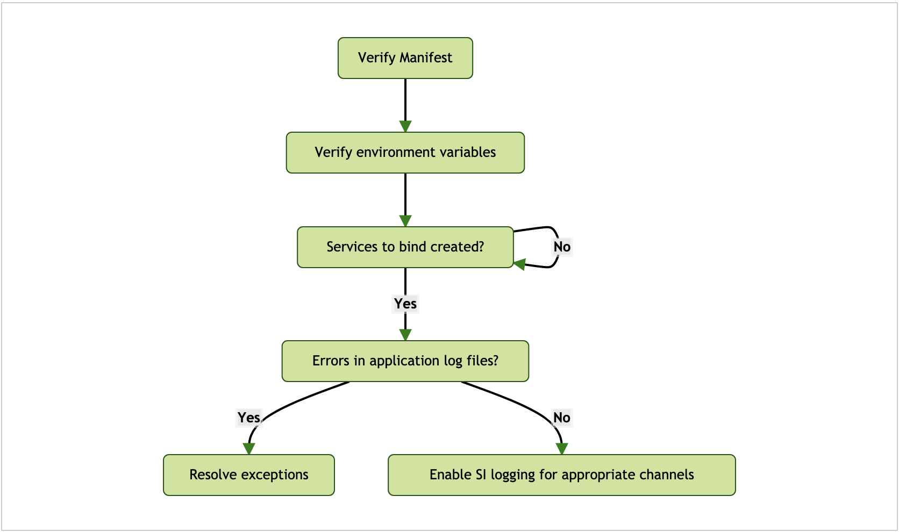
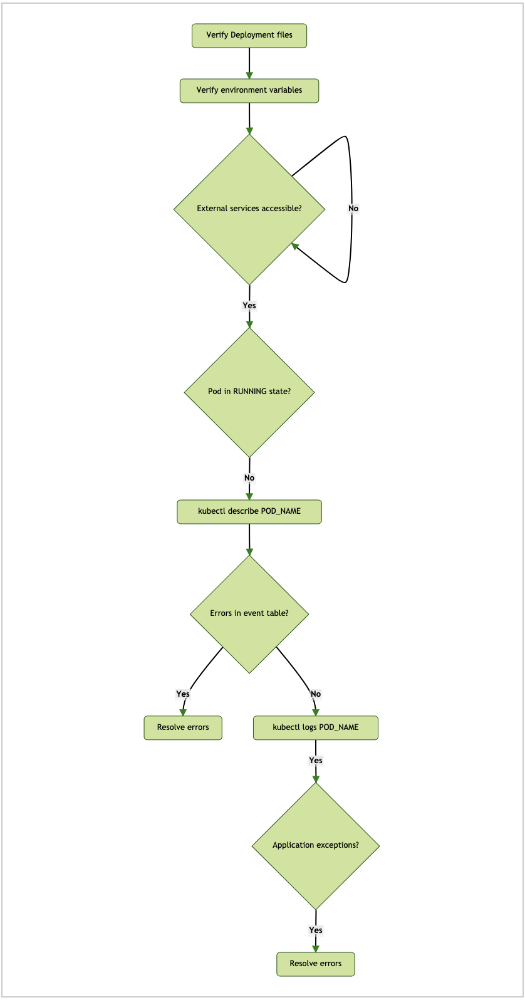
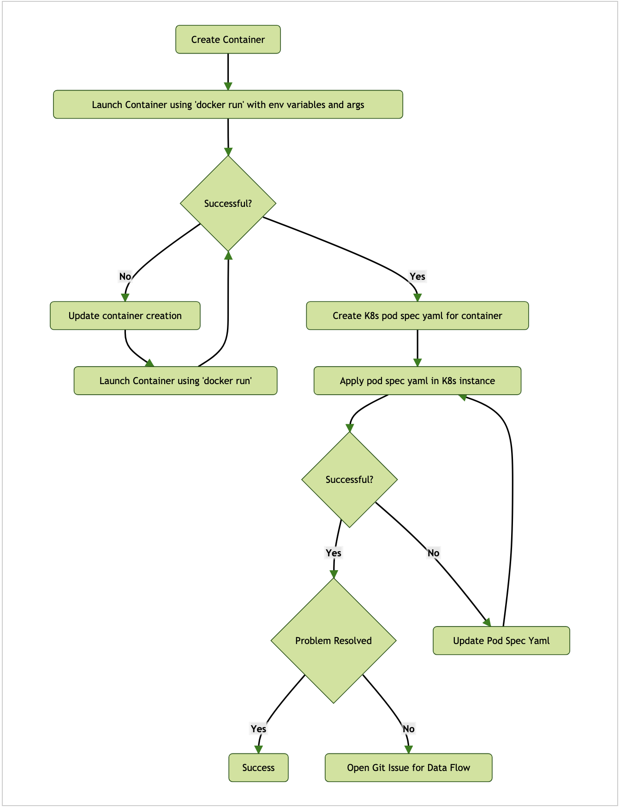

---

애플리케이션은 표준 자바 JAR로 실행할 수 있어야 하며, `java -jar`로 호출할 수 있어야 한다. 모든 의존성(데이터베이스와 메세징 미들웨어 등)을 사용할 수 있어야 하며, 커넥션 이슈는 직접 테스트해야 한다. 애플리케이션 실행과 디버깅은 SCDF를 사용해 플랫폼에 배포하고 실행하는 것과는 별개다.

### 목차

- [Project Build Errors](#project-build-errors)
- [Application Startup Exceptions](#application-startup-exceptions)
- [General Application Debugging](#general-application-debugging)
- [Task Execution Not Recorded to Database](#task-execution-not-recorded-to-database)
- [Job Failed to Run](#job-failed-to-run)
- [Platforms](#platforms)
  + [Cloud Foundry](#cloud-foundry)
  + [Kubernetes](#kubernetes)
    * [Containers](#containers)

---

## Project Build Errors

다음은 프로젝트 빌드 에러를 해결하는 방법을 나타낸 다이어그램이다:



IDE에서 발생한 에러를 수정하는 방법은 사용하는 IDE에 따라 다르다. IDE 밖에서 빌드에 성공하는지를 확인하면 프로젝트에서 발생하는 문제를 쳐낼 수 있다.

---

## Application Startup Exceptions

다음은 애플리케이션 기동 시 발생하는 예외를 해결하는 방법을 나타낸 다이어그램이다:



애플리케이션을 기동할 땐 일반적인 코딩 에러나 커넥션 이슈로 예외가 발생할 수 있다. 애플리케이션 로그 파일을 검토해서 예외를 찾아 수정해라. 모든 외부 서비스에 연결할 수 있는지, 올바른 credential을 제공했는지, 기타 다른 필요한 정보들은 문제 없이 제공했는지 확인해봐라.

---

## General Application Debugging

다음은 일반적인 애플리케이션 디버깅을 위한 다이어그램이다:


애플리케이션은 일반적인 자바 프로세스로 디버깅할 수 있으며, 로그 레벨을 DEBUG로 설정해 상세 로그를 출력하는 것도 가능하다.

디버거를 이용해 애플리케이션을 디버깅하려면, 애플리케이션을 기동할 때 아래 JVM 인자를 추가해라:

```sh
-agentlib:jdwp=transport=dt_socket,server=y,suspend=y,address=5005
```

이 파라미터를 추가하면 애플리케이션은 디버거가 `5005` 포트에 연결돼 디버깅을 시작할 수 있을 때까지 기다린다. 포트는 이미 사용하고 있지 않는 포트를 선택하면 된다.

DEBUG 레벨 로그를 활성화하는 것도 유용하다. 관심 패키지는 중 하나는 스프링 배치 (`org.springframework.batch`)와 Spring Cloud Task (`logging.level.org.springframework.cloud.task`)다. 배치 패키지에 디버그 로그를 활성화하려면 애플리케이션을 기동할 때 아래 JVM 인자를 추가해라:

```sh
-Dlogging.level.org.springframework.batch=debug
```

태스크 패키지에 디버그 로그를 활성화하려면 애플리케이션을 기동할 때 아래 JVM 인자를 추가해라:

```sh
-Dlogging.level.org.springframework.cloud.task=debug
```

---

## Task Execution Not Recorded to Database

다음은 태스크 실행 내역을 데이터베이스에 기록하지 않을 때의 해결 방법을 나타낸 다이어그램이다:



태스크 애플리케이션은 실행 정보를 데이터베이스에 기록한다. 실행 정보가 기록되지 않을 땐, 클래스 레벨 애노테이션 `@EnableTask`를 선언했는지 확인해봐라. `pom.xml`이나 `build.gradle` 파일에 적절한 데이터베이스 의존성을 추가했는지도 확인해봐라. 마지막으로 데이터베이스 커넥션 프로퍼티를 제대로 설정했는지 검증해라.

---

## Job Failed to Run

다음은 job이 실행되지 않을 때의 해결 방법을 나타낸 다이어그램이다:



스프링 배치 애플리케이션은 데이터베이스에 접근할 수 있어야 하며, `@EnableBatchProcessing`이 필요하다.

이미 실행을 완료한 적 있는 배치 앱을 실행했을 때 `Job`이 재실행되지 않는 이슈를 흔히 겪곤 한다. 이런 이슈가 발생하는 이유는 배치 앱 자체는 기본적으로 재시작할 수 있기 때문이다. 즉, 배치 `Job`이 실행 중에 실패하면, 다음번 실행에는 실패한 step 지점부터 재개하는 식으로 재시작할 수 있다. 각 배치 `Job` 인스턴스는 고유하다. 따라서 또 다른 `Job` 인스턴스를 시작하고 싶다면, `Job` 파라미터 중 하나(커맨드라인 인자 중 하나)를 업데이트해야 한다. 아니면 `Job`을 빌드하는 코드에서 `Job` [incrementer](https://docs.spring.io/spring-batch/trunk/reference/html/configureJob.html#JobParametersIncrementer)를 설정해도 된다.

---

## Platforms

이 섹션에선 특정 플랫폼에서 발생하는 문제를 해결하는 방법을 다룬다:

- 클라우드 파운드리
- 쿠버네티스

### Cloud Foundry

다음은 클라우드 파운드리에서 발생하는 에러를 해결하는 방법을 나타낸 다이어그램이다:



애플리케이션이 로컬에선 실행되지만 클라우드 파운드리에 배포할 땐 실패한다면, 먼저 배포 매니페스트(`manifest.yml`)에 문제가 없는지 살펴봐라. 이 파일에는 반드시 설정해야 하는 환경 변수, 바인딩할 서비스, 이 서비스들의 생성 여부가 담겨 있다. 애플리케이션 기동 로그에서 해결해야 할 예외가 있는지 찾아봐라.

### Kubernetes

다음은 쿠버네티스에서 발생하는 에러를 해결하는 방법을 나타낸 다이어그램이다:



애플리케이션이 로컬에선 실행되지만 쿠버네티스에 배포할 땐 실패한다면, 먼저 deployment 파일에 문제가 없는지 살펴봐라. 이 파일에는 반드시 설정해야 하는 환경 변수, 서비스 커넥션을 정의하는 프로퍼티, 이 서비스들의 사용 가능 여부가 담겨있다. 애플리케이션 포드의 이벤트 테이블을 통해 이미지 pull 원인, 헬스 체크 실패 등과 같은 포드 생성 이슈를 확인해봐라. 애플리케이션 기동 로그에서 해결해야 할 예외가 있는지 찾아봐라.

#### Containers

다음은 컨테이너 에러를 해결하는 방법을 나타낸 다이어그램이다:



앞에서 이야기한 것처럼 로컬 플랫폼에선 애플리케이션이 정상적으로 실행되더라도 Spring Cloud Data Flow로 기동할 때는 여전히 실패할 수도 있다. 이땐 컨테이너 생성 툴(DockerFile, 스프링 부트 컨테이너 플러그인, Jib 등)에서 컨테이너를 만드는 방식이 원인일 수도 있다. 위 차트는 컨테이너 관련 이슈로 앱이 실행되지 않을 때 그 이유를 찾아가는 과정을 보여주고 있다.

> Data Flow는 [공통 애플리케이션 프로퍼티](https://docs.spring.io/spring-cloud-dataflow/docs/current/reference/htmlsingle/#_common_application_properties)와 [스프링 부트 공통 태그](../../Spring%20Boot/metrics#common-tags)를 사용해 배포된 모든 `Task` 애플리케이션에 공통 메트릭 태그를 적용한다. 이 프로퍼티들은 보통 [스프링 플레이스홀더](../../Spring%20Boot/externalized-configuration#property-placeholders)를 사용해 값을 리졸브한다. 예를 들어:
>
> ```properties
> management.metrics.tags.application=${task.name:unknown}-${task.execution.id:unknown}
> ```
> 
> 이미지 컨테이너에 따라 이 설정을 제대로 파싱하지 못할 수 있으며, 임베디드 프로퍼티를 빈 문자열로 잘못 치환해서 태스크 앱이 실패할 수 있다. 메트릭을 사용하지 않는다면 `spring.cloud.dataflow.applicationProperties.taskResource`를 존재하지 않는 파일로 설정해서 이런 필드들을 비활성화할 수 있다. 예를 들어:
>
> ```properties
> spring.cloud.dataflow.applicationProperties.taskResource=classpath:fake.yml
> ```