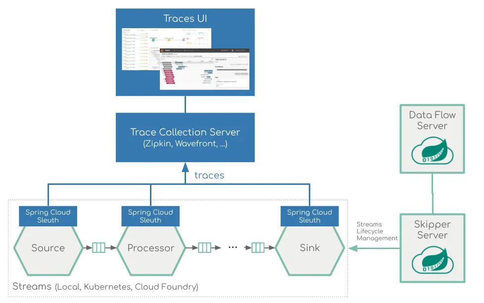
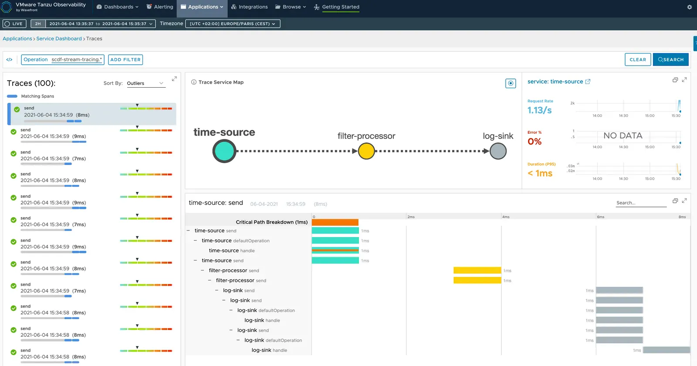
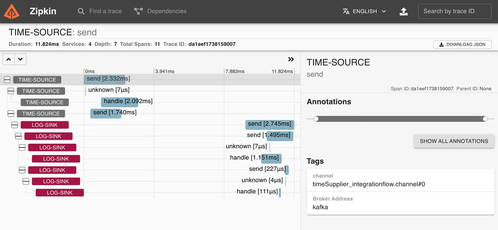
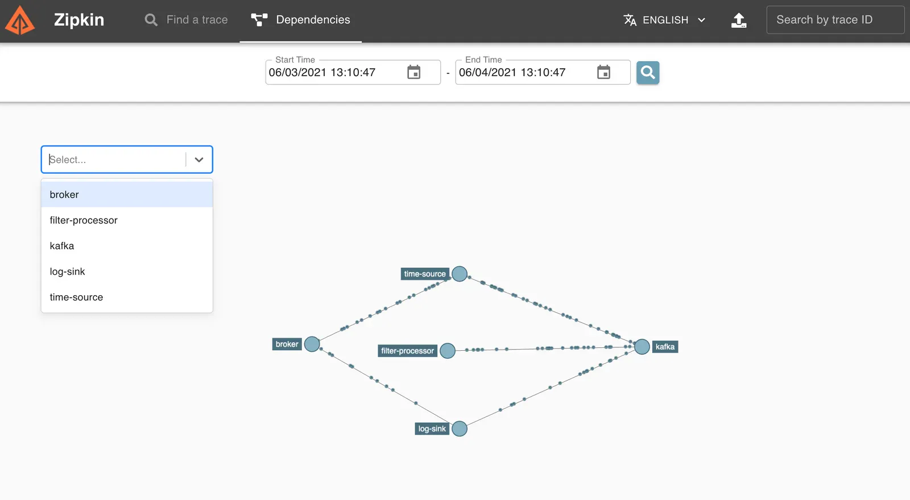

---

이 섹션에선 스트림 데이터 파이프라인을 구성하도록 배포한 애플리케이션들을 트레이싱하는 방법을 설명한다.

Data Flow의 분산 트레이싱 아키텍처는 [Spring Cloud Sleuth](https://spring.io/projects/spring-cloud-sleuth#overview) 라이브러리를 중심으로 설계되어, [OpenZipkin Brave](https://github.com/openzipkin/brave)와 통합되는 분산 트레이싱 솔루션을 위한 API를 제공한다.

Spring Cloud Sleuth는 스트리밍 파이프라인 메세지들을 추적하고, 트레이싱 정보를 외부 시스템으로 내보내 분석하고 시각화할 수 있다. Spring Cloud Sleuth는 [Zipkin Server](https://github.com/openzipkin/zipkin/tree/master/zipkin-server)나 [Wavefront Distributed Tracing](https://docs.wavefront.com/tracing_basics.html)같은 `OpenZipkin` 호환 시스템을 지원한다.

모든 Spring Cloud [스트림 애플리케이션들](https://github.com/spring-cloud/stream-applications)은 메세지 분산 트레이싱을 지원하며, `Zipkin Server`와(또는) `Wavefront Tracing`으로 트레이싱 정보들을 익스포트하기 위한 설정이 미리 세팅돼있다. 트레이싱 익스포트는 기본적으론 비활성화돼 있다! Wavefront나 Zipkin Server로 트레이싱 정보를 익스포트할 땐 `management.metrics.export.wavefront.enabled=true`, `spring.zipkin.enabled=true`를 사용한다. 상세 가이드는 아래에서 다룬다. Sleuth 설정 프로퍼티는 [spring sleuth 프로퍼티](https://docs.spring.io/spring-cloud-sleuth/docs/3.0.3/reference/html/appendix.html#appendix)를 참고하면 된다.

다음은 스트리밍 애플리케이션 모니터링의 전반적인 아키텍처를 나타낸 이미지다:



> `Spring Cloud Function` `3.1.x` 이전 버전을 기반으로 만든 스트리밍 애플리케이션에선, `Spring Cloud Sleuth` 라이브러리는 [트레이싱 계측<sup>instrumentation</sup>에 스프링 인테그레이션](https://docs.spring.io/spring-cloud-sleuth/docs/current/reference/htmlsingle/#sleuth-messaging-spring-integration-integration)을 활용한다. 이땐 `Spring Cloud Sleuth`에서 스프링 인테그레이션 내부 컴포넌트들엔 불필요한 (노이즈) 트레이싱 정보를 생성할 수도 있다!
>
> `Spring Cloud Function 3.1+`부터는 Spring Cloud Sleuth [트레이싱 계측<sup>instrumentation</sup>](https://docs.spring.io/spring-cloud-sleuth/docs/current/reference/htmlsingle/#sleuth-messaging-spring-cloud-function-integration)에서 좀더 SCF 기반 애플리케이션에잘 맞는 맞춤 트레이싱 정보를 제공한다.

### 목차

- [Instrument Custom Applications](#instrument-custom-applications)
- [Visualize Distributed Tracing](#visualize-distributed-tracing)
  + [Visualize with Wavefront](#visualize-with-wavefront)
  + [Visualize with Zipkin Server](#visualize-with-zipkin-server)
- [Platform Installations](#platform-installations)
  + [Local](#local)
    * [Wavefront](#wavefront)
    * [Zipkin Server](#zipkin-server)
  + [Kubernetes](#kubernetes)
    * [Wavefront](#wavefront-1)
    * [Zipkin Server](#zipkin-server-1)
  + [Cloud Foundry](#cloud-foundry)
    * [Wavefront](#wavefront-2)

---

## Instrument Custom Applications

커스텀 스트리밍 애플리케이션에서 분산 트레이싱을 활성화하려면, 스트리밍 애플리케이션에 다음 의존성을 추가해야 한다:

```xml
<dependencies>
  <dependency>
      <groupId>org.springframework.cloud</groupId>
      <artifactId>spring-cloud-starter-sleuth</artifactId>
  </dependency>
  <dependency>
      <groupId>org.springframework.boot</groupId>
      <artifactId>spring-boot-starter-actuator</artifactId>
  </dependency>
  <dependency>
      <groupId>org.springframework.cloud</groupId>
      <artifactId>spring-cloud-sleuth-zipkin</artifactId>
  </dependency>
  <dependency>
      <groupId>io.micrometer</groupId>
      <artifactId>micrometer-registry-wavefront</artifactId>
  </dependency>
</dependencies>

<dependencyManagement>
  <dependencies>
    <dependency>
      <groupId>org.springframework.cloud</groupId>
      <artifactId>spring-cloud-dependencies</artifactId>
      <version>${release.train.version}</version>
      <type>pom</type>
      <scope>import</scope>
    </dependency>
  </dependencies>
</dependencyManagement>
```

디폴트 트레이싱 익스포트 동작도 반드시 비활성화해줘야 한다. `application.properties`에 아래 프로퍼티를 추가해라.

```properties
management.metrics.export.wavefront.enabled=false
spring.zipkin.enabled=true
```

---

## Visualize Distributed Tracing

트레이싱 정보를 외부 시스템으로 내보내서 분석하고 시각화할 수도 있다. Spring Cloud Sleuth는 [Wavefront Distributed Tracing](https://docs.wavefront.com/tracing_basics.html)과 [Zipkin Server](https://docs.wavefront.com/tracing_basics.html)같은 OpenZipkin 호환 시스템을 지원한다.

### Visualize with Wavefront

배포한 스트리밍 파이프라인에서 수집한 [분산 트레이싱 데이터는 Wavefront를 이용해 시각화](https://docs.wavefront.com/tracing_basics.html#visualize-distributed-tracing-data-in-wavefront)할 수 있다. Wavefront는 `applications`와 `services`에 대한 정보를 조회할 수 있는 다양한 대시보드와 브라우저를 제공하므로, 곳곳을 이동하며 더 다양한 정보들을 모을 수 있다.

Wavefront는 `application`과 `service`라는 개념을 사용해서 분산 트레이스를 그룹화한다. Dataflow에선 Wavefront `application`을 스트리밍 파이프라인에 매핑하고, 이 파이프라인에 있는 애플리케이션들에는 `service`를 매핑하는 식으로 활용할 수 있다. 따라서 배포된 모든 Spring Cloud 스트림 애플리케이션 스타터들은 다음 두 가지 프로퍼티가 설정돼 있다:

- `wavefront.application.name`: 트레이스를 전송하는 애플리케이션들을 가지고 있는 스트림의 이름
- `wavefront.application.service`: 트레이스를 리포팅하는 애플리케이션의 이름 혹은 레이블

스트림 트레이스를 조회하려면 Wavefront 대시보드 메뉴에서 `Applications/Traces`로 이동하면 된다:


이 화면에서 배포한 스트림 이름과 일치하는 애플리케이션 이름을 검색하면 된다. 예를 들어 `scdf-stream-traces`라는 스트림 파이프라인을 배포했다면, Wavefront에서 다음과 같이 수집한 트레이스를 선택할 수 있다:


`Search` 버튼을 누르면 Wavefront 대시보드에서 다음과 유사한 화면이 보일 거다:



### Visualize with Zipkin Server

[Zipkin 서버](https://zipkin.io/)를 사용하면 배포한 스트리밍 파이프라인에서 분산 트레이싱 데이터를 수집하고 시각화할 수 있다. Zipkin은 데이터를 조회할 수 있는 다양한 대시보드와 브라우저를 제공한다.

http://your-zipkin-hostname:9411/zipkin에서 Zipkin UI에도 붙을 수 있다. 디폴트 url은 http://localhost:9411/zipkin이다.

로그 파일에 트레이스 ID가 있다면 이 ID로 직접 이동할 수 있다. 그 외에는 서비스, operation 이름, 태그, duration과 같은 속성을 기반으로 질의할 수 있다. 서비스에 소요된 시간(백분율), operation 실패 여부와 같은 몇 가지 흥미로운 요약 데이터를 제공해줄 거다.



Zipkin UI에선 각 애플리케이션에 요청이 얼마나 들어왔는지 추적해주는 의존성 다이어그램도 제공한다. 이 다이어그램은 에러가 발생하는 경로나 deprecated된 서비스를 호출하는지 등을 식별할 때 유용하다.



---

## Platform Installations

이어지는 섹션에선 Spring Cloud Data Flow를 배포한 플랫폼별로 분산 트레이싱을 설정하는 방법을 설명한다.

### Local

이 섹션에선 Wavefront나 Zipkin Server를 트레이스 저장소로 사용하는 스트림 애플리케이션의 분산 트레이스를 조회하는 방법을 설명한다. Wavefront는 클라우드 기반 플랫폼이긴 하지만, Data Flow를 로컬에 배포한 뒤 클라우드가 관리하는 Wavefront 모니터링 시스템을 가리키게 만들 수 있다.

#### Wavefront

Data Flow를 Wavefront 지원 기능과 함께 설치하려면 Docker Compose 가이드에 있는 [Wavefront로 모니터링하기](../installation.local-machine.docker-customize#wavefront)를 따라하면 된다. 가이드대로 따라하면 Spring Cloud Data Flow, Skipper, 아파치 카프카가 설치된다.

Wavefront는 SaaS 기반 플랫폼으로, 먼저 사용자 계정을 생성해야 한다. 이 계정을 사용해 뒤에서 설명하는 대로 환경 변수 `WAVEFRONT_KEY`와 `WAVEFRONT_URI`를 설정하면 된다.

모든 컨테이너를 실행시켰다면, 카프카를 사용하는 간단한 스트림을 배포해봐라:

```sh
dataflow:>stream create scdf-stream-tracing --definition "time --fixed-delay=10 --time-unit=MILLISECONDS | filter --expression=payload.contains('3') | log" --deploy
```

이제 [가이드를 따라 Wavefront로 시각화](#visualize-with-wavefront)하면 된다.

#### Zipkin Server

최신 스트림 애플리케이션 스타터가 필요하다 (`2020.0.3-SNAPSHOT` 이상). `STREAM_APPS_URI` 변수로 적당한 앱 버전을 설정해라.

`Zipkin Server`를 사용해 메세지 트레이스를 수집하려면 Docker Compose 가이드에 있는 [Zipkin Server](../installation.local-machine.docker-customize#zipkin-server)를 따라하면 된다. 가이드대로 따라하면 Spring Cloud Data Flow, Skipper, 아파치 카프카, Zipkin Server가 설치되고, 메세지 트레이싱이 활성화될 거다.

모든 컨테이너를 실행하고 나면 Spring Cloud Data Flow 대시보드는 http://localhost:9393/dashboard에서 확인할 수 있다.

대시보드가 작동하는 걸 보고싶다면, 카프카를 사용하는 간단한 스트림을 배포해봐라:

```sh
dataflow:>stream create stream2 --definition "time --fixed-delay=10 --time-unit=MILLISECONDS | filter --expression=payload.contains('3') | log" --deploy
```

http://localhost:9411/zipkin에 들어가 Zipkin UI를 열고, 이제 [가이드를 따라 Zipkin Server로 시각화](#visualize-with-zipkin-server)하면 된다.

### Kubernetes

이 섹션에선 클라우드로 관리하는 Wavefront 시스템 상에서 스트림 분산 트레이스를 조회하는 방법을 설명한다.

#### Wavefront

Wavefront는 SaaS 기반 플랫폼이다. 먼저 사용자 계정을 생성하고 이 계정에 할당된 `API-KEY`와 `WAVEFRONT-URI`를 알아내야 한다.

통합 가이드 [쿠버네티스에 Data Flow 설치하기](../installation.kubernetes/)에 따라 서버를 준비해라.

그런 다음 Spring Cloud Data Flow 서버 설정(ex. `src/kubernetes/server/server-config.yaml`)에 아래 프로퍼티를 추가해서 Wavefront 통합을 활성화해라:

```yml
management:
  metrics:
    export:
      wavefront:
        enabled: true
        api-token: <YOUR API-KEY>
        uri: <YOUR WAVEFRONT-URI>
        source: demo-scdf-source
```

이제 [가이드를 따라 Wavefront로 시각화](#visualize-with-wavefront)하면 된다.

#### Zipkin Server

Zipkin 서버를 `http://your-zipkin-server:9411`에서 실행 중이라치면 (쿠버네티스 클러스터 내부에 있을 수도 있고, 외부 서비스에 속할 수도 있다), Spring Cloud Data Flow 배포 설정에 아래 환경 변수를 추가하면 된다:

```yml
env:
  - name: SPRING_CLOUD_DATAFLOW_APPLICATIONPROPERTIES_STREAM_SPRING_ZIPKIN_ENABLED
    value: true
  - name: SPRING_CLOUD_DATAFLOW_APPLICATIONPROPERTIES_STREAM_SPRING_ZIPKIN_BASEURL
    value: 'http://your-zipkin-server:9411'
```

이제 [가이드를 따라 Zipkin Server로 시각화](#visualize-with-zipkin-server)하면 된다.

### Cloud Foundry

이 섹션에선 클라우드 파운드리에 있는 Wavefront를 사용하는 스트림 애플리케이션의 분산 트레이스를 조회하는 방법을 설명한다.

#### Wavefront

Wavefront는 SaaS 기반 플랫폼이다. 먼저 사용자 계정을 생성하고 이 계정에 할당된 `API-KEY`와 `WAVEFRONT-URI`를 알아내야 한다.

스트림 애플리케이션의 메트릭 데이터를 Wavefront 모니터링 시스템으로 전송하도록 Data Flow 서버를 설정하려면 [매니페스트 기반 Wavefront 설정 가이드](../installation.cloudfoundry.cli#configuration-for-wavefront)를 따라해라.

이제 [가이드를 따라 Wavefront로 시각화](#visualize-with-wavefront)하면 된다.